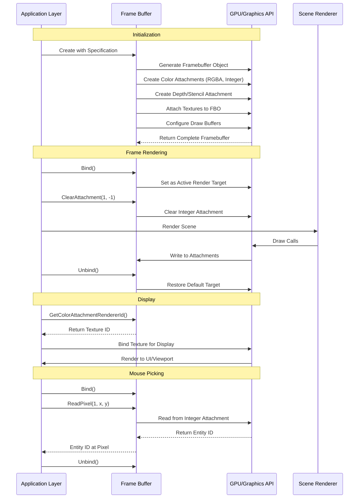
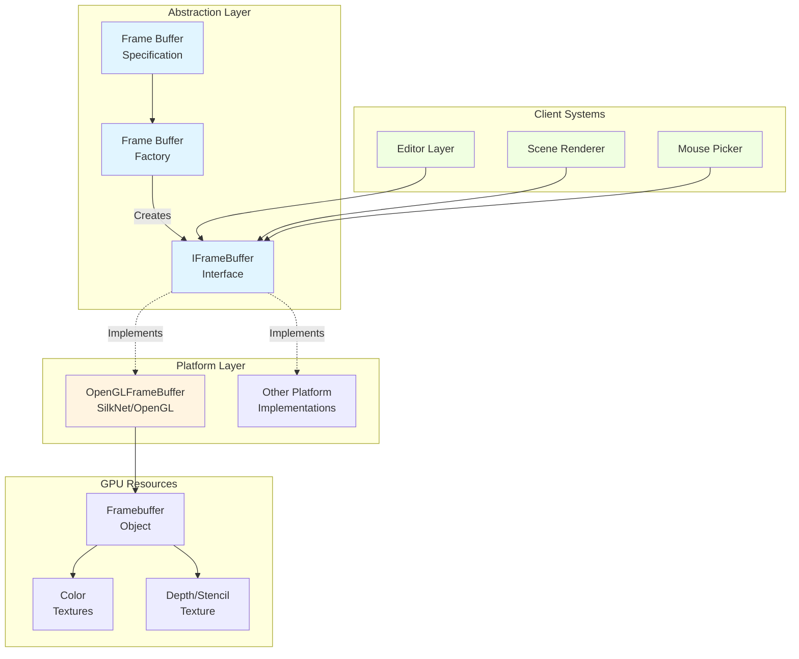
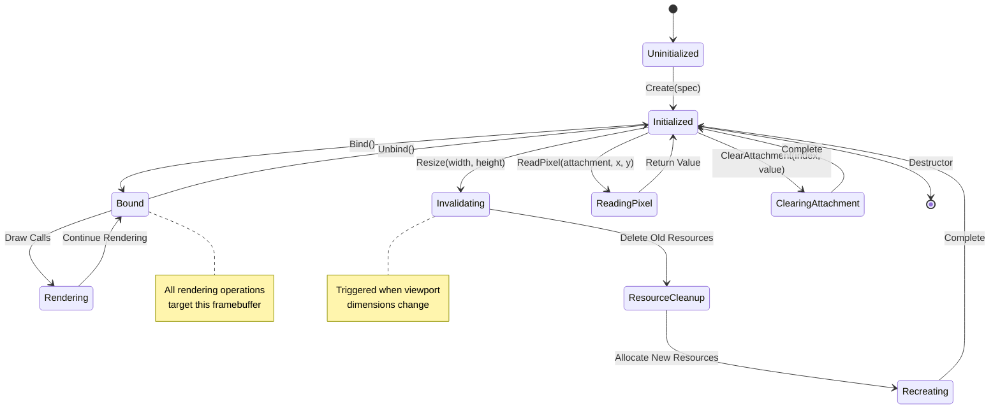

# Frame Buffers

Off-screen render targets (FBOs) with multi-attachment support for editor viewports, entity picking, and render-to-texture workflows.

---

## Overview

**Purpose**: Frame buffers provide off-screen rendering targets that allow the engine to render scenes to textures instead of directly to the screen. This enables advanced rendering techniques like post-processing effects, editor viewports, and custom rendering pipelines.

**Scope**: The frame buffer module handles:
- Creating off-screen render targets with custom attachment configurations
- Managing color and depth/stencil texture attachments
- Providing pixel-perfect mouse picking capabilities
- Supporting dynamic viewport resizing
- Enabling rendering to texture for editor integration

**Key Concepts**:
- **Attachments**: Frame buffers contain multiple texture attachments - color attachments for visual output and depth/stencil attachments for depth testing
- **Render-to-Texture**: Instead of rendering directly to the screen, content is rendered to texture buffers that can be read, displayed, or processed
- **Multiple Render Targets (MRT)**: A single frame buffer can have multiple color attachments, allowing shaders to output to multiple textures simultaneously
- **Invalidation**: When frame buffer properties change (like size), the underlying GPU resources must be recreated through an invalidation process

### Key Types

| Type | File |
|------|------|
| `IFrameBuffer` | `Engine/Renderer/Buffers/FrameBuffer/IFrameBuffer.cs` |
| `IFrameBufferFactory` | `Engine/Renderer/Buffers/FrameBuffer/IFrameBufferFactory.cs` |
| `FrameBufferSpecification` | `Engine/Renderer/Buffers/FrameBuffer/FrameBufferSpecification.cs` |
| `FrameBufferTextureFormat` | `Engine/Renderer/Buffers/FrameBuffer/FramebufferTextureFormat.cs` |
| `OpenGLFrameBuffer` (SilkNet/OpenGL) | `Engine/Platform/OpenGL/Buffers/OpenGLFrameBuffer.cs` |

### `IFrameBuffer` API

| Method | Purpose |
|--------|---------|
| `Bind()` / `Unbind()` | Set or restore the active render target (saves/restores viewport on bind) |
| `GetColorAttachmentRendererId()` | OpenGL texture ID of color attachment 0 (0 if none) |
| `GetSpecification()` | Current width, height, samples, and attachment list |
| `Resize(uint width, uint height)` | Recreate GPU resources at new size (clamped to 8192×8192; no-op on 0 or out of range) |
| `ReadPixel(int attachmentIndex, int x, int y)` | Read one pixel from a color attachment (`RED_INTEGER` → entity ID); returns `-1` on invalid index or coordinates |
| `ClearAttachment(int attachmentIndex, int value)` | `glClearBuffer` on a color attachment (entity ID buffer cleared to `-1` each frame) |

### Texture Formats

| `FrameBufferTextureFormat` | OpenGL internal format | Role |
|---------------------------|------------------------|------|
| `RGBA8` | `GL_RGBA8` | Standard 8-bit color |
| `RGBA16F` | `GL_RGBA16F` | HDR half-float color |
| `RED_INTEGER` | `GL_R32I` | 32-bit integer per pixel (entity picking) |
| `Depth` / `DEPTH24STENCIL8` | `GL_DEPTH24_STENCIL8` | Combined depth/stencil |

Color attachments use nearest filtering. Depth uses linear filtering and clamp-to-edge wrapping. At most **4** color attachments per framebuffer.

### Default Factory Specification

**File**: `Engine/Renderer/Buffers/FrameBuffer/FrameBufferFactory.cs`

`IFrameBufferFactory.Create()` (no arguments) builds a framebuffer at `DisplayConfig.DefaultEditorViewportWidth` × `DisplayConfig.DefaultEditorViewportHeight` (**1280×720**) with:

| Index | Format | Purpose |
|-------|--------|---------|
| 0 | `RGBA16F` | Scene color — displayed in the ImGui viewport |
| 1 | `RED_INTEGER` | Entity ID buffer for mouse picking |
| 2 | `Depth` | Depth testing |

Custom specs are created via `Create(FrameBufferSpecification specification)`. The factory selects `OpenGLFrameBuffer` when `IRendererApiConfig.Type` is `ApiType.SilkNet`.

## Architecture Flow

### Frame Buffer Lifecycle

1. **Specification Phase**: Developer defines frame buffer requirements through a specification object, including dimensions, attachment types, and formats

2. **Creation Phase**: Factory creates platform-specific frame buffer implementation based on the active rendering API

3. **Initialization Phase**: Frame buffer allocates GPU resources - creates frame buffer object, generates texture attachments, attaches textures to appropriate points, configures draw buffers, and validates completeness

4. **Usage Phase**: During rendering, frame buffer is bound as active render target, receives all draw commands, then is unbound to restore the default target. Frame buffer textures can then be sampled or displayed.

5. **Resize Phase**: When viewport dimensions change, frame buffer invalidates existing resources and recreates all attachments with new dimensions while maintaining attachment configuration

6. **Cleanup Phase**: When frame buffer is destroyed, GPU resources (textures and frame buffer objects) are released

### Rendering Flow

```mermaid
sequenceDiagram
    participant App as Application Layer
    participant FB as Frame Buffer
    participant GPU as GPU/Graphics API
    participant Scene as Scene Renderer

    Note over App,GPU: Initialization
    App->>FB: Create with Specification
    FB->>GPU: Generate Framebuffer Object
    FB->>GPU: Create Color Attachments (RGBA, Integer)
    FB->>GPU: Create Depth/Stencil Attachment
    FB->>GPU: Attach Textures to FBO
    FB->>GPU: Configure Draw Buffers
    GPU-->>FB: Return Complete Framebuffer

    Note over App,GPU: Frame Rendering
    App->>FB: Bind()
    FB->>GPU: Set as Active Render Target
    App->>FB: ClearAttachment(1, -1)
    FB->>GPU: Clear Integer Attachment
    App->>Scene: Render Scene
    Scene->>GPU: Draw Calls
    GPU->>FB: Write to Attachments
    App->>FB: Unbind()
    FB->>GPU: Restore Default Target

    Note over App,GPU: Display
    App->>FB: GetColorAttachmentRendererId()
    FB-->>App: Return Texture ID
    App->>GPU: Bind Texture for Display
    GPU->>App: Render to UI/Viewport

    Note over App,GPU: Mouse Picking
    App->>FB: Bind()
    App->>FB: ReadPixel(1, x, y)
    FB->>GPU: Read from Integer Attachment
    GPU-->>FB: Return Entity ID
    FB-->>App: Entity ID at Pixel
    App->>FB: Unbind()
```

## Core Workflow Stages

### 1. Specification & Creation

`FrameBufferSpecification` defines width, height, optional `Samples` (multisample depth path when > 1), `SwapChainTarget`, and `AttachmentsSpec` before creation. Dimensions are clamped to **8192×8192** in the OpenGL implementation.

Supported color formats: `RGBA8`, `RGBA16F`, `RED_INTEGER`. Depth/stencil uses `Depth` (`DEPTH24STENCIL8`). Depth attachments are separated from color attachments during setup — depth formats are not counted toward the four color-attachment limit.

### 2. Binding & Rendering

The bind/unbind pattern controls where rendering occurs. Binding sets the frame buffer as active render target so all draw calls render to its attachments. Unbinding restores the default frame buffer so subsequent draws go to screen.

This pattern enables rendering scenes to textures for display in editor viewports, creating multiple views of the same scene with different cameras, and capturing rendering output for post-processing.

### 3. Attachment Access

With the default factory spec, attachments are used as follows:
- **Color attachment 0** (`RGBA16F`): Primary visual output displayed in the editor viewport
- **Color attachment 1** (`RED_INTEGER`): Entity ID buffer for pixel-perfect mouse picking (`ReadPixel(1, x, y)`)
- **Depth attachment** (`DEPTH24STENCIL8`): Depth testing for 3D and layered 2D draws

### 4. Dynamic Resizing

When viewport size changes, the frame buffer detects the mismatch, triggers invalidation, deletes old GPU resources, and recreates with identical attachment configuration but new size. This ensures frame buffer resolution always matches the viewport.

### 5. Pixel Reading

Frame buffers enable CPU-side data readback for mouse picking (reading integer attachment at cursor position retrieves entity ID), with position mapping from viewport coordinates to frame buffer space and bounds checking to ensure valid read coordinates.

## Architecture Patterns

```mermaid
graph TB
    subgraph "Abstraction Layer"
        FBSpec[Frame Buffer<br/>Specification]
        IFB[IFrameBuffer<br/>Interface]
        FBFactory[Frame Buffer<br/>Factory]
    end

    subgraph "Platform Layer"
        OpenGLFB[OpenGLFrameBuffer<br/>SilkNet/OpenGL]
        OtherFB[Other Platform<br/>Implementations]
    end

    subgraph "GPU Resources"
        FBO[Framebuffer<br/>Object]
        ColorTex[Color<br/>Textures]
        DepthTex[Depth/Stencil<br/>Texture]
    end

    subgraph "Client Systems"
        Editor[Editor Layer]
        Renderer[Scene Renderer]
        Picker[Mouse Picker]
    end

    FBSpec-->FBFactory
    FBFactory-->|Creates|IFB
    IFB-.Implements.->OpenGLFB
    IFB-.Implements.->OtherFB

    OpenGLFB-->FBO
    FBO-->ColorTex
    FBO-->DepthTex

    Editor-->IFB
    Renderer-->IFB
    Picker-->IFB

    style FBSpec fill:#e1f5ff
    style IFB fill:#e1f5ff
    style FBFactory fill:#e1f5ff
    style OpenGLFB fill:#fff4e1
    style Editor fill:#f0ffe1
    style Renderer fill:#f0ffe1
    style Picker fill:#f0ffe1
```

## State Management

```mermaid
stateDiagram-v2
    [*] --> Uninitialized
    Uninitialized --> Initialized: Create(spec)

    Initialized --> Bound: Bind()
    Bound --> Rendering: Draw Calls
    Rendering --> Bound: Continue Rendering
    Bound --> Initialized: Unbind()

    Initialized --> Invalidating: Resize(width, height)
    Invalidating --> ResourceCleanup: Delete Old Resources
    ResourceCleanup --> Recreating: Allocate New Resources
    Recreating --> Initialized: Complete

    Initialized --> ReadingPixel: ReadPixel(attachment, x, y)
    ReadingPixel --> Initialized: Return Value

    Initialized --> ClearingAttachment: ClearAttachment(index, value)
    ClearingAttachment --> Initialized: Complete

    Initialized --> [*]: Destructor

    note right of Bound
        All rendering operations
        target this framebuffer
    end note

    note right of Invalidating
        Triggered when viewport
        dimensions change
    end note
```

## Integration Points

### Editor Integration

The editor uses frame buffers to create an embedded viewport. During initialization, it creates a frame buffer with RGBA color, entity ID, and depth attachments. Each frame, the editor binds the frame buffer, renders the scene, then unbinds. The color attachment texture is retrieved and displayed in the ImGui viewport panel. Mouse clicks in the viewport read the entity ID attachment for object selection, and viewport resizing triggers frame buffer resize to match.

### Scene Rendering Integration

Scene rendering systems integrate with frame buffers through the camera system (providing view-projection matrix), 2D renderer (drawing sprites, quads, and primitives), 3D renderer (rendering models and geometry), and entity ID rendering (writing entity IDs to integer attachment in a second pass).

### Multi-Target Rendering Strategy

The default editor framebuffer coordinates three render targets: attachment 0 (`RGBA16F`) for visual output, attachment 1 (`RED_INTEGER`) for per-pixel entity IDs, and a depth/stencil buffer for depth testing. Shaders declare multiple fragment outputs (`layout(location = N)`) that map to color attachments 0–3.

## Common Usage Patterns

### Editor Viewport Pattern

The editor creates a frame buffer (via `IFrameBufferFactory.Create()`) at viewport dimensions with `RGBA16F`, `RED_INTEGER`, and `Depth` attachments. Each frame: bind → `ClearAttachment(1, -1)` on the entity ID buffer → render scene → unbind → display color attachment 0 in ImGui. Mouse clicks call `ReadPixel(1, x, y)`. Viewport resize calls `Resize()` to invalidate and recreate GPU resources.

### Post-Processing Pattern

A frame buffer at screen resolution with RGBA8 color and depth attachments captures the scene render. After unbinding, the scene color attachment is bound as a texture input and a fullscreen quad renders with post-process shaders to the screen or another frame buffer.

### Shadow Mapping Pattern

A depth-only frame buffer at shadow map resolution (e.g., 2048x2048) with no color attachments captures the scene from the light's perspective. The depth texture is then sampled in the main render pass using shadow mapping shaders.

## Performance Considerations

### Memory Usage

Frame buffers consume GPU memory proportional to resolution, attachment count, and pixel format precision. A default-spec framebuffer at 1920×1080 (`RGBA16F` + `RED_INTEGER` + `DEPTH24STENCIL8`) uses roughly 32 MB (8 + 4 + 4 bytes per pixel across the three attachments).

### Invalidation Cost

Frame buffer resizing is expensive due to GPU resource deletion/recreation and potential memory fragmentation. Resize operations are triggered only when dimensions actually change, not every frame.

### Draw Call Impact

Frame buffer binding/unbinding has minimal overhead - just a single GPU state change per operation. Best practice is to minimize frame buffer switches per frame by grouping rendering to the same target together.

## Error Handling

### Validation Checks

- **Size limits**: `OpenGLFrameBuffer` rejects resize to 0 or above `MaxFramebufferSize` (8192) — logs and no-ops
- **Attachment count**: More than four color attachments throws `InvalidOperationException`
- **Completeness**: `glCheckFramebufferStatus` must return `GL_FRAMEBUFFER_COMPLETE` after creation or `Invalidate()` throws
- **Bounds checking**: `ReadPixel` returns `-1` for out-of-range attachment index or pixel coordinates

### Common Issues

- **Black Screen**: Frame buffer not properly bound before rendering - ensure Bind() is called before draw operations
- **Stretched Image**: Frame buffer size doesn't match viewport - implement resize detection and invalidation
- **Incomplete Framebuffer Error**: Incompatible attachment configuration - verify formats are GPU-supported
- **Entity Picking Returns -1**: Entity ID not written to integer attachment - verify shader writes and attachment clearing

## Design Rationale

### Why Multiple Attachments?

Multiple render targets enable deferred rendering (outputting multiple scene properties in single pass), editor features (separating visual output from editor metadata like entity IDs), and advanced effects (storing intermediate values for multi-pass rendering).

### Why Invalidation Pattern?

GPU resources are immutable in size and cannot be resized after allocation. The invalidation pattern encapsulates the complexity of deleting and recreating resources with new dimensions.

### Why Factory Pattern?

Abstraction enables platform independence (same interface for OpenGL, Vulkan, DirectX), runtime API selection, mock frame buffers for testing, and future platform extensions without changing client code.

## Future Enhancements

`FrameBufferSpecification.Samples` and multisampled depth attachment paths exist in `OpenGLFrameBuffer`, but color attachments are not multisampled yet. Other potential improvements: automatic mipmap generation, cube-map framebuffers, layered rendering, asynchronous pixel readback via PBOs, and additional float formats (e.g. `RGBA32F`).
