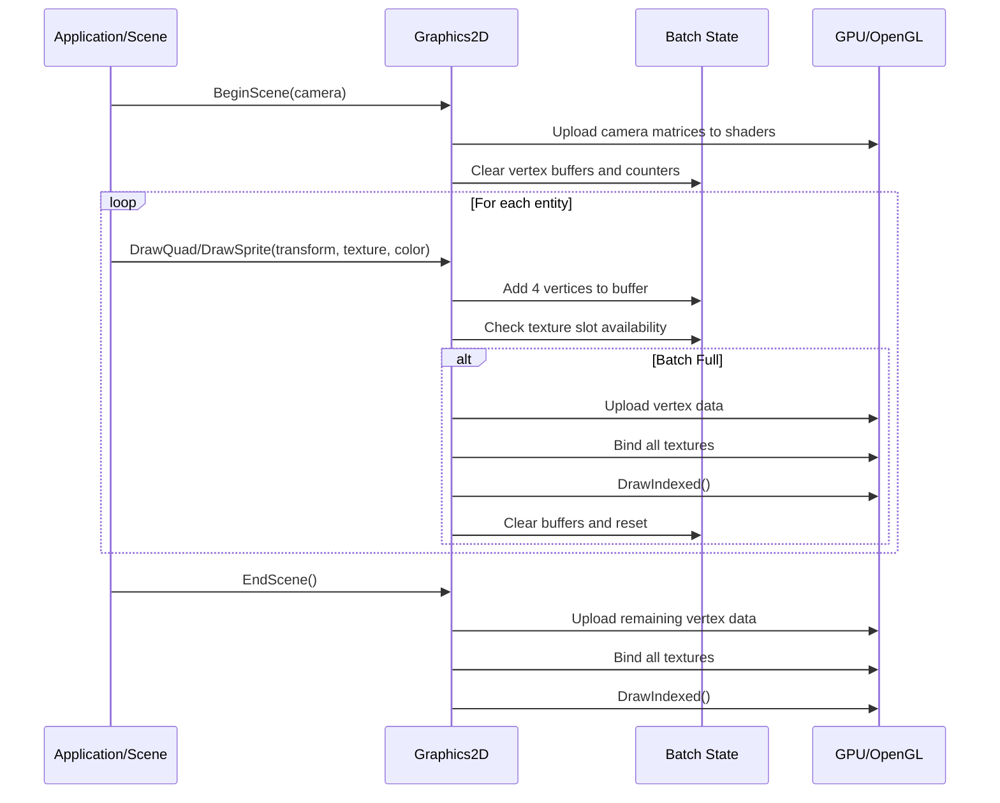
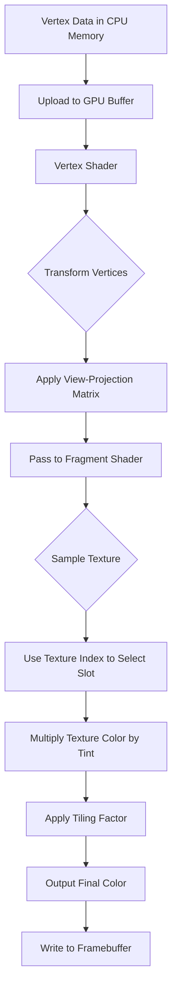
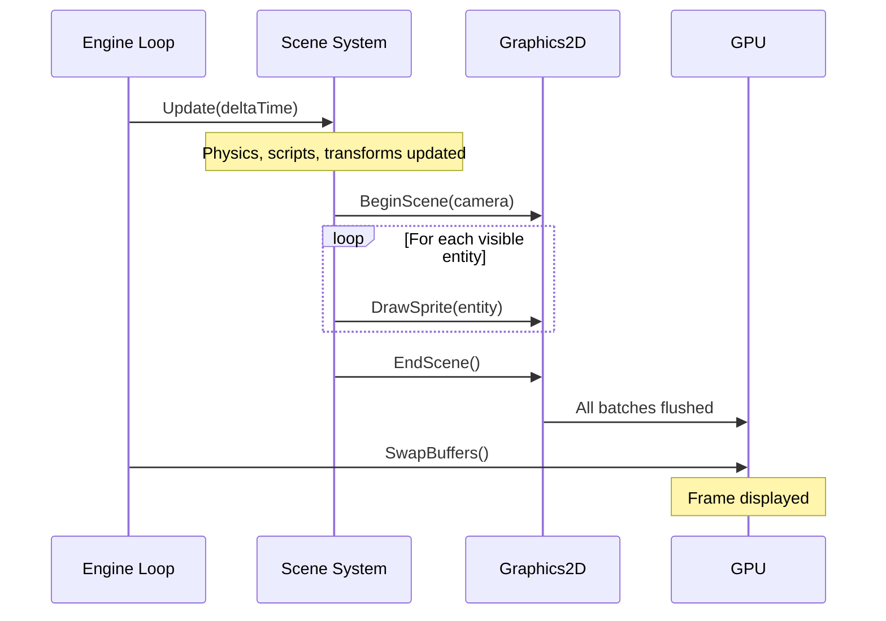
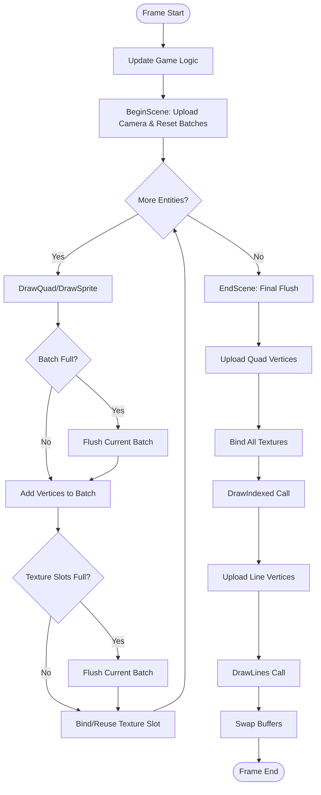
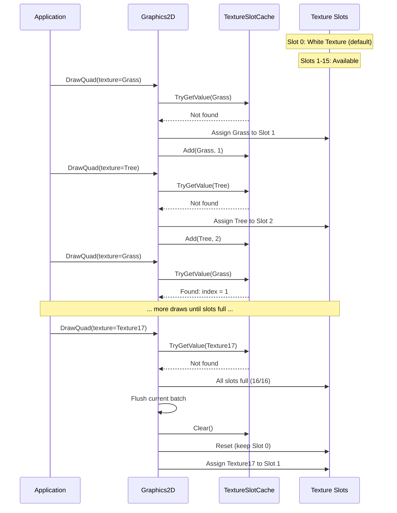
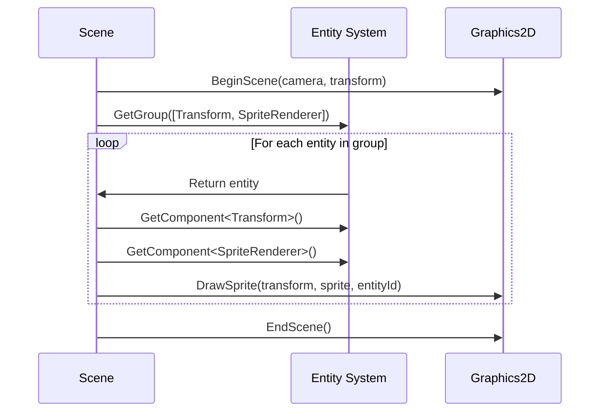

# OpenGL 2D Rendering Workflow

## Overview

The OpenGL 2D rendering system transforms game entities and sprites into pixels on screen through an efficient batched rendering pipeline.

### Purpose
- Efficiently render 2D sprites, quads, and primitive shapes using OpenGL
- Minimize draw calls through intelligent batching of similar geometry
- Support multiple textures within a single batch using texture slots
- Provide a high-level abstraction over low-level OpenGL operations

### Key Concepts

**Batch Rendering**: Instead of issuing one draw call per sprite, the system accumulates multiple quads into large vertex buffers and submits them in batches. This dramatically reduces CPU-GPU communication overhead.

**Texture Atlasing**: Up to 16 different textures can be bound simultaneously (configurable via `RenderingConstants.MaxTextureSlots`). The shader uses a texture index to sample from the correct texture slot, allowing diverse sprites to be rendered in a single draw call.

**Dynamic Vertex Buffers**: Vertex data is built on the CPU each frame and uploaded to GPU memory before drawing. This supports fully dynamic scenes where every sprite can move, change color, or swap textures.

**Immediate Mode API**: The rendering interface uses a "begin scene, draw primitives, end scene" pattern that feels immediate while actually performing deferred batching internally.

## Architecture Flow

### Initialization Phase

When the graphics system starts up, it prepares all the resources needed for rendering:

1. **Vertex Array Objects (VAO)** define how vertex data is laid out
2. **Vertex Buffers** are allocated on the GPU with capacity for maximum batch sizes
3. **Index Buffers** are pre-populated with triangle indices for quad tessellation
4. **Shaders** are compiled from source files and linked into programs
5. **Default Textures** (white 1x1 pixel) are created for solid color rendering
6. **Texture Slots** array is initialized to track which textures are currently bound

### Frame Rendering Cycle

Each frame follows a strict sequence: **BeginScene → Draw Calls → EndScene**

**BeginScene**:
- Accepts camera parameters (view and projection matrices)
- Uploads camera matrices to shader uniforms
- Clears all batch state (vertex counters, texture slots)

**Draw Calls**:
- Application code calls drawing methods (DrawQuad, DrawSprite, DrawLine)
- Each draw call adds vertices to the current batch
- If batch limits are reached, a flush occurs automatically
- New textures are assigned to available slots; duplicates reuse existing slots

**EndScene**:
- Triggers final flush to draw any remaining geometry
- All accumulated data is submitted to the GPU

### Batching Logic

The system maintains two separate batches:

**Quad Batch** (for filled rectangles and sprites):
- Accumulates quad vertices with position, color, texture coordinates, texture index, tiling factor, and entity ID
- Each quad requires 4 vertices and 6 indices (two triangles)
- Maximum capacity: 10,000 quads (40,000 vertices) by default

**Line Batch** (for debug wireframes and primitive shapes):
- Accumulates line vertices with position, color, and entity ID
- Each line requires 2 vertices
- Uses GL_LINES primitive topology

When a batch is full, the system automatically flushes to GPU, resets counters, and continues accumulating.

### Data Flow

### Shader Execution Pipeline

**Vertex Shader**: Transforms vertex positions from world space to clip space using camera matrices, passes through vertex attributes to fragment shader.

**Fragment Shader**: Samples the appropriate texture using the texture index, applies tiling and tint color, outputs final pixel color and entity ID.

### Texture Management

The system maintains an array of texture slots (typically 16):

- **Slot 0**: Reserved for the default white texture (solid color quads)
- **Slots 1-15**: Dynamically assigned to textures as encountered

**Texture Binding Logic**:
1. Check if texture is already bound using O(1) dictionary lookup
2. If found, reuse the existing slot index
3. If not found and slots available, bind to next slot and cache the mapping
4. If all slots full, flush current batch, clear cache, and start fresh

## Lifecycle & Timing

### Initialization
- Called once at application startup after OpenGL context creation
- Creates all buffers, shaders, and resources
- Sets OpenGL rendering state (blending, depth testing)

### Per-Frame Execution

### Shutdown
- `Dispose()` releases all OpenGL resources
- Disposes: shaders, vertex arrays, vertex buffers
- Texture slot references are cleared (textures owned by TextureFactory)

## Advanced Features

### Multi-Texture Batching

Supports rendering up to 16 different textures in a single draw call:
- Fragment shader declares an array of sampler2D uniforms
- Each vertex carries a texture index indicating which sampler to use
- Eliminates texture rebinding between different sprites
- When more than 16 unique textures needed, automatic flushing occurs

### Entity Identification

Each vertex includes an entity ID attribute for editor picking:
- Fragment shader outputs entity ID to a secondary color attachment
- Editor reads this attachment on mouse click to determine selected entity
- Used for object picking, debug visualization, and gizmo rendering

### Dynamic Batching Strategy

**Batch Size Limits** (from `RenderingConstants`):
- Maximum vertices per batch: 40,000
- Maximum indices per batch: 60,000
- Maximum texture slots: 16

**Additional Constants**:
- `DefaultTilingFactor`: 1.0f
- `DefaultTileScale`: 1.0f
- `TileLayerZSpacing`: 0.01f (Z-depth between tilemap layers)

Automatic flushing is transparent to application code.

### Solid Color Optimization

Quads without textures use the white texture in slot 0:
- Fragment shader samples white texture and multiplies by tint color
- Unified rendering path for textured and untextured geometry
- Allows mixing textured and colored quads in the same batch

## OpenGL State Configuration

**Blending**: Source alpha and one-minus-source-alpha for transparency

**Depth Testing**: Enabled for correct Z-ordering

**Shader Binding**: Quad shader for rectangles/sprites, line shader for wireframes

**Vertex Array Objects**: Encapsulate buffer binding state for quads and lines

## Performance Characteristics

### Draw Call Reduction
- Without batching: 1 draw call per sprite
- With batching: 1 draw call per batch (10,000 sprites might need only 1-10 calls)
- Typical improvement: 100-1000x reduction in draw calls

### Memory Bandwidth
- Each frame uploads vertex data and minimal uniform updates
- Only active vertices are uploaded (not full buffer capacity)

### Bottleneck Analysis

**Typical Bottlenecks**:
1. Vertex upload bandwidth
2. Texture binding (mitigated by multi-texture batching)
3. Draw call overhead (mitigated by batching)

**Optimization Strategies**:
- Increase batch sizes to reduce flush frequency
- Use texture atlases to reduce unique texture count
- Sort draw calls by texture to maximize batching efficiency

## Coordinate Systems

Geometry flows through multiple coordinate spaces:

1. **Local Space**: Model-relative coordinates
2. **World Space**: Scene position after transformation
3. **View Space**: Camera-relative coordinates
4. **Clip Space**: After projection matrix
5. **Screen Space**: Final pixel coordinates

**Platform Differences**: Matrix multiplication order differs between platforms; the engine detects and adjusts automatically.

## Complete Frame Rendering Flow

## Texture Slot Management

## Best Practices

### Sorting for Optimal Batching

Sort draw calls by:
1. Render pass (opaque before transparent)
2. Shader (group by shader program)
3. Texture (maximize slot reuse)
4. Depth (front-to-back for opaque, back-to-front for transparent)

### Texture Atlas Usage

Combine small textures into larger atlases:
- Reduces unique texture count
- Improves batching efficiency
- Use SubTexture2D to define regions within the atlas

### Debug Rendering

The line rendering system supports debug visualization:
- Physics collision shapes
- Bounding boxes (`DrawRect` methods)
- Path visualization
- Gizmos and selection highlights

## Integration with Scene System

### Component-Based Rendering

Entities with rendering components are automatically rendered:
- **TransformComponent**: World position, rotation, scale
- **SpriteRendererComponent**: Texture, color, tiling factor
- **CameraComponent**: Marks the active camera

### Editor vs Runtime Rendering

**Editor Mode**: Uses editor camera (orthographic, user-controlled), may include debug overlays

**Runtime Mode**: Uses scene's primary camera, queries scene for camera entity

Both modes use the same Graphics2D methods for consistent rendering.

## Summary

The OpenGL 2D rendering workflow is a batching system that balances ease of use with high performance:

- **Batching is transparent**: Application code draws one quad at a time; batching happens automatically
- **Texture management is automatic**: The system tracks texture slots via dictionary for O(1) lookup
- **Two separate batches**: Quads and lines are rendered independently with different shaders
- **Camera-driven**: All rendering is relative to the active camera's view-projection matrix
- **Deferred execution**: Draw calls accumulate data; actual GPU work happens during flush
- **Resource ownership**: Graphics2D owns shaders and buffers; textures are owned by TextureFactory

This architecture supports dynamic scenes with thousands of sprites while maintaining high frame rates.
