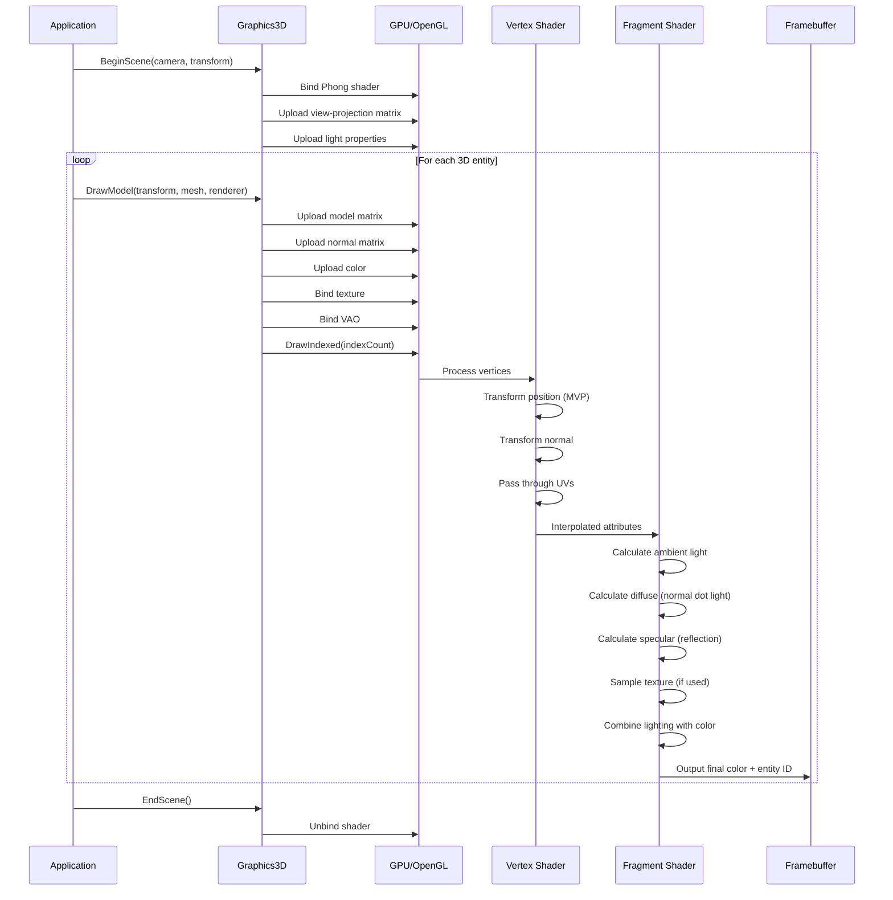
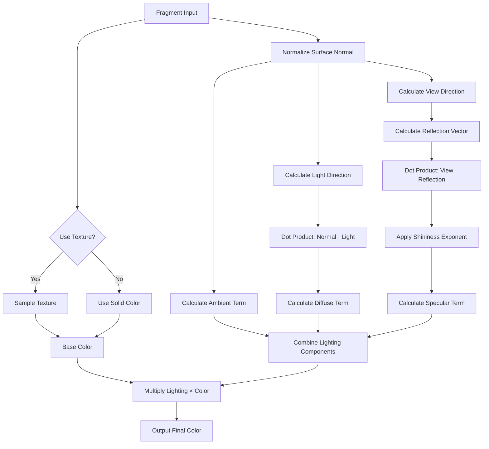
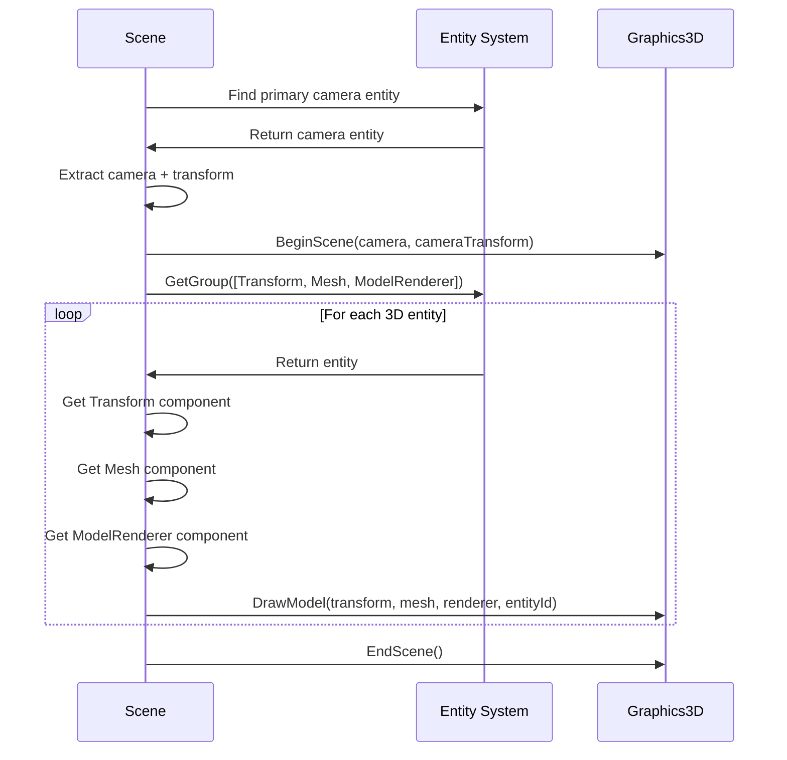
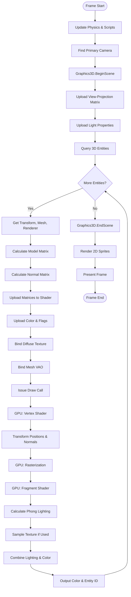

# OpenGL 3D Rendering Workflow

## Overview

The OpenGL 3D rendering system provides a complete pipeline for rendering three-dimensional models with realistic lighting using the Phong illumination model. This module handles everything from model loading through mesh processing, vertex transformation, lighting calculations, and final pixel rendering.

### Purpose

- Render 3D models imported from standard 3D file formats (OBJ, FBX, etc.)
- Apply realistic lighting using the Phong reflection model
- Support textured and colored 3D geometry
- Enable perspective and orthographic camera views
- Integrate with the Entity-Component System for scene-based rendering

### Key Concepts

**Mesh-Based Rendering**: Unlike 2D sprite batching, 3D rendering operates on individual meshes. Each mesh contains vertices with 3D positions, normals, and texture coordinates, organized into triangles via index buffers.

**Phong Lighting Model**: Per-pixel lighting combining three components:
- **Ambient**: Base illumination that exists everywhere
- **Diffuse**: Light that scatters based on surface angle to light source
- **Specular**: Shiny highlights based on view angle and reflection

**Model-View-Projection Pipeline**: Vertices flow through multiple transformation stages:
- **Model Matrix**: Positions and orients the mesh in world space
- **View Matrix**: Transforms from world space to camera space
- **Projection Matrix**: Applies perspective or orthographic projection

**Normal Transformation**: Normals require special handling (inverse transpose of model matrix) to maintain correct orientation under non-uniform scaling.

**Assimp Integration**: The system uses the Assimp library to parse 3D model files and extract mesh data, handling complex model hierarchies and multiple submeshes automatically.

## Architecture Flow

### Model Loading Phase

When a 3D model is loaded, the system processes it through several stages:

1. **File Import**: Assimp reads the model file (OBJ, FBX, GLTF, etc.), parses and triangulates it
2. **Hierarchy Traversal**: The scene graph is processed recursively, flattening into a list of meshes
3. **Mesh Extraction**: Position, normal, and texture coordinate data is extracted from each mesh
4. **Material Processing**: Texture paths for diffuse, specular, normal, and height maps are extracted and loaded
5. **GPU Resource Creation**: Vertex buffers, index buffers, and VAOs are created and initialized

### Scene Rendering Setup

Before rendering 3D geometry:

1. **Camera Configuration**: Active camera's view and projection matrices are computed
2. **Shader Preparation**: Phong shader is bound with light properties (position, color, shininess)
3. **Begin Scene**: Graphics3D begins the scene, setting per-scene uniforms

### Per-Mesh Rendering

Each 3D entity with mesh components is rendered individually:

1. **Entity Query**: Scene queries entities with TransformComponent, MeshComponent, and ModelRendererComponent
2. **Per-Mesh Transformation**: Model matrix and normal matrix are uploaded to shader
3. **Material Setup**: Color and texture bindings are configured
4. **Draw Call**: Indexed draw call renders the mesh

### Shader Execution Pipeline



### Vertex Shader Processing

The vertex shader transforms each vertex from model space to clip space:

- **Position Transformation**: Model matrix converts to world space, then view-projection to clip space
- **Normal Transformation**: Normal matrix ensures correct orientation for lighting
- **Attribute Pass-Through**: Texture coordinates and entity ID pass to fragment shader

**Platform Handling**: The shader uses a consistent multiplication order, while C# code (Graphics3D.BeginScene) handles platform-specific view-projection computation differences between Windows and macOS.

### Fragment Shader Lighting

The fragment shader implements per-pixel Phong lighting:



## Lifecycle & Timing

### Initialization

- Graphics3D instance is created
- Phong shader is loaded and compiled
- Light properties initialized with defaults (position, color, shininess)

### Per-Frame Execution

```mermaid
sequenceDiagram
    participant Loop as Game Loop
    participant Scene as Scene System
    participant Physics as Physics System
    participant Graphics3D as Graphics3D
    participant Graphics2D as Graphics2D

    Loop->>Scene: Update(deltaTime)
    Scene->>Physics: Step simulation
    Note over Scene: Entity transforms updated

    Scene->>Scene: Find primary camera
    Scene->>Graphics3D: BeginScene(camera, transform)

    Scene->>Scene: Query 3D entities
    loop For each 3D entity
        Scene->>Graphics3D: DrawModel(transform, mesh, renderer)
    end

    Scene->>Graphics3D: EndScene()

    Scene->>Graphics2D: BeginScene(camera, transform)
    Note over Graphics2D: 2D sprites rendered after 3D
    Scene->>Graphics2D: EndScene()
```

**Rendering Order**:
1. Physics and game logic update entity transforms
2. Primary camera is identified from scene entities
3. 3D rendering (meshes with lighting)
4. 2D rendering (sprites, UI)
5. Frame is presented to screen

### Runtime vs Editor Mode

- **Runtime Mode**: Uses the scene's designated primary camera, called from `Scene.OnUpdateRuntime()`
- **Editor Mode**: Currently disabled for 3D rendering, would use editor's viewport camera with entity selection support

### Shutdown

All GPU resources (vertex buffers, index buffers, VAOs, textures, shaders) are disposed via RAII.

## Advanced Features

### Model Loading and Caching

- **Assimp Integration**: Supports 40+ model formats with automatic triangulation
- **MeshFactory Pattern**: Centralized mesh creation with caching by file path
- **Texture Deduplication**: Shared textures across meshes reduce memory usage

### Normal Matrix Computation

Non-uniform scaling requires computing the normal matrix as the transpose of the inverse of the model matrix. This preserves correct lighting calculations.

### Lighting Configuration

- **Light Properties**: Position, color, and shininess can be changed at runtime
- **Single Light Model**: Current implementation supports one directional light; future expansion could add multiple lights

### Texture Override System

ModelRendererComponent supports per-entity texture overrides for use cases like character customization, damaged versions, or team colors.

### Entity Identification

Fragment shader outputs entity ID to a second framebuffer attachment, enabling editor picking by reading pixel values on mouse click.

## Mesh Data Structure

### Vertex Layout

Each vertex contains:
- **Position** (3 floats): X, Y, Z coordinates in model space
- **Normal** (3 floats): Surface normal vector for lighting
- **TexCoord** (2 floats): UV texture coordinates
- **EntityID** (1 int): Entity identifier for picking

### Buffer Organization

- **Vertex Buffer**: Static GPU data uploaded at load time
- **Index Buffer**: Triangle indices enabling vertex reuse
- **Vertex Array Object (VAO)**: Encapsulates buffer bindings and attribute layouts

### Mesh Initialization

Meshes use lazy initialization - GPU resources are created on first use via `GetVertexArray()`.

## Performance Characteristics

### No Batching

Unlike 2D rendering, 3D uses one draw call per mesh. This is acceptable because:
- Each mesh has unique model matrix
- GPU is optimized for transforming vertices
- Draw call overhead is amortized over many triangles per mesh

### Typical Performance

- 100 3D entities = 100 draw calls (acceptable for moderate entity counts)
- Vertex processing is parallelized on GPU
- Fragment shader (pixel cost) is typically the bottleneck

### Optimization Strategies

- Level-of-detail (LOD) meshes for distant objects
- Frustum culling to skip off-screen objects
- Occlusion culling to skip hidden objects
- Mesh instancing for identical objects (future feature)

### Comparison: 2D vs 3D Rendering

| Aspect | 2D Rendering | 3D Rendering |
|--------|--------------|--------------|
| Batching | Yes, extensive | No |
| Draw Calls | Few (1-10 per frame) | Many (1 per mesh) |
| Vertex Upload | Every frame (dynamic) | Once at load (static) |
| Transformation | CPU (batching) | GPU (per-vertex) |
| Lighting | None (pre-lit sprites) | Per-pixel Phong |
| Depth | Z-sorting or fixed layers | True 3D depth buffer |
| Typical Count | 1000s of sprites | 100s of meshes |

## Integration with Scene System

### Component Architecture

- **MeshComponent**: Holds reference to Mesh object, provides geometry
- **ModelRendererComponent**: Color tint, texture override, shadow flags
- **TransformComponent**: Position, rotation, scale, provides model matrix
- **CameraComponent**: Marks primary camera, provides view and projection matrices

### Scene Rendering Flow



## Camera System Integration

### Perspective Projection

- Creates a frustum viewing volume with depth perception
- Parameters: Field of View, Aspect Ratio, Near/Far Clip planes
- Farther objects appear smaller

### Orthographic Projection

- Creates a box viewing volume with no depth scaling
- Parameters: Size, Aspect Ratio, Near/Far Clip planes
- Used for top-down views, 2D-style 3D, UI

### Camera Component

SceneCamera class supports both projection types with dynamic switching. The scene searches for a CameraComponent with the Primary flag set.

## Complete Frame Rendering



## Common Issues and Debugging

**Nothing renders**: Check camera position/orientation, near/far clip planes, required components, mesh initialization

**Incorrect colors**: Verify light position/color, normal transformations, texture loading, color tint values

**Normals appear wrong**: Check normal matrix calculation, model exports, non-uniform scaling issues

**Performance issues**: Check draw call count, mesh polygon counts, culling efficiency

## Future Enhancements

- **Multiple Lights**: Point lights, spotlights, directional lights with shadow mapping
- **Instanced Rendering**: Efficient rendering of many identical meshes (foliage, particles, crowds)
- **Deferred Rendering**: G-buffer approach enabling many lights efficiently
- **PBR Materials**: Physically-based rendering with metallic-roughness workflow

## Summary

The OpenGL 3D rendering workflow provides complete support for rendering lit 3D models. Key characteristics:

- **Mesh-based rendering**: Each mesh drawn individually with its own transformation
- **Phong lighting**: Per-pixel lighting with ambient, diffuse, and specular components
- **Model-View-Projection**: Standard 3D transformation pipeline with perspective/orthographic support
- **Assimp integration**: Supports dozens of model formats
- **Component-driven**: Integrates seamlessly with ECS for scene management
- **Editor support**: Entity ID attachment enables 3D picking in editor
- **Extensible**: Foundation for advanced features like shadows, PBR, and instancing

This architecture complements the 2D rendering system, allowing games to mix 2D sprites and 3D models in the same scenes.
