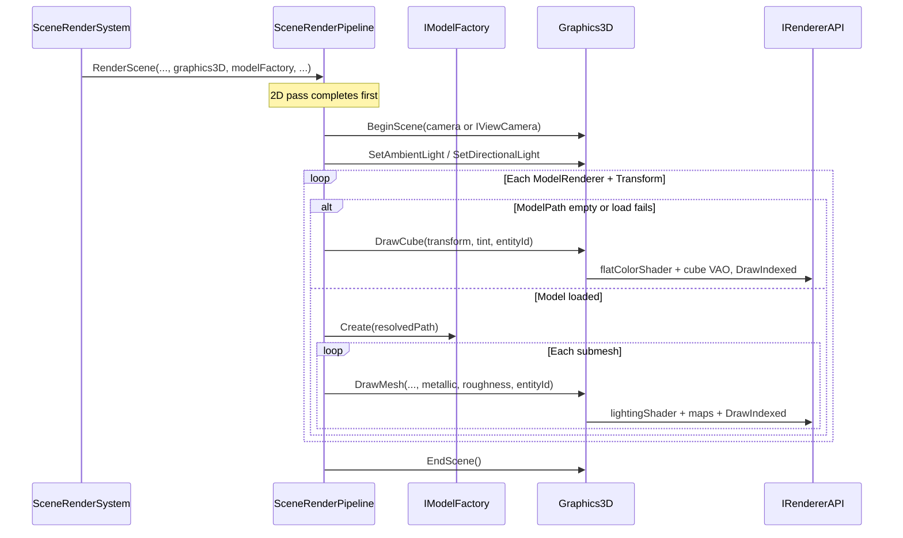

# OpenGL 3D Rendering Workflow

**File**: `Engine/Renderer/Graphics3D.cs` — implements `IGraphics3D`

## Overview

The OpenGL 3D path draws entities with `ModelRendererComponent`: either imported meshes (Assimp → PBR `lightingShader`) or a shared unit cube fallback (`flatColorShader`). Lighting comes from the first `AmbientLightComponent` and `DirectionalLightComponent` in the scene. There is no 3D draw batching.

### Purpose

- Load and draw FBX / glTF / GLB (and other Assimp-supported) models with metal/rough materials
- Fall back to lit unit cubes when the model path is empty or load fails
- Support perspective and orthographic cameras (via `SceneCamera`)
- Output entity IDs for editor picking (same framebuffer attachment model as 2D)
- Integrate with `SceneRenderPipeline` and the ECS scene graph

### Key Concepts

**Cube vs mesh**: Empty/`null` load → one `DrawCube` of the shared mesh. Successful load → one `DrawMesh` per submesh.

**Model factory**: Path-keyed cache. Miss → `AssimpModelImporter` → texture bind via `TextureFactory` → GPU mesh init → cache.

**PBR materials**: Albedo, packed metallic-roughness, optional normal (and legacy specular). Scalars fill gaps; component metallic/roughness overrides replace imported scalars when set.

**Lighting**: Ambient + one directional light. Cube path is ambient+diffuse tint only; mesh path uses Cook-Torrance-style metal/rough in `lightingShader`.

**Model-View-Projection**: `BeginScene` uploads view-projection and view position; each draw uploads model and normal matrices.

---

## Architecture Flow

### Initialization

**File**: `Engine/Renderer/Graphics3D.cs`

1. Load `flatColorShader.vert` / `.frag` (cube fallback)
2. Load `lightingShader.vert` / `.frag` (textured PBR meshes); bind sampler units 0–3
3. `MeshFactory.CreateCube()` creates the shared cube `Mesh` (24 vertices, 36 indices)

### Scene Integration

**File**: `Engine/Scene/SceneRenderPipeline.cs`

`SceneRenderSystem` (priority 150) calls `SceneRenderPipeline.RenderScene`: **2D first**, then **3D**:

| Pass | Components queried | Graphics API |
|------|-------------------|--------------|
| 2D sprites / subtextures | `SpriteRendererComponent` or `SubTextureRendererComponent` + `TransformComponent` | `IGraphics2D.DrawQuad` |
| 3D models / cubes | `ModelRendererComponent` + `TransformComponent` | `DrawMesh` or `DrawCube` |

Lighting is resolved once per 3D pass from the first matching ECS components:

| Component | Shader uniforms | Default when absent |
|-----------|-----------------|---------------------|
| `AmbientLightComponent` | `lightColor`, `strength` | `Vector3.One`, `0.1` |
| `DirectionalLightComponent` | `u_LightDirection`, `u_LightColor` | `(0, -1, 0)`, `Vector3.Zero` |

### Per-Frame 3D Cycle

```mermaid
sequenceDiagram
    participant SRS as SceneRenderSystem
    participant SRP as SceneRenderPipeline
    participant MF as IModelFactory
    participant G3D as Graphics3D
    participant GPU as IRendererAPI

    SRS->>SRP: RenderScene(..., graphics3D, modelFactory, ...)
    Note over SRP: 2D pass completes first
    SRP->>G3D: BeginScene(camera or IViewCamera)
    SRP->>G3D: SetAmbientLight / SetDirectionalLight
    loop Each ModelRenderer + Transform
        alt ModelPath empty or load fails
            SRP->>G3D: DrawCube(transform, tint, entityId)
            G3D->>GPU: flatColorShader + cube VAO, DrawIndexed
        else Model loaded
            SRP->>MF: Create(resolvedPath)
            loop Each submesh
                SRP->>G3D: DrawMesh(..., metallic, roughness, entityId)
                G3D->>GPU: lightingShader + maps + DrawIndexed
            end
        end
    end
    SRP->>G3D: EndScene()
```

---

## IGraphics3D API

**File**: `Engine/Renderer/IGraphics3D.cs`

| Method | Purpose |
|--------|---------|
| `Init()` | Load both shaders; create shared cube mesh |
| `BeginScene(Camera, Matrix4x4 transform)` | Runtime: invert camera transform × projection → `u_ViewProjection`; store view position |
| `BeginScene(IViewCamera)` | Editor: precomputed view-projection + position from `EditorCamera` |
| `EndScene()` | No-op (unbind per draw) |
| `DrawCube(Matrix4x4 transform, Vector4 color, int entityId)` | Shared cube with tint |
| `DrawMesh(transform, mesh, material, tint, metallic, roughness, entityId)` | PBR submesh draw |
| `SetAmbientLight` / `SetDirectionalLight` | Upload light uniforms |
| `ResetStats()` / `GetStats()` | Per-frame `DrawCalls` |

---

## Model Loading

**Files**: `Engine/Renderer/ModelFactory.cs`, `Engine/Renderer/AssimpModelImporter.cs`, `Engine/Renderer/Model.cs`, `Engine/Renderer/MeshMaterial.cs`

| Step | Behavior |
|------|----------|
| Cache | Full-path key; return existing `Model` on hit |
| Import | Assimp with triangulate, normals, tangents, FlipUVs, PreTransformVertices |
| Materials | BaseColor/Diffuse → albedo; glTF MR / metalness / roughness → packed MR; normals/height; specular or `_Specular` sibling of `_BaseColor` |
| Scalars | glTF metallic/roughness factors when present; else Phong shininess → roughness, metallic `0` |
| Textures | Paths relative to model directory; `TextureFactory.Create`; missing map → soft fail (null) |
| GPU | Each submesh `Mesh.Initialize` via buffer factories |
| Failure | Missing file / no meshes → `null` → pipeline draws cube |

`Model` is an ordered list of `ModelSubmesh(Mesh, MeshMaterial)`. Animation, skins, and file cameras/lights are ignored. Node transforms are baked (`PreTransformVertices`); per-mesh `NodeTransform` still multiplies the entity transform at draw time.

---

## Mesh and Vertex Layout

**Files**: `Engine/Renderer/Mesh.cs`, `Engine/Renderer/MeshFactory.cs`

`Mesh.Vertex` (60 bytes):

| Field | Type | Used by |
|-------|------|---------|
| Position | `Vector3` | Both shaders (`a_Position`) |
| Normal | `Vector3` | Both shaders (`a_Normal`) |
| TexCoord | `Vector2` | `lightingShader` |
| Tangent / Bitangent | `Vector3` | `lightingShader` (normal mapping) |
| EntityId | `int` | Both (`a_EntityID`) |

Normal matrix: transpose of inverse model matrix (`Graphics3D.ComputeNormalMatrix`).

---

## Shaders

### Cube — `flatColorShader`

**Files**: `assets/shaders/OpenGL/flatColorShader.vert`, `.frag`

- Albedo from `u_Color`
- `ambient = strength * lightColor`
- `diffuse = max(dot(N, L), 0.0) * u_LightColor` where `L = -u_LightDirection`
- Output: `(ambient + diffuse) * albedo`; entity ID to second attachment

### Mesh — `lightingShader`

**Files**: `assets/shaders/OpenGL/lightingShader.vert`, `.frag`

- Samplers: `u_AlbedoMap` (0), `u_MetallicRoughnessMap` (1), `u_NormalMap` (2), `u_SpecularMap` (3)
- Uniforms: `u_Metallic`, `u_Roughness`, `u_Color` tint, light + view position
- Has-map flags select textures vs white / flat-normal fallbacks
- Metal/rough BRDF under the directional light; ambient fill dampened for metals

---

## ECS Components

| Component | Role |
|-----------|------|
| `ModelRendererComponent` | `ModelPath`, `Color` tint, optional `MetallicOverride` / `RoughnessOverride` |
| `TransformComponent` | World model matrix via `GetTransform()` |
| `CameraComponent` | Primary camera (resolved by `PrimaryCameraSystem`, priority 145) |
| `AmbientLightComponent` | Scene-wide ambient color and strength |
| `DirectionalLightComponent` | World-space light direction and color |

**Editor UI:** [Component Inspector — lighting and model renderer](../guide/editor/component-inspector.md#modelrenderercomponent)

---

## Camera Integration

Same binding as 2D:

- **Runtime**: `PrimaryCameraSystem` → `Camera` + entity transform; `Graphics3D.BeginScene` inverts transform × projection
- **Editor**: `EditorCamera` as `IViewCamera`

Prefer `ProjectionType.Perspective` for depth. Orthographic works for flat 3D-style views.

---

## Performance Characteristics

| Aspect | 2D (`Graphics2D`) | 3D (`Graphics3D`) |
|--------|-------------------|-------------------|
| Batching | Yes (up to 10K quads) | No |
| Draw calls | Few per frame | One per cube, or one per submesh |
| Vertex upload | Dynamic each frame | Static at mesh init / cube creation |
| Lighting | None (tinted sprites) | Ambient + directional (PBR on meshes) |
| Depth | Off during sprite flush | On for 3D draws |

`Graphics3D` statistics expose `DrawCalls` only.

---

## Entity Picking

`entity.Id` is passed into `DrawCube` / `DrawMesh`. Fragment shaders write `o_EntityID` to the second color attachment — same picking path as 2D ([Frame Buffers](frame-buffers.md)).

---

## Common Issues

**Nothing renders**: Primary camera present; entity has `ModelRendererComponent` + `TransformComponent`; frustum contains the object.

**Black / flat shading**: Add `DirectionalLightComponent` with non-zero `Color` (default is zero when absent). Raise `AmbientLightComponent.Strength` for fill.

**Cube instead of model**: Check `ModelPath`, file exists after `PathBuilder.Resolve`, and logs for Assimp / texture failures.

**Wrong scale**: Fallback cube is 1×1×1 centered at origin; imported meshes keep their authored size (plus entity scale).

---

## Summary

- **Models** via Assimp + `ModelFactory` cache; **cube fallback** when path/load fails
- **PBR metal/rough** on meshes; simple lit tint on cubes
- **Ambient + one directional** light from ECS
- **No 3D batching**
- **Same scene pipeline** as 2D: `SceneRenderSystem` → `SceneRenderPipeline` → `Graphics3D`

Design background: [3D model loading](../specs/3d-model-loading/introduction.md), [Physically based rendering](../specs/physically-based-rendering/introduction.md).

For the full pipeline diagram and `IRendererAPI` details, see [Rendering Pipeline](../architecture/rendering-pipeline.md).
