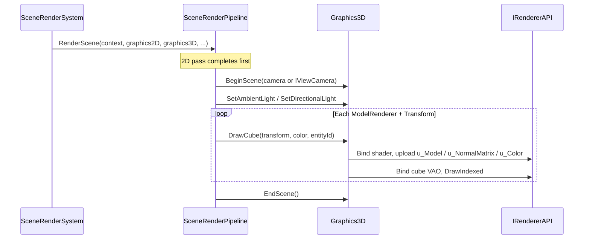

# OpenGL 3D Rendering Workflow

> **Prototype status:** 3D rendering is intentionally minimal — lit unit cubes only. There is no mesh import (no Assimp, `.obj`, or `.fbx`), no textured 3D geometry, and no draw batching. Use for blockout and pipeline validation; not for shipping 3D art.

**File**: `Engine/Renderer/Graphics3D.cs` — implements `IGraphics3D`

## Overview

The OpenGL 3D rendering path draws lit unit cubes for entities with `ModelRendererComponent`. It uses a shared cube mesh, per-entity model matrices, and ambient plus directional lighting from ECS light components. There is no mesh import, texture sampling, or draw batching in the current 3D path.

### Purpose

- Render solid-color 3D cubes with simple ambient and diffuse lighting
- Support perspective and orthographic cameras (via `SceneCamera`)
- Output entity IDs for editor picking (same framebuffer attachment model as 2D)
- Integrate with `SceneRenderPipeline` and the ECS scene graph

### Key Concepts

**Per-Entity Draw Calls**: Each `ModelRendererComponent` entity issues one indexed draw of the shared cube mesh. Unlike 2D batching, there is no CPU-side geometry accumulation for 3D.

**Shared Cube Mesh**: `MeshFactory.CreateCube()` builds a single 1×1×1 cube (half-extent 0.5) with per-face normals, uploads it once, and reuses the same VAO for every draw.

**Ambient + Diffuse Lighting**: `flatColorShader.frag` combines scene ambient (`AmbientLightComponent`) and directional diffuse (`DirectionalLightComponent`) with the entity albedo color. There is no specular term.

**Model-View-Projection**: `BeginScene` uploads view-projection; each `DrawCube` uploads model and normal matrices.

---

## Architecture Flow

### Initialization

**File**: `Engine/Renderer/Graphics3D.cs`

1. `Graphics3D.Init()` loads `flatColorShader.vert` / `flatColorShader.frag` via `ShaderFactory`
2. `MeshFactory.CreateCube()` creates and initializes the shared cube `Mesh` (24 vertices, 36 indices)

### Scene Integration

**File**: `Engine/Scene/SceneRenderPipeline.cs`

`SceneRenderSystem` (priority 150) calls `SceneRenderPipeline.RenderScene`, which runs **2D sprites first**, then **3D cubes**:

| Pass | Components queried | Graphics API |
|------|-------------------|--------------|
| 2D sprites / subtextures | `SpriteRendererComponent` or `SubTextureRendererComponent` + `TransformComponent` | `IGraphics2D.DrawQuad` |
| 3D cubes | `ModelRendererComponent` + `TransformComponent` | `IGraphics3D.DrawCube` |

Lighting is resolved once per 3D pass from the first matching ECS components:

| Component | Shader uniforms | Default when absent |
|-----------|-----------------|---------------------|
| `AmbientLightComponent` | `lightColor`, `strength` | `Vector3.One`, `0.1` |
| `DirectionalLightComponent` | `u_LightDirection`, `u_LightColor` | `(0, -1, 0)`, `Vector3.Zero` |

### Per-Frame 3D Cycle

```mermaid
sequenceDiagram
    participant SRS as SceneRenderSystem
    participant SRP as SceneRenderPipeline
    participant G3D as Graphics3D
    participant GPU as IRendererAPI

    SRS->>SRP: RenderScene(context, graphics2D, graphics3D, ...)
    Note over SRP: 2D pass completes first
    SRP->>G3D: BeginScene(camera or IViewCamera)
    SRP->>G3D: SetAmbientLight / SetDirectionalLight
    loop Each ModelRenderer + Transform
        SRP->>G3D: DrawCube(transform, color, entityId)
        G3D->>GPU: Bind shader, upload u_Model / u_NormalMatrix / u_Color
        G3D->>GPU: Bind cube VAO, DrawIndexed
    end
    SRP->>G3D: EndScene()
```

---

## IGraphics3D API

**File**: `Engine/Renderer/IGraphics3D.cs`

| Method | Purpose |
|--------|---------|
| `Init()` | Load `flatColorShader`, create shared cube mesh |
| `BeginScene(Camera, Matrix4x4 transform)` | Runtime: invert camera entity transform × projection → `u_ViewProjection` |
| `BeginScene(IViewCamera)` | Editor: use precomputed view-projection from `EditorCamera` |
| `EndScene()` | Unbind mesh shader |
| `DrawCube(Matrix4x4 transform, Vector4 color, int entityId)` | Draw shared cube with model matrix and tint |
| `SetAmbientLight(Vector3 color, float strength)` | Upload ambient uniforms |
| `SetDirectionalLight(Vector3 direction, Vector3 color)` | Upload directional light uniforms |
| `ResetStats()` / `GetStats()` | Track per-frame `DrawCalls` (one per cube) |

---

## Mesh and Vertex Layout

**Files**: `Engine/Renderer/Mesh.cs`, `Engine/Renderer/MeshFactory.cs`

`Mesh.Vertex` (60 bytes):

| Field | Type | Shader location |
|-------|------|-----------------|
| Position | `Vector3` | `a_Position` (0) |
| Normal | `Vector3` | `a_Normal` (1) |
| TexCoord | `Vector2` | not used by `flatColorShader` |
| Tangent | `Vector3` | not used |
| Bitangent | `Vector3` | not used |
| EntityId | `int` | `a_EntityID` (5) |

`Mesh.Initialize()` creates VAO/VBO/IBO via buffer factories and uploads static vertex data. `IMeshFactory` currently exposes only `CreateCube()` — no file-based mesh loading.

Normal matrix for lighting: transpose of the inverse of the model matrix (`Graphics3D.ComputeNormalMatrix`).

---

## Shaders

**Files**: `assets/shaders/OpenGL/flatColorShader.vert`, `flatColorShader.frag`

**Vertex shader**:
- Transforms position: `worldPos = vec4(a_Position, 1.0) * u_Model`
- Transforms normal: `v_Normal = normalize(a_Normal * mat3(u_NormalMatrix))`
- Passes `a_EntityID` to fragment stage

**Fragment shader**:
- `albedo = u_Color.rgb`
- `ambient = strength * lightColor`
- `diffuse = max(dot(N, L), 0.0) * u_LightColor` where `L = -u_LightDirection`
- `o_Color = vec4((ambient + diffuse) * albedo, u_Color.a)`
- `o_EntityID = u_EntityID` (entity picking attachment)

---

## ECS Components

**File**: `SceneComponents/Rendering/ModelRendererComponent.cs`

| Component | Role |
|-----------|------|
| `ModelRendererComponent` | `Color` tint (`Vector4`, default white) — only rendering property today |
| `TransformComponent` | World model matrix via `GetTransform()` |
| `CameraComponent` | Primary camera for view-projection (resolved by `PrimaryCameraSystem`, priority 145) |
| `AmbientLightComponent` | Scene-wide ambient color and strength |
| `DirectionalLightComponent` | World-space light direction and color |

There is no `MeshComponent` or model file path in the current codebase. Every `ModelRendererComponent` draws the same unit cube mesh scaled and positioned by its transform.

**Editor UI:** [Component Inspector — lighting and model renderer](../guide/editor/component-inspector.md#ambientlightcomponent)

---

## Camera Integration

3D cubes use the same camera binding as 2D sprites:

- **Runtime**: `PrimaryCameraSystem` provides `Camera` + entity `Transform`; `Graphics3D.BeginScene` inverts the camera transform and multiplies by `camera.GetProjectionMatrix()`
- **Editor**: `EditorCamera` implements `IViewCamera`; `BeginScene(IViewCamera)` uploads `GetViewProjectionMatrix()` directly

Use `ProjectionType.Perspective` on `SceneCamera` for depth perspective. Orthographic projection is also supported for flat 3D-style views.

---

## Performance Characteristics

| Aspect | 2D (`Graphics2D`) | 3D (`Graphics3D`) |
|--------|-------------------|-------------------|
| Batching | Yes (up to 10K quads) | No |
| Draw calls | Few per frame | One per `ModelRendererComponent` |
| Vertex upload | Dynamic each frame | Static at cube creation |
| Lighting | None (tinted sprites) | Ambient + directional diffuse |
| Depth | Z-order / layers | Depth buffer (enabled in `IRendererAPI.Init`) |

`Graphics3D` statistics expose `DrawCalls` only (no quad/mesh counts).

---

## Entity Picking

Cube draws pass `entity.Id` into `DrawCube`. The fragment shader writes `o_EntityID` to the second color attachment, matching the 2D picking pipeline described in [Frame Buffers](frame-buffers.md).

---

## Common Issues

**Nothing renders**: Confirm a valid primary camera, `ModelRendererComponent` + `TransformComponent` on entities, and that the camera frustum contains the cubes.

**Flat / black cubes**: Add a `DirectionalLightComponent` with non-zero `Color`. Default directional color is zero when no component exists. Tune `AmbientLightComponent.Strength` for base fill.

**Wrong scale**: The shared mesh is a 1×1×1 cube centered at the origin; use `TransformComponent` scale for size.

---

## Summary

Current 3D rendering is intentionally minimal:

- **Cube-only geometry** via shared `MeshFactory` mesh
- **Ambient + diffuse** lighting from ECS light components
- **No model import**, textures, specular highlights, or 3D batching
- **Same scene pipeline** as 2D: `SceneRenderSystem` → `SceneRenderPipeline` → `Graphics3D`
- **Entity ID output** for editor picking

For the full pipeline diagram and `IRendererAPI` details, see [Rendering Pipeline](../architecture/rendering-pipeline.md).
