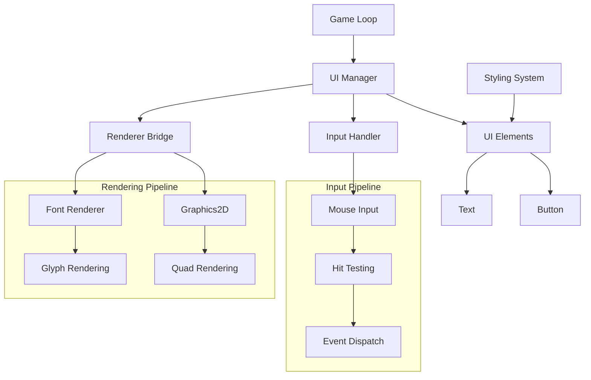
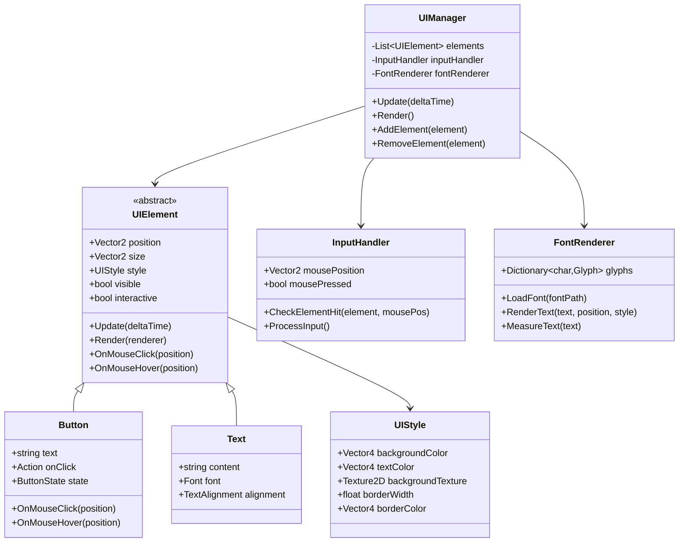
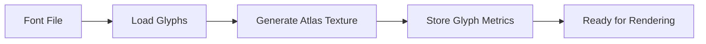
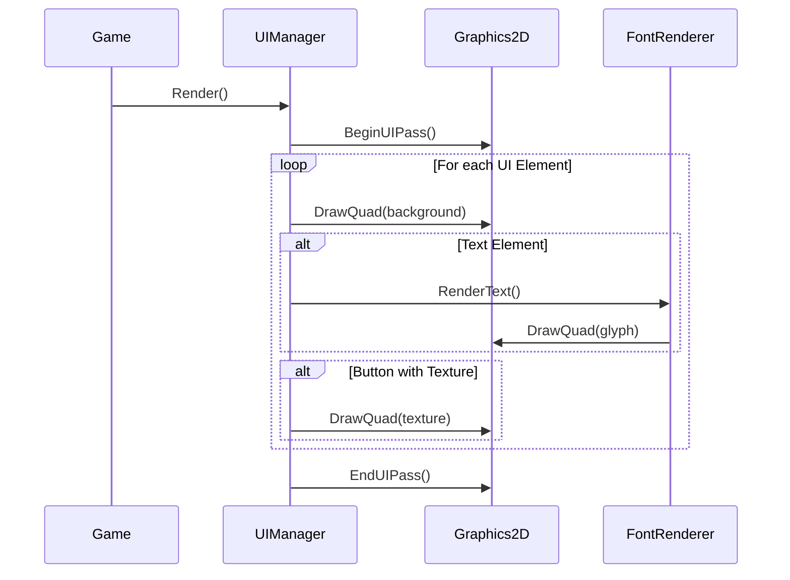
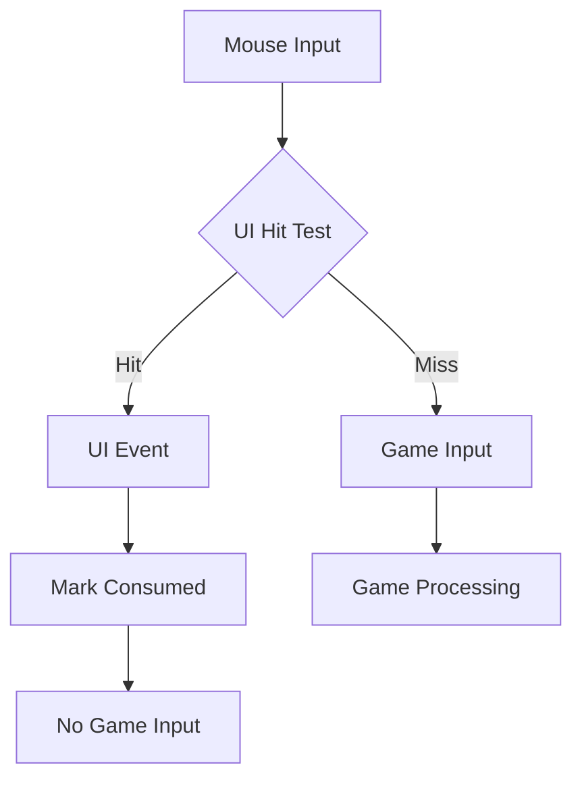

# UI System Specification

## Overview
A screen-space UI system for in-game interfaces that renders as an overlay on top of the 3D scene. The system operates independently from the ECS architecture and integrates with the existing OpenGL renderer and input system.

## Core Requirements

### Functional Requirements
- **UI Elements**: Button and Text components initially
- **Positioning**: Fixed screen-space positioning system
- **Styling**: Custom colors, textures, and borders per element
- **Input**: Mouse interaction with input consumption
- **Rendering**: Screen-space overlay using existing 2D renderer
- **Integration**: Works with current input system without ECS dependency

### Non-Functional Requirements
- **Performance**: Handle 50+ UI elements at 60 FPS
- **Memory**: Minimal allocations during frame rendering
- **Platform**: Cross-platform compatibility (Windows, Linux, macOS)

## System Architecture



### Component Structure



## System Components

### 1. UI Manager
**Purpose**: Central coordinator for all UI operations

**Responsibilities**:
- Element lifecycle management
- Input processing coordination
- Render order management
- Frame update orchestration

**Key Methods**:
```csharp
void Update(float deltaTime)
void Render(IGraphics2D renderer)
void AddElement(UIElement element)
bool RemoveElement(UIElement element)
UIElement GetElementAt(Vector2 screenPosition)
```

### 2. UI Element Base Class
**Purpose**: Common interface for all UI components

**Properties**:
- `Vector2 Position` - Screen coordinates (0,0 = top-left)
- `Vector2 Size` - Element dimensions in pixels
- `UIStyle Style` - Visual appearance configuration
- `bool Visible` - Rendering visibility flag
- `bool Interactive` - Input processing flag

### 3. Button Component
**Purpose**: Interactive clickable UI element

**Features**:
- Text label rendering
- Click event callbacks
- Visual state feedback (normal, hover, pressed)
- Texture-based backgrounds

**States**:
- Normal: Default appearance
- Hover: Mouse over element
- Pressed: Mouse down on element
- Disabled: Non-interactive state

### 4. Text Component
**Purpose**: Static text rendering

**Features**:
- Font-based text rendering
- Color styling
- Text measurement utilities
- Left/Center/Right alignment

### 5. Font Rendering System
**Purpose**: Text rendering capabilities

**Features**:
- TrueType font loading
- Glyph atlas generation
- Text measurement
- Multi-line text support

**Font Atlas Generation**:


### 6. Styling System
**Purpose**: Visual appearance configuration

**Style Properties**:
- Background Color (`Vector4`)
- Text Color (`Vector4`)
- Background Texture (`Texture2D`)
- Border Width (`float`)
- Border Color (`Vector4`)

### 7. Input Handler
**Purpose**: Mouse interaction processing

**Features**:
- Hit testing against UI elements
- Input event generation
- Input consumption (prevent game input)
- Mouse state tracking

## Rendering Pipeline

### Screen Space Projection
UI elements render in normalized screen coordinates:
- (0,0) = Top-left corner
- (1,1) = Bottom-right corner
- Independent of camera transformations
- Always rendered after 3D scene

### Rendering Order
1. **3D Scene**: Game world rendering
2. **UI Background**: Non-interactive UI elements
3. **UI Interactive**: Buttons and interactive elements
4. **UI Overlay**: Always-on-top elements

### Render Integration


## Input System Integration

### Hit Testing Algorithm
```
For each UI element (reverse render order):
    If element.Interactive && element.Visible:
        If mousePosition inside element.Bounds:
            Return element
Return null (no UI hit)
```

### Input Consumption
When UI element receives input:
1. Process UI event (button click, etc.)
2. Mark input as consumed
3. Prevent game input systems from receiving event

### Input Flow


## Font System Architecture

### Font Loading Process
1. **Font File Loading**: Load TTF/OTF font files
2. **Glyph Extraction**: Extract character metrics and bitmap data
3. **Atlas Generation**: Pack glyphs into texture atlas
4. **Metrics Storage**: Store character dimensions and offsets

### Text Rendering Process
1. **Text Measurement**: Calculate total text dimensions
2. **Glyph Positioning**: Position each character
3. **Quad Generation**: Create screen-space quads for each glyph
4. **Batch Rendering**: Submit to existing Graphics2D system

## Performance Considerations

### Optimization Strategies
- **Batch Rendering**: Group UI elements by texture/material
- **Dirty Flagging**: Only update changed elements
- **Culling**: Skip off-screen elements
- **Font Atlas Caching**: Reuse glyph textures

### Memory Management
- Pool UI element objects
- Cache frequently used styles
- Minimize per-frame allocations
- Efficient font atlas packing

## Error Handling

### Font Loading Failures
- Fallback to system default font
- Log warning but continue execution
- Graceful degradation for missing glyphs

### Rendering Failures
- Skip problematic elements
- Continue rendering remaining UI
- Log errors for debugging

### Input Edge Cases
- Handle window resize events
- Manage elements outside screen bounds
- Process rapid click events correctly

## Integration Points

### Existing Systems Integration

#### Graphics2D Integration
```csharp
// Use existing DrawQuad methods for UI backgrounds
graphics2D.DrawQuad(position, size, backgroundColor);
graphics2D.DrawQuad(position, size, backgroundTexture);

// Extend with text rendering
graphics2D.DrawQuad(position, size, glyphTexture, glyphUVs);
```

#### Input System Integration
```csharp
// Hook into existing input callbacks
inputSystem.OnMouseClick += HandleMouseInput;
inputSystem.OnMouseMove += HandleMouseMove;

// Add input consumption mechanism
public bool ConsumeInput { get; set; }
```

### New Components Required
1. **Font Renderer**: New system for text rendering
2. **UI Manager**: Central UI coordination system
3. **UI Elements**: Button and Text component classes
4. **Style System**: Appearance configuration system

## Main Menu Implementation Example

### Menu Structure
```
Main Menu
├── Background (Texture)
├── Title Text ("Game Title")
├── Play Button
├── Options Button
├── Exit Button
```

### Menu Layout
- **Background**: Full-screen textured quad
- **Title**: Centered text at top third
- **Buttons**: Vertical stack, center-aligned
- **Styling**: Consistent button appearance

### Pseudo-code Implementation
```csharp
var mainMenu = new UIManager();

// Background
var background = new UIElement();
background.Style.BackgroundTexture = menuBackgroundTexture;
mainMenu.AddElement(background);

// Title
var title = new Text("Game Title");
title.Position = new Vector2(0.5f, 0.2f); // Center-top
title.Style.TextColor = Vector4.One;
mainMenu.AddElement(title);

// Buttons
var playButton = new Button("Play");
playButton.Position = new Vector2(0.5f, 0.5f);
playButton.OnClick = () => StartGame();
mainMenu.AddElement(playButton);

var exitButton = new Button("Exit");
exitButton.Position = new Vector2(0.5f, 0.7f);
exitButton.OnClick = () => ExitGame();
mainMenu.AddElement(exitButton);
```

## Implementation Plan

### Phase 1: Core Foundation (Week 1)
1. **Create UIManager class**
   - Basic element management
   - Update/Render loops
   - Integration hooks

2. **Implement UIElement base class**
   - Position/Size properties
   - Style system foundation
   - Visibility controls

3. **Basic rendering integration**
   - Screen-space projection
   - Graphics2D integration
   - Render order management

### Phase 2: Font System (Week 2)
1. **FontRenderer implementation**
   - TTF font loading (using FreeType or similar)
   - Glyph atlas generation
   - Text measurement utilities

2. **Text component**
   - Basic text rendering
   - Style integration
   - Alignment options

3. **Font system testing**
   - Multiple font support
   - Different text sizes
   - Performance validation

### Phase 3: Input System (Week 3)
1. **Input handler implementation**
   - Mouse position tracking
   - Hit testing algorithm
   - Input consumption mechanism

2. **Button component**
   - Interactive functionality
   - Visual state management
   - Event callback system

3. **Input integration testing**
   - Click detection accuracy
   - Input consumption validation
   - Edge case handling

### Phase 4: Styling & Polish (Week 4)
1. **Enhanced styling system**
   - Texture support
   - Border rendering
   - Color variations

2. **Main menu implementation**
   - Menu layout creation
   - Button functionality
   - Visual polish

3. **Performance optimization**
   - Batch rendering
   - Memory optimization
   - Profile and optimize

### Phase 5: Testing & Integration (Week 5)
1. **Integration testing**
   - Game integration
   - Cross-platform testing
   - Performance benchmarks

2. **Documentation**
   - API documentation
   - Usage examples
   - Best practices guide

3. **Bug fixes and polish**
   - Address discovered issues
   - Performance tuning
   - Final validation

## Success Criteria

### Functional Success
- ✅ Buttons respond to mouse clicks
- ✅ Text renders with custom fonts and colors
- ✅ UI elements position correctly on screen
- ✅ Input consumption prevents game input conflicts
- ✅ Main menu functions completely

### Performance Success
- ✅ Maintains 60 FPS with 50+ UI elements
- ✅ No visible frame drops during UI interactions
- ✅ Memory usage remains stable during extended use

### Integration Success
- ✅ Works seamlessly with existing renderer
- ✅ Integrates cleanly with current input system
- ✅ No conflicts with ECS systems
- ✅ Cross-platform compatibility maintained

### Code Quality Success
- ✅ Clean, maintainable code architecture
- ✅ Comprehensive error handling
- ✅ Adequate test coverage
- ✅ Clear API for future extensions

---

**Document Version**: 1.0  
**Created**: 2025-09-05  
**Target Completion**: 5 weeks from start date