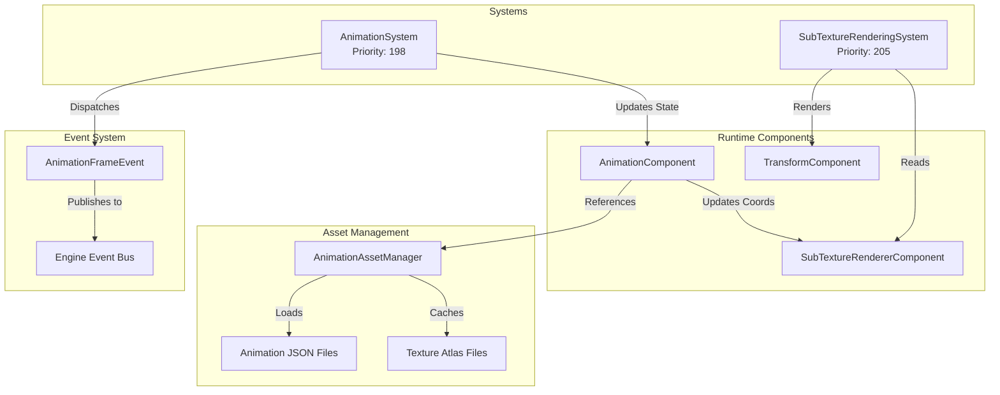
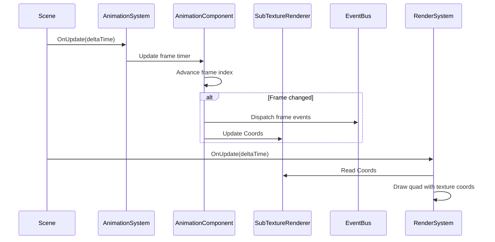
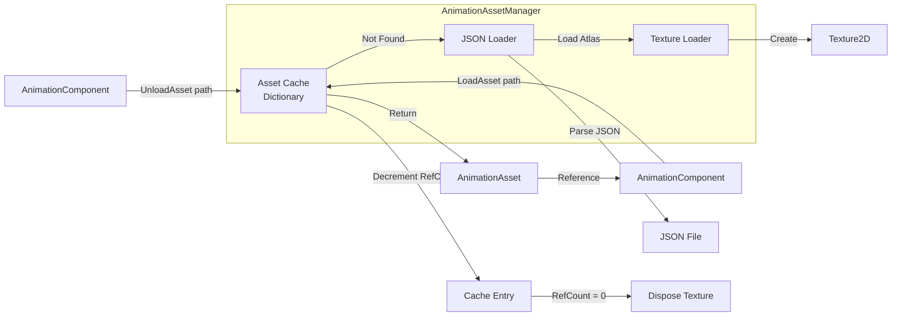

# 2D Sprite Animation System Specification

**Version:** 1.0
**Date:** 2025-10-28
**Status:** Design Phase

---

## Executive Summary

This specification defines a 2D sprite animation system for the game engine, providing frame-based animation using texture atlases (spritesheets). The system integrates with the existing ECS architecture, leveraging the current `SubTextureRendererComponent` for rendering while adding temporal control through an `AnimationComponent` and `AnimationSystem`.

**Key Features:**
- ECS-based animation with delta-time progression
- JSON-defined animation assets with spritesheet references
- Asset manager with reference-counted caching
- Frame event system via engine event bus
- Per-frame metadata (flip, rotation, scale, pivot)
- Animation Timeline editor for visual authoring
- Script API for runtime control

---

## 1. Goals & Requirements

### 1.1 Functional Goals

1. **ECS-Friendly Architecture**: Integrate seamlessly with existing Entity-Component-System
2. **Spritesheet-Based**: Use texture atlases as canonical asset format
3. **Single Active Animation**: One animation clip playing per entity at a time
4. **Runtime Control**: Simple API (Play, Stop, Pause, Resume, Loop)
5. **Frame Metadata**: Support pivot, flip, rotation, scale per frame
6. **Frame Events**: Fire named events at specific frames for gameplay integration
7. **Asset Management**: Automatic texture load/unload with caching
8. **Delta-Time Progression**: Frame-rate independent animation timing
9. **Debug Tools**: Animation Timeline, inspector overlay, performance profiling

### 1.2 Technical Requirements

- **Platform**: C# .NET 9.0
- **Rendering**: Integrate with existing `Graphics2D` batching system
- **Performance**: No impact on rendering batch efficiency
- **Memory**: Efficient caching with reference counting
- **Editor**: ImGui-based authoring and preview tools
- **Serialization**: JSON format for animation assets and scene data

### 1.3 Non-Goals (Future Extensions)

- Multi-layer animation blending
- Inverse kinematics or bone-based animation
- Animation state machines with transitions
- Sprite mesh deformation
- Particle system integration

---

## 2. Architecture Overview

### 2.1 System Components

The animation system consists of four major subsystems:



### 2.2 Component Relationship Pattern

**Companion Component Strategy:**
- `AnimationComponent` holds animation state and asset reference
- `AnimationSystem` updates `AnimationComponent` state each frame
- `AnimationComponent` writes current frame coordinates to `SubTextureRendererComponent`
- Existing `SubTextureRenderingSystem` handles all rendering

**Benefits:**
- Leverages existing rendering infrastructure
- Clean separation of animation logic and rendering
- No changes required to rendering pipeline
- Animation can be added/removed without affecting rendering

### 2.3 Execution Flow



**System Priority Order:**
1. **Priority 150**: ScriptUpdateSystem (scripts can control animations)
2. **Priority 198**: AnimationSystem (updates animation state)
3. **Priority 205**: SubTextureRenderingSystem (renders current frame)

---

## 3. Asset Format Specification

### 3.1 JSON Schema

Animation assets are defined in JSON files with the following structure:

```json
{
  "id": "player.animations",
  "atlas": "Textures/Characters/player_spritesheet.png",
  "cellSize": [32, 32],
  "origin": "bottom-left",
  "animations": {
    "idle": {
      "fps": 8,
      "loop": true,
      "frames": [
        {
          "rect": [0, 0, 32, 32],
          "pivot": [0.5, 0.0],
          "flip": [false, false],
          "rotation": 0.0,
          "scale": [1.0, 1.0],
          "events": []
        },
        {
          "rect": [32, 0, 32, 32],
          "pivot": [0.5, 0.0],
          "flip": [false, false],
          "rotation": 0.0,
          "scale": [1.0, 1.0],
          "events": ["blink"]
        }
      ]
    },
    "walk": {
      "fps": 12,
      "loop": true,
      "frames": [
        {
          "rect": [0, 32, 32, 32],
          "pivot": [0.5, 0.0],
          "flip": [false, false],
          "rotation": 0.0,
          "scale": [1.0, 1.0],
          "events": ["footstep"]
        },
        {
          "rect": [32, 32, 32, 32],
          "pivot": [0.5, 0.0],
          "flip": [false, false],
          "rotation": 0.0,
          "scale": [1.0, 1.0],
          "events": []
        }
      ]
    },
    "attack": {
      "fps": 15,
      "loop": false,
      "frames": [
        {
          "rect": [0, 64, 32, 32],
          "pivot": [0.5, 0.0],
          "flip": [false, false],
          "rotation": 0.0,
          "scale": [1.0, 1.0],
          "events": ["swing_start"]
        },
        {
          "rect": [32, 64, 32, 32],
          "pivot": [0.5, 0.0],
          "flip": [false, false],
          "rotation": 0.0,
          "scale": [1.2, 1.2],
          "events": ["hit", "camera_shake"]
        },
        {
          "rect": [64, 64, 32, 32],
          "pivot": [0.5, 0.0],
          "flip": [false, false],
          "rotation": 0.0,
          "scale": [1.0, 1.0],
          "events": ["swing_end"]
        }
      ]
    }
  }
}
```

### 3.2 Field Definitions

#### Root Level

| Field | Type | Required | Description |
|-------|------|----------|-------------|
| `id` | string | Yes | Unique identifier for this animation asset (e.g., "player.animations") |
| `atlas` | string | Yes | Relative path to texture atlas file from Assets/ directory |
| `cellSize` | [int, int] | Yes | Default cell size [width, height] in pixels for grid-based layouts |
| `origin` | string | Yes | Coordinate system origin: "bottom-left" (OpenGL standard) |
| `animations` | object | Yes | Dictionary of animation clip name → clip definition |

#### Animation Clip

| Field | Type | Required | Default | Description |
|-------|------|----------|---------|-------------|
| `fps` | float | Yes | - | Frames per second for this animation (e.g., 12.0) |
| `loop` | bool | No | false | Whether animation loops back to frame 0 after last frame |
| `frames` | array | Yes | - | Array of frame definitions (minimum 1 frame) |

#### Frame Definition

| Field | Type | Required | Default | Description |
|-------|------|----------|---------|-------------|
| `rect` | [int, int, int, int] | Yes | - | Frame rectangle [x, y, width, height] in pixels, bottom-left origin |
| `pivot` | [float, float] | No | [0.5, 0.0] | Normalized pivot point [nx, ny] in range [0..1], relative to frame rectangle |
| `flip` | [bool, bool] | No | [false, false] | Horizontal and vertical flip flags [flipH, flipV] |
| `rotation` | float | No | 0.0 | Rotation in degrees (clockwise positive) |
| `scale` | [float, float] | No | [1.0, 1.0] | Per-frame scale multiplier [scaleX, scaleY] applied to transform |
| `events` | array[string] | No | [] | List of event names to fire when entering this frame |

### 3.3 Coordinate System

**Origin Convention**: Bottom-left (OpenGL standard)
- X-axis: Left (0) to Right (texture width)
- Y-axis: Bottom (0) to Top (texture height)

**UV Coordinate Conversion**:
```
// Convert pixel rect to normalized UV coordinates (0..1 range)
UV_min = (rect.x / atlas.width, rect.y / atlas.height)
UV_max = ((rect.x + rect.width) / atlas.width, (rect.y + rect.height) / atlas.height)

// Quad vertex UVs (counter-clockwise from bottom-left)
Vertex[0] = (UV_min.x, UV_min.y)  // Bottom-left
Vertex[1] = (UV_max.x, UV_min.y)  // Bottom-right
Vertex[2] = (UV_max.x, UV_max.y)  // Top-right
Vertex[3] = (UV_min.x, UV_max.y)  // Top-left
```

### 3.4 Asset Path Convention

**Recommended Directory Structure**:
```
Assets/
├── Animations/
│   ├── Characters/
│   │   ├── player.json
│   │   ├── enemy_goblin.json
│   │   └── npc_merchant.json
│   ├── Effects/
│   │   ├── explosion.json
│   │   └── heal.json
│   └── UI/
│       └── loading_spinner.json
└── Textures/
    ├── Characters/
    │   ├── player_spritesheet.png
    │   ├── enemy_goblin_spritesheet.png
    │   └── npc_merchant_spritesheet.png
    ├── Effects/
    │   ├── explosion_atlas.png
    │   └── heal_atlas.png
    └── UI/
        └── loading_spinner_atlas.png
```

**Path Resolution**:
- All paths in JSON are relative to `Assets/` directory
- Asset manager resolves paths using `AssetsManager.AssetsPath`
- Example: `"atlas": "Textures/Characters/player_spritesheet.png"` resolves to `{AssetsPath}/Textures/Characters/player_spritesheet.png`

---

## 4. Component Design

### 4.1 AnimationComponent

**Purpose**: Stores animation asset reference, playback state, and runtime data.

**Properties**:

```csharp
// Asset Reference
AnimationAsset? Asset              // Reference to loaded animation asset
string? AssetPath                  // Path to animation JSON file

// Playback State
string CurrentClipName             // Name of currently playing animation clip
bool IsPlaying                     // Whether animation is currently playing
bool Loop                          // Whether to loop current animation (can override asset)
float PlaybackSpeed                // Speed multiplier (1.0 = normal, 0.5 = half speed, etc.)

// Runtime State (not serialized to scene file)
int CurrentFrameIndex              // Current frame index within clip (0-based)
float FrameTimer                   // Accumulator for frame timing (0..frameDuration)
int PreviousFrameIndex             // Previous frame index (for event detection)

// Editor/Debug
bool ShowDebugInfo                 // Whether to display debug overlay in viewport
```

**Script API Methods**:

```csharp
// Basic Controls
void Play(string clipName, bool forceRestart = false)
void Stop()                        // Stops and resets to frame 0
void Pause()                       // Pauses without resetting
void Resume()                      // Resumes from paused state

// Advanced Playback
void SetSpeed(float speed)         // Set playback speed multiplier
void SetFrame(int frameIndex)      // Jump to specific frame
void SetNormalizedTime(float t)    // Set playback position (0..1 range)

// State Queries
int GetCurrentFrame()              // Returns current frame index
int GetFrameCount()                // Returns total frames in current clip
float GetNormalizedTime()          // Returns playback position (0..1)
string GetCurrentClipName()        // Returns name of current clip
bool HasClip(string clipName)      // Check if asset contains clip

// Clip Management
string[] GetAvailableClips()       // Returns array of all clip names
float GetClipDuration(string clipName)  // Returns duration in seconds
```

### 4.2 AnimationAsset (Data Class)

**Purpose**: In-memory representation of loaded animation JSON.

**Structure**:

```csharp
class AnimationAsset
{
    string Id                      // Asset identifier
    string AtlasPath               // Path to texture atlas
    Texture2D Atlas                // Loaded texture reference
    Vector2 CellSize               // Default cell size
    Dictionary<string, AnimationClip> Clips  // Clip name → clip data
}

class AnimationClip
{
    string Name                    // Clip name
    float FPS                      // Frames per second
    bool Loop                      // Loop flag
    AnimationFrame[] Frames        // Frame definitions
    float Duration                 // Calculated: frames.Length / FPS
}

class AnimationFrame
{
    Rectangle Rect                 // Pixel rectangle [x, y, width, height]
    Vector2 Pivot                  // Normalized pivot [0..1]
    Vector2 Flip                   // Flip flags [flipH, flipV]
    float Rotation                 // Rotation in degrees
    Vector2 Scale                  // Scale multiplier
    string[] Events                // Event names
    Vector2[] TexCoords            // Calculated UV coordinates (4 vertices)
}
```

### 4.3 Required Companion Components

**Entities with `AnimationComponent` must also have**:
- `SubTextureRendererComponent`: For rendering current frame
- `TransformComponent`: For spatial positioning (inherited from Entity requirements)

**Component Initialization Pattern**:

```
PSEUDO-CODE: Entity Setup

entity = scene.CreateEntity("Animated Sprite")

// Required: Transform
transform = entity.AddComponent<TransformComponent>()
transform.Translation = Vector3(100, 100, 0)

// Required: SubTexture Renderer
renderer = entity.AddComponent<SubTextureRendererComponent>()
renderer.Texture = null  // Will be set by AnimationComponent
renderer.CellSize = Vector2(32, 32)

// Animation Component
animation = entity.AddComponent<AnimationComponent>()
animation.AssetPath = "Animations/Characters/player.json"
animation.CurrentClipName = "idle"
animation.IsPlaying = true
```

---

## 5. Animation System Logic

### 5.1 AnimationSystem Class

**Priority**: 198 (after scripts at 150, before rendering at 205)

**Responsibilities**:
1. Update animation state for all entities with `AnimationComponent`
2. Advance frame timers using delta time
3. Detect frame changes and dispatch events
4. Update `SubTextureRendererComponent` with current frame data
5. Handle loop/end-of-animation logic

### 5.2 Update Algorithm (Pseudo-code)

```
FUNCTION AnimationSystem.OnUpdate(deltaTime):
    FOR EACH (entity, animComponent) IN Context.View<AnimationComponent>():
        // Skip if not playing or no asset loaded
        IF NOT animComponent.IsPlaying OR animComponent.Asset == null:
            CONTINUE

        // Get current clip
        clip = animComponent.Asset.Clips[animComponent.CurrentClipName]
        IF clip == null:
            LogWarning("Animation clip not found: " + animComponent.CurrentClipName)
            CONTINUE

        // Calculate frame duration from FPS
        frameDuration = 1.0 / clip.FPS

        // Advance frame timer
        animComponent.FrameTimer += deltaTime * animComponent.PlaybackSpeed

        // Check if we should advance to next frame
        IF animComponent.FrameTimer >= frameDuration:
            // Reset timer (keep overflow for precise timing)
            animComponent.FrameTimer -= frameDuration

            // Store previous frame for event detection
            animComponent.PreviousFrameIndex = animComponent.CurrentFrameIndex

            // Advance frame
            animComponent.CurrentFrameIndex += 1

            // Handle end of animation
            IF animComponent.CurrentFrameIndex >= clip.Frames.Length:
                IF animComponent.Loop:
                    // Loop back to start
                    animComponent.CurrentFrameIndex = 0
                ELSE:
                    // Clamp to last frame and stop
                    animComponent.CurrentFrameIndex = clip.Frames.Length - 1
                    animComponent.IsPlaying = false

                    // Dispatch animation complete event
                    DispatchEvent(AnimationCompleteEvent(entity, clip.Name))

            // Frame changed - dispatch frame events
            currentFrame = clip.Frames[animComponent.CurrentFrameIndex]
            FOR EACH eventName IN currentFrame.Events:
                DispatchEvent(AnimationFrameEvent(entity, clip.Name, eventName, animComponent.CurrentFrameIndex))

        // Update SubTextureRendererComponent with current frame
        IF entity.HasComponent<SubTextureRendererComponent>():
            UpdateRendererComponent(entity, animComponent, clip)
END FUNCTION

FUNCTION UpdateRendererComponent(entity, animComponent, clip):
    currentFrame = clip.Frames[animComponent.CurrentFrameIndex]
    renderer = entity.GetComponent<SubTextureRendererComponent>()

    // Set texture from asset
    renderer.Texture = animComponent.Asset.Atlas

    // Calculate grid coordinates from pixel rect
    // (SubTextureRendererComponent uses grid coords, not pixel rects)
    gridX = currentFrame.Rect.X / animComponent.Asset.CellSize.X
    gridY = currentFrame.Rect.Y / animComponent.Asset.CellSize.Y
    renderer.Coords = Vector2(gridX, gridY)

    // Set cell size and sprite size
    renderer.CellSize = animComponent.Asset.CellSize
    cellsX = currentFrame.Rect.Width / animComponent.Asset.CellSize.X
    cellsY = currentFrame.Rect.Height / animComponent.Asset.CellSize.Y
    renderer.SpriteSize = Vector2(cellsX, cellsY)

    // TODO: Apply per-frame flip, rotation, scale
    // (Requires extending SubTextureRendererComponent or TransformComponent)
END FUNCTION
```

### 5.3 Frame Event Detection

**Event Dispatch Conditions**:
- Events fire when entering a frame (frame index changes)
- Events fire on loop wraparound (when frame 0 is entered again)
- Events do NOT fire when animation is paused or scrubbed manually
- Events fire even if frame is only visible for partial time (fast playback)

**Edge Cases**:
- If `PlaybackSpeed > 10.0`, multiple frames may advance in single update
  - Solution: Loop through skipped frames and fire all events in sequence
- If animation clip is changed mid-playback
  - Solution: Fire `AnimationChangeEvent` but not frame events for new clip's frame 0

---

## 6. Asset Manager Design

### 6.1 AnimationAssetManager Class

**Purpose**: Singleton manager for loading, caching, and lifecycle management of animation assets.

**Architecture**:



### 6.2 Cache Entry Structure

```csharp
class CacheEntry
{
    AnimationAsset Asset           // Loaded asset
    int ReferenceCount             // Number of components using this asset
    DateTime LastAccessTime        // For LRU eviction (future)
}
```

### 6.3 Asset Manager API

```csharp
class AnimationAssetManager
{
    // Singleton
    static AnimationAssetManager Instance

    // Asset Loading
    AnimationAsset LoadAsset(string path)
    void UnloadAsset(string path)

    // Cache Management
    bool IsCached(string path)
    int GetReferenceCount(string path)
    void ClearUnusedAssets()          // Remove assets with refCount = 0
    void ClearAllAssets()             // Force unload all (for scene unload)

    // Stats (for debug UI)
    int GetCachedAssetCount()
    long GetTotalMemoryUsage()
}
```

### 6.4 Loading Algorithm (Pseudo-code)

```
FUNCTION AnimationAssetManager.LoadAsset(path) -> AnimationAsset:
    // Check cache first
    IF cache.ContainsKey(path):
        entry = cache[path]
        entry.ReferenceCount += 1
        entry.LastAccessTime = DateTime.Now
        RETURN entry.Asset

    // Not cached - load from disk
    TRY:
        // Parse JSON
        jsonText = File.ReadAllText(ResolveAssetPath(path))
        data = JsonDeserialize(jsonText)

        // Load texture atlas
        atlasPath = ResolveAssetPath(data.atlas)
        atlasTexture = TextureFactory.Create(atlasPath)

        // Build AnimationAsset
        asset = NEW AnimationAsset()
        asset.Id = data.id
        asset.AtlasPath = data.atlas
        asset.Atlas = atlasTexture
        asset.CellSize = data.cellSize

        // Parse animation clips
        FOR EACH (clipName, clipData) IN data.animations:
            clip = NEW AnimationClip()
            clip.Name = clipName
            clip.FPS = clipData.fps
            clip.Loop = clipData.loop
            clip.Frames = []

            // Parse frames
            FOR EACH frameData IN clipData.frames:
                frame = NEW AnimationFrame()
                frame.Rect = frameData.rect
                frame.Pivot = frameData.pivot ?? [0.5, 0.0]
                frame.Flip = frameData.flip ?? [false, false]
                frame.Rotation = frameData.rotation ?? 0.0
                frame.Scale = frameData.scale ?? [1.0, 1.0]
                frame.Events = frameData.events ?? []

                // Pre-calculate UV coordinates
                frame.TexCoords = CalculateUVCoords(frame.Rect, atlasTexture)

                clip.Frames.Add(frame)

            // Calculate clip duration
            clip.Duration = clip.Frames.Length / clip.FPS

            asset.Clips[clipName] = clip

        // Add to cache
        cacheEntry = NEW CacheEntry()
        cacheEntry.Asset = asset
        cacheEntry.ReferenceCount = 1
        cacheEntry.LastAccessTime = DateTime.Now
        cache[path] = cacheEntry

        RETURN asset

    CATCH exception:
        LogError("Failed to load animation asset: " + path + " - " + exception.Message)
        RETURN null
END FUNCTION

FUNCTION AnimationAssetManager.UnloadAsset(path):
    IF NOT cache.ContainsKey(path):
        RETURN

    entry = cache[path]
    entry.ReferenceCount -= 1

    // If no more references, dispose texture
    IF entry.ReferenceCount <= 0:
        entry.Asset.Atlas.Dispose()
        cache.Remove(path)
END FUNCTION
```

### 6.5 Reference Counting Rules

**Increment Reference Count**:
- `AnimationComponent.OnAwake()`: Load asset from `AssetPath`
- Scene deserialization: Load all animation assets
- Runtime asset path change: Load new asset

**Decrement Reference Count**:
- `AnimationComponent.OnDestroy()`: Unload current asset
- Scene unload: Unload all assets in scene
- Runtime asset path change: Unload old asset

**Manual Cache Management**:
- Editor: Call `ClearUnusedAssets()` after scene changes
- Runtime: Call `ClearUnusedAssets()` after level load (optional, for memory-constrained platforms)

---

## 7. Event System Integration

### 7.1 Event Types

#### AnimationFrameEvent

Dispatched when animation enters a new frame that has events defined.

```csharp
class AnimationFrameEvent : IEvent
{
    Entity Entity                  // Entity that triggered the event
    string ClipName                // Name of animation clip
    string EventName               // Name of the event (from JSON)
    int FrameIndex                 // Frame index that triggered event
    AnimationFrame Frame           // Full frame data (for advanced usage)
}
```

**Use Cases**:
- Play footstep sound when "footstep" event fires
- Spawn particles when "explosion" event fires
- Deal damage when "hit" event fires in attack animation
- Trigger camera shake when "impact" event fires

#### AnimationCompleteEvent

Dispatched when non-looping animation reaches last frame and stops.

```csharp
class AnimationCompleteEvent : IEvent
{
    Entity Entity                  // Entity that completed animation
    string ClipName                // Name of completed clip
}
```

**Use Cases**:
- Transition to idle animation after attack completes
- Destroy entity after death animation finishes
- Enable input after cutscene animation ends

### 7.2 Event Bus Integration

**Engine Event Bus** (existing system):
- Central publish-subscribe pattern
- Events inherit from `IEvent` interface
- Subscribers register callbacks per event type

**Animation System Integration**:

```
PSEUDO-CODE: Event Dispatching

FUNCTION DispatchFrameEvents(entity, clip, frame):
    FOR EACH eventName IN frame.Events:
        event = NEW AnimationFrameEvent()
        event.Entity = entity
        event.ClipName = clip.Name
        event.EventName = eventName
        event.FrameIndex = currentFrameIndex
        event.Frame = frame

        EventBus.Publish(event)
END FUNCTION

FUNCTION DispatchCompleteEvent(entity, clipName):
    event = NEW AnimationCompleteEvent()
    event.Entity = entity
    event.ClipName = clipName

    EventBus.Publish(event)
END FUNCTION
```

### 7.3 Script Subscription Pattern

**Game Code Example** (C# Script):

```csharp
// In script component OnInit()
EventBus.Subscribe<AnimationFrameEvent>(OnAnimationFrameEvent);
EventBus.Subscribe<AnimationCompleteEvent>(OnAnimationComplete);

// Event handlers
void OnAnimationFrameEvent(AnimationFrameEvent evt)
{
    // Filter by entity
    if (evt.Entity != this.Entity) return;

    // Handle specific events
    switch (evt.EventName)
    {
        case "footstep":
            PlayFootstepSound();
            break;
        case "attack_hit":
            DealDamageToEnemies();
            break;
        case "spawn_particle":
            SpawnParticleEffect(evt.Frame.Pivot);
            break;
    }
}

void OnAnimationComplete(AnimationCompleteEvent evt)
{
    // Filter by entity
    if (evt.Entity != this.Entity) return;

    // Transition to next animation
    if (evt.ClipName == "attack")
    {
        animComponent.Play("idle");
    }
}
```

### 7.4 Event Performance Considerations

**Optimization Strategies**:
1. **Event Filtering**: Scripts should filter by entity to avoid processing irrelevant events
2. **Sparse Events**: Most frames have no events - only dispatch when `frame.Events.Length > 0`
3. **Event Pooling**: Reuse event objects to reduce GC pressure (future optimization)
4. **Batch Dispatch**: If multiple frames are skipped in one update, batch event dispatch

**Memory Impact**:
- Each event allocation: ~64 bytes
- Expected event rate: 1-5 events per second per animated entity
- 100 animated entities = ~500 events/sec = ~32KB/sec (negligible)

---

## 8. Editor Integration

### 8.1 Component Inspector UI

**Location**: `Editor/Panels/ComponentEditors/AnimationComponentEditor.cs`

**Layout**:

```
┌─────────────────────────────────────────────────────┐
│ Animation Component                              [×] │
├─────────────────────────────────────────────────────┤
│ Asset Path:  [Animations/player.json    ] [Browse] │
│                                                     │
│ Current Clip: [idle ▼]  (12 frames, 0.83s)        │
│                                                     │
│ Playback:                                           │
│   ☑ Playing    ☑ Loop    Speed: [1.0x]            │
│                                                     │
│ Timeline:                                           │
│   ▶ [━━━━━━●━━━━━━━━] Frame: 6 / 12  Time: 0.50s │
│                                                     │
│ Frame Info:                                         │
│   Rect: [0, 0, 32, 32]    Pivot: [0.50, 0.00]     │
│   Events: footstep                                  │
│                                                     │
│ Available Clips:                                    │
│   • idle     (12 frames, 8 fps)      [Preview]    │
│   • walk     (8 frames, 12 fps)      [Preview]    │
│   • attack   (6 frames, 15 fps)      [Preview]    │
│                                                     │
│ [Open Timeline Editor]              [Show Debug]   │
└─────────────────────────────────────────────────────┘
```

**UI Features**:
- Asset path with drag-drop support for `.json` files
- Clip dropdown with real-time preview in viewport
- Playback controls (play/pause toggle, loop toggle, speed slider)
- Scrubber bar for manual frame navigation
- Frame info display (rect, pivot, events for current frame)
- Clip list with frame count and FPS
- Button to open Animation Timeline window
- Debug overlay toggle

**Interactive Features**:
- Changing clip in inspector immediately plays new clip
- Scrubbing timeline updates viewport in real-time (even when paused)
- Speed slider ranges from 0.1x to 3.0x with 0.1x increments
- Preview buttons play clip once and return to previous clip

### 8.2 Animation Timeline Window

**Window Type**: Floating ImGui window (similar to Scene Hierarchy)

**Layout**:

```
┌────────────────────────────────────────────────────────────────┐
│ Animation Timeline - player.json                            [×] │
├────────────────────────────────────────────────────────────────┤
│ Entity: Player                                                  │
│ Clip: [walk ▼]  (8 frames, 12 fps, 0.67s duration)            │
│                                                                 │
│ ┌──────────────────────────────────────────────────────────┐   │
│ │ Controls: [▶ Play] [⏸ Pause] [⏹ Stop] [⟲ Loop: On]      │   │
│ │ Speed: [━━━●━━━] 1.0x                                     │   │
│ └──────────────────────────────────────────────────────────┘   │
│                                                                 │
│ Timeline:                                                       │
│ ┌──────────────────────────────────────────────────────────┐   │
│ │  0     1     2     3     4     5     6     7             │   │
│ │ ┌──┬──┬──┬──┬──┬──┬──┬──┐                               │   │
│ │ │  │  │  │⚡│  │⚡│  │  │ ← Events                        │   │
│ │ ├──┼──┼──┼──┼──┼──┼──┼──┤                               │   │
│ │ │▓▓│▓▓│▓▓│▓▓│▓▓│▓▓│▓▓│▓▓│ ← Frames                       │   │
│ │ └──┴──┴──┴──┴──┴──┴──┴──┘                               │   │
│ │        │                                                  │   │
│ │        └─ Playhead (frame 3)                             │   │
│ └──────────────────────────────────────────────────────────┘   │
│                                                                 │
│ Frame Details: Frame 3                                          │
│ ┌──────────────────────────────────────────────────────────┐   │
│ │ [Preview 32×32]    Rect: [96, 32, 32, 32]                │   │
│ │                    Pivot: [0.5, 0.0]                      │   │
│ │                    Flip: H[☐] V[☐]                        │   │
│ │                    Rotation: 0.0°                         │   │
│ │                    Scale: [1.0, 1.0]                      │   │
│ │                    Events: [footstep]                     │   │
│ └──────────────────────────────────────────────────────────┘   │
│                                                                 │
│ Statistics:                                                     │
│   Total Frames: 8    Duration: 0.67s    Memory: 8.2 KB         │
└────────────────────────────────────────────────────────────────┘
```

**Features**:
1. **Timeline Scrubbing**: Click/drag on timeline to jump to frame
2. **Event Markers**: Visual indicators (⚡) above frames with events
3. **Frame Preview**: Thumbnail of current frame's sprite region
4. **Playback Controls**: Independent from scene play mode
5. **Frame Details Panel**: Shows all metadata for selected frame
6. **Multi-Clip Support**: Dropdown to switch between clips in asset
7. **Statistics**: Frame count, duration, memory usage

**Implementation Notes**:
- Window docks like other editor panels
- Updates in real-time during scene play mode
- Can scrub animation even when scene is paused
- Preview thumbnail rendered using ImGui image widget with SubTexture2D UV coords

### 8.3 Performance Stats Panel

**Location**: Integrated into existing Performance/Profiler panel

**Metrics to Display**:

```
┌─────────────────────────────────────────────┐
│ Animation System Stats                      │
├─────────────────────────────────────────────┤
│ Active Animations:  23 / 100                │
│ Cached Assets:      5 assets (2.3 MB)      │
│ Total Frame Updates: 23 / frame             │
│ Event Dispatches:    3 events / frame       │
│                                             │
│ System Update Time:  0.12 ms                │
│ Asset Load Time:     8.45 ms (this frame)   │
│                                             │
│ Top Assets by Usage:                        │
│   • player.json         (8 instances)       │
│   • enemy_goblin.json   (15 instances)      │
│                                             │
│ [Clear Unused Assets]  [Reload All]         │
└─────────────────────────────────────────────┘
```

**Metrics Collection**:
- Active animations: Count of entities with `IsPlaying == true`
- Cached assets: Number of entries in `AnimationAssetManager.Cache`
- Memory usage: Sum of texture sizes + JSON data size
- Frame updates: Number of animations that advanced frame this update
- Event dispatches: Total events fired this frame
- Update time: Time spent in `AnimationSystem.OnUpdate()`

**Action Buttons**:
- **Clear Unused Assets**: Calls `AnimationAssetManager.ClearUnusedAssets()`
- **Reload All**: Force reload all animation assets from disk (for live editing)

### 8.4 Viewport Debug Overlay

**Toggle**: Enabled via `AnimationComponent.ShowDebugInfo` checkbox in inspector

**Visual Overlay** (rendered in scene viewport):

```
┌─────────────────────────────────┐
│                                 │
│        [32×32 Sprite]           │
│           │                     │
│           ×  ← Pivot Point      │
│           │                     │
│         ┌─┴─┐                   │
│         │   │ ← Bounding Box    │
│         └───┘                   │
│                                 │
│  Text Overlay:                  │
│  walk - Frame 3/8               │
│  Time: 0.25s / 0.67s            │
│  Events: [footstep]             │
└─────────────────────────────────┘
```

**Debug Elements**:
1. **Bounding Box**: Green rectangle showing frame.Rect size
2. **Pivot Point**: Red crosshair at pivot position
3. **Flip Indicators**: H/V arrows if flip flags are set
4. **Text Overlay**: Clip name, frame index, time, events

**Render Implementation**:
- Uses `Graphics2D.DrawQuad()` with debug colors
- Rendered after main scene in `AnimationDebugRenderSystem` (priority 999)
- Only visible in editor, disabled in runtime builds

---

## 9. Per-Frame Metadata Implementation

### 9.1 Flip Handling

**Horizontal Flip**:
- Inverts UV coordinates along X-axis
- Does NOT modify transform scale (avoids lighting/culling issues)

```
PSEUDO-CODE: Calculate Flipped UVs

FUNCTION GetFlippedUVCoords(baseUVs, flipH, flipV) -> Vector2[4]:
    result = baseUVs.Clone()

    IF flipH:
        // Swap X coordinates (horizontal mirror)
        result[0].X, result[1].X = result[1].X, result[0].X
        result[2].X, result[3].X = result[3].X, result[2].X

    IF flipV:
        // Swap Y coordinates (vertical mirror)
        result[0].Y, result[3].Y = result[3].Y, result[0].Y
        result[1].Y, result[2].Y = result[2].Y, result[1].Y

    RETURN result
END FUNCTION
```

**Integration**:
- Apply flip during UV coordinate calculation in `AnimationFrame` initialization
- Store flipped UVs in `AnimationFrame.TexCoords`
- No runtime cost - UVs pre-calculated during asset load

### 9.2 Rotation Handling

**Approach**: Modify `TransformComponent.Rotation.Z` for 2D rotation

```
PSEUDO-CODE: Apply Frame Rotation

FUNCTION ApplyFrameTransforms(entity, frame):
    // Store original rotation (for restoration later)
    transform = entity.GetComponent<TransformComponent>()

    // Apply frame rotation (additive)
    frameRotationRadians = frame.Rotation * (PI / 180.0)
    transform.Rotation.Z += frameRotationRadians

    // Note: Reset to original after rendering or in next frame
END FUNCTION
```

**Considerations**:
- Rotation is additive to entity's base rotation
- Need to store original rotation to restore later
- Alternatively: Store frame rotation separately and apply in rendering system

### 9.3 Scale Handling

**Approach**: Multiply `TransformComponent.Scale` by per-frame scale

```
PSEUDO-CODE: Apply Frame Scale

FUNCTION ApplyFrameScale(entity, frame):
    transform = entity.GetComponent<TransformComponent>()

    // Store original scale
    originalScale = transform.Scale

    // Apply frame scale (multiplicative)
    transform.Scale = originalScale * frame.Scale

    // Note: Reset to original after rendering
END FUNCTION
```

**Use Cases**:
- Squash/stretch effects during impact frames
- Breathing animation (subtle scale pulse)
- Hit flash (momentary enlargement)

### 9.4 Pivot Point Handling

**Approach**: Adjust translation to account for pivot offset

```
PSEUDO-CODE: Calculate Pivot Offset

FUNCTION CalculateTransformWithPivot(transform, frame) -> Matrix4x4:
    // Get frame dimensions
    frameWidth = frame.Rect.Width
    frameHeight = frame.Rect.Height

    // Calculate pivot offset in world space
    pivotOffsetX = (frame.Pivot.X - 0.5) * frameWidth * transform.Scale.X
    pivotOffsetY = (frame.Pivot.Y - 0.5) * frameHeight * transform.Scale.Y

    // Create translation matrix with pivot offset
    translationMatrix = Matrix4x4.CreateTranslation(
        transform.Translation.X + pivotOffsetX,
        transform.Translation.Y + pivotOffsetY,
        transform.Translation.Z
    )

    // Combine scale, rotation, translation
    scaleMatrix = Matrix4x4.CreateScale(transform.Scale)
    rotationMatrix = Matrix4x4.CreateRotationZ(transform.Rotation.Z)

    RETURN scaleMatrix * rotationMatrix * translationMatrix
END FUNCTION
```

**Implementation Strategy**:
- **Option A**: Modify `SubTextureRenderingSystem` to read pivot from `AnimationComponent`
- **Option B**: Store pivot in `SubTextureRendererComponent` (requires component extension)
- **Recommended**: Option A to avoid modifying existing component

---

## 10. Performance Considerations

### 10.1 Rendering Performance

**Batching Efficiency**:
- All frames from same spritesheet batch together
- No impact on existing batch count if using single atlas per character
- Worst case: Each entity uses different spritesheet → 1 batch per entity (same as current system)

**Memory Impact**:
- UV coordinates pre-calculated during asset load (4 × Vector2 per frame = 32 bytes)
- Typical animation: 8 frames = 256 bytes per clip
- Typical asset: 5 clips = 1.28 KB
- 100 animated entities sharing assets = 1.28 KB total (reference-counted)

**Optimization Strategies**:
1. **Texture Atlasing**: Pack multiple character spritesheets into texture array
2. **Frame Culling**: Skip animation update for off-screen entities
3. **LOD System**: Reduce animation FPS for distant entities (future)

### 10.2 Update Performance

**Per-Frame Cost**:
```
For each animated entity:
  1. Timer increment:         ~1 ns
  2. Frame index update:      ~2 ns
  3. Component property set:  ~5 ns
  4. Event dispatch:          ~100 ns (if events present)
  Total:                      ~108 ns per entity per frame
```

**Scaling**:
- 100 animated entities: ~10.8 µs (0.0108 ms)
- 1000 animated entities: ~108 µs (0.108 ms)
- Target frame time (60 FPS): 16.67 ms
- Animation system budget: < 1% of frame time

**Bottlenecks**:
- Event dispatching (allocation + dispatch)
- Dictionary lookup for asset/clip access
- Component query in `Context.View<AnimationComponent>()`

**Mitigation**:
- Cache clip reference instead of dictionary lookup each frame
- Use sparse event firing (most frames have no events)
- Optimize `Context.View<T>()` with component indexing (ECS-level optimization)

### 10.3 Memory Usage

**Per AnimationComponent**:
- Properties: ~64 bytes
- Asset reference: 8 bytes (pointer)
- Runtime state: ~24 bytes
- Total: ~96 bytes per component

**Per AnimationAsset**:
- Texture2D: ~(width × height × 4) bytes (e.g., 512×512 = 1 MB)
- JSON data: ~1-5 KB per asset
- AnimationFrame array: ~256 bytes per clip
- Total: ~1 MB + 10 KB per asset

**Worst Case Scenario**:
- 100 animated entities
- Each with unique 512×512 spritesheet
- Total: ~100 MB texture memory + 10 KB metadata

**Realistic Scenario**:
- 100 animated entities
- 10 shared spritesheets (reference-counted)
- Total: ~10 MB texture memory + 10 KB metadata

**Memory Management**:
- Automatic texture unload when reference count reaches 0
- Manual cache clear via `ClearUnusedAssets()` in editor
- Scene unload automatically clears all assets

### 10.4 Profiling Hooks

**Instrumentation Points**:
1. `AnimationSystem.OnUpdate()` - Total system update time
2. `AnimationAssetManager.LoadAsset()` - Asset load time
3. `AnimationFrame.CalculateUVCoords()` - UV calculation time
4. Event dispatch - Event system overhead

**Editor Profiler Integration**:
- Add "Animation" category to profiler
- Display per-frame timing breakdown
- Show memory allocation per update
- Track asset cache hit/miss rate

---

## 11. Implementation Plan

### Phase 1: Core Data Structures (3-4 days)

**1.1 Animation Data Classes**
- [ ] Create `AnimationAsset.cs` in `Engine/Animation/`
  - `AnimationAsset`, `AnimationClip`, `AnimationFrame` classes
  - JSON deserialization support (System.Text.Json)
  - UV coordinate calculation methods
- [ ] Create `AnimationEvents.cs` in `Engine/Events/`
  - `AnimationFrameEvent` class
  - `AnimationCompleteEvent` class
  - Integration with existing event system

**1.2 Asset Manager**
- [ ] Create `AnimationAssetManager.cs` in `Engine/Animation/`
  - Singleton instance
  - Cache dictionary with reference counting
  - `LoadAsset()` and `UnloadAsset()` methods
  - JSON parsing and texture loading integration
  - Error handling and logging

**1.3 Component**
- [ ] Create `AnimationComponent.cs` in `Engine/Scene/Components/`
  - Implement all properties (asset reference, playback state)
  - Implement script API methods (Play, Stop, Pause, etc.)
  - Implement `IComponent.Clone()` for entity duplication
  - Add serialization attributes for scene save/load

**Testing**:
- Unit test JSON deserialization with sample animation file
- Verify UV coordinate calculations match expected values
- Test asset manager reference counting (load/unload cycles)

---

### Phase 2: Animation System Logic (3-4 days)

**2.1 Animation System**
- [ ] Create `AnimationSystem.cs` in `Engine/Scene/Systems/`
  - Implement `ISystem` interface (Priority = 198)
  - Frame advancement logic with delta-time
  - Loop/end-of-animation handling
  - Event firing on frame change
  - Update `SubTextureRendererComponent` with current frame

**2.2 System Registration**
- [ ] Register `AnimationSystem` in `SceneSystemRegistry.cs`
  - Add as shared singleton system
  - Set priority to 198 (after scripts, before rendering)

**2.3 Component Integration**
- [ ] Modify `AnimationComponent` to load asset in `OnAwake()`
  - Call `AnimationAssetManager.LoadAsset(AssetPath)`
  - Set initial clip and playback state
  - Unload asset in `OnDestroy()`

**Testing**:
- Create test scene with animated entity
- Verify frame advancement timing (use stopwatch to measure FPS accuracy)
- Test loop and non-loop animations
- Verify events fire at correct frames (log events to console)
- Test entity with multiple animation clips (switch between clips)

---

### Phase 3: Editor Integration (4-5 days)

**3.1 Component Inspector**
- [ ] Create `AnimationComponentEditor.cs` in `Editor/Panels/ComponentEditors/`
  - Asset path field with drag-drop support
  - Clip dropdown (populate from loaded asset)
  - Playback controls (play/pause, loop, speed)
  - Frame scrubber bar
  - Frame info display
  - Clip list with preview buttons
  - Buttons for Timeline window and debug overlay

**3.2 Component Registration**
- [ ] Register `AnimationComponentEditor` in `ComponentEditorRegistry`
- [ ] Add `AnimationComponent` to `ComponentSelector.cs`
  - Add menu item: "Animation" → adds `AnimationComponent`

**3.3 Asset Browser Integration**
- [ ] Add `.json` file support to asset browser
  - Display animation JSON files with icon
  - Drag-drop to AnimationComponent asset field
  - Double-click to open Timeline window

**Testing**:
- Add AnimationComponent via editor UI
- Load animation asset via drag-drop
- Switch between clips and verify viewport updates
- Scrub timeline and verify frame changes in real-time
- Test playback controls (play/pause/speed)

---

### Phase 4: Animation Timeline Window (5-6 days)

**4.1 Timeline Window UI**
- [ ] Create `AnimationTimelineWindow.cs` in `Editor/Windows/`
  - ImGui window with docking support
  - Entity selector dropdown
  - Clip selector dropdown
  - Playback controls (play/pause/stop/loop)
  - Speed slider

**4.2 Timeline Visualization**
- [ ] Implement timeline scrubber
  - Frame boxes (one per frame)
  - Playhead indicator
  - Event markers above frames
  - Click/drag to scrub

**4.3 Frame Preview**
- [ ] Implement frame preview panel
  - Render current frame sprite (ImGui texture)
  - Display frame metadata (rect, pivot, flip, rotation, scale)
  - List frame events

**4.4 Statistics Panel**
- [ ] Add statistics display
  - Frame count, duration, memory usage
  - Clip list with metadata

**Testing**:
- Open Timeline window from component inspector
- Scrub timeline and verify frame preview updates
- Verify event markers appear at correct frames
- Test playback controls independently from scene play mode
- Switch between clips and verify UI updates

---

### Phase 5: Per-Frame Metadata Support (3-4 days)

**5.1 Flip Implementation**
- [ ] Modify UV calculation in `AnimationFrame` to support flip flags
  - Implement `GetFlippedUVCoords()` method
  - Apply flip during UV calculation in asset load

**5.2 Rotation Implementation**
- [ ] Extend `AnimationSystem` to apply per-frame rotation
  - Store original rotation in component
  - Apply frame rotation additively
  - Restore original rotation after rendering (or in next frame)

**5.3 Scale Implementation**
- [ ] Extend `AnimationSystem` to apply per-frame scale
  - Store original scale in component
  - Multiply transform scale by frame scale
  - Restore original scale after rendering

**5.4 Pivot Implementation**
- [ ] Modify transform calculation to account for pivot offset
  - Calculate pivot offset in world space
  - Adjust translation matrix accordingly
  - Integrate with `SubTextureRenderingSystem`

**Testing**:
- Create animation JSON with flip flags (test H, V, and both)
- Create animation with per-frame rotation (spinning sprite)
- Create animation with per-frame scale (squash/stretch effect)
- Create animation with varying pivot points (rotation around different points)
- Verify all transforms combine correctly with entity's base transform

---

### Phase 6: Debug & Profiling Tools (2-3 days)

**6.1 Performance Stats Panel**
- [ ] Create `AnimationStatsPanel.cs` in `Editor/Panels/`
  - Display active animation count
  - Display cached asset count and memory usage
  - Display system update time
  - Display event dispatch count
  - List top assets by instance count
  - Add "Clear Unused Assets" and "Reload All" buttons

**6.2 Viewport Debug Overlay**
- [ ] Create `AnimationDebugRenderSystem.cs` in `Engine/Scene/Systems/`
  - Priority 999 (after all rendering)
  - Render bounding box for animated entities
  - Render pivot point crosshair
  - Render flip indicators (if enabled)
  - Render text overlay (clip name, frame, time, events)
  - Only render if `AnimationComponent.ShowDebugInfo == true`

**6.3 Profiling Integration**
- [ ] Add timing instrumentation to `AnimationSystem`
  - Measure total update time
  - Measure per-entity update time
  - Measure event dispatch time
- [ ] Add memory tracking to `AnimationAssetManager`
  - Track total texture memory
  - Track metadata memory
  - Track cache hit/miss rate

**Testing**:
- Open stats panel and verify metrics update in real-time
- Enable debug overlay and verify visuals render correctly
- Profile animation system with 100+ animated entities
- Verify performance stays under 1ms per frame

---

### Phase 7: Documentation & Samples (2-3 days)

**7.1 Module Documentation**
- [ ] Create `docs/modules/animation-system.md`
  - System overview and architecture
  - Component API reference
  - Asset format specification
  - Usage examples
  - Performance guidelines

**7.2 Tutorial Documentation**
- [ ] Create `docs/tutorials/creating-animated-sprites.md`
  - Step-by-step tutorial for creating animated sprite
  - JSON file structure explanation
  - Editor workflow guide
  - Script integration examples

**7.3 Sample Project**
- [ ] Create sample animation assets in `Assets/Animations/Samples/`
  - Character animation (idle, walk, run, attack)
  - Effect animation (explosion, heal)
  - UI animation (loading spinner)
- [ ] Create sample scene in `games scripts/AnimationDemo/`
  - Multiple animated entities
  - Script showing animation control
  - Event handling examples

**7.4 Code Examples**
- [ ] Add inline code documentation
  - XML doc comments on all public APIs
  - Usage examples in comments
- [ ] Create script templates
  - Template for character controller with animations
  - Template for event handler script

---

### Phase 8: Testing & Polish (3-4 days)

**8.1 Integration Testing**
- [ ] Test animation system with existing engine features
  - Physics integration (animated sprites with rigidbodies)
  - Scripting integration (control animations from scripts)
  - Scene serialization (save/load scenes with animations)
  - Entity duplication (verify components clone correctly)

**8.2 Edge Case Testing**
- [ ] Test edge cases
  - Empty animation clips (0 frames)
  - Single-frame animations
  - Very fast playback (speed > 10x)
  - Very slow playback (speed < 0.1x)
  - Missing animation assets (broken paths)
  - Invalid JSON files
  - Mismatched texture sizes

**8.3 Performance Testing**
- [ ] Benchmark with large entity counts
  - 100 animated entities
  - 500 animated entities
  - 1000 animated entities
- [ ] Profile memory usage
  - Verify no memory leaks
  - Verify reference counting works correctly
  - Test cache eviction

**8.4 Polish**
- [ ] UI/UX improvements
  - Add tooltips to inspector fields
  - Add keyboard shortcuts to Timeline window
  - Improve error messages and warnings
  - Add visual feedback for loading states
- [ ] Code cleanup
  - Remove debug logging
  - Refactor duplicated code
  - Add missing error handling
  - Format code consistently

---

### Phase 9: Deployment & Feedback (1-2 days)

**9.1 Code Review**
- [ ] Review all code for consistency with engine patterns
- [ ] Verify naming conventions match codebase standards
- [ ] Check for performance issues or bottlenecks

**9.2 Documentation Review**
- [ ] Verify all documentation is complete and accurate
- [ ] Check for broken links or missing images
- [ ] Ensure examples compile and run correctly

**9.3 Release Preparation**
- [ ] Create changelog entry
- [ ] Update README.md with animation system info
- [ ] Tag release version in git

**9.4 Gather Feedback**
- [ ] Test with sample game projects
- [ ] Collect feedback from users
- [ ] Identify areas for improvement

---

## 12. Implementation Summary

**Total Estimated Time**: 26-34 days

**Critical Path**:
1. Core data structures and asset manager (Phase 1)
2. Animation system logic (Phase 2)
3. Basic editor integration (Phase 3)
4. Metadata support (Phase 5)
5. Testing and polish (Phase 8)

**Dependencies**:
- Timeline window (Phase 4) requires Phase 3 completion
- Debug tools (Phase 6) require Phase 2 completion
- All phases depend on Phase 1 (core structures)

**Risk Areas**:
- Per-frame metadata (flip/rotation/scale) may require changes to rendering system
- Event system integration depends on existing event bus architecture
- Performance at scale (1000+ entities) may require optimization

**Success Criteria**:
- [ ] Animation system integrates seamlessly with ECS
- [ ] Asset loading and caching work reliably
- [ ] Editor provides intuitive animation authoring workflow
- [ ] Performance overhead < 1% of frame time for typical game
- [ ] Documentation enables developers to use system effectively
- [ ] Sample project demonstrates all features

---

## Appendix A: File Structure

**New Files to Create**:

```
Engine/
├── Animation/
│   ├── AnimationAsset.cs              (Phase 1)
│   ├── AnimationAssetManager.cs       (Phase 1)
│   └── AnimationEvents.cs             (Phase 1)
├── Scene/
│   ├── Components/
│   │   └── AnimationComponent.cs      (Phase 1)
│   └── Systems/
│       ├── AnimationSystem.cs         (Phase 2)
│       └── AnimationDebugRenderSystem.cs (Phase 6)

Editor/
├── Panels/
│   ├── ComponentEditors/
│   │   └── AnimationComponentEditor.cs (Phase 3)
│   └── AnimationStatsPanel.cs         (Phase 6)
└── Windows/
    └── AnimationTimelineWindow.cs     (Phase 4)

docs/
├── modules/
│   └── animation-system.md            (Phase 7)
├── tutorials/
│   └── creating-animated-sprites.md   (Phase 7)
└── specs/
    └── 2d-animation-system.md         (This document)

Assets/
└── Animations/
    └── Samples/
        ├── character.json             (Phase 7)
        ├── explosion.json             (Phase 7)
        └── loading_spinner.json       (Phase 7)

games scripts/
└── AnimationDemo/
    ├── AnimationDemoScene.scene       (Phase 7)
    └── Scripts/
        ├── CharacterController.cs     (Phase 7)
        └── AnimationEventHandler.cs   (Phase 7)
```

**Modified Files**:

```
Engine/Scene/SceneSystemRegistry.cs    (Phase 2) - Register AnimationSystem
Editor/Panels/ComponentEditors/ComponentEditorRegistry.cs (Phase 3) - Register editor
Editor/Panels/Elements/ComponentSelector.cs (Phase 3) - Add component menu item
README.md                              (Phase 9) - Update feature list
```

---

## Appendix B: API Quick Reference

### AnimationComponent Script API

```csharp
// Playback Control
animation.Play("walk");
animation.Play("attack", forceRestart: true);
animation.Stop();
animation.Pause();
animation.Resume();

// Playback Parameters
animation.SetSpeed(1.5f);           // 1.5x speed
animation.SetFrame(5);              // Jump to frame 5
animation.SetNormalizedTime(0.5f);  // Jump to 50% through animation

// State Queries
int frame = animation.GetCurrentFrame();
int totalFrames = animation.GetFrameCount();
float progress = animation.GetNormalizedTime();
string clip = animation.GetCurrentClipName();
bool hasClip = animation.HasClip("idle");

// Clip Information
string[] clips = animation.GetAvailableClips();
float duration = animation.GetClipDuration("walk");

// Properties
animation.IsPlaying = true;
animation.Loop = false;
animation.PlaybackSpeed = 2.0f;
```

### Event Subscription

```csharp
// Subscribe to frame events
EventBus.Subscribe<AnimationFrameEvent>(evt => {
    if (evt.Entity == this.Entity && evt.EventName == "footstep")
        PlayFootstepSound();
});

// Subscribe to animation complete events
EventBus.Subscribe<AnimationCompleteEvent>(evt => {
    if (evt.Entity == this.Entity && evt.ClipName == "attack")
        animation.Play("idle");
});
```

### Asset Manager API

```csharp
// Typically called by AnimationComponent, not user code
var asset = AnimationAssetManager.Instance.LoadAsset("Animations/player.json");
AnimationAssetManager.Instance.UnloadAsset("Animations/player.json");

// Cache management (editor only)
AnimationAssetManager.Instance.ClearUnusedAssets();
AnimationAssetManager.Instance.ClearAllAssets();

// Stats
int count = AnimationAssetManager.Instance.GetCachedAssetCount();
long memory = AnimationAssetManager.Instance.GetTotalMemoryUsage();
```

---

**End of Specification**