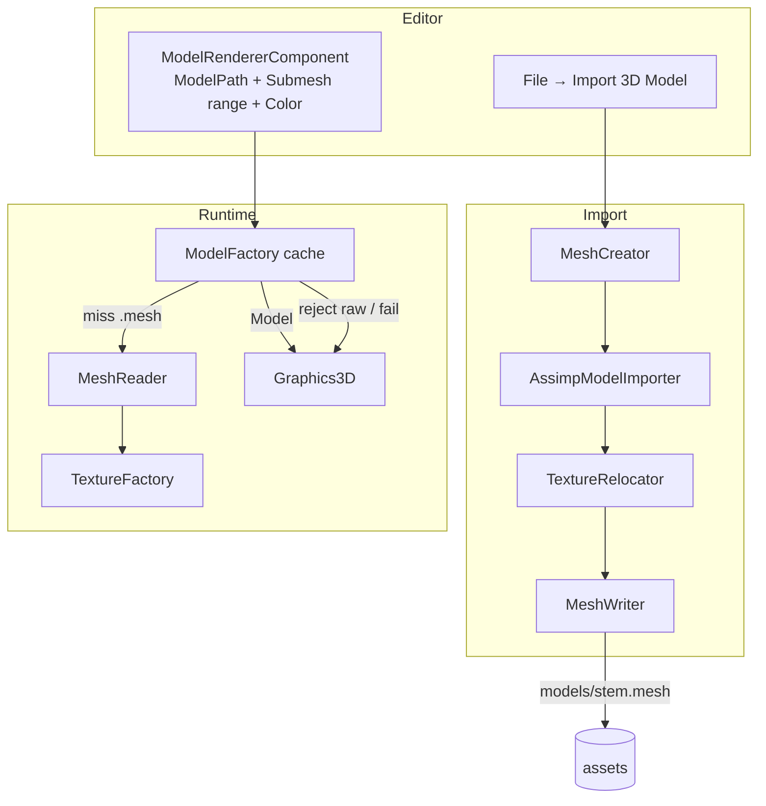
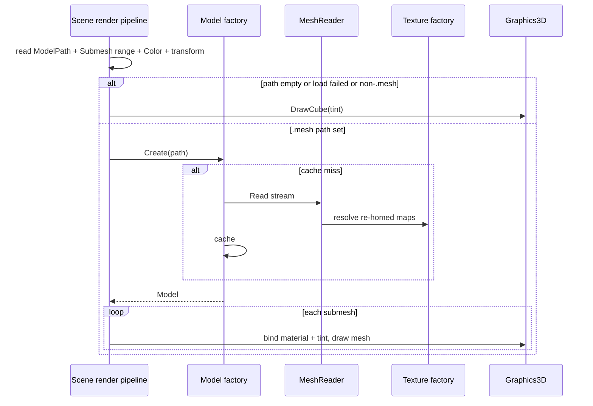

# 3D Model Loading (import / `.mesh`) — Developer Guide

Implementation guide for editor import and `.mesh`-only runtime load. See `introduction.md` for conceptual background.

## Glossary (implementation subset)

| Term | Meaning in code |
|------|-----------------|
| Model path | String on `ModelRendererComponent`; empty = cube; must be `.mesh` when set |
| Model | Cached path key + ordered submeshes |
| Submesh | Mesh geometry + `MeshMaterial` (PBR) |
| MeshCreator | Assimp node walk → texture relocate → one `assets/models/<stem>.mesh` + scene spawn with submesh ranges |
| Model factory | Path → cached model; `MeshReader` on miss; rejects non-`.mesh` |
| Cube fallback | Empty, failed, or rejected path → unit-cube draw |
| Tint | Component color multiplied with albedo |

## Pipeline (current)

1. **Author** — **File → Import 3D Model…** (macOS file|folder path; Windows folder pick + non-recursive enumerate of `.fbx` / `.glb` / `.gltf`)
2. **CreateSplit** — `MeshCreator.CreateSplit(...)` → one `models/<stem>.mesh` (all node submeshes packed in order) + relocated textures
3. **Spawn** — parent entity + children (`Transform` + `ModelRenderer` with shared path + `SubmeshStart`/`SubmeshCount`) in the active scene
4. **Runtime** — `ModelFactory.Create` loads the shared `.mesh`; each child draws only its submesh range

Animation/skinning is **out of scope for v1** (roadmap follow-on).

---

## Create path (`MeshCreator`)

**Files**: `Editor/Features/Import/MeshCreator.cs`, `AssimpModelImporter.cs`, `TextureRelocator.cs` (editor-only import); format codec in `Engine/Renderer/MeshWriter.cs`

```
open source with Assimp (import-time only)
post-process: triangulate, normals/tangents (no PreTransformVertices; no FlipUVs)
walk mesh-bearing nodes → parts with local-to-root transforms
map materials → MeshMaterial (PBR + legacy heuristics)
TextureRelocator → copy maps under assets/models/textures/, rewrite paths relative
MeshWriter → one assets/models/<stem>.mesh (ordered submeshes across nodes)
```

Ignore bones, animations, cameras, lights, and empties.

Each spawned child points at that file with `SubmeshStart` / `SubmeshCount` so parts stay independently movable.

**Why:** Assimp stays behind one import boundary; Runtime never opens raw interchange.

---

## Runtime path (`ModelFactory`)

**Files**: `Engine/Renderer/ModelFactory.cs`, `MeshReader.cs`

- `Create(path)` → cache hit, or open `.mesh` via `MeshReader`, resolve textures with `PathBuilder.Resolve`, upload GPU, cache
- Non-`.mesh` extension → warn + return null (cube fallback upstream) — **no Assimp fallback**
- Missing/corrupt file or unknown magic/VERSION → fail soft (null); do not cache hard failures as success
- Register in engine DI; dispose/clear aligned with other renderer factories

**Why:** Call sites stay path-based; hot path is binary I/O only.

---

## Graphics3D and scene render path

Per entity with model renderer + transform:

```
if ModelPath empty:
  DrawCube(tint)
else:
  model = ModelFactory.Create(resolved ModelPath)
  if model missing:
    log (throttled) + DrawCube(tint)
  else:
    for each submesh in renderer SubmeshStart..Count (or all if Count < 0):
      bind PBR maps + tint / overrides
      draw mesh
```

---

## Component and editor

On `ModelRendererComponent`:

- `ModelPath` (string) — project-relative `.mesh`
- `SubmeshStart` / `SubmeshCount` — slice of that file’s submeshes (`Count = -1` draws all)
- `Color` tint; optional metallic/roughness overrides

Editor:

- **File → Import 3D Model…** — write sources into `assets/models/`
- Inspector MeshDropTarget — **`.mesh` only**
- Content Browser Type: Model — same allowlist as MeshDropTarget
- Required project dir: `assets/models`

### Legacy raw ModelPath (hard cutover)

Existing scenes with raw `.fbx` / `.gltf` / `.glb` (etc.) on `ModelPath` show the **unit cube** until authors **re-import** and update the path to the imported `.mesh`. Document this break; do not dual-load.

---

## Testing focus

**Automated**

- `MeshWriter` ↔ `MeshReader` round-trip (geometry + materials)
- `ModelFactory` accepts `.mesh`, rejects raw extensions
- Import/re-home on tiny glTF fixtures; flat `models/<stem>.mesh` layout
- Serialization: `ModelPath` + `Color` + submesh range round-trip

**Manual smoke**

- Import → Content Browser shows `.mesh` → drag to Model field → lit mesh
- Empty / raw / bad path → cube + log
- Sample `Editor/assets/scenes/3d.scene` → `models/stachu-light.mesh` (imported sample may be large ~94 MB under `Editor/assets/models/`)

---

## Architecture





---

## Error-handling checklist

| Case | Behavior |
|------|----------|
| Missing / corrupt `.mesh` | No success cache; throttled log; cube fallback |
| Non-`.mesh` ModelPath (legacy raw) | Reject + log; cube until re-import |
| Zero meshes in file | Treat as load failure |
| Missing texture map | Skip that map; draw with remaining material + tint |
| Unsupported chunks at import (anim, lights, …) | Ignore |
| Single submesh GPU init failure | Drop that submesh; keep others; log |

---

## Out of scope reminders

Do not add in this feature: animation/skins (roadmap), child-entity hierarchy from nodes, dual-load Assimp in `ModelFactory`, mesh-index selection API, or treating Assimp as a public runtime service.
