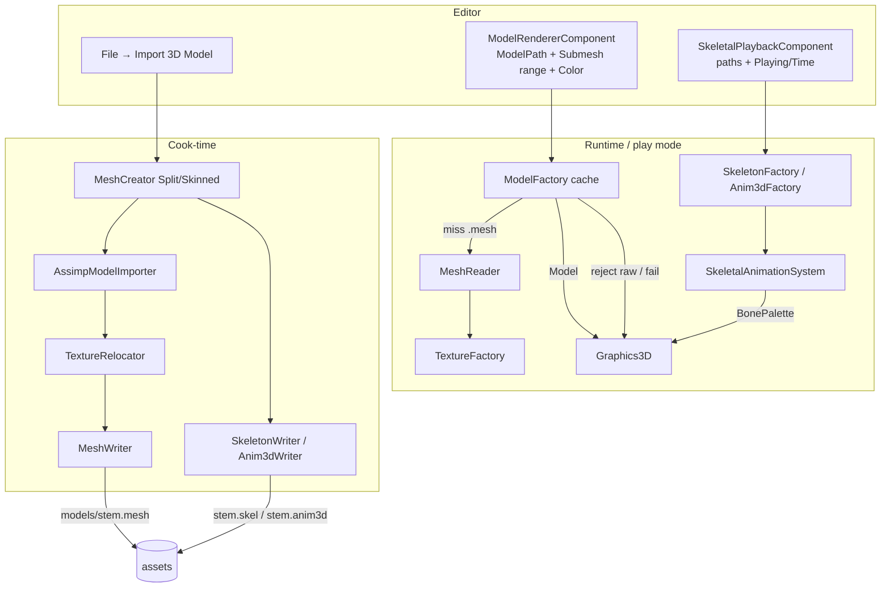
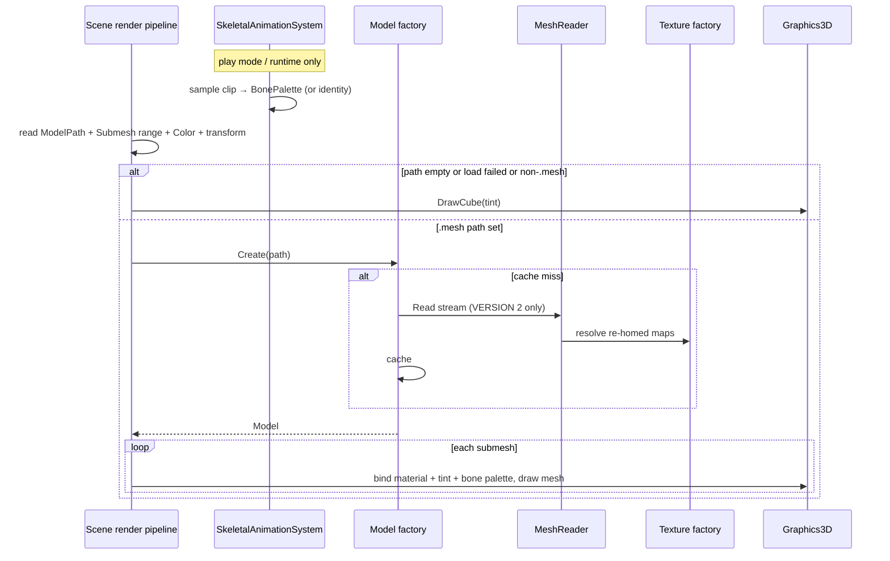

# 3D Model Loading (bake-on-import / `.mesh`) — Developer Guide

Implementation guide for cook-on-import, `.mesh`-only runtime load, and skeletal v1 companions. See `introduction.md` for conceptual background and [re-cook-checklist.md](./re-cook-checklist.md) for the VERSION 2 hard cutover.

## Glossary (implementation subset)

| Term | Meaning in code |
|------|-----------------|
| Model path | String on `ModelRendererComponent`; empty = cube; must be `.mesh` when set |
| Model | Cached path key + ordered submeshes |
| Submesh | Mesh geometry + `MeshMaterial` (PBR); verts always include bone index/weight (zeros if static) |
| MeshCreator | `CreateSplit` (static) / `CreateSkinned` (bones) → `assets/models/<stem>.mesh` (+ `.skel`/`.anim3d` when skinned) + scene spawn |
| Model factory | Path → cached model; `MeshReader` on miss; rejects non-`.mesh`; VERSION 2 only |
| Skeleton / Anim factories | Path → cached `.skel` / `.anim3d` |
| Cube fallback | Empty, failed, or rejected path → unit-cube draw |
| Tint | Component color multiplied with albedo |
| Bone palette | `SkeletalPlaybackComponent.BonePalette` (`Matrix4x4[100]`); identity = bind pose |
| Magics | `.mesh` = **`KULA`** VERSION **2**; `.skel` = `SKEL` v1; `.anim3d` = `AN3D` v1 |

## Pipeline (current)

1. **Author** — **File → Import 3D Model…** (macOS file|folder path; Windows folder pick + non-recursive enumerate of `.fbx` / `.glb` / `.gltf`)
2. **Auto-detect** — any Assimp mesh with `mBones > 0` → skinned cook; else static split cook. Both write `.mesh` VERSION 2.
3. **CreateSplit / CreateSkinned** — one `models/<stem>.mesh` + relocated textures; skinned also writes `models/<stem>.skel` + `models/<stem>.anim3d`
4. **Spawn** — parent entity + children (`Transform` + `ModelRenderer` with shared path + `SubmeshStart`/`SubmeshCount`); skinned attaches `SkeletalPlaybackComponent` on the **parent** with companion paths
5. **Runtime / play mode** — `ModelFactory.Create` loads the shared `.mesh`; `SkeletalAnimationSystem` (priority 135) evaluates palette when Playing; each child draws its submesh range with resolved palette (self → parent)

**Playback is play-mode / runtime only** — the pose system runs with other runtime systems (`OnUpdate` while playing), same pattern as Audio. Edit-mode viewport shows bind pose (identity palette) unless you enter Play.

---

## Create path (`MeshCreator`)

**Files**: `Engine/Renderer/MeshCreator.cs`, `AssimpModelImporter.cs`, `TextureRelocator.cs`, `MeshWriter.cs`, `SkeletonWriter.cs`, `Anim3dWriter.cs`

### Static (`CreateSplit`)

```
open source with Assimp (cook-time only)
post-process: triangulate, normals/tangents (no PreTransformVertices; no FlipUVs)
walk mesh-bearing nodes → parts with local-to-root transforms
map materials → MeshMaterial (PBR + legacy heuristics)
TextureRelocator → copy maps under assets/models/textures/, rewrite paths relative
MeshWriter → one assets/models/<stem>.mesh VERSION 2 (bone attrs = zeros)
```

### Skinned (`CreateSkinned`)

```
open source with Assimp — omit PreTransformVertices; LimitBoneWeights
extract bone indices/weights onto verts (cap 100 bones; fail clearly if more)
write .mesh VERSION 2 + .skel (parentIndex + inverseBind) + .anim3d (multi-clip, seconds)
transpose Assimp aiMatrix4x4 → System.Numerics at cook (W3)
```

Ignore cameras, lights, and empties. FBX preserve-pivots import property is **not** enabled by default (W7); enable only if Mixamo-style pivots break fixtures.

Each spawned child points at the `.mesh` with `SubmeshStart` / `SubmeshCount` so parts stay independently movable.

**Why:** Assimp stays behind one cook boundary; Runtime never opens raw interchange.

---

## Runtime path (`ModelFactory` + companions)

**Files**: `Engine/Renderer/ModelFactory.cs`, `MeshReader.cs`, `SkeletonFactory.cs`, `Anim3dFactory.cs`

- `Create(path)` → cache hit, or open `.mesh` via `MeshReader`, resolve textures with `PathBuilder.Resolve`, upload GPU (extended layout stride 88), cache
- Non-`.mesh` extension → warn + return null (cube fallback upstream) — **no Assimp fallback**
- Missing/corrupt file, unknown magic, or **VERSION ≠ 2** → fail soft / throw with **re-import** message; do not dual-read VERSION 1; do not cache hard failures as success
- Skeleton / anim factories mirror the path-keyed cache pattern for `.skel` / `.anim3d`
- Register in engine DI; dispose/clear aligned with other renderer factories

**Why:** Call sites stay path-based; hot path is binary I/O only.

---

## Graphics3D and scene render path

Per entity with model renderer + transform:

```
if ModelPath empty:
  DrawCube(tint)
else:
  model = ModelFactory.Create(resolved ModelPath)
  if model missing:
    log (throttled) + DrawCube(tint)
  else:
    bones = ResolveBonePalette(entity)  // self SkeletalPlayback, else parent; absent/!Playing → identity[100]
    for each submesh in renderer SubmeshStart..Count (or all if Count < 0):
      bind PBR maps + tint / overrides
      DrawMesh(..., bones)  // uploads u_BoneMatrices via SetMat4Array
```

Lighting VS (copied to Editor / Runtime / Sandbox / Benchmark hosts) skins with `a_BoneIndex` / `a_BoneWeight` and `u_BoneMatrices[100]`. Zero weights → identity skin (static verts).

### Deferred GL coverage

`tests/Engine.GraphicsTests/OpenGLShaderSetMat4ArrayTests` need a display / xvfb host. They were skipped in headless local runs (Group 3.5). Prefer verifying on CI with xvfb:

```bash
dotnet test tests/Engine.GraphicsTests --filter OpenGLShaderSetMat4ArrayTests
```

---

## Component and editor

On `ModelRendererComponent`:

- `ModelPath` (string) — project-relative `.mesh`
- `SubmeshStart` / `SubmeshCount` — slice of that file’s submeshes (`Count = -1` draws all)
- `Color` tint; optional metallic/roughness overrides

On `SkeletalPlaybackComponent` (parent on import):

- `SkeletonPath` / `ClipPath` — project-relative companions
- `ClipName` — optional; null/empty → first clip; Ordinal name match
- `Playing` / `Loop` / `Speed` / `Time`
- `BonePalette` — transient, not serialized

Editor:

- **File → Import 3D Model…** — bake sources into `assets/models/` (auto-detect skinned)
- Inspector MeshDropTarget — **`.mesh` only**; skeletal inspector = paths + Playing/Loop/Speed/Time (+ ClipName)
- Content Browser Type: Model — same allowlist as MeshDropTarget
- Required project dir: `assets/models`
- Publish: `PublishedAssetValidator` checks non-empty `SkeletonPath` / `ClipPath` exist on disk

### Legacy raw ModelPath / v1 `.mesh` (hard cutover)

Existing scenes with raw `.fbx` / `.gltf` / `.glb` (etc.) on `ModelPath` show the **unit cube** until authors **re-import** and update the path to the cooked `.mesh`. Stale VERSION 1 `.mesh` files must be re-cooked — **no dual-load**. Follow [re-cook-checklist.md](./re-cook-checklist.md).

---

## Testing focus

**Automated**

- `MeshWriter` ↔ `MeshReader` round-trip (geometry + bone attrs + materials); VERSION ≠ 2 → re-import message
- Skeleton / anim3d round-trip; skinned cook fixtures; pose math; palette draw (self + parent)
- `ModelFactory` accepts `.mesh` v2 extended layout; rejects raw extensions
- Four-host `lightingShader.vert` file presence (skinned attrs) — no GL required
- Import auto-detect + publish companion path validation
- Serialization: paths only on playback (no `BonePalette` in JSON)

**Manual smoke**

- Import static → Content Browser `.mesh` → lit mesh
- Import skinned → `.mesh` + `.skel` + `.anim3d` → Play → Playing advances clip; !Playing = bind pose
- Empty / raw / bad path → cube + log
- Re-cook sample paths listed in the checklist after VERSION 2 ship

---

## Architecture





---

## Error-handling checklist

| Case | Behavior |
|------|----------|
| Missing / corrupt `.mesh` | No success cache; throttled log; cube fallback |
| Non-`.mesh` ModelPath (legacy raw) | Reject + log; cube until re-import |
| `.mesh` VERSION ≠ 2 | Fail with clear re-import message; no dual-read |
| Zero meshes in file | Treat as load failure |
| Missing texture map | Skip that map; draw with remaining material + tint |
| Skeleton > 100 bones at cook | Fail with clear error |
| Missing companion at publish | `PublishedAssetValidator` fails |
| Unsupported chunks at cook (lights, …) | Ignore |
| Single submesh GPU init failure | Drop that submesh; keep others; log |

---

## Out of scope reminders

Do not add in this feature: blend trees, CPU skinning, bone entities, dual-load Assimp in `ModelFactory`, dual-read VERSION 1, force static/skinned override UI, mesh-index selection API, or treating Assimp as a public runtime service.
