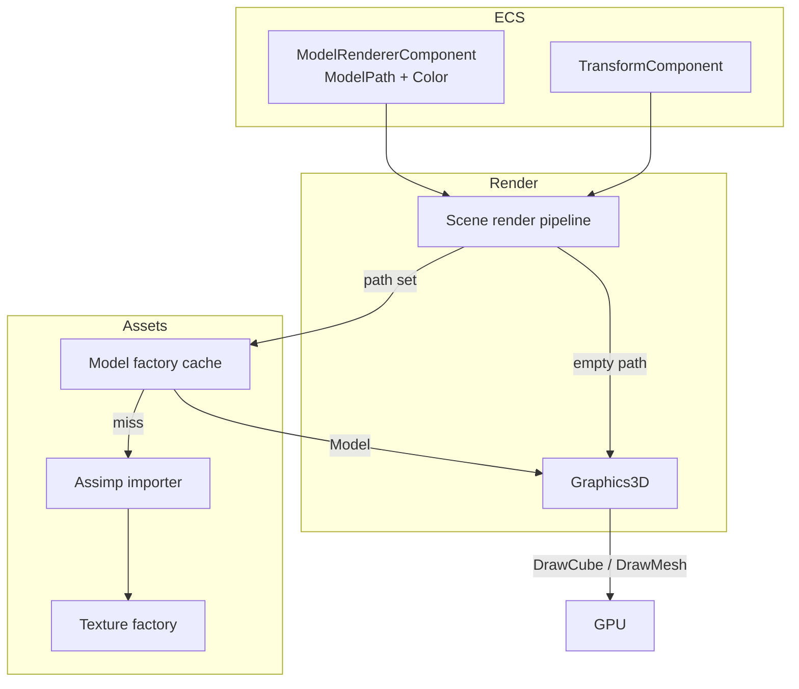
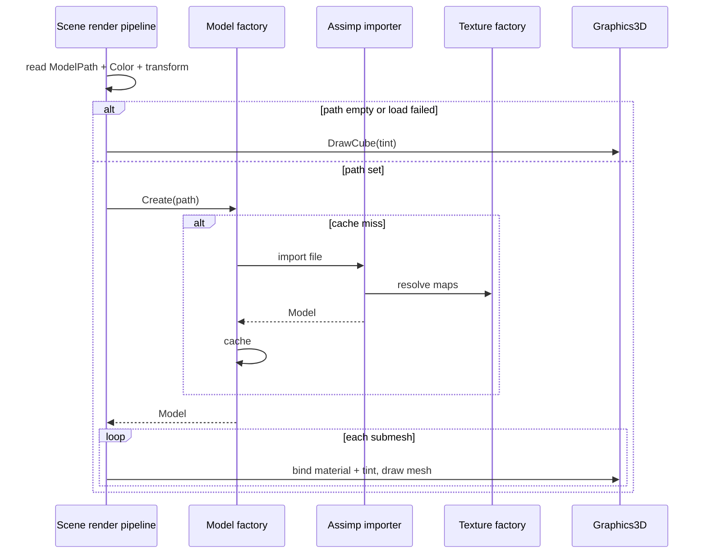

# 3D Model Loading (FBX / glTF) — Developer Guide

Implementation guide for runtime FBX/glTF load with textured lit materials. See `introduction.md` for conceptual background.

## Glossary (implementation subset)

| Term | Meaning in code |
|------|-----------------|
| Model path | String on `ModelRendererComponent`; empty = cube |
| Model | Cached path key + ordered submeshes |
| Submesh | Existing mesh geometry + mesh material |
| Mesh material | Diffuse / specular / normal maps + shininess + fallback color |
| Model factory | Path → cached model; Assimp on miss |
| Cube fallback | Empty or failed path → existing unit-cube draw |
| Tint | Component color multiplied with diffuse |

## Implementation order

1. **Mesh material + model container** — data only, no Assimp yet
2. **Assimp importer** — file → meshes + materials; texture path resolution
3. **Model factory** — cache, DI registration, failure policy
4. **Graphics3D draw path** — bind materials, draw submeshes; keep cube for empty path
5. **Component + editor** — `ModelPath`, inspector, content-browser extensions, drag-drop
6. **Tests + fixtures** — mapping, cache, serialization, manual smoke

---

## Step 1: Mesh material and model container

Introduce:

- Mesh material fields: optional diffuse / specular / normal texture references, shininess, fallback diffuse color
- Model: path/name key + ordered list of (mesh + material)

Reuse the existing mesh/vertex layout (positions, normals, UVs, tangents/bitangents). Do not invent a parallel vertex format.

Textures are not owned as raw bitmaps on the material long-term — resolve through the existing texture factory when building or drawing (same soft-cache pattern as sprites).

**Why:** Separates “what a model is” from “how Assimp fills it,” and keeps GPU upload on the existing mesh initialize path.

---

## Step 2: Assimp importer

Add Silk.NET.Assimp. Keep the importer private to the model-loading path (not a public engine service).

On load:

```
open file with Assimp
apply post-process: triangulate, normals if missing, tangents if missing (no FlipUVs — glTF is already OpenGL UV space; textures use stbi vertical flip)
for each mesh in scene:
  copy positions, normals, uvs, tangents/bitangents into engine vertices
  copy indices (triangles only after triangulate)
  map material slot → mesh material:
    diffuse map / color
    specular map
    shininess
    normal map (optional)
  resolve texture paths relative to model file directory (then project-relative if needed)
  initialize mesh GPU buffers
return model with ordered submeshes
```

Ignore bones, animations, cameras, lights, and empties.

**Why:** One dependency covers FBX and glTF; fixed post-process flags keep import behavior predictable.

---

## Step 3: Model factory

Add a model factory beside the texture/mesh factories:

- `Create(path)` → cached model on hit; import + cache on miss
- Do **not** cache hard failures as successful empty models; allow retry after the user fixes the file
- Throttle or gate per-path error logs so a bad path does not spam every frame
- Register in the engine DI container; clear/dispose policy aligned with other renderer factories on shutdown

**Why:** Call sites stay path-based; Assimp stays behind one cache boundary.

---

## Step 4: Graphics3D and scene render path

Extend the 3D draw API so the scene render pipeline can draw a loaded model, not only the shared cube.

Per entity with model renderer + transform:

```
if ModelPath empty:
  DrawCube(tint)
else:
  model = ModelFactory.Create(ModelPath)
  if model missing:
    log (throttled) + DrawCube(tint)
  else:
    for each submesh:
      bind diffuse / specular / normal (skip missing maps)
      set shininess + tint
      set world transform from entity
      draw mesh
```

Keep ambient + directional lighting uniforms consistent with the cube path. Prefer extending the existing lit shader path over a second lighting model.

**Why:** Empty-path cube preserves current scenes; textured draw is an additive path.

---

## Step 5: Component and editor

On `ModelRendererComponent`:

- Add `ModelPath` (string)
- Keep `Color` as tint

Editor:

- Inspector field for path + existing color
- Drag-drop from content browser onto the path (same UX idea as texture paths on sprites)
- Content browser: recognize `.fbx`, `.gltf`, `.glb` as known asset types for selection/browse (no bake UI)

Serialize `ModelPath` with the component like other string asset fields.

**Why:** Authors only learn one field; whole-file attachment matches the approved v1 UX.

---

## Step 6: Testing

**Automated**

- Importer/factory: fixture glTF (and FBX if practical) → expected submesh count, non-zero geometry, material slots populated when present
- Texture path resolution: relative-to-model success; missing map does not fail the model
- Cache: same path → same cached instance; failed path not treated as a permanent success entry
- Serialization: `ModelPath` + `Color` round-trip

**Manual smoke**

- Empty path → cube
- Valid textured FBX and glTF → lit meshes with diffuse (and specular/normal when present)
- Bad path → cube + log, no crash

---

## Architecture





---

## Error-handling checklist

| Case | Behavior |
|------|----------|
| Missing / corrupt file | No success cache; throttled log; cube fallback |
| Zero meshes in file | Treat as load failure (same as above) |
| Missing texture map | Skip that map; draw with remaining material + tint |
| No material on mesh | Default material (fallback color, default shininess) |
| Unsupported chunks (anim, lights, …) | Ignore |
| Single submesh GPU init failure | Drop that submesh; keep others; log |

---

## Out of scope reminders

Do not add in this feature: animation/skins, child-entity hierarchy from nodes, editor bake format, PBR metal/rough, mesh-index selection API, or a public Assimp service used outside the model factory.
