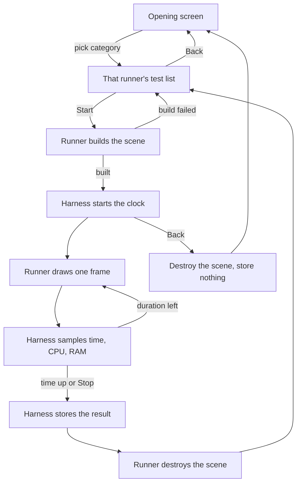

# Benchmark Categories — Developer Guide

Implementation guide for an opening screen with four categories, one runner each, and a shared harness. Assumes the existing benchmark results, baseline, and Markdown export, and the existing scene render pipeline.

## Implementation Overview



## Glossary

| Term | Implementation meaning |
|------|------------------------|
| Harness | Today's timing, CPU, RAM, result list, baseline, export, and the performance monitor. It learns a result name and extra metrics. It does not construct entities |
| Runner | One category. Produces a run object or an error string. Draws only its own test buttons and sliders |
| Run | A live scene plus its result name. Tick draws one frame. Dispose runs once. Contribute copies the last frame's pipeline counters onto the result |
| DirectionalShadows | New field on the view, default true. The pipeline draws the sun's depth pass only when this is true and the sun color is not black |
| PointShadows | Existing field on the view. false skips every point-light cubemap |
| CastsShadow | Existing field on a point light. false skips that lamp's cubemap even when PointShadows is true |
| Steady grid | 256 unit cubes. 16 columns, 16 rows, spacing 1.5, centered on the origin, sitting on y = 0 |
| Template mesh | One small glTF shipped with the benchmark. Copied bytes, distinct paths |
| Result names | 2D keeps today's names. Others: `3D_Cubes`, `3D_InstancedMesh`, `3D_UniqueMeshes`, `Lighting_Sun`, `Lighting_Point1`, `Lighting_Point8`, `Shadows_Directional`, `Shadows_Point1`, `Shadows_Point8` |

## Step-by-Step Requirements

### 1. Let the view turn the sun shadow off

Add `DirectionalShadows` to the view, default true, after the existing fields. In the 3D render, the depth pass runs only when that field is true and the sun color is not black. The call that disables the shadow before the branch stays where it is, so a skipped pass still uploads "no shadow".

**Why:** A colored sun currently always tries the depth pass. Lighting and 3D need the sun, or a quiet scene, without paying for that pass. Callers that omit the field keep today's behavior.

### 2. Split the benchmark window into a harness and four runners

The layer keeps the opening screen, the result window, the monitor, and the clock. It holds the active runner and, while a test is running, the run object.

The opening screen shows four buttons and nothing else about scenes. Choosing one sets the active runner and clears any previous run. That runner then draws its buttons. 2D keeps the sliders it has today (entity count, draw calls, texture count, script entities, duration). 3D replaces those with object count (100 to 20000, default 1000) and duration (default 5 seconds). Lighting and shadows show duration only. The grid size is the constant above.

2D's test bodies move onto the 2D runner as they are. Direct sprite drawing stays direct. The physics test still starts and stops the scene runtime. Result names for those five tests stay the strings they produce today.

**Why:** The layer is already the clock and the result list. The scene setup is what grows. Leaving 2D's drawing alone keeps old baselines meaningful.

### 3. Draw 3D, lighting, and shadows through the pipeline, not the runtime

Those runs do not call runtime start. Each frame clears, then renders the scene with an explicit view: perspective 60°, the benchmark window's aspect (1280/720), near 0.1, far 100, eye at (0, 12, 18) looking at the origin. Multiply view by projection, the same order the shadow tests already use. Reset the 3D stats before the render and keep the last stats for Contribute. The view is built when the run starts. A later window resize does not rebuild it.

Before the clock starts, the runner builds the scene. A failed build returns an error string, creates no run, and leaves the user on the test list. Dispose drops the scene once. It stops the runtime only if this run started it, which only the 2D physics run does.

**Why:** The runtime's render system builds its own view and would turn both shadows on. The explicit view is the switch. Skipping the runtime also skips physics and scripts, which these tests do not measure.

### 4. Stage each 3D test with both shadows off

Shared scene facts: ambient light at strength 0.1, no point lights, no directional light, view flags `DirectionalShadows: false` and `PointShadows: false`.

Test ids are `Cubes`, `InstancedMesh`, and `UniqueMeshes`. Result names are `3D_Cubes`, `3D_InstancedMesh`, and `3D_UniqueMeshes`.

- `Cubes`: `count` entities with a transform and a model renderer whose model path is empty. That empty path is the unit cube.
- `InstancedMesh`: `count` entities with the template path. One identity, many copies.
- `UniqueMeshes`: `count` entities, each with its own path, all from the template bytes. If any load returns null, dispose every identity created so far, clear the model cache, and return the error. After a finished or aborted run, clear the model cache so the identities do not stay resident. Cap this slider at 500. The other two sliders run from 100 to 20000. Default count for all three is 1000, and the unique-mesh slider clamps that default down to 500 when that test is selected.

**Why:** Empty model path is the cube the pipeline already draws. The factory's cache key is the path, so copies of one path become one instanced group and distinct paths become distinct groups. Clearing the cache is the cleanup. The whole cache is the benchmark's, and the next test loads what it needs.

### 5. Stage lighting and shadows on the steady grid

Same 256 cubes for all six tests. Same camera as step 3.

| Test | Sun | Point lights | DirectionalShadows | PointShadows | CastsShadow |
|------|-----|--------------|--------------------|--------------|-------------|
| Lighting_Sun | white, intensity 1, direction (0.3, -1, 0.2) | none | false | false | — |
| Lighting_Point1 | none | 1 lamp | false | false | false |
| Lighting_Point8 | none | 8 lamps | false | false | false |
| Shadows_Directional | same sun | none | true | false | — |
| Shadows_Point1 | none | 1 lamp | false | true | true |
| Shadows_Point8 | none | 8 lamps | false | true | true |

A lamp sits 4 units above the grid. One lamp is over the center. Eight lamps are spread across the grid in two rows of four. Color white, intensity 1, range 25, so the range covers the grid. No sun means no directional component, not a black-colored one left in the scene.

**Why:** Pairing each lighting test with a shadow test on the same cubes makes the frame-time gap the shadow. One shadow family per test keeps the two depth paths from adding in a single number. Range 25 is inside the grid, not a world-sized cubemap.

### 6. Commit, abort, and label the shadow

```
Start:
  error = runner.TryCreate(test, settings, out run)
  if error: show it on the list, return
  reset samples and the clock

each frame while running:
  run.Tick
  sample frame time, CPU, RAM

time elapsed or Stop:
  build the result under run.ResultName
  run.Contribute(result)
  append result
  run.Dispose
  stay on the test list

Back while running:
  run.Dispose
  drop the partial samples
  opening screen

Back while idle:
  opening screen
```

Contribute copies, from the last 3D stats: color draw calls, instanced draws, instance count, point light count, point-shadow light count, and whether the directional shadow ran. 2D contribute stays the renderer stats already aggregated today. When the chosen shadow did not run, also set a metric `Shadow pass` to `skipped`. For a sun shadow test, skipped means the directional flag in the stats is false. For a point shadow test, skipped means the point-shadow light count is 0.

**Why:** Last-frame counters describe a static scene. Point-shadow caches may redraw on the first frames and then hit. Frame time already includes those frames. The flag is what stops a failed fit from being read as a shadow result. Back must not append, or a one-second sample becomes a baseline.

## Tests

1. Pipeline, next to the existing shadow tests. A scene with a colored sun and `DirectionalShadows: false` begins no shadow pass and still begins the color scene. The same scene with the field left at its default still draws the depth pass.
2. No window. Building each lighting and shadow plan yields the table in step 5. Building the 3D plan yields ambient only and both flags false. `Lighting_Point8` and `Shadows_Point8` are different names. A completed clock appends one result. An abort appends none.
3. Unique-mesh failure. Load succeeds for the first identity and fails for the second. The cache is empty afterwards, and the error is returned.

The benchmark window itself is not started in a test. Check by hand: launch, enter each category, Back during a run, confirm the result list still holds earlier finished runs.
