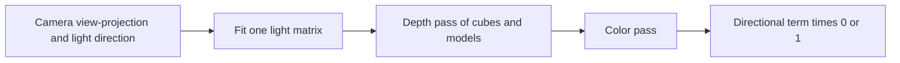
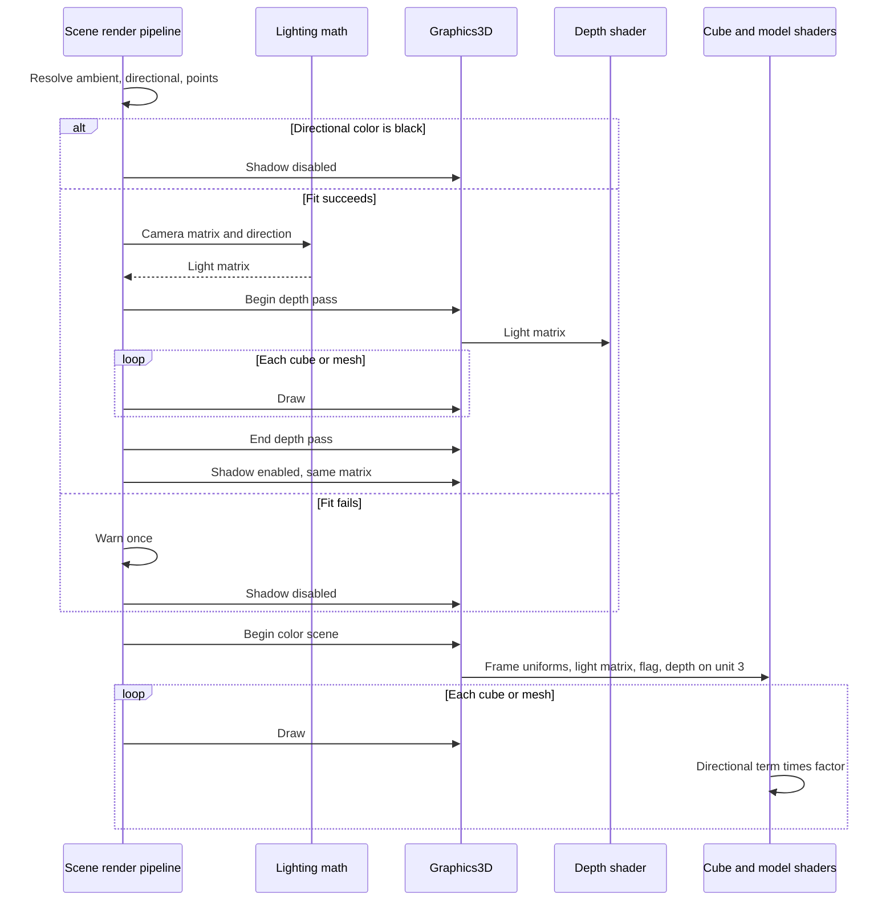

# Directional Shadows — Developer Guide

Implementation guide for one hard shadow from the existing directional light. Assumes familiarity with the 3D frame-uniform path.

## Implementation Overview



## Glossary

| Term | Implementation meaning |
|------|------------------------|
| Map size | 1024, one constant used by the fit and by the depth image |
| Fit | Invert the camera matrix, take the eight corners, build an orthographic light matrix, snap its center |
| Window depth | `ndcZ * 0.5 + 0.5`, the value stored in the depth image |
| Shadow factor | 0 or 1 from one comparison. 1 when the pass is skipped |
| Bias | `0.002` subtracted from the fragment's window depth before the comparison. Shader constant only |
| Enabled flag | Uploaded integer. 0 skips the sample and returns factor 1 |
| Depth slot | Texture unit 3, so it does not collide with model samplers on 0, 1, and 2 |

## Step-by-Step Requirements

### 1. Fit the light matrix on the CPU

Add a function beside the existing lighting math. Inputs: the camera view-projection, the light direction, the map size. Output: one matrix, or a clear failure. No exceptions.

Recover the eight corners by inverting the camera matrix and unprojecting clip corners. Horizontal and vertical clip coordinates are −1 and 1. Depth is 0 at the near plane and 1 at the far plane, matching the projection this engine already builds. Do not use a depth of −1.

Build a light view from the origin looking along the direction. If the direction is nearly parallel to world up, use the world Z axis as the up vector. Transform the corners into that view and take their box.

Snap the box center on X and Y to whole texels. Leave Z alone. Build an orthographic matrix that maps that box to the same clip convention as the camera: X and Y from −1 to 1, and Z from 0 at the side closer to the light to 1 at the far side. The stored matrix is light view times that orthographic matrix, the same multiply order as the camera view-projection.

Return failure when the camera matrix does not invert, a corner's W is too small to divide, or the box has no area on X or Y. Do not throw.

**Why:** The color pass and the depth pass must share one matrix, and unit tests must be able to judge it without a GPU. Placing the eye at the world origin only works because the orthographic matrix covers the whole Z range of the corners, including corners behind that eye.

### 2. Allocate one depth image

Create it once, lazily, through the existing framebuffer factory. Size 1024 by 1024. No color attachment. Depth format is the one the framebuffer already treats as a shadow depth texture. Nearest filtering. Wrap mode clamp-to-border, which that path already fills with border color 1.

Binding that framebuffer already switches the viewport to the map and restores the previous viewport and framebuffer on unbind. Do not set the viewport a second time.

**Why:** Border value 1 is "as far as the window depth goes," so a sample outside the map fails the "farther than the occluder" test and stays lit. Creating it lazily keeps frame-uniform tests from touching a real framebuffer.

### 3. Draw the depth pass with one shader

Add a depth shader pair. The vertex shader reads position at attribute 0, multiplies by the model matrix, then by the light matrix, in that order, with the same row-vector convention as the cube and model shaders. The fragment shader writes nothing.

The graphics layer grows two calls: begin the depth pass with the light matrix, and end it. Begin binds the depth image, clears it, forces depth test and depth writes on, and binds the depth shader with the light matrix. End unbinds the shader and the framebuffer. While the pass is open, cube and mesh draws set only the model matrix and draw. They do not bind color textures.

Leave depth writes on afterwards. The color draws already assume depth testing is available.

**Why:** Both vertex formats put position at attribute 0, so one program covers cubes and models. The framebuffer's own bind and unbind is the viewport restore.

### 4. Walk the opaque 3D scene once, call it twice

Move the existing cube and model loop into one function. After lights are resolved:

```
shadow enabled = false
if directional color is not black
    and the fit succeeds:
        begin depth pass with that matrix
        walk
        end depth pass
        shadow enabled = true
        keep that matrix
if the fit failed:
    warn once, not every frame
upload the matrix and the enabled flag for the color pass
begin the color scene
walk
end the color scene
```

A black directional color skips the fit and the depth pass. The flag stays off.

**Why:** One walk keeps the failed-model cube, the texture cube, mesh index, and suppressed draws identical in both passes. The flag must be set every frame so a failed fit does not keep last frame's shadow.

### 5. Sample once in both fragment shaders

Upload the light matrix, the enabled flag, and the depth texture on unit 3 once per color scene, to the cube shader and the model shader. Do not upload them again per draw.

Copy this test into both fragment shaders:

```
if shadow is disabled: factor = 1
else:
    clip = fragmentWorldPosition * lightMatrix
    ndc = clip.xyz / clip.w
    uv = ndc.xy * 0.5 + 0.5
    current = ndc.z * 0.5 + 0.5
    closest = one sample of the depth image at uv
    factor = 0 when current - 0.002 > closest, else 1
```

Apply the factor only to the directional term. On the cube, that is the directional diffuse inside the existing albedo multiply, not the ambient term and not the point-light sum. On the model, that is directional diffuse plus directional specular. Ambient and point lights are added unchanged.

Leave the 2D and line shaders unchanged.

**Why:** The depth image stores window depth, not raw clip Z. Comparing clip Z to the texture darkens the wrong pixels. Duplication is required because shader files are loaded whole. The cube's albedo multiply must not be applied twice, and must not swallow ambient.

## Data Flow



## Edge Cases

| Input | Result |
|-------|--------|
| No directional light | Color is black, depth pass skipped, factor 1 |
| Direction length zero | Existing normalize already substitutes down, then the fit runs |
| Camera matrix cannot invert | Depth pass skipped, factor 1, one warning |
| Corner W too small, or no box area | Same as a failed invert |
| Light aimed straight down | Up vector switches to world Z, fit still returns a matrix |
| Empty scene | Depth image stays cleared far, nothing is in shadow |
| Sample outside the map | Border depth 1, factor stays 1 |
| Object outside the light box | Not drawn into the map, casts nothing into the view |
| Failed model path | Fallback cube in both passes |
| Grazing light angle | Constant bias can still self-shadow or detach the shadow. Accepted |

## Testing

Cover the fit without a GPU:

- A real perspective view-projection returns a matrix, and each unprojected corner lands inside the light clip box.
- Translating the camera by a tiny step, with the view direction held fixed, leaves that matrix unchanged. Turning the camera may still change it.
- A straight-down direction returns a matrix.
- A zero matrix returns failure and does not throw.
- A box with no X or Y area returns failure. Test that check directly if a real camera cannot produce it.

Cover the pipeline with a graphics substitute, no GPU:

- Black directional color does not begin a depth pass, and the color scene still begins.
- A directional light and one cube begin the depth pass once, draw the cube twice, and upload the fitted matrix.
- A model path that fails to load draws the fallback cube on both passes.

Cover graphics uniforms the way frame uniforms are already tested:

- The color scene uploads the light matrix and the enabled flag to both shaders once, not again on draw.
- The depth pass draws with the depth shader.
- Update existing graphics constructions for the new framebuffer factory argument, and return a shader for the new shader id from `Init`.

Do not add a GPU pixel test.

Check by hand in the editor: a cube above a floor, one directional light. The shadow sits on the opposite side of the light and disappears when the light color is black. Ambient still brightens the shadowed floor. A point light still lights it. A sprite neither casts nor receives. A tiny camera move does not crawl the shadow edge.

## Pitfalls

**Comparing clip Z to the depth texture.** The image stores window depth. Both shaders must use the half-and-add conversion.

**An orthographic matrix that only sees in front of the eye.** The eye sits at the world origin, so some corners are behind it. The matrix has to span the corners' full Z range.

**Snapping Z.** Snap X and Y only. Snapping Z moves acne on and off as the camera moves.

**Two copies of the walk.** A fallback or a suppressed mesh that exists in only one pass is a wrong shadow.

**Shadowing ambient.** The factor multiplies the directional term only. On the cube, ambient is inside the same parenthesis as diffuse; pull diffuse out before multiplying.

**Sampler unit 0.** The depth image stays on unit 3. Cube and model draws rebind units 0 through 2.

**Last frame's flag.** Set the enabled flag every frame before the color scene. A failed fit after a successful one must turn the factor back to 1.

**Divergent shader copies.** The bias, the window-depth conversion, and the comparison have to match in both fragment shaders.

## Done When

- [ ] The fit returns one snapped light matrix or a non-throwing failure
- [ ] One 1024 depth image is created lazily with nearest filtering and a far border
- [ ] One depth shader draws cubes and models into that image
- [ ] The opaque 3D walk is shared by the depth pass and the color pass
- [ ] A black directional color skips the depth pass
- [ ] A failed fit warns once and draws the frame unshadowed
- [ ] Both 3D fragment shaders apply one comparison to the directional term only
- [ ] Fit, pipeline, and frame-uniform tests cover the cases above
- [ ] 2D and line shaders are unchanged
- [ ] The directional component, its editor, and scene save format are unchanged
