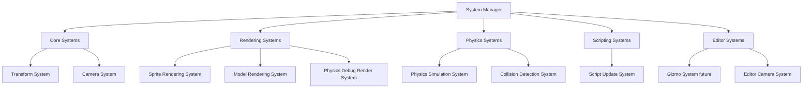

# ECS Systems Integration Specification

## 1. Overview

This specification outlines the introduction of a proper **System** architecture to the existing ECS implementation. The goal is to decouple tight dependencies (particularly `IGraphics` direct access in layers) and move logic into dedicated systems that operate on entities with specific component combinations.

### Current State Analysis

**Existing Architecture:**
- **Entity**: Pure component container with add/remove/get operations
- **Component**: Marker interface + abstract base class (data-only)
- **Context**: Singleton managing entity collection with `GetGroup()` and `View<T>()` queries
- **Scene**: Contains update logic (`OnUpdateRuntime`, `OnUpdateEditor`) with direct Graphics2D/3D calls
- **EditorLayer**: Direct access to `Graphics2D.Instance`, `Graphics3D.Instance`, physics world, script engine

**Pain Points:**
1. `EditorLayer` and `Scene` have tight coupling to rendering implementation (`Graphics2D/3D.Instance`)
2. Update logic scattered across Scene methods (physics, rendering, scripts)
3. No explicit execution order control
4. Difficult to add/remove/reorder game logic
5. Hard to test individual subsystems in isolation

---

## 2. System Architecture Design

### 2.1 Core System Interface

```csharp
public interface ISystem
{
    /// <summary>
    /// System initialization - called once when system is added to world
    /// </summary>
    void OnInit();

    /// <summary>
    /// Main update loop - called every frame
    /// </summary>
    void OnUpdate(TimeSpan deltaTime);

    /// <summary>
    /// Cleanup - called when system is removed or world is destroyed
    /// </summary>
    void OnShutdown();

    /// <summary>
    /// Execution priority - lower values execute first
    /// </summary>
    int Priority { get; }
}
```

### 2.2 System Manager

The `SystemManager` orchestrates system lifecycle and execution order.

```csharp
public class SystemManager
{
    private List<ISystem> _systems;

    public void RegisterSystem(ISystem system);
    public void UnregisterSystem(ISystem system);
    public void Initialize(); // Calls OnInit on all systems
    public void Update(TimeSpan deltaTime); // Calls OnUpdate in priority order
    public void Shutdown(); // Calls OnShutdown on all systems
}
```

### 2.3 System Categories

Systems will be organized into logical categories:



---

## 3. Proposed System Types

### 3.1 Core Systems

#### TransformSystem (Priority: 10)
- **Purpose**: Update transform hierarchies (future: parent-child relationships)
- **Components**: `TransformComponent`
- **Logic**: Calculate world transforms from local transforms

#### CameraSystem (Priority: 20)
- **Purpose**: Update camera viewport, aspect ratio
- **Components**: `CameraComponent`, `TransformComponent`
- **Logic**: Handle viewport resize events, maintain aspect ratios

### 3.2 Physics Systems

#### PhysicsSimulationSystem (Priority: 100)
- **Purpose**: Step Box2D world, synchronize physics bodies with transforms
- **Components**: `RigidBody2DComponent`, `BoxCollider2DComponent`, `TransformComponent`
- **Logic**:
  - World.Step() execution
  - Transform → Body synchronization (before step)
  - Body → Transform synchronization (after step)
  - Collision callbacks

#### PhysicsDebugRenderSystem (Priority: 500)
- **Purpose**: Visualize collision shapes (editor/debug only)
- **Components**: `RigidBody2DComponent`, `BoxCollider2DComponent`
- **Logic**: Draw wireframe boxes/shapes using Graphics2D

### 3.3 Scripting Systems

#### ScriptUpdateSystem (Priority: 150)
- **Purpose**: Execute user script OnUpdate methods
- **Components**: `NativeScriptComponent`
- **Logic**: Delegate to `ScriptEngine.Instance.OnUpdate()`

### 3.4 Rendering Systems

#### SpriteRenderingSystem (Priority: 200)
- **Purpose**: Render 2D sprites
- **Components**: `SpriteRendererComponent`, `TransformComponent`
- **Logic**:
  - BeginScene with active camera
  - Iterate sprite entities
  - DrawSprite for each
  - EndScene

#### ModelRenderingSystem (Priority: 210)
- **Purpose**: Render 3D models
- **Components**: `MeshComponent`, `ModelRendererComponent`, `TransformComponent`
- **Logic**:
  - BeginScene with active camera
  - Iterate model entities
  - DrawModel for each
  - EndScene

#### CameraRenderTargetSystem (Priority: 50)
- **Purpose**: Find and activate primary camera
- **Components**: `CameraComponent`
- **Logic**: Query for primary camera, provide to rendering systems

### 3.5 Editor-Specific Systems

#### EditorCameraSystem (Priority: 15)
- **Purpose**: Handle editor camera movement (only in Edit mode)
- **Components**: None (operates on EditorLayer's `OrthographicCameraController`)
- **Logic**: Camera panning, zooming, focus on selection

---

## 4. Execution Order & Dependencies

### 4.1 Priority System

Systems execute in **ascending priority order** each frame:

| Priority | System | Reason |
|----------|--------|--------|
| 10 | TransformSystem | Must update before anything reads transforms |
| 15 | EditorCameraSystem | Update editor camera before rendering |
| 20 | CameraSystem | Update game cameras before rendering |
| 50 | CameraRenderTargetSystem | Determine active camera |
| 100 | PhysicsSimulationSystem | Physics before rendering |
| 150 | ScriptUpdateSystem | Scripts may modify positions/sprites |
| 200 | SpriteRenderingSystem | Render 2D sprites |
| 210 | ModelRenderingSystem | Render 3D models |
| 500 | PhysicsDebugRenderSystem | Debug overlay last |

### 4.2 Dependency Declaration (Future)

For now, priority numbers are sufficient. In the future, systems could declare dependencies:

```csharp
public interface ISystemWithDependencies : ISystem
{
    Type[] GetDependencies(); // Systems that must run before this one
}
```

---

## 5. Scene Integration

### 5.1 Current Scene Structure

```csharp
public class Scene
{
    // Current:
    public void OnUpdateRuntime(TimeSpan ts)
    {
        // Script updates
        ScriptEngine.Instance.OnUpdate(ts);

        // Physics step
        _physicsWorld.Step(...);

        // Sync transforms
        // ...

        // Find camera
        // ...

        // Render 3D
        Render3D(mainCamera, cameraTransform);

        // Render 2D
        Graphics2D.Instance.BeginScene(...);
        // foreach sprite...
        Graphics2D.Instance.EndScene();
    }
}
```

### 5.2 Proposed Scene Structure

```csharp
public class Scene
{
    private SystemManager _systemManager;

    public Scene(string path)
    {
        _systemManager = new SystemManager();

        // Register systems in any order - priority determines execution
        _systemManager.RegisterSystem(new TransformSystem());
        _systemManager.RegisterSystem(new PhysicsSimulationSystem());
        _systemManager.RegisterSystem(new ScriptUpdateSystem());
        _systemManager.RegisterSystem(new SpriteRenderingSystem());
        _systemManager.RegisterSystem(new ModelRenderingSystem());
        _systemManager.RegisterSystem(new PhysicsDebugRenderSystem());
    }

    public void OnRuntimeStart()
    {
        _systemManager.Initialize();
    }

    public void OnRuntimeStop()
    {
        _systemManager.Shutdown();
    }

    public void OnUpdateRuntime(TimeSpan ts)
    {
        _systemManager.Update(ts);
    }

    public void OnUpdateEditor(TimeSpan ts, OrthographicCamera camera)
    {
        // Editor uses subset of systems or different system configuration
        _systemManager.Update(ts);
    }
}
```

---

## 6. Graphics Abstraction

### 6.1 Problem: Direct Graphics2D/3D Access

Current code directly calls singletons:
```csharp
Graphics2D.Instance.BeginScene(camera);
Graphics2D.Instance.DrawSprite(...);
Graphics3D.Instance.DrawModel(...);
```

### 6.2 Solution: Renderer Interface

Create abstraction that systems use instead of singletons:

```csharp
public interface IRenderer2D
{
    void BeginScene(Camera camera);
    void BeginScene(Camera camera, Matrix4x4 transform);
    void DrawSprite(Matrix4x4 transform, SpriteRendererComponent sprite, int entityId);
    void DrawRect(Vector3 position, Vector2 size, Vector4 color, int entityId);
    void EndScene();
}

public interface IRenderer3D
{
    void BeginScene(Camera camera, Matrix4x4 transform);
    void DrawModel(Matrix4x4 transform, MeshComponent mesh, ModelRendererComponent model, int entityId);
    void EndScene();
}
```

### 6.3 Renderer Adapter

Wrap existing Graphics2D/3D singletons:

```csharp
public class Graphics2DAdapter : IRenderer2D
{
    public void BeginScene(Camera camera)
        => Graphics2D.Instance.BeginScene(camera);

    // ... delegate all methods to Graphics2D.Instance
}
```

### 6.4 System Constructor Injection

```csharp
public class SpriteRenderingSystem : ISystem
{
    private readonly IRenderer2D _renderer;

    public SpriteRenderingSystem(IRenderer2D renderer)
    {
        _renderer = renderer;
    }

    public void OnUpdate(TimeSpan deltaTime)
    {
        var camera = /* find camera */;
        _renderer.BeginScene(camera);

        var sprites = Context.Instance.GetGroup(typeof(SpriteRendererComponent), typeof(TransformComponent));
        foreach (var entity in sprites)
        {
            // ...
            _renderer.DrawSprite(...);
        }

        _renderer.EndScene();
    }
}
```

---

## 7. EditorLayer Refactoring

### 7.1 Current Dependencies

```
EditorLayer
    ├─ Graphics2D.Instance (direct)
    ├─ Graphics3D.Instance (direct)
    ├─ OrthographicCameraController (owns)
    ├─ ScriptEngine.Instance (direct)
    └─ Scene (delegates update)
```

### 7.2 After Systems Integration

```
EditorLayer
    ├─ SystemManager (owns editor-specific systems)
    │   ├─ EditorCameraSystem
    │   └─ EditorGridRenderSystem (future)
    └─ Scene (has its own SystemManager)
        └─ SystemManager (owns game systems)
```

### 7.3 Editor Mode vs Play Mode

```csharp
public class EditorLayer : ILayer
{
    private SystemManager _editorSystems; // Editor-only systems

    public void OnUpdate(TimeSpan timeSpan)
    {
        // ... framebuffer setup ...

        switch (_sceneManager.SceneState)
        {
            case SceneState.Edit:
                // Update editor-specific systems (camera, grid, etc.)
                _editorSystems.Update(timeSpan);

                // Update scene with editor camera
                CurrentScene.Instance.OnUpdateEditor(timeSpan, _cameraController.Camera);
                break;

            case SceneState.Play:
                // Scene systems handle everything
                CurrentScene.Instance.OnUpdateRuntime(timeSpan);
                break;
        }
    }
}
```

---

## 8. Migration Strategy

### Phase 1: Foundation (Week 1)
1. Create `ISystem` interface in ECS project
2. Implement `SystemManager` class
3. Add unit tests for SystemManager (priority ordering, lifecycle)

### Phase 2: Physics System (Week 1-2)
1. Extract `PhysicsSimulationSystem` from Scene.OnUpdateRuntime
2. Move Box2D world management into system
3. Test physics still works correctly
4. Extract `PhysicsDebugRenderSystem`

### Phase 3: Rendering Systems (Week 2)
1. Create `IRenderer2D` and `IRenderer3D` interfaces
2. Implement `Graphics2DAdapter` and `Graphics3DAdapter`
3. Extract `SpriteRenderingSystem`
4. Extract `ModelRenderingSystem`
5. Extract `CameraRenderTargetSystem`

### Phase 4: Script System (Week 2)
1. Extract `ScriptUpdateSystem`
2. Ensure hot reload still works

### Phase 5: Scene Integration (Week 3)
1. Add `SystemManager` to Scene class
2. Register all game systems in Scene constructor
3. Update Scene.OnUpdateRuntime to use SystemManager
4. Update Scene.OnUpdateEditor to use SystemManager
5. Remove old hard-coded logic from Scene

### Phase 6: Editor Integration (Week 3)
1. Create `EditorCameraSystem`
2. Add editor-specific SystemManager to EditorLayer
3. Remove direct Graphics2D/3D calls from EditorLayer
4. Test Edit mode and Play mode transitions

### Phase 7: Cleanup & Documentation (Week 4)
1. Remove obsolete Scene methods
2. Update architecture documentation
3. Create system developer guide
4. Performance benchmarking vs old approach

---

## 9. Event Handling in Systems

### 9.1 When Systems Need Events

Systems should handle events for:
- **Input events**: Character controller, camera movement
- **Collision events**: Trigger zones, damage systems
- **Lifecycle events**: Entity spawned/destroyed

### 9.2 Event System Integration

```csharp
public interface IEventListener<TEvent>
{
    void OnEvent(TEvent @event);
}

public class CharacterControllerSystem : ISystem, IEventListener<KeyPressedEvent>
{
    public void OnEvent(KeyPressedEvent @event)
    {
        // Handle input for character movement
    }
}
```

SystemManager would route events to subscribed systems:

```csharp
public class SystemManager
{
    private Dictionary<Type, List<object>> _eventListeners = new();

    public void RegisterSystem(ISystem system)
    {
        // ... existing registration ...

        // Auto-detect event listeners
        foreach (var iface in system.GetType().GetInterfaces())
        {
            if (iface.IsGenericType && iface.GetGenericTypeDefinition() == typeof(IEventListener<>))
            {
                var eventType = iface.GetGenericArguments()[0];
                // Register listener...
            }
        }
    }

    public void BroadcastEvent<TEvent>(TEvent @event)
    {
        if (_eventListeners.TryGetValue(typeof(TEvent), out var listeners))
        {
            foreach (IEventListener<TEvent> listener in listeners)
            {
                listener.OnEvent(@event);
            }
        }
    }
}
```

---

## 10. Typical Game ECS Systems

### Common Systems in Game Engines

| System | Purpose | Components |
|--------|---------|------------|
| **TransformSystem** | Update world transforms from local | Transform |
| **PhysicsSystem** | Simulate physics world | RigidBody, Collider, Transform |
| **AnimationSystem** | Update sprite/skeletal animations | Animator, Sprite |
| **ParticleSystem** | Update particle emitters | ParticleEmitter, Transform |
| **AudioSystem** | Update 3D audio positions | AudioSource, Transform |
| **AISystem** | Run AI logic (pathfinding, FSM) | AIAgent, Transform |
| **RenderSystem** | Submit draw calls | MeshRenderer, Transform |
| **CameraSystem** | Update camera frustum, view matrix | Camera, Transform |
| **UISystem** | Update UI elements | UIElement |
| **InputSystem** | Process player input | InputController |
| **HealthSystem** | Handle damage, death | Health |
| **InventorySystem** | Manage items | Inventory |
| **CollisionSystem** | Resolve collisions, triggers | Collider, RigidBody |

---

## 11. System Design Best Practices

### 11.1 System Responsibilities

**DO:**
- ✅ Operate on entities with specific component combinations
- ✅ Encapsulate one logical concern (physics, rendering, AI)
- ✅ Be stateless or maintain minimal shared state
- ✅ Communicate through components or events
- ✅ Declare priority/dependencies explicitly

**DON'T:**
- ❌ Store entity-specific data in system (use components)
- ❌ Directly reference other systems (use events/services)
- ❌ Perform rendering AND physics in same system
- ❌ Mutate components of entities other systems own
- ❌ Access global singletons (except Context for queries)

### 11.2 Component Design

Components remain **pure data**:

```csharp
// GOOD
public class HealthComponent : Component
{
    public float CurrentHealth { get; set; }
    public float MaxHealth { get; set; }
}

// BAD - logic in component
public class HealthComponent : Component
{
    public void TakeDamage(float amount) { /* ... */ }
}
```

Logic goes in systems:

```csharp
public class HealthSystem : ISystem
{
    public void ApplyDamage(Entity entity, float amount)
    {
        var health = entity.GetComponent<HealthComponent>();
        health.CurrentHealth -= amount;

        if (health.CurrentHealth <= 0)
        {
            // Trigger death event
        }
    }
}
```

---

## 12. Testing Strategy

### 12.1 Unit Tests

**SystemManager:**
- Systems execute in priority order
- OnInit called before first OnUpdate
- OnShutdown called when system unregistered
- Event routing to correct listeners

**Individual Systems:**
- Create test entities with required components
- Call system.OnUpdate()
- Assert expected component state changes

Example:
```csharp
[Test]
public void PhysicsSystem_UpdatesTransformFromRigidBody()
{
    // Arrange
    var entity = new Entity { Name = "Test" };
    entity.AddComponent(new TransformComponent { Translation = Vector3.Zero });
    entity.AddComponent(new RigidBody2DComponent());

    var system = new PhysicsSimulationSystem();
    system.OnInit();

    // Act
    system.OnUpdate(TimeSpan.FromSeconds(1.0 / 60.0));

    // Assert
    var transform = entity.GetComponent<TransformComponent>();
    Assert.That(transform.Translation, Is.Not.EqualTo(Vector3.Zero));
}
```

### 12.2 Integration Tests

- Full Scene with SystemManager
- Verify multi-system interactions (physics → rendering)
- Performance benchmarks vs current approach

---

## 13. Performance Considerations

### 13.1 Query Optimization

Current `Context.GetGroup()` creates new list every call:

```csharp
// Called every frame - allocates!
var sprites = Context.Instance.GetGroup(typeof(SpriteRendererComponent), typeof(TransformComponent));
```

**Optimization:** Cache query results

```csharp
public class SpriteRenderingSystem : ISystem
{
    private List<Entity> _cachedSprites = new();

    public void OnInit()
    {
        // Subscribe to entity add/remove events
        Context.Instance.OnEntityAdded += InvalidateCache;
        Context.Instance.OnComponentAdded += InvalidateCache;
    }

    private void InvalidateCache()
    {
        _cachedSprites = Context.Instance.GetGroup(typeof(SpriteRendererComponent), typeof(TransformComponent));
    }
}
```

### 13.2 System Overhead

Adding SystemManager adds:
- List iteration overhead
- Virtual method calls (OnUpdate)

**Mitigation:**
- Keep system count reasonable (<20 systems)
- Avoid empty systems (combine related logic)
- Profile before/after migration

Expected impact: <5% frame time increase for typical scene (100 entities, 10 systems)

---

## 14. Future Enhancements

### 14.1 Multithreading (Phase 2)

```csharp
public interface IParallelSystem : ISystem
{
    bool CanRunInParallel { get; }
}

public class SystemManager
{
    public void UpdateParallel(TimeSpan deltaTime)
    {
        // Group systems by parallel-safety
        // Run independent systems on thread pool
        Parallel.ForEach(parallelSystems, system => system.OnUpdate(deltaTime));
    }
}
```

### 14.2 System Hot-Reload

Similar to script hot-reload, allow recompiling and swapping systems at runtime.

### 14.3 System Profiling

```csharp
public class SystemManager
{
    private Dictionary<ISystem, TimeSpan> _systemTimings = new();

    public void Update(TimeSpan deltaTime)
    {
        foreach (var system in _systems)
        {
            var stopwatch = Stopwatch.StartNew();
            system.OnUpdate(deltaTime);
            _systemTimings[system] = stopwatch.Elapsed;
        }
    }
}
```

Expose in editor UI: "Systems" panel showing execution time per system.

---

## 15. Implementation Steps Plan

### Step 1: Create System Foundation
- [ ] Create `ISystem` interface in `ECS/ISystem.cs`
- [ ] Create `SystemManager` class in `ECS/SystemManager.cs`
- [ ] Add unit tests for SystemManager in new test project

### Step 2: Create Renderer Abstractions
- [ ] Create `IRenderer2D` interface in `Engine/Renderer/IRenderer2D.cs`
- [ ] Create `IRenderer3D` interface in `Engine/Renderer/IRenderer3D.cs`
- [ ] Create `Graphics2DAdapter` implementing `IRenderer2D`
- [ ] Create `Graphics3DAdapter` implementing `IRenderer3D`

### Step 3: Implement Core Systems
- [ ] Create `PhysicsSimulationSystem` in `Engine/Scene/Systems/PhysicsSimulationSystem.cs`
  - Extract logic from `Scene.OnUpdateRuntime` (lines 173-198)
  - Constructor accepts `World` instance (injected)
- [ ] Create `ScriptUpdateSystem` in `Engine/Scene/Systems/ScriptUpdateSystem.cs`
  - Extract `ScriptEngine.Instance.OnUpdate(ts)` call
- [ ] Create `SpriteRenderingSystem` in `Engine/Scene/Systems/SpriteRenderingSystem.cs`
  - Extract sprite rendering loop (lines 225-233)
  - Constructor accepts `IRenderer2D`
- [ ] Create `ModelRenderingSystem` in `Engine/Scene/Systems/ModelRenderingSystem.cs`
  - Extract 3D rendering logic (lines 420-440)
  - Constructor accepts `IRenderer3D`

### Step 4: Integrate Systems into Scene
- [ ] Add `private SystemManager _runtimeSystems` field to Scene
- [ ] Add `private SystemManager _editorSystems` field to Scene
- [ ] In Scene constructor, register all runtime systems
- [ ] Update `OnRuntimeStart()` to call `_runtimeSystems.Initialize()`
- [ ] Update `OnRuntimeStop()` to call `_runtimeSystems.Shutdown()`
- [ ] Replace `OnUpdateRuntime()` body with `_runtimeSystems.Update(ts)`
- [ ] Replace `OnUpdateEditor()` body with `_editorSystems.Update(ts)`

### Step 5: Refactor EditorLayer
- [ ] Remove direct `Graphics2D.Instance` calls (lines 134-139)
- [ ] Create `EditorCameraSystem` for camera controller updates
- [ ] Add `private SystemManager _editorSystems` to EditorLayer
- [ ] Register `EditorCameraSystem` in OnAttach
- [ ] Update OnUpdate to use `_editorSystems.Update()` for Edit mode

### Step 6: Implement Physics Debug System
- [ ] Create `PhysicsDebugRenderSystem`
- [ ] Extract `DrawPhysicsDebugSimple()` from Scene (lines 245-275)
- [ ] Register conditionally based on `_showPhysicsDebug` flag

### Step 7: Cleanup & Validation
- [ ] Remove obsolete methods from Scene (Render3D, DrawPhysicsDebugSimple)
- [ ] Test Edit mode: camera movement, rendering
- [ ] Test Play mode: physics, scripts, rendering
- [ ] Test mode transitions (Edit → Play → Edit)
- [ ] Performance benchmark: old vs new approach

### Step 8: Documentation
- [ ] Update `docs/modules/ecs-gameobject.md` with system architecture
- [ ] Create `docs/modules/system-architecture.md`
- [ ] Add system creation guide for contributors
- [ ] Document typical system patterns and examples

---

## 16. Success Criteria

✅ **Decoupling Achieved:**
- EditorLayer no longer calls `Graphics2D.Instance` directly
- Scene no longer contains rendering/physics logic
- Systems communicate through components and abstractions

✅ **Maintainability Improved:**
- New game logic can be added as new system (no Scene modification)
- Execution order controlled by priority values
- Individual systems testable in isolation

✅ **Functionality Preserved:**
- All existing features work identically
- Physics simulation unchanged
- Rendering output identical
- Script hot-reload still functional

✅ **Performance Acceptable:**
- Frame time increase <5% for typical scene
- No new allocations per frame (cached queries)

---

## 17. Risks & Mitigation

| Risk | Impact | Mitigation |
|------|--------|------------|
| Breaking existing gameplay | High | Incremental migration, keep old code temporarily |
| Performance regression | Medium | Benchmark before/after, optimize queries |
| Increased complexity | Medium | Good documentation, clear examples |
| Hot-reload breaks | High | Test thoroughly, ScriptEngine integration |
| Physics determinism affected | High | Ensure system order matches old execution order |

---

## Conclusion

This specification provides a comprehensive plan to introduce a proper System architecture to the ECS implementation. The migration is structured in incremental phases to minimize risk while achieving the goal of decoupling tight dependencies and improving maintainability.

The proposed architecture follows industry-standard ECS patterns while accommodating the existing codebase structure and editor requirements. By extracting logic into focused systems with clear priorities, the engine becomes more modular, testable, and extensible.
