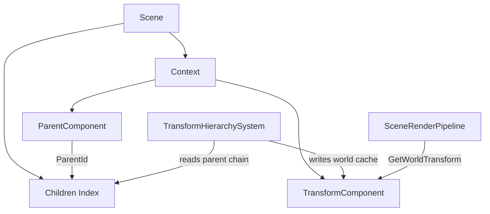
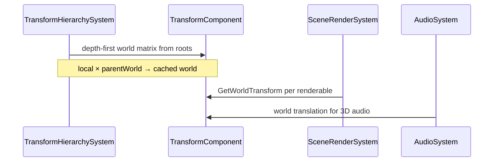
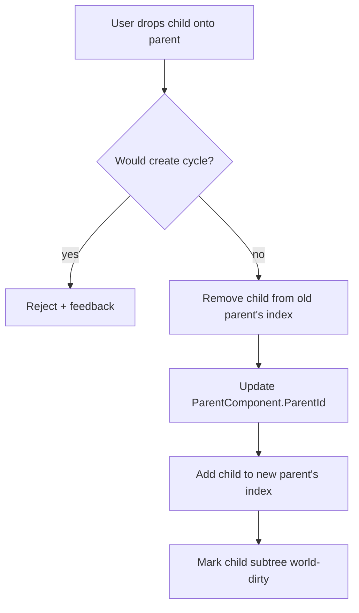

# Entity Hierarchy — Developer Guide

Implementation guide for parent-child entity nesting. See `introduction.md` for conceptual background.

## Glossary (implementation subset)

| Term | Meaning in code |
|------|-----------------|
| `ParentComponent` | Optional component on a child; holds `ParentId` (`int?`, null = root) |
| Children index | `Dictionary<int, List<int>>` on scene; parent Id → ordered child Ids |
| Local matrix | `TransformComponent` TRS product (existing `GetTransform()`) |
| World matrix | Cached matrix on `TransformComponent`; parent world × local |
| Hierarchy API | `SetParent`, `GetChildren`, `DestroySubtree`, `DuplicateSubtree` on scene |
| Prefab-local index | Zero-based position of an entity in a prefab's `Entities` array |

## Implementation order

Work in this sequence — each step unlocks the next and leaves the engine in a runnable state.

1. **`ParentComponent`** — data + serialization + clone
2. **Scene hierarchy index + API** — maintain children map; implement set/get/reparent with cycle guard
3. **`TransformHierarchySystem`** — world matrix pass; switch rendering/audio/camera consumers to world
4. **Lifecycle** — cascade delete and subtree duplicate on scene
5. **Scene serialization** — `ParentId` round-trip; load-time orphan fixup
6. **Multi-entity prefabs** — new prefab format v2; migrate save/load/instantiate paths
7. **Editor hierarchy panel** — real tree via `TreeDrawer.DrawHierarchy`; drag reparent
8. **Script API** — parent/children accessors on `ScriptableEntity`
9. **Tests** — hierarchy invariants, transform math, serialization, prefab remapping

---

## Step 1: ParentComponent

Add `ParentComponent` in `SceneComponents/` implementing `IComponent`.

- Single field: `ParentId` (`int?`). Null or absent component means root.
- `Clone()` copies `ParentId` as-is (remapping happens at subtree duplicate / prefab instantiate, not in generic clone).
- Register in `ComponentSerializerRegistry` with JSON field `"ParentId"`.
- Do **not** store a children list on the component.

**Why:** One writable source of truth. Serializable. Fits existing component clone pipeline.

---

## Step 2: Scene hierarchy index and API

Extend `IScene` / `Scene` with hierarchy operations. Internally maintain:

```
childrenIndex: Map<parentId, List<childId>>
```

Rebuild the entire index when loading a scene (scan all entities with `ParentComponent`). Incrementally update on `SetParent` and entity removal.

### Required API surface

| Operation | Behavior |
|-----------|----------|
| `GetParent(entity)` | Returns parent entity or null |
| `GetChildren(entity)` | Returns direct children (stable order = insertion order) |
| `GetRootEntities()` | Entities with no parent |
| `SetParent(child, parent)` | Detach from old parent, attach to new; reject cycles; update index |
| `DestroyEntity(entity)` | **Replace** current flat delete — cascade destroy entire subtree (deepest first) |
| `DuplicateEntity(entity)` | **Replace** current flat duplicate — clone subtree with new Ids; remap `ParentId` within clone set |

### Cycle prevention

Before `SetParent(child, newParent)`:

```
if newParent is null → ok
walk ancestors from newParent
  if any ancestor == child → reject (would create cycle)
```

### Reparent side effects

- Remove `child.Id` from old parent's children list.
- Add to new parent's children list.
- Update `ParentComponent.ParentId` on child.
- Mark `child` and all descendants dirty for world transform recompute.

---

## Step 3: TransformHierarchySystem

New system, priority **before** `PhysicsSimulationSystem` (e.g. 90) and rendering (150).

### World matrix computation

```
for each root in GetRootEntities():
  ComputeWorldTransform(root, identityMatrix)

function ComputeWorldTransform(entity, parentWorld):
  local = entity.TransformComponent.GetLocalTransform()
  world = parentWorld * local
  cache world on TransformComponent
  for each child in GetChildren(entity):
    ComputeWorldTransform(child, world)
```

### TransformComponent changes

- Rename existing matrix accessor to `GetLocalTransform()` (or keep `GetTransform()` as local alias for minimal churn — pick one name and use consistently).
- Add cached `_worldTransform` + `_worldDirty` flag.
- Add `GetWorldTransform()` returning cached world matrix.
- `MarkWorldDirty()` — set dirty on self; called when local TRS changes or parent changes.
- Propagate dirty to descendants when local transform changes (ponytail: O(subtree) walk; upgrade path is a separate dirty set per frame).

### Consumer updates (v1)

Switch these to `GetWorldTransform()`:

- `SceneRenderPipeline` — sprite/model draw matrices
- `PrimaryCameraSystem` — camera view matrix
- `AudioSystem` — 3D position from world translation
- Editor viewport camera pan-to-entity — world translation
- Editor gizmos (`MoveTool`, `RotateTool`, `ScaleTool`) — read/write **local** TRS; display at world position for handle placement

**Do not change** `PhysicsSimulationSystem` in v1.

---

## Step 4: Lifecycle

### Cascade delete

```
function DestroySubtree(root):
  for each child in GetChildren(root) (snapshot list first):
    DestroySubtree(child)
  run script OnDestroy, remove from Context, update index
```

Deepest-first ensures children are gone before parent `OnDestroy` runs.

### Subtree duplicate

```
function DuplicateSubtree(root):
  idMap = empty
  entities = collect root + descendants depth-first (parent before child)
  for each e in entities:
    newEntity = clone all components via IComponent.Clone()
    assign new Id, append to idMap[e.Id] = newEntity.Id
  for each newEntity that has ParentComponent:
    remap ParentId through idMap
  register all new entities, rebuild index entries
  return idMap[root.Id]
```

---

## Step 5: Scene serialization

No change to top-level scene JSON shape. `ParentComponent` serializes inside each entity's `Components` array like any other component.

### Deserialize load order

1. Create all entities and deserialize all components (including `ParentId` values that may reference not-yet-loaded Ids — this is fine since Ids are in the file).
2. Rebuild children index from `ParentComponent` data.
3. **Orphan fixup:** if `ParentId` references a missing Id, set to null and log warning.

### Play mode snapshot

Existing play-mode serialize/reload must include `ParentComponent`. Verify `RuntimeSceneStarter` snapshot path preserves hierarchy.

---

## Step 6: Multi-entity prefabs

Bump prefab format to **v2** when `Entities` array is present; keep v1 (single `Components` array) readable for backward compatibility.

### v2 prefab JSON shape

```
{
  "Prefab": "name",
  "Version": "2.0",
  "Entities": [
    { "PrefabIndex": 0, "Name": "...", "Components": [...] },
    { "PrefabIndex": 1, "Name": "...", "Components": [ { "Name": "ParentComponent", "ParentId": 0 } ] }
  ],
  "RootPrefabIndex": 0
}
```

**ParentId in prefabs** uses `PrefabIndex` (int), not scene Id. Serializer writes indices; deserializer remaps to scene Ids on instantiate.

### Save prefab from editor

- If selected entity has descendants → save v2 subtree (all entities in subtree).
- If leaf entity → may save v1-compatible single-entity prefab OR always v2 with one entry (pick one; recommend always v2 for one code path).

### Instantiate prefab

```
entities = create all from array with new scene Ids
idMap = prefabIndex → sceneId
for each entity with ParentComponent:
  ParentId = idMap[prefabParentIndex]
register entities, update index
return idMap[RootPrefabIndex]
```

### Apply prefab to existing entity

v1 behavior unchanged for single-entity prefabs. v2 apply-to-entity: replace subtree rooted at target (destructive — delete existing children, recreate from prefab). Document this behavior in editor UX.

---

## Step 7: Editor hierarchy panel

Refactor `SceneHierarchyPanel` to render from `GetRootEntities()` using `TreeDrawer.DrawHierarchy`:

```
DrawHierarchy(
  roots: scene.GetRootEntities(),
  getChildren: e => scene.GetChildren(e),
  drawNode: (entity) => { selectable row; context menu },
  ...
)
```

### Drag-and-drop reparent

- Drag entity row → drop on another entity → `SetParent(dragged, target)`.
- Drop on empty panel background → `SetParent(dragged, null)` (promote to root).
- Reject drop if cycle would form (visual feedback: disallow cursor).

### Search filter

When filter active, show matching entities **and their ancestor chain** so nested matches remain visible in context. Flatten is not acceptable for filtered view.

### Context menu

- "Create Child Entity" under selected → create entity + `SetParent(new, selected)`.
- Delete uses cascade `DestroyEntity`.

---

## Step 8: Script API

Extend `ScriptableEntity` (requires access to `IScene` or a narrow `IEntityHierarchy` injected at construction):

| Member | Behavior |
|--------|----------|
| `Parent` | Current parent entity, or null |
| `Children` | Read-only enumerable of direct children |
| `SetParent(parent)` | Reparent self; null = detach to root |
| `GetChild(name)` | First direct child matching name, or null |
| `WorldPosition` | Convenience: world translation from transform |

Call scene hierarchy API internally — scripts never mutate `ParentComponent` directly.

---

## Architecture diagrams

### Component relationships



### Frame update sequence



### Reparent flow



---

## Error handling

| Situation | Response |
|-----------|----------|
| Reparent creates cycle | Reject operation; no mutation; editor shows blocked drop |
| Deserialize ParentId → missing entity | Set parent null; log warning with entity name + Id |
| SetParent on destroyed entity | Throw or no-op with clear error |
| Prefab v2 ParentId → invalid index | Fail prefab load with `InvalidSceneJsonException` |
| Entity without TransformComponent in subtree | Skip world compute for that node; children still compose from nearest ancestor with transform (ponytail: require TransformComponent on all entities for v1 — simpler) |

**v1 simplification:** Require `TransformComponent` on every entity that participates in hierarchy. Editor auto-adds transform on create (already default).

---

## Testing

### Unit tests (no GPU)

| Test | Asserts |
|------|---------|
| SetParent / detach | Index matches ParentComponent; order preserved |
| Cycle rejection | A→B→C, attempt C→A fails; tree unchanged |
| World transform — single root | World equals local |
| World transform — two levels | Child world = parentWorld × childLocal |
| Dirty propagation | Change parent rotation → child world position updates |
| Cascade delete | Parent + 3 descendants → all removed from Context |
| Subtree duplicate | Clone 2-level tree; new Ids; parent links intact |
| Scene round-trip | Save/load scene with 3-level tree; hierarchy preserved |
| Orphan fixup | JSON with bad ParentId → entity becomes root |
| Prefab v2 instantiate | 3-entity prefab → correct scene tree |
| Prefab v1 backward compat | Old single-entity prefab still loads |

### Manual editor verification

- Drag reparent in hierarchy; child moves visually with parent in viewport.
- Delete parent removes nested children from panel.
- Ctrl+D on parent duplicates entire subtree.
- Save multi-entity prefab; drag into scene creates full tree.
- Play mode start/stop preserves hierarchy.

---

## Files likely touched

| Area | Files |
|------|-------|
| Component | `SceneComponents/ParentComponent.cs` |
| Scene API | `Engine/Scene/Scene.cs`, `Engine/Scene/IScene.cs` |
| Transform | `SceneComponents/TransformComponent.cs` |
| System | `Engine/Scene/Systems/TransformHierarchySystem.cs`, `SceneSystemsFactory.cs` |
| Consumers | `SceneRenderPipeline.cs`, `PrimaryCameraSystem.cs`, `AudioSystem.cs` |
| Serialization | `ComponentSerializerRegistry.cs`, `SceneSerializer.cs`, `PrefabSerializer.cs` |
| Editor | `SceneHierarchyPanel.cs`, viewport tools, `PropertiesPanel` prefab save |
| Scripts | `ScriptableEntity.cs`, script DI wiring |
| Tests | `tests/Engine.Tests/Scene/` (new hierarchy test file) |

---

## Out-of-scope follow-ups (track separately)

- Physics body sync from world transform
- World/local gizmo toolbar toggle
- Undo/redo for hierarchy edits
- `GetDescendants()` / `FindInChildren()` depth search on scripts
