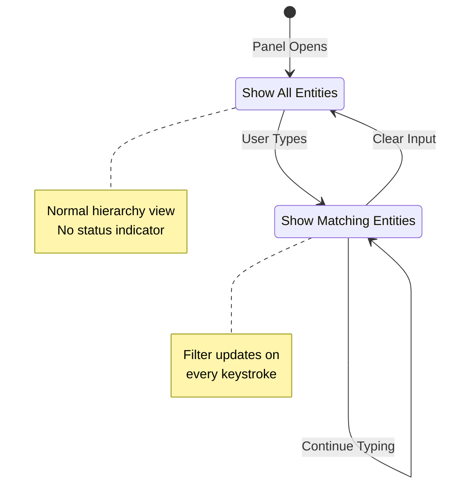
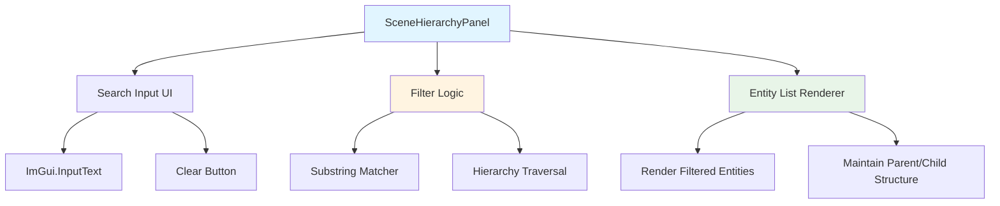
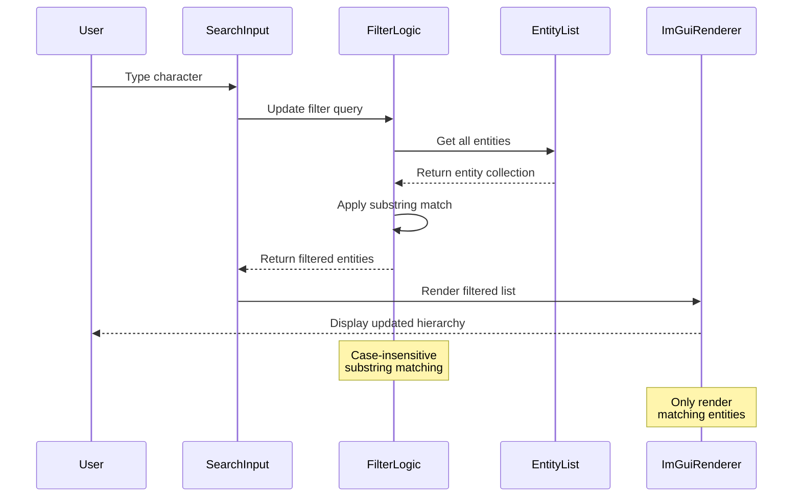

h# Entity Search/Filter Specification

**Version**: 1.0
**Date**: 2025-10-26
**Target Component**: Scene Hierarchy Panel
**Status**: Draft

---

## 1. Overview

This specification defines a simple, real-time entity search and filter feature for the Scene Hierarchy panel. Users can filter entities by name using substring matching, with results updating dynamically as they type.

### 1.1 Goals

- Enable quick entity location in scenes with many entities
- Provide intuitive, real-time filtering experience
- Maintain consistent performance with hundreds of entities
- Work seamlessly in both edit and play modes

---

## 2. Requirements

### 2.1 Functional Requirements

| ID | Requirement | Priority |
|----|-------------|----------|
| FR-01 | Filter entities by name using case-insensitive substring matching | Must Have |
| FR-02 | Update filtered results in real-time as user types | Must Have |
| FR-03 | Display only matching entities, hiding non-matches | Must Have |
| FR-04 | Show visual indicator when filter is active | Must Have |
| FR-05 | Preserve entity hierarchy structure in filtered view | Must Have |
| FR-06 | Allow clearing filter to restore full entity list | Must Have |
| FR-07 | Function identically in edit mode and play mode | Must Have |
| FR-08 | Search input persists during session (cleared on scene change) | Should Have |

### 2.2 Non-Functional Requirements

| ID | Requirement | Priority |
|----|-------------|----------|
| NFR-01 | Filter operation completes within 16ms for 500 entities | Must Have |
| NFR-02 | Search input responds without perceptible lag | Must Have |
| NFR-03 | UI follows existing editor design patterns and constants | Must Have |
| NFR-04 | No impact on scene hierarchy performance when filter is empty | Must Have |

### 2.3 Constraints

- Search scope limited to current active scene
- Search applies to entity names only
- Filtering uses simple substring matching (no regex, no wildcards)

---

## 3. User Interface Design

### 3.1 Layout

```
┌─────────────────────────────────────────┐
│ Scene Hierarchy                      [×]│
├─────────────────────────────────────────┤
│ [🔍] Search entities...            [×] │ ← Search input bar
├─────────────────────────────────────────┤
│ ▼ Entity 1                              │
│   ▼ Child Entity                        │
│     • Grandchild                        │
│ ▼ Entity 2                              │
│   • Another Child                       │
└─────────────────────────────────────────┘

When filter active:
┌─────────────────────────────────────────┐
│ Scene Hierarchy                      [×]│
├─────────────────────────────────────────┤
│ [🔍] player                        [×] │ ← Active filter
│ 🔍 Filtering: 2 of 150 entities        │ ← Status indicator
├─────────────────────────────────────────┤
│ ▼ Player                                │
│   • PlayerController                    │
└─────────────────────────────────────────┘
```

### 3.2 UI Elements

#### Search Input Field
- **Location**: Top of Scene Hierarchy panel, below panel title
- **Width**: Full panel width minus padding (use `EditorUIConstants.FilterInputWidth` or similar)
- **Placeholder**: "Search entities..." (grayed out when empty)
- **Clear Button**: Small [×] button on right side, visible only when text entered
- **Icon**: Magnifying glass icon on left side (optional, for clarity)

#### Filter Status Indicator
- **Location**: Below search input, above entity list
- **Content**: "🔍 Filtering: {matchCount} of {totalCount} entities"
- **Visibility**: Only shown when filter is active (non-empty search query)
- **Color**: Use `EditorUIConstants.InfoColor` for subtle visual distinction

### 3.3 Interaction Flow



### 3.4 Visual Feedback

- **Active Filter**: Search input has focus styling, clear button visible
- **No Results**: Display "No entities match your search" message in hierarchy area
- **Match Count**: Status indicator updates with each keystroke
- **Clear Action**: Clicking [×] button clears input and returns focus to search field

---

## 4. Architecture

### 4.1 Component Overview



### 4.2 Data Flow



### 4.3 Class Structure

```
SceneHierarchyPanel
├── Properties
│   ├── _searchQuery (string)
│   ├── _filteredEntities (List<Entity>)
│   └── _isFilterActive (bool)
│
├── Methods
│   ├── OnImGuiRender()
│   ├── RenderSearchInput()
│   ├── RenderFilterStatus()
│   ├── RenderEntityHierarchy()
│   ├── ApplyFilter(string query)
│   ├── ClearFilter()
│   └── MatchesFilter(Entity entity, string query)
│
└── Private Helpers
    ├── DrawEntityNode(Entity entity)
    └── CountMatchingEntities()
```

---

## 5. Technical Implementation

### 5.1 Search Input Rendering

**Pseudo-code:**
```
function RenderSearchInput():
    ImGui.SetNextItemWidth(panelWidth - 2 * EditorUIConstants.StandardPadding)

    if ImGui.InputText("##searchInput", ref _searchQuery, MaxNameLength):
        ApplyFilter(_searchQuery)

    if _searchQuery is not empty:
        ImGui.SameLine()
        if ImGui.Button("×", SmallButtonSize):
            ClearFilter()
```

### 5.2 Filter Application Logic

**Pseudo-code:**
```
function ApplyFilter(query):
    if query is empty or whitespace:
        _isFilterActive = false
        _filteredEntities.Clear()
        return

    _isFilterActive = true
    _filteredEntities.Clear()

    query = query.Trim().ToLowerInvariant()

    foreach entity in currentScene.GetAllEntities():
        if MatchesFilter(entity, query):
            _filteredEntities.Add(entity)
            AddParentChain(entity, _filteredEntities)

function MatchesFilter(entity, query):
    entityName = entity.Name?.ToLowerInvariant() ?? ""
    return entityName.Contains(query)

function AddParentChain(entity, filteredList):
    current = entity.Parent
    while current is not null:
        if current not in filteredList:
            filteredList.Add(current)
        current = current.Parent
```

**Note on Parent Chain:**
To maintain hierarchy structure, when an entity matches, all its ancestors must be included in the filtered view (even if they don't match) so the tree structure remains valid.

### 5.3 Hierarchy Rendering with Filter

**Pseudo-code:**
```
function RenderEntityHierarchy():
    if _isFilterActive:
        RenderFilterStatus()

        if _filteredEntities is empty:
            ImGui.Text("No entities match your search")
            return

        rootEntities = _filteredEntities.Where(e => e.Parent is null)
        foreach entity in rootEntities:
            DrawEntityNodeFiltered(entity)
    else:
        foreach entity in scene.GetRootEntities():
            DrawEntityNode(entity)

function DrawEntityNodeFiltered(entity):
    shouldShow = _filteredEntities.Contains(entity)

    if not shouldShow:
        return

    // Highlight matched entities differently than parent-chain entities
    isDirectMatch = MatchesFilter(entity, _searchQuery)

    if isDirectMatch:
        ImGui.PushStyleColor(Text, EditorUIConstants.InfoColor)

    DrawEntityNode(entity)

    if isDirectMatch:
        ImGui.PopStyleColor()

    // Recursively draw children that are in filtered list
    foreach child in entity.Children:
        DrawEntityNodeFiltered(child)
```

### 5.4 Filter Status Rendering

**Pseudo-code:**
```
function RenderFilterStatus():
    if not _isFilterActive:
        return

    matchCount = CountDirectMatches()
    totalCount = currentScene.EntityCount

    statusText = $"🔍 Filtering: {matchCount} of {totalCount} entities"

    ImGui.PushStyleColor(Text, EditorUIConstants.InfoColor)
    ImGui.Text(statusText)
    ImGui.PopStyleColor()

    ImGui.Separator()

function CountDirectMatches():
    count = 0
    query = _searchQuery.Trim().ToLowerInvariant()

    foreach entity in _filteredEntities:
        if MatchesFilter(entity, query):
            count++

    return count
```

---

## 6. Edge Cases & Handling

### 6.1 Edge Cases

| Scenario | Expected Behavior |
|----------|-------------------|
| Empty search query | Show all entities, no filter active |
| Whitespace-only query | Treated as empty, show all entities |
| No matching entities | Display "No entities match your search" message |
| Entity renamed during filter | Filter re-applies automatically if entity list updates |
| Scene changed | Clear search query and filter state |
| Entity deleted during filter | Remove from filtered list, update count |
| Very long entity names | Truncate in display, but search full name |
| Special characters in search | Treat as literal characters (no escape needed) |
| Case sensitivity | Always case-insensitive matching |
| Parent doesn't match but child does | Show both parent and matching child (maintain hierarchy) |

### 6.2 Performance Considerations

**Optimization Strategies:**
- Linear search is acceptable for hundreds of entities (< 1ms)
- Avoid string allocations in hot path (cache `ToLowerInvariant()` results if needed)
- Lazy evaluation: only filter when query changes, not on every frame
- Early exit: if query unchanged, skip filter logic

**Performance Budget:**
- Filter computation: < 5ms for 500 entities
- UI rendering: Standard ImGui performance (< 10ms for visible entities)
- Total overhead: Should not impact editor frame time noticeably

---

## 7. Testing Considerations

### 7.1 Manual Test Cases

1. **Basic Filtering**
   - Type partial entity name, verify only matches shown
   - Type complete entity name, verify exact match shown
   - Clear filter, verify all entities restored

2. **Case Insensitivity**
   - Search "player" finds "Player", "PLAYER", "PlayerController"
   - Search "ENEMY" finds "enemy", "Enemy", "EnemySpawner"

3. **Hierarchy Preservation**
   - Search for child entity, verify parent chain shown
   - Search for grandchild, verify all ancestors shown
   - Verify tree structure icons (▼, •) display correctly

4. **No Results**
   - Type non-existent name, verify "No entities match" message
   - Verify status shows "0 of N entities"

5. **Real-time Updates**
   - Type character-by-character, verify results update each keystroke
   - Delete characters with backspace, verify results expand

6. **Mode Independence**
   - Verify filter works in edit mode
   - Enter play mode, verify filter still works
   - Exit play mode, verify filter state preserved

7. **Entity Lifecycle**
   - Delete filtered entity, verify it disappears from results
   - Rename entity during filter, verify it appears/disappears based on new name
   - Create entity during filter, verify it appears if matches

### 7.2 Edge Case Validation

- Empty scene (0 entities)
- Single entity scene
- Deeply nested hierarchy (5+ levels)
- Very long entity names (> 100 characters)
- Special characters in names (@, #, $, %, &, etc.)
- Unicode characters in names (emoji, non-ASCII)

---

## 8. Implementation Plan

### Phase 1: Core Infrastructure (1-2 hours)
1. Add search query state variable to SceneHierarchyPanel
2. Add filtered entities list storage
3. Implement `ApplyFilter()` method with substring matching
4. Implement `MatchesFilter()` helper
5. Implement `ClearFilter()` method

### Phase 2: UI Integration (1-2 hours)
6. Add search input field to panel header
7. Wire up input text callback to trigger filtering
8. Implement clear button with conditional rendering
9. Add filter status indicator with match count
10. Apply `EditorUIConstants` for consistent styling

### Phase 3: Hierarchy Rendering (2-3 hours)
11. Modify entity rendering to respect filter state
12. Implement parent chain inclusion logic
13. Add visual distinction for direct matches vs ancestors
14. Handle "no results" case with message
15. Ensure tree expand/collapse works with filtered view

### Phase 4: Polish & Edge Cases (1 hour)
16. Add scene change detection to clear filter
17. Optimize filter performance for large entity counts
18. Test case-insensitive matching thoroughly
19. Verify behavior in play mode
20. Add keyboard shortcuts (Ctrl+F to focus search, Esc to clear)

### Phase 5: Testing & Documentation (1 hour)
21. Manual testing of all test cases listed above
22. Edge case validation
23. Performance testing with 300-500 entities
24. Update user documentation (if applicable)
25. Code review and cleanup

---

## 9. Future Enhancements (Out of Scope)

These features are explicitly excluded from this specification but may be considered for future iterations:

- Component-based filtering ("entities with SpriteRenderer")
- Multi-criteria search (name AND component type)
- Regular expression support
- Search history dropdown
- Saved filter presets
- Fuzzy matching (typo tolerance)
- Search across multiple scenes
- Batch operations on filtered results (select all, delete all, etc.)
- Search result export/clipboard copy

---

## 10. Acceptance Criteria

This feature is considered complete when:

- ✅ User can type in search field and see real-time filtering
- ✅ Only entities matching substring appear in hierarchy
- ✅ Filter is case-insensitive
- ✅ Parent chains are preserved for matching children
- ✅ Status indicator shows "X of Y entities" when filtering
- ✅ Clear button removes filter and restores full view
- ✅ Feature works identically in edit and play modes
- ✅ No perceptible performance impact on editor
- ✅ All manual test cases pass
- ✅ Code follows project style guidelines and uses `EditorUIConstants`

---

## 11. References

- **Related Documentation**: `docs/modules/editor.md`
- **Affected Files**:
  - `Editor/Panels/SceneHierarchyPanel.cs`
  - `Editor/UI/EditorUIConstants.cs` (reference for styling)
- **Design Patterns**: Immediate-mode UI (ImGui), real-time filtering
- **Dependencies**: ImGui.NET, existing Scene/Entity system

---

**End of Specification**