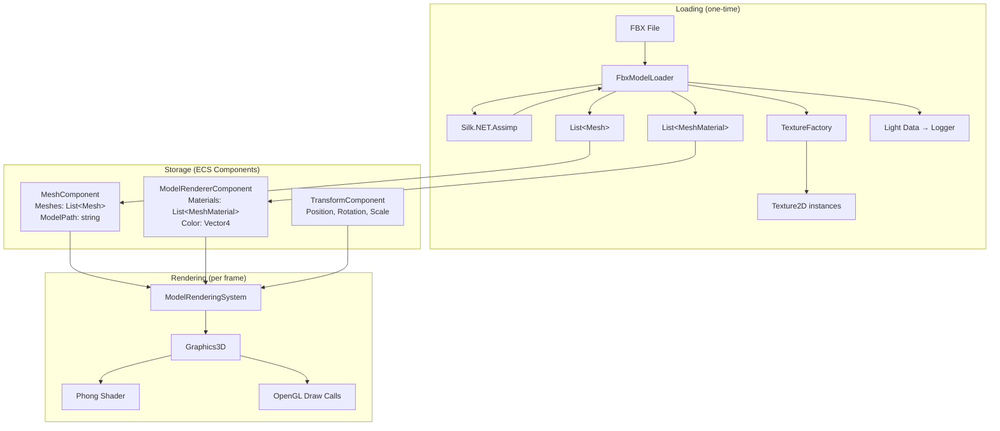
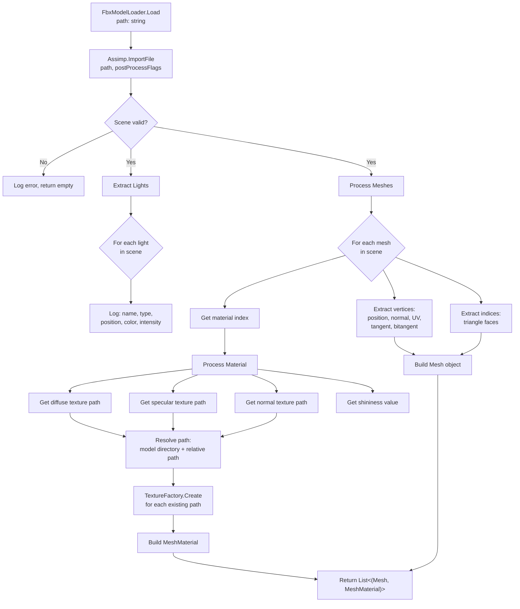
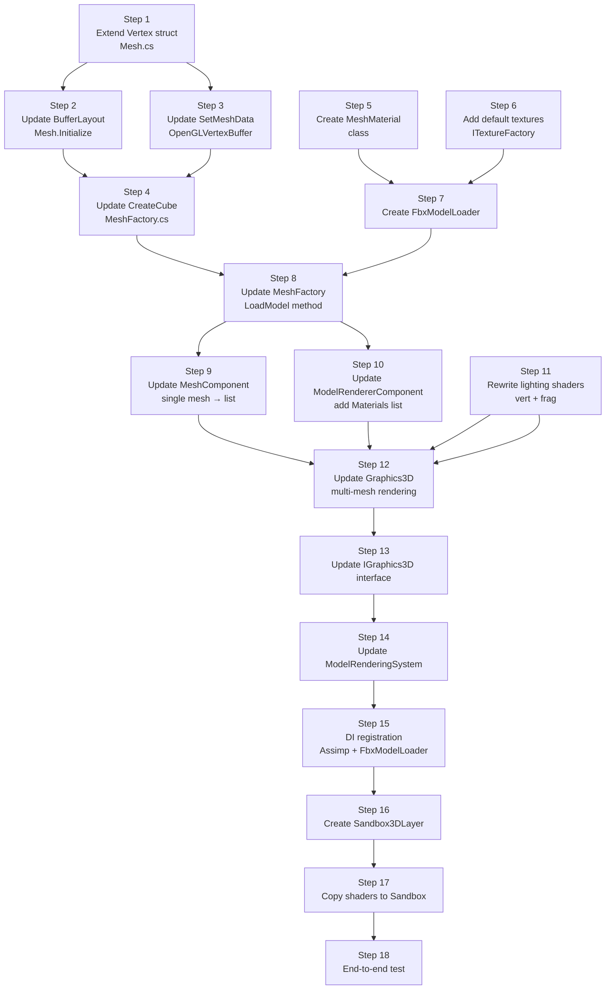

# FBX Support — Complete Specification

## Table of Contents

- [1. Overview](#1-overview)
- [2. Scope](#2-scope)
- [3. Architecture](#3-architecture)
- [4. Vertex Structure Changes](#4-vertex-structure-changes)
- [5. Material Data Model](#5-material-data-model)
- [6. FBX Loader](#6-fbx-loader)
- [7. Component Changes](#7-component-changes)
- [8. Shader Upgrade](#8-shader-upgrade)
- [9. Graphics3D Rendering Changes](#9-graphics3d-rendering-changes)
- [10. MeshFactory Changes](#10-meshfactory-changes)
- [11. ModelRenderingSystem Changes](#11-modelrenderingsystem-changes)
- [12. IGraphics3D Interface Changes](#12-igraphics3d-interface-changes)
- [13. DI Registration](#13-di-registration)
- [14. Sandbox Demo](#14-sandbox-demo)
- [15. Light Extraction](#15-light-extraction)
- [16. Implementation Plan](#16-implementation-plan)
- [17. Design Decisions & Rationale](#17-design-decisions--rationale)
- [18. Risk & Limitations](#18-risk--limitations)

---

## 1. Overview

This specification adds FBX model loading to the engine: static meshes with multi-texture Phong materials (diffuse, specular, normal maps), multi-mesh models as a single entity, and light data extraction with console logging. Loading happens at runtime via Silk.NET.Assimp. A Sandbox demo validates the feature end-to-end.

---

## 2. Scope

### In Scope

| Feature | Description |
|---|---|
| Static mesh loading | Vertices (position, normal, UV, tangent, bitangent), indices from FBX |
| Multi-mesh models | One FBX = one entity, multiple meshes stored as a list |
| External textures | Load `.png`/`.jpg` files referenced by FBX materials |
| Multi-texture materials | Diffuse + specular + normal maps per mesh |
| Shader upgrade | Lighting shader supports texture coords, normal mapping, specular mapping |
| Light extraction | Read lights from FBX, log to console |
| Sandbox demo | Working 3D model rendering in Sandbox project |

### Out of Scope

Animations, morph targets, scene hierarchy, cameras, embedded textures, editor integration, asset import pipeline.

---

## 3. Architecture

### System Overview



### File Map (files that change or are created)

| File | Action | Purpose |
|---|---|---|
| `Engine/Renderer/Mesh.cs` | **Modify** | Extend Vertex struct with tangent/bitangent |
| `Engine/Renderer/MeshMaterial.cs` | **Create** | Material data class (textures + shininess) |
| `Engine/Renderer/FbxModelLoader.cs` | **Create** | Assimp-based FBX loading |
| `Engine/Renderer/IMeshFactory.cs` | **Modify** | Add `LoadModel` method |
| `Engine/Renderer/MeshFactory.cs` | **Modify** | Implement `LoadModel` with caching |
| `Engine/Renderer/IGraphics3D.cs` | **Modify** | Update `DrawModel` signature |
| `Engine/Renderer/Graphics3D.cs` | **Modify** | Multi-texture rendering, normal matrix |
| `Engine/Renderer/IModel.cs` | **Modify** | Update to include material data |
| `Engine/Scene/Components/MeshComponent.cs` | **Modify** | Single mesh → list of meshes |
| `Engine/Scene/Components/ModelRendererComponent.cs` | **Modify** | Add `List<MeshMaterial>` |
| `Engine/Scene/Systems/ModelRenderingSystem.cs` | **Modify** | Loop over mesh list |
| `Engine/Renderer/Buffers/IVertexBuffer.cs` | **Modify** | Update `SetMeshData` for new vertex |
| `Engine/Platform/OpenGL/OpenGLVertexBuffer.cs` | **Modify** | Upload new vertex layout |
| `Editor/assets/shaders/OpenGL/lightingShader.vert` | **Rewrite** | Add UV, tangent, bitangent, normal matrix |
| `Editor/assets/shaders/OpenGL/lightingShader.frag` | **Rewrite** | Multi-texture sampling, TBN matrix |
| `Sandbox/assets/shaders/OpenGL/lightingShader.vert` | **Create** | Copy of upgraded shader |
| `Sandbox/assets/shaders/OpenGL/lightingShader.frag` | **Create** | Copy of upgraded shader |
| `Sandbox/Sandbox3DLayer.cs` | **Create** | 3D FBX rendering demo layer |
| `Sandbox/Program.cs` | **Modify** | Wire up 3D layer |

---

## 4. Vertex Structure Changes

### Current Vertex (32 bytes)

```
record struct Vertex(Vector3 Position, Vector3 Normal, Vector2 TexCoord, int EntityId = -1)
```

| Field | Type | Bytes |
|---|---|---|
| Position | Vector3 | 12 |
| Normal | Vector3 | 12 |
| TexCoord | Vector2 | 8 |
| EntityId | int | 4 |
| **Total** | | **36** |

> Note: `GetSize()` in current code returns `sizeof(float) * 8 + sizeof(int) = 36` but the comment-aligned layout in the buffer is 32+4=36. The actual size is 36 bytes. The current buffer layout declaration uses Float3 + Float3 + Float2 + Int which totals 36 bytes.

### New Vertex (60 bytes)

```
record struct Vertex(
    Vector3 Position,
    Vector3 Normal,
    Vector2 TexCoord,
    Vector3 Tangent,
    Vector3 Bitangent,
    int EntityId = -1)
```

| Field | Type | Bytes | Shader Attribute |
|---|---|---|---|
| Position | Vector3 | 12 | `a_Position` (location 0) |
| Normal | Vector3 | 12 | `a_Normal` (location 1) |
| TexCoord | Vector2 | 8 | `a_TexCoord` (location 2) |
| Tangent | Vector3 | 12 | `a_Tangent` (location 3) |
| Bitangent | Vector3 | 12 | `a_Bitangent` (location 4) |
| EntityId | int | 4 | `a_EntityID` (location 5) |
| **Total** | | **60** | |

### Buffer Layout Update

The `BufferLayout` in `Mesh.Initialize()` must be updated:

```
BufferLayout = [
    Float3  "a_Position",
    Float3  "a_Normal",
    Float2  "a_TexCoord",
    Float3  "a_Tangent",
    Float3  "a_Bitangent",
    Int     "a_EntityID"
]
```

### GetSize() Update

```
GetSize() => sizeof(float) * (3 + 3 + 2 + 3 + 3) + sizeof(int) = 60
```

### Impact on Procedural Cube

`MeshFactory.CreateCube()` must supply tangent/bitangent values for each vertex. For axis-aligned cube faces, tangents are straightforward:

| Face | Normal | Tangent | Bitangent |
|---|---|---|---|
| Front (+Z) | (0,0,1) | (1,0,0) | (0,1,0) |
| Back (-Z) | (0,0,-1) | (-1,0,0) | (0,1,0) |
| Top (+Y) | (0,1,0) | (1,0,0) | (0,0,-1) |
| Bottom (-Y) | (0,-1,0) | (1,0,0) | (0,0,1) |
| Right (+X) | (1,0,0) | (0,0,-1) | (0,1,0) |
| Left (-X) | (-1,0,0) | (0,0,1) | (0,1,0) |

### SetMeshData Impact

`IVertexBuffer.SetMeshData(List<Mesh.Vertex>, int)` — the OpenGL implementation marshals vertex data to GPU memory. Since `Mesh.Vertex` is a `record struct`, the memory layout changes automatically when the struct changes. The `dataSize` parameter uses `Vertices.Count * Vertex.GetSize()` which will reflect the new 60-byte size.

---

## 5. Material Data Model

### MeshMaterial Class (New)

A data class holding per-mesh material properties. This is NOT an ECS component — it is a data object stored inside `ModelRendererComponent`.

```
MeshMaterial
├── DiffuseTexture: Texture2D?      // Base color image
├── SpecularTexture: Texture2D?     // Shininess map
├── NormalTexture: Texture2D?       // Surface detail map
├── Shininess: float = 32.0         // Specular exponent
├── HasDiffuseMap: bool             // Computed: DiffuseTexture != null
├── HasSpecularMap: bool            // Computed: SpecularTexture != null
├── HasNormalMap: bool              // Computed: NormalTexture != null
```

**Texture slot convention:**

| Slot | Map | Default when absent |
|---|---|---|
| 0 | Diffuse | White texture (full brightness, color from `u_Color`) |
| 1 | Specular | Black texture (no specular highlights) |
| 2 | Normal | Flat normal texture (RGB = 0.5, 0.5, 1.0 — "pointing straight out") |

### Default Textures

The engine's `ITextureFactory` already provides `GetWhiteTexture()`. Two additional default textures are needed:

- **Black texture** (1x1, RGBA = 0,0,0,255) — for absent specular maps
- **Flat normal texture** (1x1, RGBA = 128,128,255,255) — for absent normal maps

These should be added to `ITextureFactory` as `GetBlackTexture()` and `GetFlatNormalTexture()`.

### Serialization Consideration

`MeshMaterial` holds `Texture2D` references which are runtime-only GPU resources. For JSON serialization, only the texture **paths** should be persisted. The actual textures are loaded at runtime via `ITextureFactory.Create(path)`.

```
MeshMaterial (serialized fields)
├── DiffuseTexturePath: string?
├── SpecularTexturePath: string?
├── NormalTexturePath: string?
├── Shininess: float
```

Runtime `Texture2D` fields should be marked `[JsonIgnore]`.

---

## 6. FBX Loader

### Class: FbxModelLoader

Internal class responsible for using Silk.NET.Assimp to load FBX files. Injected via DI.

**Dependencies:**
- `ITextureFactory` — for loading texture files
- `Silk.NET.Assimp.Assimp` — the Assimp API instance

### Loading Pipeline



### Assimp Post-Processing Flags

When importing, request these post-processing steps from Assimp:

| Flag | Purpose |
|---|---|
| `Triangulate` | Convert all faces to triangles (quads → 2 triangles) |
| `GenerateNormals` | Generate normals if the model doesn't have them |
| `CalcTangentSpace` | Calculate tangent/bitangent for normal mapping |
| `FlipUVs` | Flip V coordinate (many formats use top-left origin; OpenGL uses bottom-left) |

### Assimp Material Texture Queries

Assimp materials use texture type enums. The relevant mappings:

| Assimp Type | Our Map Type | Fallback |
|---|---|---|
| `TextureType.Diffuse` | Diffuse map | White texture |
| `TextureType.Specular` | Specular map | Black texture |
| `TextureType.Normals` | Normal map | Flat normal texture |
| `TextureType.Height` | Normal map (fallback) | Some exporters put normals here |

### Texture Path Resolution

FBX files store texture paths relative to the model file or as absolute paths from the artist's machine. The loader must:

1. Get the raw texture path string from Assimp
2. Extract just the filename (ignore directory — artist paths are meaningless)
3. Look for the texture file in the same directory as the FBX file
4. If not found, log a warning and use the default texture

Pseudocode:
```
FUNCTION resolveTexturePath(modelDirectory, assimpTexturePath):
    filename = getFileName(assimpTexturePath)  // "brick_diffuse.png"
    resolvedPath = combine(modelDirectory, filename)
    IF fileExists(resolvedPath):
        RETURN resolvedPath
    ELSE:
        log warning: "Texture not found: {resolvedPath}"
        RETURN null
```

### Assimp Resource Cleanup

Silk.NET.Assimp uses unmanaged memory. After loading:
- Call `Assimp.ReleaseImport(scene)` to free the Assimp scene
- The Assimp API instance itself is long-lived (singleton)

### Return Type

```
FbxModelLoader.Load(string path) → FbxModelResult
    Meshes: List<Mesh>           // GPU resources NOT yet initialized
    Materials: List<MeshMaterial> // Textures already loaded
    Directory: string            // Model file directory
```

GPU initialization (`Mesh.Initialize()`) happens in `MeshFactory` after the loader returns, because the loader should not depend on buffer factories.

---

## 7. Component Changes

### MeshComponent — Before

```
MeshComponent
├── MeshPath: string?
├── Mesh: Mesh?          [JsonIgnore]
```

### MeshComponent — After

```
MeshComponent
├── ModelPath: string?                  // Path to the FBX file (replaces MeshPath)
├── Meshes: List<Mesh>    [JsonIgnore]  // All meshes from the model (replaces single Mesh)
├── MeshCount: int        [read-only]   // Meshes.Count (convenience)
```

**Migration:** `MeshPath` → `ModelPath`, `Mesh` → first item of `Meshes`.

The `SetMesh` method becomes `SetModel(List<Mesh> meshes, string? modelPath)`.

`Clone()` copies the list reference (meshes are shared GPU resources, not deep-copied).

### ModelRendererComponent — Before

```
ModelRendererComponent
├── Color: Vector4 = (1,1,1,1)
├── OverrideTexture: Texture2D?     [JsonIgnore]
├── OverrideTexturePath: string?
├── CastShadows: bool = true
├── ReceiveShadows: bool = true
```

### ModelRendererComponent — After

```
ModelRendererComponent
├── Color: Vector4 = (1,1,1,1)
├── Materials: List<MeshMaterial>    // Per-mesh materials, index-aligned with MeshComponent.Meshes
├── CastShadows: bool = true
├── ReceiveShadows: bool = true
```

**Migration:** `OverrideTexture` and `OverrideTexturePath` are replaced by the `Materials` list. The first material's diffuse texture serves the same role as `OverrideTexture` did.

`Clone()` shallow-copies the materials list (textures are shared GPU resources).

### Index Alignment Contract

```
MeshComponent.Meshes[i]  ←→  ModelRendererComponent.Materials[i]

The i-th mesh uses the i-th material. Both lists must have the same length.
```

---

## 8. Shader Upgrade

### Current State

The `lightingShader` only accepts position and normal. No texture coordinates, no texture sampling, no tangent space.

### Upgraded Vertex Shader

```glsl
#version 330 core

// Vertex attributes
layout(location = 0) in vec3 a_Position;
layout(location = 1) in vec3 a_Normal;
layout(location = 2) in vec2 a_TexCoord;
layout(location = 3) in vec3 a_Tangent;
layout(location = 4) in vec3 a_Bitangent;
layout(location = 5) in int  a_EntityID;

// Uniforms
uniform mat4 u_ViewProjection;
uniform mat4 u_Model;
uniform mat4 u_NormalMatrix;    // inverse-transpose of u_Model

// Outputs to fragment shader
out vec3 v_Position;            // World-space position
out vec2 v_TexCoord;            // UV coordinates
out mat3 v_TBN;                 // Tangent-Bitangent-Normal matrix
flat out int v_EntityID;        // Entity ID for picking

void main()
{
    // World-space position
    vec4 worldPos = vec4(a_Position, 1.0) * u_Model;
    v_Position = worldPos.xyz;

    // Pass through UVs
    v_TexCoord = a_TexCoord;

    // Build TBN matrix in world space for normal mapping
    // Use NormalMatrix (inverse-transpose of model) for correct normal transformation
    vec3 T = normalize(vec3(vec4(a_Tangent,   0.0) * u_NormalMatrix));
    vec3 B = normalize(vec3(vec4(a_Bitangent, 0.0) * u_NormalMatrix));
    vec3 N = normalize(vec3(vec4(a_Normal,    0.0) * u_NormalMatrix));
    v_TBN = mat3(T, B, N);

    // Entity ID pass-through
    v_EntityID = a_EntityID;

    // Clip-space position
    gl_Position = worldPos * u_ViewProjection;
}
```

### Upgraded Fragment Shader

```glsl
#version 330 core

// Outputs
layout(location = 0) out vec4 o_Color;
layout(location = 1) out int  o_EntityID;

// Inputs from vertex shader
in vec3 v_Position;
in vec2 v_TexCoord;
in mat3 v_TBN;
flat in int v_EntityID;

// Material textures
uniform sampler2D u_DiffuseMap;     // slot 0
uniform sampler2D u_SpecularMap;    // slot 1
uniform sampler2D u_NormalMap;      // slot 2

// Material flags (which maps are active)
uniform int u_HasDiffuseMap;
uniform int u_HasSpecularMap;
uniform int u_HasNormalMap;

// Light and view
uniform vec3 u_LightPosition;
uniform vec3 u_LightColor;
uniform vec3 u_ViewPosition;

// Material properties
uniform vec4 u_Color;           // Tint color
uniform float u_Shininess;      // Specular exponent

void main()
{
    // --- Normal ---
    vec3 normal;
    if (u_HasNormalMap == 1)
    {
        // Sample normal map (range 0..1) and convert to -1..1
        normal = texture(u_NormalMap, v_TexCoord).rgb;
        normal = normal * 2.0 - 1.0;
        // Transform from tangent space to world space
        normal = normalize(v_TBN * normal);
    }
    else
    {
        // Use interpolated vertex normal (third column of TBN)
        normal = normalize(v_TBN[2]);
    }

    // --- Diffuse color ---
    vec4 diffuseColor;
    if (u_HasDiffuseMap == 1)
    {
        diffuseColor = texture(u_DiffuseMap, v_TexCoord) * u_Color;
    }
    else
    {
        diffuseColor = u_Color;
    }

    // --- Specular intensity ---
    float specularIntensity;
    if (u_HasSpecularMap == 1)
    {
        specularIntensity = texture(u_SpecularMap, v_TexCoord).r;
    }
    else
    {
        specularIntensity = 0.5;    // Default: moderate specular
    }

    // --- Phong lighting ---

    // Ambient
    float ambientStrength = 0.1;
    vec3 ambient = ambientStrength * u_LightColor;

    // Diffuse
    vec3 lightDir = normalize(u_LightPosition - v_Position);
    float diff = max(dot(normal, lightDir), 0.0);
    vec3 diffuse = diff * u_LightColor;

    // Specular
    vec3 viewDir = normalize(u_ViewPosition - v_Position);
    vec3 reflectDir = reflect(-lightDir, normal);
    float spec = pow(max(dot(viewDir, reflectDir), 0.0), u_Shininess);
    vec3 specular = specularIntensity * spec * u_LightColor;

    // Combine
    vec3 result = (ambient + diffuse + specular) * diffuseColor.rgb;
    o_Color = vec4(result, diffuseColor.a);

    // Entity ID for picking
    o_EntityID = v_EntityID;
}
```

### Key Differences from Current Shader

| Aspect | Current | Upgraded |
|---|---|---|
| Vertex attributes | Position, Normal | Position, Normal, TexCoord, Tangent, Bitangent, EntityID |
| Normal matrix | Not used (uses `vec4(normal, 0.0) * u_Model`) | `u_NormalMatrix` (inverse-transpose) |
| Texture sampling | None | Diffuse, Specular, Normal maps |
| Normal source | Vertex normal only | Normal map via TBN matrix, fallback to vertex normal |
| Specular strength | Hardcoded 0.5 | From specular map or default 0.5 |
| Shininess | Hardcoded 32 | `u_Shininess` uniform |
| Color | `vec3 u_Color` | `vec4 u_Color` (includes alpha) |
| Entity ID | Uniform only | Vertex attribute + flat interpolation |

### Why the Normal Matrix Matters

When a model is scaled non-uniformly (e.g., stretched along X), normals transformed by the regular model matrix become incorrect — they skew and no longer point perpendicular to the surface. The normal matrix (inverse-transpose of the model matrix) corrects this.

Pseudocode for computing it on the CPU:
```
normalMatrix = transpose(inverse(modelMatrix))
```

`System.Numerics.Matrix4x4.Invert()` provides the inverse. Transpose is also available in the library.

---

## 9. Graphics3D Rendering Changes

### Current DrawModel

```
DrawModel(transform, meshComponent, modelRenderer, entityId):
    mesh = meshComponent.Mesh
    if mesh is null: return
    DrawMesh(transform, mesh, modelRenderer.Color, entityId)
```

### New DrawModel

```
DrawModel(transform, meshComponent, modelRenderer, entityId):
    meshes = meshComponent.Meshes
    materials = modelRenderer.Materials
    if meshes is empty: return

    // Compute normal matrix once for all meshes (same transform)
    normalMatrix = transpose(inverse(transform))

    shader.SetMat4("u_Model", transform)
    shader.SetMat4("u_NormalMatrix", normalMatrix)
    shader.SetFloat4("u_Color", modelRenderer.Color)
    shader.SetInt("u_EntityID", entityId)  // fallback, overridden by vertex attribute

    FOR i = 0 TO meshes.Count - 1:
        mesh = meshes[i]
        material = materials[i]  // index-aligned

        // Set material uniforms
        shader.SetFloat("u_Shininess", material.Shininess)
        shader.SetInt("u_HasDiffuseMap", material.HasDiffuseMap ? 1 : 0)
        shader.SetInt("u_HasSpecularMap", material.HasSpecularMap ? 1 : 0)
        shader.SetInt("u_HasNormalMap", material.HasNormalMap ? 1 : 0)

        // Bind textures to slots
        material.DiffuseTexture?.Bind(0)    // or white texture default
        material.SpecularTexture?.Bind(1)   // or black texture default
        material.NormalTexture?.Bind(2)     // or flat normal default

        // Set sampler uniforms (once during Init, not per-frame)
        // shader.SetInt("u_DiffuseMap", 0)
        // shader.SetInt("u_SpecularMap", 1)
        // shader.SetInt("u_NormalMap", 2)

        // Draw
        mesh.Bind()  // binds VAO only, no longer binds diffuse texture
        rendererApi.DrawIndexed(mesh.GetVertexArray(), mesh.GetIndexCount())
        stats.DrawCalls++
```

### Sampler Uniform Initialization

Texture sampler uniforms (`u_DiffuseMap`, `u_SpecularMap`, `u_NormalMap`) are integers that tell the shader which texture slot to read from. These never change and should be set once during `Graphics3D.Init()`:

```
Init():
    // ... existing shader loading ...
    _meshShader.Bind()
    _meshShader.SetInt("u_DiffuseMap", 0)
    _meshShader.SetInt("u_SpecularMap", 1)
    _meshShader.SetInt("u_NormalMap", 2)
    _meshShader.Unbind()
```

### Mesh.Bind() Change

Currently, `Mesh.Bind()` binds both the VAO and the diffuse texture:

```
// Current
Bind():
    _vertexArray.Bind()
    DiffuseTexture.Bind()
```

With per-material texture binding handled by Graphics3D, `Mesh.Bind()` should only bind the VAO:

```
// New
Bind():
    _vertexArray.Bind()
```

The `DiffuseTexture` field on `Mesh` can be removed. Texture ownership moves to `MeshMaterial`.

---

## 10. MeshFactory Changes

### IMeshFactory Interface — New Method

```
interface IMeshFactory : IDisposable
    Mesh CreateCube()
    Mesh CreateCube(factories...)
    (List<Mesh>, List<MeshMaterial>) LoadModel(string path)   // NEW
    void Clear()
```

### MeshFactory Implementation

```
LoadModel(path):
    // Check cache
    IF _loadedModels contains path:
        RETURN _loadedModels[path]

    // Load via FbxModelLoader
    result = _fbxModelLoader.Load(path)

    // Initialize GPU resources for each mesh
    FOR each mesh IN result.Meshes:
        mesh.Initialize(vertexArrayFactory, vertexBufferFactory, indexBufferFactory)

    // Cache
    _loadedModels[path] = (result.Meshes, result.Materials)

    RETURN (result.Meshes, result.Materials)
```

### Cache Structure Change

Currently: `Dictionary<string, Mesh> _loadedMeshes`

New: `Dictionary<string, (List<Mesh> Meshes, List<MeshMaterial> Materials)> _loadedModels`

The old `_loadedMeshes` dictionary can remain for single-mesh procedural assets. The new `_loadedModels` dictionary caches multi-mesh model loads.

### Dispose Update

`Dispose()` must iterate both caches and dispose all meshes. `MeshMaterial` does not own textures (they are owned by `TextureFactory`'s weak-reference cache), so materials don't need disposal.

### New Dependency

`MeshFactory` gains a dependency on `FbxModelLoader` (injected via primary constructor).

---

## 11. ModelRenderingSystem Changes

### Current

```
OnUpdate(deltaTime):
    if no camera: return
    graphics3D.BeginScene(camera, transform)

    FOR (entity, meshComponent) IN context.View<MeshComponent>():
        transform = entity.GetComponent<TransformComponent>()
        renderer = entity.GetComponent<ModelRendererComponent>()
        graphics3D.DrawModel(transform.GetTransform(), meshComponent, renderer, entity.Id)

    graphics3D.EndScene()
```

### New

No change to the system itself. The multi-mesh iteration moves into `Graphics3D.DrawModel()`. The system still queries `MeshComponent` and passes it along with `ModelRendererComponent`. This keeps the system thin and the rendering logic in the renderer where it belongs.

The only change: `DrawModel` signature may be simplified since `Graphics3D` now needs the full component data (mesh list + material list).

---

## 12. IGraphics3D Interface Changes

### Current

```
void DrawMesh(Matrix4x4 transform, Mesh mesh, Vector4 color, int entityId = -1)
void DrawModel(Matrix4x4 transform, MeshComponent meshComponent, ModelRendererComponent modelRenderer, int entityId = -1)
```

### New

```
void DrawModel(Matrix4x4 transform, MeshComponent meshComponent, ModelRendererComponent modelRenderer, int entityId = -1)
```

`DrawMesh` (single mesh) can remain as an internal method but doesn't need to be on the public interface. The public API is `DrawModel`, which handles both single and multi-mesh cases.

---

## 13. DI Registration

### New Registrations in EngineIoCContainer

```
// In Register() method:
container.RegisterDelegate<Silk.NET.Assimp.Assimp>(
    _ => Silk.NET.Assimp.Assimp.GetApi(), Reuse.Singleton);
container.Register<FbxModelLoader>(Reuse.Singleton);
```

`FbxModelLoader` is injected into `MeshFactory` via its primary constructor.

### Registration Order

`FbxModelLoader` depends on `ITextureFactory` and `Assimp`. Both must be registered before `MeshFactory` resolves (DryIoc handles this automatically via lazy resolution).

---

## 14. Sandbox Demo

### New File: Sandbox3DLayer.cs

A new layer that demonstrates FBX loading and 3D rendering.

Pseudocode:
```
class Sandbox3DLayer : ILayer

    DEPENDENCIES: IGraphics3D, IMeshFactory, ITextureFactory

    FIELDS:
        _editorCamera: EditorCamera
        _meshes: List<Mesh>
        _materials: List<MeshMaterial>
        _modelTransform: Matrix4x4

    OnAttach(inputSystem):
        _editorCamera = new EditorCamera()

        // Load a 3D model
        (_meshes, _materials) = meshFactory.LoadModel("assets/models/example.fbx")

        _modelTransform = Matrix4x4.Identity

        // Configure light
        graphics3D.SetLightPosition(new Vector3(2, 5, 3))
        graphics3D.SetLightColor(new Vector3(1, 1, 1))

    OnUpdate(deltaTime):
        graphics3D.SetClearColor(new Vector4(0.1, 0.1, 0.1, 1))
        graphics3D.Clear()

        graphics3D.BeginScene(_editorCamera)

        // Draw each mesh with its material
        FOR i = 0 TO _meshes.Count - 1:
            graphics3D.DrawMesh(_modelTransform, _meshes[i], _materials[i])

        graphics3D.EndScene()

    HandleInputEvent(event):
        // Camera scroll zoom
        if event is MouseScrolledEvent:
            _editorCamera.OnMouseScroll(event.YOffset)

    HandleWindowEvent(event):
        // Viewport resize
        if event is WindowResizeEvent:
            _editorCamera.SetViewportSize(event.Width, event.Height)
```

### Program.cs Change

Switch the DI registration from `Sandbox2DLayer` to `Sandbox3DLayer`:

```
// Before:
container.Register<ILayer, Sandbox2DLayer>(Reuse.Singleton)

// After:
container.Register<ILayer, Sandbox3DLayer>(Reuse.Singleton)
```

Or add both and choose via configuration.

### Required Assets

Place an FBX model with textures in `Sandbox/assets/models/`:

```
Sandbox/assets/models/
├── example.fbx
├── diffuse.png
├── specular.png       (optional)
└── normal.png         (optional)
```

The `.csproj` already copies `assets/**/*.*` to the output directory.

---

## 15. Light Extraction

### What Gets Logged

When loading an FBX file, for each light in the scene:

```
[INF] FBX Light found: "Sun"
      Type: Directional
      Position: (10.0, 20.0, -5.0)
      Direction: (-0.5, -0.8, 0.3)
      Color: (1.0, 0.95, 0.8)
      Intensity: 2.5
```

### Assimp Light Properties

Assimp provides these light fields:

| Field | Description |
|---|---|
| `Name` | Light name from the 3D tool |
| `Type` | Point, Directional, Spot, Area, Ambient |
| `Position` | World-space position (for point/spot lights) |
| `Direction` | Light direction (for directional/spot lights) |
| `ColorDiffuse` | RGB diffuse color |
| `ColorSpecular` | RGB specular color |
| `ColorAmbient` | RGB ambient color |
| `AttenuationConstant` | Distance falloff constant term |
| `AttenuationLinear` | Distance falloff linear term |
| `AttenuationQuadratic` | Distance falloff quadratic term |
| `AngleInnerCone` | Spot light inner cone angle |
| `AngleOuterCone` | Spot light outer cone angle |

We log all available fields but do not create entities or modify the rendering pipeline.

### Future Use

The logged light data helps developers manually configure `Graphics3D.SetLightPosition()` and `SetLightColor()` to match the artist's intent. A future feature could auto-create light entities from FBX data.

---

## 16. Implementation Plan

### Step-by-step ordering with dependencies



### Detailed Steps

**Step 1 — Extend Vertex struct** (`Engine/Renderer/Mesh.cs`)
- Add `Vector3 Tangent` and `Vector3 Bitangent` to `Mesh.Vertex`
- Update `GetSize()` to return 60

**Step 2 — Update BufferLayout** (`Engine/Renderer/Mesh.cs`)
- In `Initialize()`, add `Float3 "a_Tangent"`, `Float3 "a_Bitangent"` to the layout
- Move `Int "a_EntityID"` to location 5

**Step 3 — Update SetMeshData** (`Engine/Platform/OpenGL/OpenGLVertexBuffer.cs`)
- The `SetMeshData` method marshals `List<Mesh.Vertex>` to GPU memory
- Since `Vertex` is a `record struct`, the memory layout changes automatically
- Verify the marshalling code handles the new struct size correctly

**Step 4 — Update CreateCube** (`Engine/Renderer/MeshFactory.cs`)
- Add tangent and bitangent vectors to each cube vertex
- Use the face-specific tangent/bitangent table from Section 4

**Step 5 — Create MeshMaterial** (`Engine/Renderer/MeshMaterial.cs`)
- New file with the data class described in Section 5
- Properties: DiffuseTexture, SpecularTexture, NormalTexture, Shininess
- Computed HasXxxMap properties
- Serializable path fields

**Step 6 — Add default textures** (`Engine/Renderer/Textures/ITextureFactory.cs`, `TextureFactory.cs`)
- Add `GetBlackTexture()` method
- Add `GetFlatNormalTexture()` method
- Implement as lazy singletons like `GetWhiteTexture()`

**Step 7 — Create FbxModelLoader** (`Engine/Renderer/FbxModelLoader.cs`)
- New file implementing the loading pipeline from Section 6
- Depends on `ITextureFactory` and `Silk.NET.Assimp.Assimp`
- Returns `FbxModelResult` (meshes + materials + directory)

**Step 8 — Update MeshFactory** (`Engine/Renderer/MeshFactory.cs`, `IMeshFactory.cs`)
- Add `LoadModel(string path)` method to interface and implementation
- Add `_loadedModels` cache dictionary
- Inject `FbxModelLoader` dependency
- Initialize GPU resources for loaded meshes

**Step 9 — Update MeshComponent** (`Engine/Scene/Components/MeshComponent.cs`)
- `Mesh?` → `List<Mesh>`
- `MeshPath` → `ModelPath`
- Update `SetMesh` → `SetModel`
- Update `Clone()`

**Step 10 — Update ModelRendererComponent** (`Engine/Scene/Components/ModelRendererComponent.cs`)
- Add `List<MeshMaterial> Materials` property
- Remove `OverrideTexture` and `OverrideTexturePath`
- Update `Clone()`

**Step 11 — Rewrite lighting shaders**
- Replace `Editor/assets/shaders/OpenGL/lightingShader.vert` with upgraded version
- Replace `Editor/assets/shaders/OpenGL/lightingShader.frag` with upgraded version
- Ensure `Sandbox/assets/shaders/OpenGL/` has copies

**Step 12 — Update Graphics3D** (`Engine/Renderer/Graphics3D.cs`)
- Update `Init()`: set sampler uniforms, load default textures
- Update `DrawModel()`: iterate mesh list, bind materials, compute normal matrix
- Remove single-texture binding from `Mesh.Bind()`
- Update `BeginScene()`: set `u_Color` as Vector4 instead of Vector3

**Step 13 — Update IGraphics3D interface** (`Engine/Renderer/IGraphics3D.cs`)
- Simplify if needed; ensure `DrawModel` signature matches implementation

**Step 14 — Update ModelRenderingSystem** (`Engine/Scene/Systems/ModelRenderingSystem.cs`)
- Minimal changes — the system passes components to `Graphics3D.DrawModel()`
- Verify it still queries and passes the right components

**Step 15 — DI registration** (`Engine/Core/DI/EngineIoCContainer.cs`)
- Register `Silk.NET.Assimp.Assimp` as singleton
- Register `FbxModelLoader` as singleton

**Step 16 — Create Sandbox3DLayer** (`Sandbox/Sandbox3DLayer.cs`)
- New file implementing `ILayer`
- Loads an FBX model, sets up camera and light, renders per frame

**Step 17 — Copy shaders to Sandbox** (`Sandbox/assets/shaders/OpenGL/`)
- Copy `lightingShader.vert` and `lightingShader.frag`
- Ensure `.csproj` copies them to output

**Step 18 — End-to-end validation**
- `dotnet build` — zero warnings
- `dotnet test` — all pass
- Run Sandbox — model renders with textures and lighting

---

## 17. Design Decisions & Rationale

### Runtime Loading vs Import Pipeline

| Criterion | Runtime | Import Pipeline |
|---|---|---|
| Implementation effort | Low | High (need intermediate format) |
| Iteration speed | Restart to see changes | Rebuild + restart |
| Load time | Slower (parses FBX each time) | Faster (reads optimized format) |
| Suitability | Hobby project, small scenes | Production, large scenes |

**Decision:** Runtime loading. Simplest approach for a hobby project. Can add import step later.

### Single Entity with Mesh List vs Multiple Entities

**Decision:** Single entity. The engine lacks parent-child hierarchy, and a model should be one selectable/transformable unit.

### Extend ModelRendererComponent vs New Material Component

**Decision:** Extend existing. Avoids multi-component joins in the rendering system. Keeps the query pattern simple: `context.View<MeshComponent>()`.

### Shader Upgrade vs Separate Shader

**Decision:** Upgrade in-place. The `u_HasXxxMap` flags allow the shader to fall back gracefully. No shader selection logic needed. The procedural cube (no textures) works identically when all flags are 0.

### Texture Ownership

**Decision:** `MeshMaterial` holds `Texture2D` references but does NOT own them. Textures are owned by `TextureFactory`'s cache. `MeshMaterial` only holds references. This avoids double-dispose issues and leverages existing texture caching.

### Mesh.Bind() No Longer Binds Texture

**Decision:** Remove texture binding from `Mesh.Bind()`. Texture binding is now per-material, handled by `Graphics3D`. `Mesh.Bind()` only binds the VAO. This is cleaner because a mesh can be rendered with different materials in different contexts.

---

## 18. Risk & Limitations

### Silk.NET.Assimp Complexity

Silk.NET.Assimp uses unsafe pointers and native interop. The API surface is verbose compared to managed alternatives like AssimpNet. Key risks:
- Memory leaks if `ReleaseImport` is not called
- Pointer dereferencing requires careful null checks
- String marshalling from native to managed

**Mitigation:** Encapsulate all Assimp interaction in `FbxModelLoader`. Use try/finally to ensure cleanup. Add null checks on all pointer dereferences.

### Texture Path Resolution

FBX files from different tools use different path conventions (absolute paths from the artist's machine, relative paths, backslashes, forward slashes). Asset store models are inconsistent.

**Mitigation:** Strip the path down to just the filename and look in the model's directory. This handles 90% of cases.

### Normal Map Coordinate System

Different tools export normal maps in different coordinate systems (OpenGL vs DirectX convention — Y channel is flipped). This can cause lighting to appear inverted.

**Mitigation:** Start with the assumption that textures use OpenGL convention. If a specific model looks wrong, the flip can be added as a per-material flag later.

### Performance

Loading FBX at runtime is slower than loading a pre-processed format. Each model triggers Assimp parsing + texture loading + GPU upload.

**Mitigation:** The `MeshFactory` cache prevents reloading the same model. For a hobby project with small scenes, this is adequate.

### Backward Compatibility

Changing `MeshComponent.Mesh` to `MeshComponent.Meshes` breaks any existing scene JSON files that reference `MeshPath`. The serialized property name changes.

**Mitigation:** This is a hobby project. Existing scenes can be manually updated. No migration tool needed.
