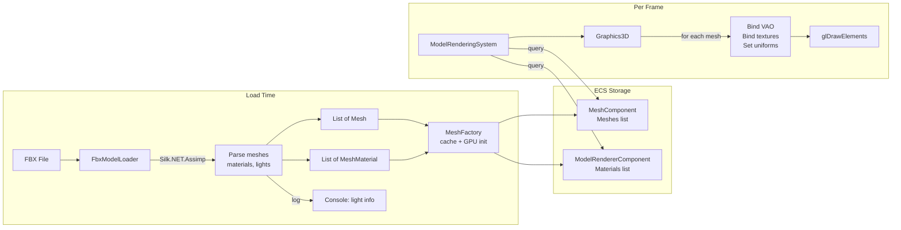

# FBX Support — Developer Guide

A step-by-step guide for implementing FBX model loading. Each step is self-contained: complete it, verify it compiles, then move on.

---

## Quick Reference

### What We're Building

Load FBX files at runtime → extract meshes + materials (diffuse/specular/normal maps) → render with upgraded Phong shader. One FBX = one entity with a list of meshes. Lights in FBX are logged, not rendered.

### Files to Create

| File | Purpose |
|---|---|
| `Engine/Renderer/MeshMaterial.cs` | Per-mesh material data (textures + shininess) |
| `Engine/Renderer/FbxModelLoader.cs` | Assimp-based FBX parser |
| `Sandbox/Sandbox3DLayer.cs` | Demo layer rendering a 3D model |
| `Sandbox/assets/shaders/OpenGL/lightingShader.vert` | Upgraded vertex shader |
| `Sandbox/assets/shaders/OpenGL/lightingShader.frag` | Upgraded fragment shader |

### Files to Modify

| File | What Changes |
|---|---|
| `Engine/Renderer/Mesh.cs` | Vertex struct gets tangent + bitangent |
| `Engine/Renderer/MeshFactory.cs` | Add `LoadModel()`, update cube tangents |
| `Engine/Renderer/IMeshFactory.cs` | Add `LoadModel()` to interface |
| `Engine/Renderer/Graphics3D.cs` | Multi-texture rendering, normal matrix |
| `Engine/Renderer/IGraphics3D.cs` | Signature cleanup |
| `Engine/Scene/Components/MeshComponent.cs` | Single mesh → list |
| `Engine/Scene/Components/ModelRendererComponent.cs` | Add materials list |
| `Engine/Scene/Systems/ModelRenderingSystem.cs` | Minor adjustment |
| `Engine/Renderer/Textures/ITextureFactory.cs` | Add default texture methods |
| `Engine/Renderer/Textures/TextureFactory.cs` | Implement default textures |
| `Engine/Platform/OpenGL/OpenGLVertexBuffer.cs` | Verify new vertex marshalling |
| `Engine/Core/DI/EngineIoCContainer.cs` | Register Assimp + loader |
| `Editor/assets/shaders/OpenGL/lightingShader.vert` | Upgraded shader |
| `Editor/assets/shaders/OpenGL/lightingShader.frag` | Upgraded shader |
| `Sandbox/Program.cs` | Wire Sandbox3DLayer |

---

## Essential Concepts

### Tangent Space & the TBN Matrix

Normal maps store surface directions in a local coordinate system called **tangent space**. To use them in world-space lighting, we need a transformation matrix built from three vectors at each vertex:

- **Tangent (T)** — points along the U texture axis
- **Bitangent (B)** — points along the V texture axis
- **Normal (N)** — points perpendicular to the surface

Together they form a 3x3 matrix (TBN) that transforms normal map values from tangent space to world space. Assimp computes tangent and bitangent for us when we request the `CalcTangentSpace` post-processing flag.

### Normal Matrix

When a mesh is scaled non-uniformly, the model matrix distorts normals. The **normal matrix** (inverse-transpose of the model matrix) corrects this. Compute it on the CPU and pass it to the shader as a uniform.

```
normalMatrix = transpose(inverse(modelMatrix))
```

### Texture Slots

The GPU can bind multiple textures simultaneously. Each is assigned a numbered slot. The shader uses sampler uniforms (integers) to know which slot holds which map:

| Slot | Map | Sampler Uniform |
|------|-----|-----------------|
| 0 | Diffuse | `u_DiffuseMap` |
| 1 | Specular | `u_SpecularMap` |
| 2 | Normal | `u_NormalMap` |

---

## Step 1: Extend the Vertex Struct

**File:** `Engine/Renderer/Mesh.cs`

Add `Tangent` and `Bitangent` fields to the `Vertex` record struct.

**Before:**
```
record struct Vertex(Vector3 Position, Vector3 Normal, Vector2 TexCoord, int EntityId = -1)
    GetSize() => sizeof(float) * (3 + 3 + 2) + sizeof(int)  // 36 bytes
```

**After:**
```
record struct Vertex(
    Vector3 Position,
    Vector3 Normal,
    Vector2 TexCoord,
    Vector3 Tangent,
    Vector3 Bitangent,
    int EntityId = -1)
    GetSize() => sizeof(float) * (3 + 3 + 2 + 3 + 3) + sizeof(int)  // 60 bytes
```

Update the `BufferLayout` in `Initialize()`:

```
BufferLayout = [
    Float3  "a_Position",
    Float3  "a_Normal",
    Float2  "a_TexCoord",
    Float3  "a_Tangent",      // NEW
    Float3  "a_Bitangent",    // NEW
    Int     "a_EntityID"
]
```

Also update `Mesh.Bind()` — remove the `DiffuseTexture.Bind()` call. Texture binding moves to `Graphics3D`. The `DiffuseTexture` field can be removed from `Mesh` entirely.

**Verify:** `dotnet build` compiles (expect errors in MeshFactory cube — fixed in Step 3).

---

## Step 2: Update OpenGLVertexBuffer

**File:** `Engine/Platform/OpenGL/OpenGLVertexBuffer.cs`

The `SetMeshData(List<Mesh.Vertex>, int)` method marshals vertex data to GPU memory. Since `Mesh.Vertex` is a `record struct`, verify the marshalling uses `Vertex.GetSize()` or `sizeof` correctly and handles the new 60-byte stride.

Check that the implementation uses `CollectionsMarshal.AsSpan()` or manual pinning. The struct layout change should propagate automatically if the marshalling is size-agnostic.

**Verify:** No compile errors related to vertex buffer.

---

## Step 3: Update CreateCube in MeshFactory

**File:** `Engine/Renderer/MeshFactory.cs`

Every `new Mesh.Vertex(...)` call now needs tangent and bitangent. For axis-aligned cube faces:

| Face | Normal | Tangent | Bitangent |
|---|---|---|---|
| Front (+Z) | (0,0,1) | (1,0,0) | (0,1,0) |
| Back (-Z) | (0,0,-1) | (-1,0,0) | (0,1,0) |
| Top (+Y) | (0,1,0) | (1,0,0) | (0,0,-1) |
| Bottom (-Y) | (0,-1,0) | (1,0,0) | (0,0,1) |
| Right (+X) | (1,0,0) | (0,0,-1) | (0,1,0) |
| Left (-X) | (-1,0,0) | (0,0,1) | (0,1,0) |

Example for one front-face vertex:
```
new Mesh.Vertex(
    Position:  new Vector3(-0.5f, -0.5f, 0.5f),
    Normal:    Vector3.UnitZ,
    TexCoord:  new Vector2(0.0f, 0.0f),
    Tangent:   Vector3.UnitX,
    Bitangent: Vector3.UnitY)
```

**Verify:** `dotnet build` succeeds. Run Sandbox — existing 2D rendering still works (cube is only used for light visualization).

---

## Step 4: Create MeshMaterial

**File:** `Engine/Renderer/MeshMaterial.cs` (new)

A plain data class holding per-mesh material properties:

```
Properties:
    DiffuseTexture:  Texture2D?         [JsonIgnore]
    SpecularTexture: Texture2D?         [JsonIgnore]
    NormalTexture:   Texture2D?         [JsonIgnore]
    Shininess:       float = 32.0f

    DiffuseTexturePath:  string?        (for serialization)
    SpecularTexturePath: string?        (for serialization)
    NormalTexturePath:   string?        (for serialization)

Computed:
    HasDiffuseMap  → DiffuseTexture != null
    HasSpecularMap → SpecularTexture != null
    HasNormalMap   → NormalTexture != null
```

**Verify:** `dotnet build` succeeds.

---

## Step 5: Add Default Textures to TextureFactory

**File:** `Engine/Renderer/Textures/ITextureFactory.cs` — add methods:
```
Texture2D GetBlackTexture();
Texture2D GetFlatNormalTexture();
```

**File:** `Engine/Renderer/Textures/TextureFactory.cs` — implement as lazy singletons (same pattern as `GetWhiteTexture()`):

- **Black texture**: 1x1, RGBA = `0x000000FF` — used when no specular map
- **Flat normal texture**: 1x1, RGBA = `0x8080FFFF` (128,128,255,255) — used when no normal map. This RGB encodes a normal pointing straight out of the surface (0,0,1) in tangent space.

**Verify:** `dotnet build` succeeds.

---

## Step 6: Create FbxModelLoader

**File:** `Engine/Renderer/FbxModelLoader.cs` (new)

This is the core of the feature. It uses Silk.NET.Assimp to parse FBX files.

### Constructor Dependencies

```
FbxModelLoader(ITextureFactory textureFactory)
```

The `Silk.NET.Assimp.Assimp` API instance is obtained via `Assimp.GetApi()` — can be stored as a field or injected via DI.

### Load Method Pseudocode

```
FUNCTION Load(path: string) → FbxModelResult:
    api = Assimp.GetApi()

    flags = PostProcessSteps.Triangulate
          | PostProcessSteps.GenerateNormals
          | PostProcessSteps.CalculateTangentSpace
          | PostProcessSteps.FlipUVs

    scene = api.ImportFile(path, (uint)flags)

    IF scene is null OR scene->MRootNode is null:
        log error
        RETURN empty result

    modelDirectory = Path.GetDirectoryName(path)
    meshes = new List<Mesh>()
    materials = new List<MeshMaterial>()

    // Extract lights (log only)
    FOR i = 0 TO scene->MNumLights - 1:
        light = scene->MLights[i]
        log: name, type, position, direction, color

    // Process meshes
    FOR i = 0 TO scene->MNumMeshes - 1:
        aiMesh = scene->MMeshes[i]
        (mesh, material) = ProcessMesh(aiMesh, scene, modelDirectory)
        meshes.Add(mesh)
        materials.Add(material)

    api.ReleaseImport(scene)

    RETURN new FbxModelResult(meshes, materials, modelDirectory)
```

### ProcessMesh Pseudocode

```
FUNCTION ProcessMesh(aiMesh, scene, modelDirectory) → (Mesh, MeshMaterial):

    mesh = new Mesh(name: Marshal.PtrToStringAnsi(aiMesh->MName.Data))

    // Extract vertices
    FOR i = 0 TO aiMesh->MNumVertices - 1:
        position  = aiMesh->MVertices[i]          // Vector3
        normal    = aiMesh->MNormals[i]            // Vector3
        tangent   = aiMesh->MTangents[i]           // Vector3
        bitangent = aiMesh->MBitangents[i]         // Vector3

        texCoord = Vector2.Zero
        IF aiMesh->MTextureCoords[0] is not null:  // first UV channel
            tc = aiMesh->MTextureCoords[0][i]
            texCoord = new Vector2(tc.X, tc.Y)

        mesh.Vertices.Add(new Vertex(position, normal, texCoord, tangent, bitangent))

    // Extract indices
    FOR i = 0 TO aiMesh->MNumFaces - 1:
        face = aiMesh->MFaces[i]
        FOR j = 0 TO face.MNumIndices - 1:
            mesh.Indices.Add(face.MIndices[j])

    // Extract material
    material = new MeshMaterial()
    IF aiMesh->MMaterialIndex >= 0:
        aiMaterial = scene->MMaterials[aiMesh->MMaterialIndex]
        material = ProcessMaterial(aiMaterial, modelDirectory)

    RETURN (mesh, material)
```

### ProcessMaterial Pseudocode

```
FUNCTION ProcessMaterial(aiMaterial, modelDirectory) → MeshMaterial:
    material = new MeshMaterial()

    // Diffuse texture
    diffusePath = GetTexturePath(aiMaterial, TextureType.Diffuse, modelDirectory)
    IF diffusePath is not null:
        material.DiffuseTexture = textureFactory.Create(diffusePath)
        material.DiffuseTexturePath = diffusePath

    // Specular texture
    specularPath = GetTexturePath(aiMaterial, TextureType.Specular, modelDirectory)
    IF specularPath is not null:
        material.SpecularTexture = textureFactory.Create(specularPath)
        material.SpecularTexturePath = specularPath

    // Normal texture (try Normals first, then Height as fallback)
    normalPath = GetTexturePath(aiMaterial, TextureType.Normals, modelDirectory)
              ?? GetTexturePath(aiMaterial, TextureType.Height, modelDirectory)
    IF normalPath is not null:
        material.NormalTexture = textureFactory.Create(normalPath)
        material.NormalTexturePath = normalPath

    // Shininess
    material.Shininess = GetMaterialFloat(aiMaterial, "shininess", default: 32.0f)

    RETURN material
```

### GetTexturePath Pseudocode

```
FUNCTION GetTexturePath(aiMaterial, type, modelDirectory) → string?:
    // Use Assimp API to get texture count for this type
    count = api.GetMaterialTextureCount(aiMaterial, type)
    IF count == 0: RETURN null

    // Get the first texture path
    api.GetMaterialTexture(aiMaterial, type, index: 0, out path, ...)

    // Resolve: strip to filename, look in model directory
    filename = Path.GetFileName(path)
    resolved = Path.Combine(modelDirectory, filename)

    IF File.Exists(resolved):
        RETURN resolved
    ELSE:
        log warning: "Texture not found: {resolved}"
        RETURN null
```

### Important: Silk.NET.Assimp is Unsafe

All Assimp structs are accessed via pointers (`Scene*`, `Mesh*`, `Material*`). The entire `Load` method should be in an `unsafe` block. Always check for null pointers before dereferencing. Always call `ReleaseImport` in a `finally` block.

**Verify:** `dotnet build` succeeds.

---

## Step 7: Update MeshFactory

**File:** `Engine/Renderer/IMeshFactory.cs` — add:
```
(List<Mesh> Meshes, List<MeshMaterial> Materials) LoadModel(string path);
```

**File:** `Engine/Renderer/MeshFactory.cs`:

1. Add `FbxModelLoader` to primary constructor dependencies
2. Add cache: `Dictionary<string, (List<Mesh>, List<MeshMaterial>)> _loadedModels`
3. Implement `LoadModel`:

```
FUNCTION LoadModel(path) → (List<Mesh>, List<MeshMaterial>):
    IF _loadedModels.TryGetValue(path, out cached):
        RETURN cached

    result = _fbxModelLoader.Load(path)

    FOR each mesh IN result.Meshes:
        mesh.Initialize(vertexArrayFactory, vertexBufferFactory, indexBufferFactory)

    entry = (result.Meshes, result.Materials)
    _loadedModels[path] = entry
    RETURN entry
```

4. Update `Dispose()` and `Clear()` to handle `_loadedModels`

**Verify:** `dotnet build` succeeds.

---

## Step 8: Update MeshComponent

**File:** `Engine/Scene/Components/MeshComponent.cs`

Replace single mesh with a list:

```
Before:
    MeshPath: string?
    Mesh: Mesh?                    [JsonIgnore]

After:
    ModelPath: string?
    Meshes: List<Mesh> = []        [JsonIgnore]
```

Update methods:
- `SetMesh(mesh, path)` → `SetModel(List<Mesh> meshes, string? modelPath)`
- `Clone()` — copy list reference (meshes are shared GPU resources)

**Verify:** Compile errors in `ModelRenderingSystem` and `Graphics3D` — expected, fixed in later steps.

---

## Step 9: Update ModelRendererComponent

**File:** `Engine/Scene/Components/ModelRendererComponent.cs`

Add materials list, remove single-texture override:

```
Remove:
    OverrideTexture: Texture2D?        [JsonIgnore]
    OverrideTexturePath: string?

Add:
    Materials: List<MeshMaterial> = []
```

Keep: `Color`, `CastShadows`, `ReceiveShadows`.

Update `Clone()` — shallow-copy the materials list.

**Verify:** Compile errors in `Graphics3D` — expected, fixed next.

---

## Step 10: Rewrite Lighting Shaders

Replace both vertex and fragment shaders. These go in **both** `Editor/assets/shaders/OpenGL/` and `Sandbox/assets/shaders/OpenGL/`.

### Vertex Shader (`lightingShader.vert`)

```glsl
#version 330 core

layout(location = 0) in vec3 a_Position;
layout(location = 1) in vec3 a_Normal;
layout(location = 2) in vec2 a_TexCoord;
layout(location = 3) in vec3 a_Tangent;
layout(location = 4) in vec3 a_Bitangent;
layout(location = 5) in int  a_EntityID;

uniform mat4 u_ViewProjection;
uniform mat4 u_Model;
uniform mat4 u_NormalMatrix;

out vec3 v_Position;
out vec2 v_TexCoord;
out mat3 v_TBN;
flat out int v_EntityID;

void main()
{
    vec4 worldPos = vec4(a_Position, 1.0) * u_Model;
    v_Position = worldPos.xyz;
    v_TexCoord = a_TexCoord;

    vec3 T = normalize(vec3(vec4(a_Tangent,   0.0) * u_NormalMatrix));
    vec3 B = normalize(vec3(vec4(a_Bitangent, 0.0) * u_NormalMatrix));
    vec3 N = normalize(vec3(vec4(a_Normal,    0.0) * u_NormalMatrix));
    v_TBN = mat3(T, B, N);

    v_EntityID = a_EntityID;
    gl_Position = worldPos * u_ViewProjection;
}
```

### Fragment Shader (`lightingShader.frag`)

```glsl
#version 330 core

layout(location = 0) out vec4 o_Color;
layout(location = 1) out int  o_EntityID;

in vec3 v_Position;
in vec2 v_TexCoord;
in mat3 v_TBN;
flat in int v_EntityID;

uniform sampler2D u_DiffuseMap;
uniform sampler2D u_SpecularMap;
uniform sampler2D u_NormalMap;

uniform int u_HasDiffuseMap;
uniform int u_HasSpecularMap;
uniform int u_HasNormalMap;

uniform vec3 u_LightPosition;
uniform vec3 u_LightColor;
uniform vec3 u_ViewPosition;
uniform vec4 u_Color;
uniform float u_Shininess;

void main()
{
    // Normal
    vec3 normal;
    if (u_HasNormalMap == 1)
    {
        normal = texture(u_NormalMap, v_TexCoord).rgb * 2.0 - 1.0;
        normal = normalize(v_TBN * normal);
    }
    else
    {
        normal = normalize(v_TBN[2]);
    }

    // Base color
    vec4 baseColor = (u_HasDiffuseMap == 1)
        ? texture(u_DiffuseMap, v_TexCoord) * u_Color
        : u_Color;

    // Specular intensity
    float specIntensity = (u_HasSpecularMap == 1)
        ? texture(u_SpecularMap, v_TexCoord).r
        : 0.5;

    // Phong lighting
    float ambientStrength = 0.1;
    vec3 ambient = ambientStrength * u_LightColor;

    vec3 lightDir = normalize(u_LightPosition - v_Position);
    float diff = max(dot(normal, lightDir), 0.0);
    vec3 diffuse = diff * u_LightColor;

    vec3 viewDir = normalize(u_ViewPosition - v_Position);
    vec3 reflectDir = reflect(-lightDir, normal);
    float spec = pow(max(dot(viewDir, reflectDir), 0.0), u_Shininess);
    vec3 specular = specIntensity * spec * u_LightColor;

    vec3 result = (ambient + diffuse + specular) * baseColor.rgb;
    o_Color = vec4(result, baseColor.a);
    o_EntityID = v_EntityID;
}
```

**Verify:** Files saved. Shader correctness verified at runtime.

---

## Step 11: Update Graphics3D

**File:** `Engine/Renderer/Graphics3D.cs`

### Init() — Add sampler uniforms and default textures

```
Init():
    // ... existing shader loading ...
    _meshShader.Bind()
    _meshShader.SetInt("u_DiffuseMap", 0)
    _meshShader.SetInt("u_SpecularMap", 1)
    _meshShader.SetInt("u_NormalMap", 2)
    _meshShader.Unbind()

    // Store default textures for fallback
    _whiteTexture = textureFactory.GetWhiteTexture()
    _blackTexture = textureFactory.GetBlackTexture()
    _flatNormalTexture = textureFactory.GetFlatNormalTexture()
```

Add `ITextureFactory` to the constructor dependencies.

### DrawModel() — Multi-mesh with materials

```
DrawModel(transform, meshComponent, modelRenderer, entityId):
    meshes = meshComponent.Meshes
    materials = modelRenderer.Materials
    IF meshes.Count == 0: RETURN

    // Normal matrix (once per entity)
    IF Matrix4x4.Invert(transform, out inverse):
        normalMatrix = Matrix4x4.Transpose(inverse)
    ELSE:
        normalMatrix = Matrix4x4.Identity

    _meshShader.Bind()
    _meshShader.SetMat4("u_Model", transform)
    _meshShader.SetMat4("u_NormalMatrix", normalMatrix)
    _meshShader.SetFloat4("u_Color", modelRenderer.Color)

    FOR i = 0 TO meshes.Count - 1:
        mesh = meshes[i]
        material = (i < materials.Count) ? materials[i] : defaultMaterial

        _meshShader.SetFloat("u_Shininess", material.Shininess)
        _meshShader.SetInt("u_HasDiffuseMap", material.HasDiffuseMap ? 1 : 0)
        _meshShader.SetInt("u_HasSpecularMap", material.HasSpecularMap ? 1 : 0)
        _meshShader.SetInt("u_HasNormalMap", material.HasNormalMap ? 1 : 0)

        // Bind textures (use defaults for missing maps)
        (material.DiffuseTexture ?? _whiteTexture).Bind(0)
        (material.SpecularTexture ?? _blackTexture).Bind(1)
        (material.NormalTexture ?? _flatNormalTexture).Bind(2)

        mesh.Bind()
        rendererApi.DrawIndexed(mesh.GetVertexArray(), (uint)mesh.GetIndexCount())
        _stats.DrawCalls++
```

### BeginScene() — Use Vector4 for color

Update the `u_Color` uniform from `SetFloat3` to `SetFloat4` (or set it per-mesh in DrawModel, which is what the above pseudocode does).

**Verify:** `dotnet build` succeeds.

---

## Step 12: Update ModelRenderingSystem

**File:** `Engine/Scene/Systems/ModelRenderingSystem.cs`

Minimal change. The system still queries `MeshComponent` entities and calls `DrawModel`. The multi-mesh loop is inside `Graphics3D.DrawModel()`.

Verify that `entity.GetComponent<ModelRendererComponent>()` still works with the updated component.

**Verify:** `dotnet build` succeeds.

---

## Step 13: DI Registration

**File:** `Engine/Core/DI/EngineIoCContainer.cs`

Add to `Register()`:

```
container.Register<FbxModelLoader>(Reuse.Singleton);
```

If `FbxModelLoader` takes `Silk.NET.Assimp.Assimp` as a constructor parameter, also register it:

```
container.RegisterDelegate<Silk.NET.Assimp.Assimp>(
    _ => Silk.NET.Assimp.Assimp.GetApi(), Reuse.Singleton);
```

Alternatively, `FbxModelLoader` can call `Assimp.GetApi()` internally and skip the DI registration.

**Verify:** `dotnet build` succeeds.

---

## Step 14: Create Sandbox3DLayer

**File:** `Sandbox/Sandbox3DLayer.cs` (new)

A new `ILayer` implementation that:

1. Creates an `EditorCamera`
2. Loads an FBX model via `IMeshFactory.LoadModel()`
3. Sets up light position and color
4. Renders all meshes each frame

### Required constructor dependencies:
- `IGraphics3D`
- `IMeshFactory`

### OnAttach:
- Create camera
- Call `meshFactory.LoadModel("assets/models/your-model.fbx")`
- Store the returned meshes and materials
- Set light: `graphics3D.SetLightPosition(new Vector3(2, 5, 3))`

### OnUpdate:
- Clear screen
- `graphics3D.BeginScene(camera)`
- For each mesh/material pair: `graphics3D.DrawMesh(transform, mesh, material)`
  Or: create an entity with MeshComponent + ModelRendererComponent and let the system handle it
- `graphics3D.EndScene()`

### HandleInputEvent:
- Mouse scroll → camera zoom

### HandleWindowEvent:
- Resize → camera viewport

**Verify:** `dotnet build` succeeds.

---

## Step 15: Wire Up Sandbox

**File:** `Sandbox/Program.cs`

Change the layer registration:

```
// Replace:
container.Register<ILayer, Sandbox2DLayer>(Reuse.Singleton);

// With:
container.Register<ILayer, Sandbox3DLayer>(Reuse.Singleton);
```

### Prepare Assets

Create `Sandbox/assets/models/` directory. Place an FBX file with its textures:

```
Sandbox/assets/models/
├── example.fbx
├── diffuse.png
├── specular.png     (optional)
└── normal.png       (optional)
```

The `Sandbox.csproj` already copies `assets/**/*.*` to the output directory.

Also ensure `lightingShader.vert` and `lightingShader.frag` are in `Sandbox/assets/shaders/OpenGL/` and listed in the `.csproj` for copy.

---

## Step 16: End-to-End Verification

```bash
# 1. Build — must have zero warnings
dotnet build

# 2. Tests — all must pass
dotnet test

# 3. Run Sandbox
cd Sandbox && dotnet run
```

**Expected result:** A 3D model renders in the Sandbox window with:
- Diffuse texture visible (base color from the texture)
- Specular highlights responding to the light position
- Normal map detail visible (if the model has a normal map) — subtle lighting variations on flat surfaces
- Camera zoom works via mouse scroll
- Console shows logged light data from the FBX file (if any lights exist)

### Troubleshooting

| Symptom | Likely Cause |
|---|---|
| Black screen | Shader compile error — check console for GLSL errors |
| Model renders but no texture | Texture path resolution failed — check logs for "Texture not found" |
| Lighting looks flat/wrong | Normal matrix not being set, or TBN matrix issue |
| Normals appear inverted | Normal map uses DirectX convention (Y flipped) — negate Y in shader |
| Crash on load | Assimp null pointer — add null checks on all `scene->` accesses |
| Model doesn't appear | Transform too large/small — try scaling; check camera looks at origin |

---

## Architecture Diagram


