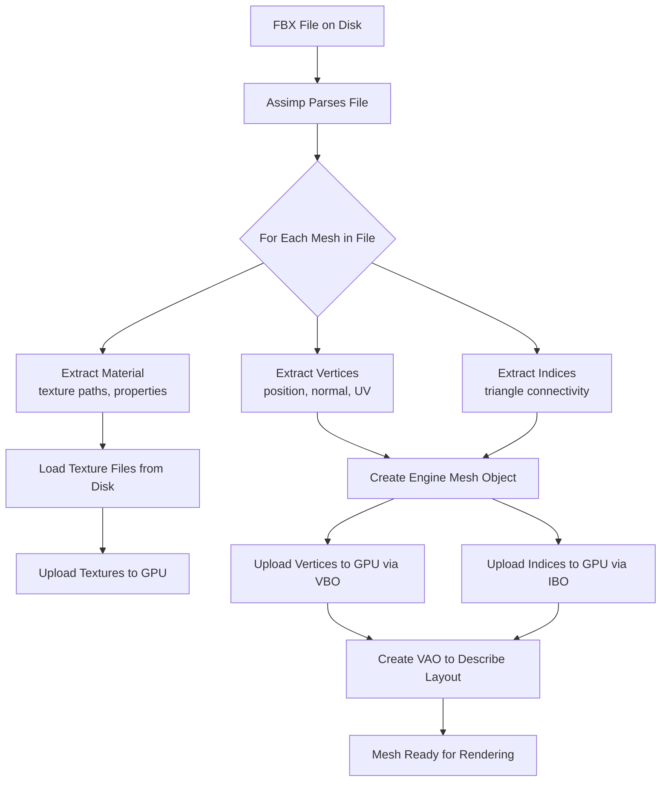
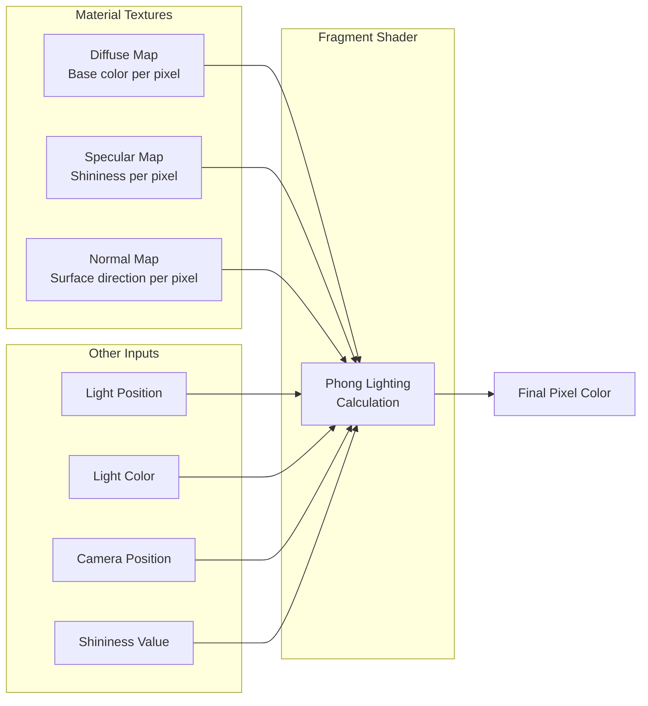
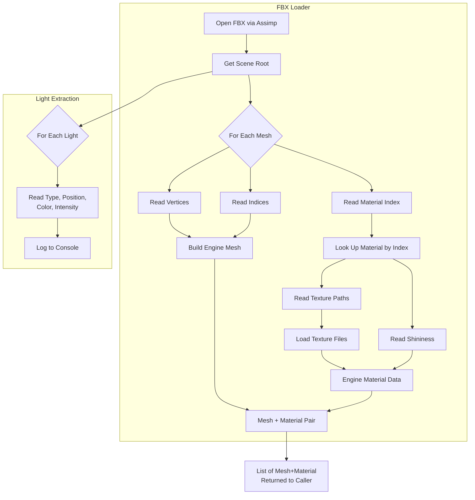
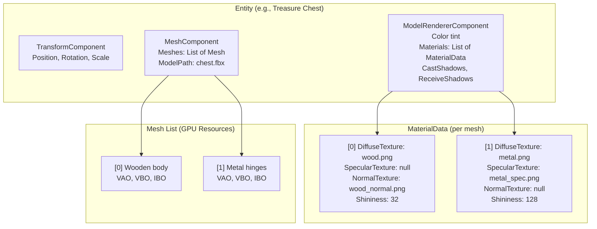
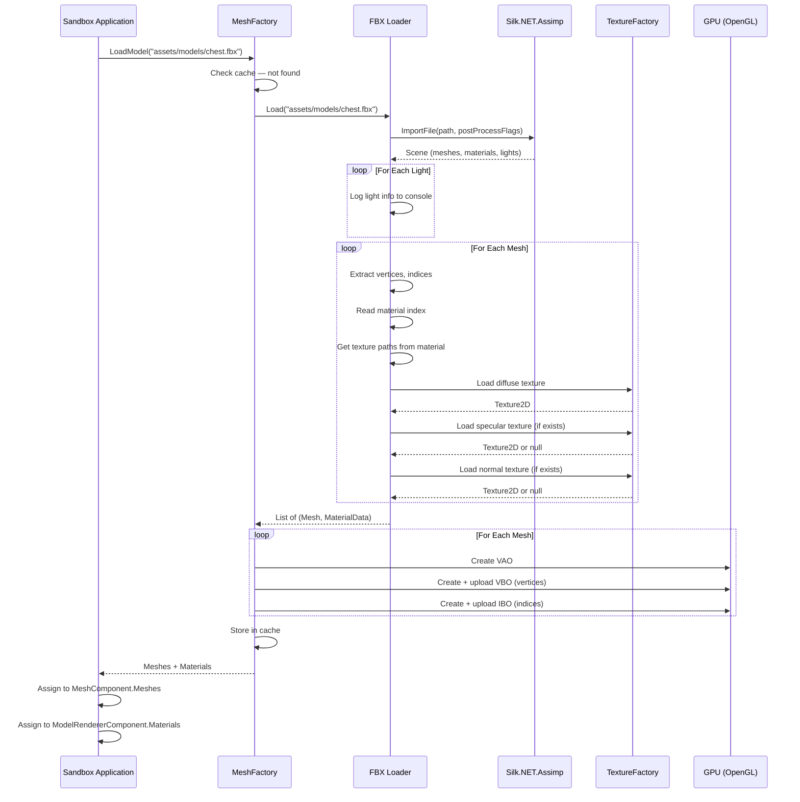
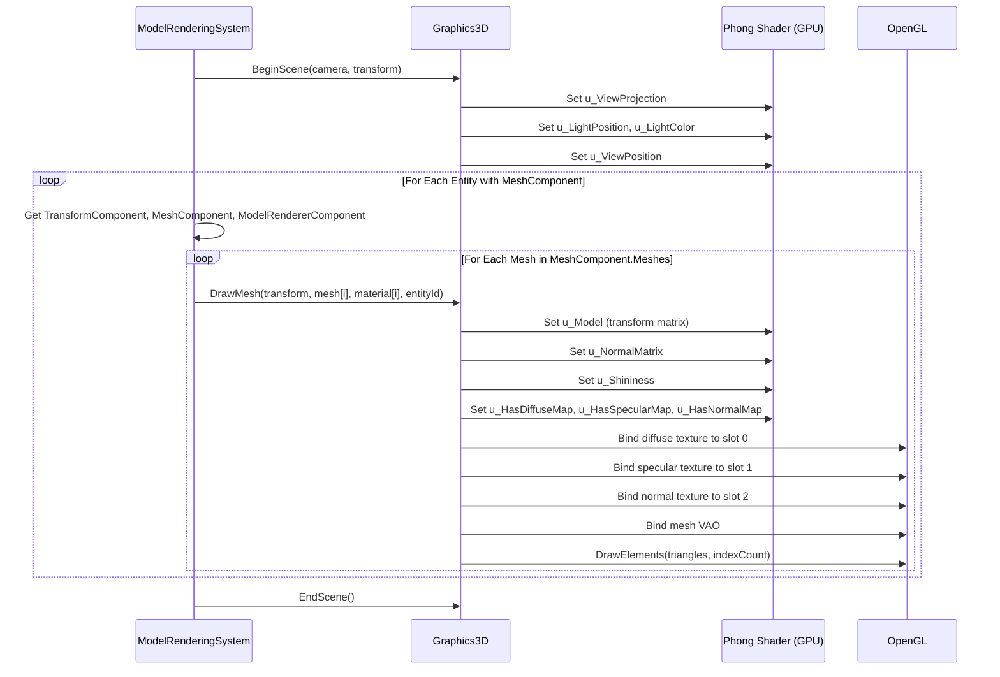

# FBX Support — Specification

## Table of Contents

- [1. What is FBX?](#1-what-is-fbx)
- [2. What We're Building](#2-what-were-building)
- [3. Terminology](#3-terminology)
- [4. How 3D Models Work](#4-how-3d-models-work)
- [5. Material System Concepts](#5-material-system-concepts)
- [6. Architecture Overview](#6-architecture-overview)
- [7. Data Flow](#7-data-flow)
- [8. Key Design Decisions](#8-key-design-decisions)

---

## 1. What is FBX?

FBX (Filmbox) is a file format created by Autodesk for exchanging 3D content between different software tools. When an artist creates a 3D character in Blender, Maya, or 3ds Max, they need a way to move that work into a game engine. FBX is one of the most common formats for doing this.

An FBX file is a container — a single file that can hold many types of 3D data:

| Data Type | Description |
|---|---|
| **Meshes** | The 3D shapes — characters, buildings, props |
| **Materials** | Surface appearance — color, shininess, roughness |
| **Textures** | Image files referenced by materials — brick patterns, skin details |
| **Lights** | Light sources placed in the 3D scene by the artist |
| **Cameras** | Viewpoints defined in the 3D scene |
| **Animations** | Movement data — walk cycles, facial expressions |
| **Scene hierarchy** | How objects are organized and parented to each other |

Think of FBX like a ZIP file for 3D content — it bundles everything an artist created into one portable package.

### Why FBX Specifically?

FBX is the most widely supported format on asset stores (Unity Asset Store, Sketchfab, TurboSquid). When you download a 3D model pack, it almost always includes FBX files. Supporting FBX means access to a massive library of ready-made content.

### How Our Engine Reads FBX

We do not parse FBX files ourselves. FBX is a complex proprietary format with multiple encoding versions (binary and ASCII). Instead, we use a library called **Assimp** (Open Asset Import Library) that handles the parsing for us. Assimp reads the FBX file and presents the data in a standardized structure that our engine can work with. Our engine uses **Silk.NET.Assimp**, which provides C# bindings to the native Assimp library.

---

## 2. What We're Building

### In Scope

| Feature | Details |
|---|---|
| **Static mesh loading** | Load 3D geometry (vertices, triangles) from FBX files at runtime |
| **Multi-mesh models** | A single FBX file can contain multiple meshes — load all of them as one unit |
| **External texture references** | Load texture images (`.png`, `.jpg`) that the FBX file points to |
| **Multi-texture materials** | Support diffuse, specular, and normal texture maps per mesh |
| **Light extraction** | Read light data from FBX files and log it to the console |
| **Phong shader upgrade** | Upgrade the engine's 3D shader to support texture mapping and multiple map types |
| **Sandbox demo** | A working demo in the Sandbox project that loads and renders an FBX model |

### Out of Scope

| Feature | Why Excluded |
|---|---|
| Skeletal animation | Requires bone systems, skinning — separate large feature |
| Morph targets / blend shapes | Requires vertex animation infrastructure |
| Scene hierarchy | Would need parent-child entity relationships |
| Cameras from FBX | Engine has its own camera system |
| Embedded textures | Only external file references are supported |
| Editor integration | No inspector panels, preview widgets, or import dialogs |
| Asset import pipeline | Models load directly at runtime, no conversion step |

---

## 3. Terminology

This section defines every technical term used in this document. Each concept builds on the ones before it.

### Geometry Terms

**Vertex** (plural: vertices)
A single point in 3D space. A vertex is not just a position — it carries additional data that describes the surface at that point. In our engine, each vertex contains:

- **Position** — Where the point sits in 3D space (X, Y, Z)
- **Normal** — Which direction the surface faces at this point (used for lighting)
- **Texture coordinate (UV)** — Where on a 2D image this point maps to

**Index**
A number that refers to a vertex by its position in the vertex list. Instead of repeating vertex data for shared corners, we list each unique vertex once and then use indices to say "triangle 1 uses vertices 0, 1, 2; triangle 2 uses vertices 2, 1, 3." This saves memory significantly.

**Triangle**
The basic building block of all 3D shapes. Three vertices connected by edges form a triangle. Every 3D model, no matter how complex, is made entirely of triangles. A cube needs 12 triangles (2 per face × 6 faces). A detailed character model might use tens of thousands.

**Mesh**
A collection of vertices and indices that together form a 3D shape. A single mesh uses one material. If a character has a metal sword and a cloth cape, those would typically be separate meshes because they need different materials.

**Model**
A complete 3D object loaded from a file. A model can contain multiple meshes. For example, a car model might contain separate meshes for the body, windows, wheels, and interior — each with its own material.

### Surface & Appearance Terms

**Normal Vector**
A direction that points straight out from a surface. Imagine sticking a pin perpendicular to a wall — the pin points in the normal direction. Normals tell the rendering system which way a surface faces, which determines how light bounces off it. Without normals, a sphere would look like a flat circle.

**UV Coordinates**
A pair of numbers (U, V) that map a point on a 3D surface to a point on a 2D image. Think of it like gift wrapping — UV coordinates describe how to unfold a 3D shape and lay it flat so that a 2D image (texture) can be painted onto it. U is the horizontal axis (0.0 = left, 1.0 = right), V is the vertical axis (0.0 = bottom, 1.0 = top).

```
Texture Image (2D)              3D Triangle
┌──────────────┐                    /\
│  U=0   U=1   │                   /  \
│  ┌─────┐     │      maps to     /    \
│  │ .   │     │   ──────────>   / .    \
│  │  \  │     │                /________\
│  │   . │     │
│  └─────┘     │
└──────────────┘
  V=0    V=1
```

**Texture**
A 2D image that gets painted onto a 3D surface using UV coordinates. Textures add visual detail without adding more triangles. A flat wall with a brick texture looks like a brick wall, even though geometrically it is still perfectly flat.

**Material**
A collection of properties that describe how a surface looks and reacts to light. A material typically includes:

- One or more textures (color, shininess, surface detail)
- Numeric properties (how shiny, how transparent)
- Shader settings (which rendering algorithm to use)

Materials are what make a metal barrel look different from a wooden crate, even if both have the same shape.

### Texture Map Types

A single material can use multiple textures, each serving a different purpose:

**Diffuse Map** (also called albedo or color map)
The base color of a surface. This is what you would see if you lit the object with perfectly even light from all directions. A brick wall's diffuse map is a photograph of bricks. A character's diffuse map contains their skin color, clothing colors, and painted details.

**Specular Map**
Controls how shiny each part of a surface is. Bright areas on the specular map are shiny (like metal or wet surfaces), dark areas are matte (like cloth or rubber). This is a grayscale image where white = maximum shine and black = no shine. Without a specular map, the entire surface has uniform shininess, which looks unnatural.

```
Diffuse Map              Specular Map             Combined Result
┌──────────────┐        ┌──────────────┐        ┌──────────────┐
│ ████  Brown   │        │ ░░░░  Dark   │        │ Matte wood   │
│ ████  wood    │   +    │ ░░░░  (matte)│   =    │ with shiny   │
│ ▓▓▓▓  Metal   │        │ ████  Bright │        │ metal parts  │
│ ▓▓▓▓  handle  │        │ ████  (shiny)│        │              │
└──────────────┘        └──────────────┘        └──────────────┘
```

**Normal Map**
Fakes surface detail without adding geometry. A normal map is a special texture where the RGB color values represent surface directions (normals) instead of colors. This creates the illusion of bumps, dents, scratches, and grooves. A flat wall with a brick normal map will have visible mortar lines and brick edges that catch light realistically — even though the geometry is still a flat rectangle.

```
Flat surface + Normal map = Apparent detail

Geometry:    ─────────────────  (flat)
Normal map:  ╱╲╱╲╱╲╱╲╱╲╱╲╱╲   (encoded directions)
Looks like:  ∿∿∿∿∿∿∿∿∿∿∿∿∿∿∿  (bumpy surface)
```

Normal maps are typically blue-purple images because the blue channel (Z) represents "pointing straight out" which is the default direction for most of the surface.

### Lighting Terms

**Phong Lighting Model**
A mathematical model for calculating how light interacts with a surface. It combines three components:

1. **Ambient** — A small constant amount of light everywhere. Simulates indirect light bouncing around a room. Without ambient, shadows would be completely black.
2. **Diffuse** — Light that scatters evenly when it hits a surface. This is the main source of visible color. Surfaces facing the light are bright; surfaces facing away are dark.
3. **Specular** — Bright highlights that appear when light reflects directly toward the viewer. Think of the bright spot on a billiard ball. The shininess value controls how tight or spread-out this highlight is.

```
        Light Source
            │
            ▼
    ┌───────────────┐
    │   Ambient     │  Constant low-level illumination (everywhere)
    │ + Diffuse     │  Depends on angle between surface and light
    │ + Specular    │  Bright highlight, depends on viewer position
    │ = Final Color │
    └───────────────┘
```

**Shininess**
A number that controls how focused the specular highlight is. Low values (like 8) create a wide, blurry highlight (like plastic). High values (like 256) create a tiny, sharp highlight (like polished metal).

### GPU Terms

These terms describe how 3D data is stored on the graphics card (GPU) for fast rendering.

**Vertex Buffer Object (VBO)**
A block of GPU memory that holds vertex data (positions, normals, UVs). Uploading vertex data to the GPU once and reusing it every frame is much faster than sending it from CPU memory each frame.

**Index Buffer Object (IBO)**
A block of GPU memory that holds index data. Tells the GPU which vertices to connect into triangles.

**Vertex Array Object (VAO)**
A container that remembers how a VBO is structured. It stores the layout information: "bytes 0-11 are the position, bytes 12-23 are the normal, bytes 24-31 are the UV coordinate." When rendering, binding a VAO automatically sets up all the vertex data interpretation.

**Shader**
A small program that runs on the GPU. Shaders control how vertices are positioned on screen (vertex shader) and what color each pixel is (fragment shader). Our Phong lighting calculations happen inside the fragment shader.

```
Vertex Data (VBO)          Vertex Shader           Fragment Shader         Screen
┌──────────────┐          ┌──────────┐           ┌──────────────┐       ┌─────────┐
│ Position     │          │ Transform│           │ Phong        │       │         │
│ Normal       │────────> │ to screen│────────>  │ lighting     │──────>│  Pixels │
│ UV           │          │ coords   │           │ + textures   │       │         │
└──────────────┘          └──────────┘           └──────────────┘       └─────────┘
```

**Uniform**
A value sent from the CPU to a shader that stays the same for all vertices/pixels in a single draw call. Examples: the camera position, light color, model transformation matrix. Unlike vertex data which changes per-vertex, uniforms are "uniform" across the entire mesh.

---

## 4. How 3D Models Work

This section explains the journey from an artist's creation to pixels on screen.

### From Artist to File

A 3D artist works in software like Blender or Maya. They sculpt shapes, paint textures, and set up materials. When they export to FBX, the software converts their work into structured data:

- Every visible surface is broken into triangles
- Each triangle corner becomes a vertex with position, normal, and UV
- Textures are saved as separate image files alongside the FBX
- Material settings (shininess, which textures to use) are stored inside the FBX

### From File to Memory

When our engine loads an FBX file, it goes through these steps:



### From Memory to Screen

Every frame (typically 60 times per second), the engine renders all visible models:

1. **Bind the shader** — Tell the GPU which rendering program to use
2. **Set uniforms** — Send camera position, light data, and transformation matrix
3. **Bind the mesh** — Point the GPU to the correct VAO (which automatically references the VBO and IBO)
4. **Bind textures** — Activate the diffuse, specular, and normal map textures
5. **Draw call** — Tell the GPU to render all triangles defined by the index buffer
6. **Repeat** — Do this for every mesh of every visible entity

### Multi-Mesh Models

A single FBX file often contains multiple meshes. Consider a treasure chest model:

```
Treasure Chest (FBX file)
├── Mesh 0: Wooden body    → Material: wood diffuse + wood normal
├── Mesh 1: Metal hinges   → Material: metal diffuse + metal specular
└── Mesh 2: Gold trim      → Material: gold diffuse + gold specular + gold normal
```

Each mesh has its own material, and each material can have its own set of textures. During rendering, the engine draws each mesh separately with its own material bound. In our engine, all of these meshes belong to a single entity — they are stored as a list within one component.

---

## 5. Material System Concepts

### What Materials Represent

In the real world, when light hits a surface, what happens depends on the material. A mirror reflects light sharply. A cotton shirt scatters light softly. A ruby lets some light pass through while tinting it red.

In a game engine, a material is a simplified model of these physical interactions. Our engine uses the Phong model, which breaks light interaction into three phenomena: ambient, diffuse, and specular (defined in the terminology section).

### How Texture Maps Feed the Shader

The shader is a program running on the GPU that computes the final color of each pixel. Texture maps provide per-pixel input data to this computation:



**Without texture maps** — Every pixel on a mesh has the same color, same shininess, same surface direction. The object looks like smooth plastic.

**With a diffuse map** — Each pixel gets its own color from the image. The object has painted-on detail.

**With a diffuse + specular map** — Each pixel has its own color AND its own shininess level. Metal parts shine, cloth parts don't.

**With all three maps** — Each pixel has its own color, shininess, AND surface direction. Light catches tiny bumps and grooves that don't exist in the geometry. This is the most realistic combination our engine will support.

### Normal Map Details

Normal maps deserve extra explanation because they modify how lighting is calculated.

Normally, the "normal" (surface direction) at each pixel is interpolated from the vertex normals. This makes curved surfaces look smooth, but flat surfaces remain perfectly flat.

A normal map overrides the interpolated normal with a per-pixel value read from a texture. The shader reads the RGB value at each pixel and interprets it as a direction vector:

- **R** (red channel) → X direction (left/right tilt)
- **G** (green channel) → Y direction (up/down tilt)
- **B** (blue channel) → Z direction (how much it points "outward")

This requires a coordinate system called **tangent space** — a local frame of reference at each point on the surface. The tangent and bitangent vectors, combined with the normal, form a 3×3 matrix (the TBN matrix) that transforms the normal map's directions from texture space into world space where lighting calculations happen.

```
Tangent Space at a surface point:

          Normal (N)
            ↑
            │
            │
            ├──────→ Tangent (T)
           ╱
          ╱
         ↙
    Bitangent (B)
```

For normal mapping to work, each vertex must carry two additional vectors: the tangent and the bitangent. These can be computed automatically from the vertex positions and UV coordinates.

### Texture Slots

The GPU can have multiple textures active simultaneously, each assigned to a numbered "slot" (also called a texture unit). The shader knows which slot each map type is in:

| Slot | Purpose | Shader Uniform |
|------|---------|----------------|
| 0 | Diffuse map | `u_DiffuseMap` |
| 1 | Specular map | `u_SpecularMap` |
| 2 | Normal map | `u_NormalMap` |

If a material does not have a particular map (e.g., no normal map), the shader uses a sensible default: a white texture for diffuse (full brightness), a black texture for specular (no shine), and a flat-blue texture for normals (surface unchanged).

---

## 6. Architecture Overview

This section describes how FBX loading integrates into the existing engine architecture.

### Current State

The engine currently supports:
- A `Mesh` class that holds vertex/index data and GPU buffers
- A `MeshComponent` that attaches a Mesh to an ECS entity
- A `ModelRendererComponent` that holds color tint and a single optional texture override
- A `MeshFactory` that can only create procedural cubes
- A `Graphics3D` renderer with basic Phong lighting (no texture coordinates in the shader)
- A `ModelRenderingSystem` that queries entities and draws them
- `Silk.NET.Assimp` NuGet package (already referenced, but no loader implemented)

### What Changes

#### 6.1 FBX Loader (New)

A new class responsible for using Silk.NET.Assimp to open FBX files and extract mesh, material, and light data. This is the bridge between the file format and our engine types.

The loader:
- Opens the FBX file via Assimp
- Iterates over all meshes in the file
- For each mesh: extracts vertices (position, normal, UV, tangent, bitangent), indices, and material index
- For each material: reads texture file paths (diffuse, specular, normal) and numeric properties (shininess)
- For each light: reads type, position, color, and intensity — then logs this information
- Returns a list of engine `Mesh` objects paired with their `Material` data



#### 6.2 Vertex Structure (Extended)

The current vertex stores: Position, Normal, UV, EntityId (32 bytes).

For normal mapping, we need tangent and bitangent vectors. The extended vertex:

| Field | Type | Size | Purpose |
|-------|------|------|---------|
| Position | Vector3 | 12 bytes | Where in 3D space |
| Normal | Vector3 | 12 bytes | Surface direction |
| TexCoord | Vector2 | 8 bytes | UV mapping |
| Tangent | Vector3 | 12 bytes | For normal mapping |
| Bitangent | Vector3 | 12 bytes | For normal mapping |
| EntityId | int | 4 bytes | For mouse picking |
| **Total** | | **60 bytes** | |

#### 6.3 Material Data on ModelRendererComponent (Extended)

The existing `ModelRendererComponent` gains new fields to hold material information per mesh:

**Current fields** (kept):
- Color (tint)
- OverrideTexture / OverrideTexturePath
- CastShadows, ReceiveShadows

**New fields**:
- List of per-mesh materials, each containing:
  - Diffuse texture
  - Specular texture
  - Normal texture
  - Shininess value
  - Whether each map type is present (flags for the shader)

This approach keeps one entity per FBX model. The component holds a list that matches the mesh list in `MeshComponent` by index.

#### 6.4 MeshComponent (Extended)

Currently holds a single `Mesh`. Changes to hold a **list of meshes** to represent multi-mesh FBX models:

- `List<Mesh> Meshes` — All meshes from the FBX file
- `string? ModelPath` — Path to the source FBX file
- Index alignment with `ModelRendererComponent`'s material list: mesh[0] uses material[0], mesh[1] uses material[1], etc.

#### 6.5 Lighting Shader (Upgraded)

The current lighting shader does not use texture coordinates and only supports a flat color uniform. It must be upgraded to the full Phong shader that supports:

- Texture coordinate pass-through (vertex → fragment)
- Diffuse map sampling
- Specular map sampling
- Normal map sampling with TBN matrix transformation
- Tangent and bitangent vertex attributes
- Per-material shininess uniform
- Flags to enable/disable each map type (for meshes without all maps)
- Normal matrix uniform for correct normal transformation

#### 6.6 Graphics3D (Updated)

The rendering API gains the ability to bind multiple textures and set material-related uniforms:

- Before drawing each mesh: bind its diffuse, specular, and normal textures to the correct slots
- Set the shininess uniform
- Set flags indicating which maps are active
- Compute and upload the normal matrix (inverse-transpose of the model matrix)
- Iterate over the mesh list instead of drawing a single mesh

#### 6.7 MeshFactory (Extended)

Gains the ability to load FBX files via the new FBX Loader:

- New method to load all meshes from an FBX file path
- Caches loaded models by path to prevent reloading
- Returns mesh list and material data
- Initializes GPU resources (VBO, IBO, VAO) for each mesh

#### 6.8 ModelRenderingSystem (Updated)

Updated to handle the new list-based mesh and material structure:

- For each entity: iterate over the mesh list
- For each mesh: bind the corresponding material's textures, set uniforms, draw

### Component Architecture



### Light Extraction

Lights in FBX files are informational only — they are logged but do not create entities or affect rendering. The engine's existing light system (uniform-based single light in `Graphics3D`) remains unchanged.

When the FBX loader encounters lights, it logs:
- Light name
- Type (point, directional, spot)
- Position and direction
- Color and intensity

This gives the developer information they can use to manually configure the engine's light settings.

---

## 7. Data Flow

### Loading an FBX Model (Full Pipeline)



### Rendering One Frame



---

## 8. Key Design Decisions

### Why Runtime Loading (No Import Pipeline)?

Production engines like Unity convert assets into an optimized internal format during an "import" step. This makes runtime loading faster but requires a complex editor pipeline.

For this hobby project, runtime loading is the right choice:
- Simpler to implement — no intermediate file format to design and maintain
- Faster iteration — change the FBX file, restart, and see the result
- Assimp handles the parsing efficiently enough for small-to-medium scenes
- A conversion pipeline can be added later if performance becomes a concern

### Why One Entity with a Mesh List (Not Multiple Entities)?

When loading a multi-mesh FBX model, there are two options:

| Approach | Pros | Cons |
|---|---|---|
| **One entity, mesh list** | Simple transform management, model moves as a unit, fewer entities in scene | Component holds a list, rendering loops over list |
| **Multiple entities** | Each mesh is independent, standard single-mesh component | Need parent-child system, more complex scene graph, harder to move/rotate as a unit |

We chose one entity with a mesh list because:
- The engine doesn't have a parent-child entity hierarchy
- A treasure chest should be one "thing" in the scene, not five separate entities
- Transform, selection, and deletion work naturally on a single entity

### Why Extend ModelRendererComponent (Not a New Material Component)?

The engine already has a rendering pipeline that queries `ModelRendererComponent`. Extending it keeps the existing system working while adding new capabilities. A separate `MaterialComponent` would require the rendering system to query and join two components, adding complexity without clear benefit for this scope.

### Why Upgrade the Shader (Not Add a Separate Shader)?

Having two 3D shaders (basic + textured) means the engine must choose which one to use for each mesh, adding branching logic and potential confusion. Upgrading the existing shader to handle all cases (using flags for optional texture maps) keeps the pipeline simple. When a texture map is absent, the shader falls back to default behavior — the same visual result as the current basic shader.

### Why External Textures Only (Not Embedded)?

FBX files can embed texture data directly inside the file (as binary blobs). Supporting this requires:
- Extracting raw bytes from Assimp's embedded texture structures
- Creating textures from memory instead of file paths
- Handling various embedded formats (PNG, JPEG, raw pixels)

Asset store models typically include texture files alongside the FBX. External texture references cover the common case with significantly less implementation effort. Embedded texture support can be added later if needed.
