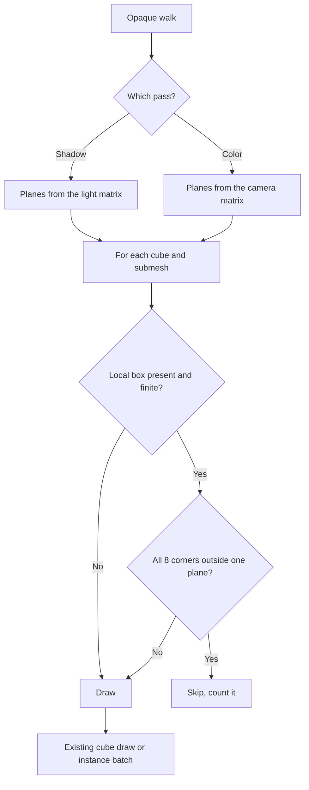
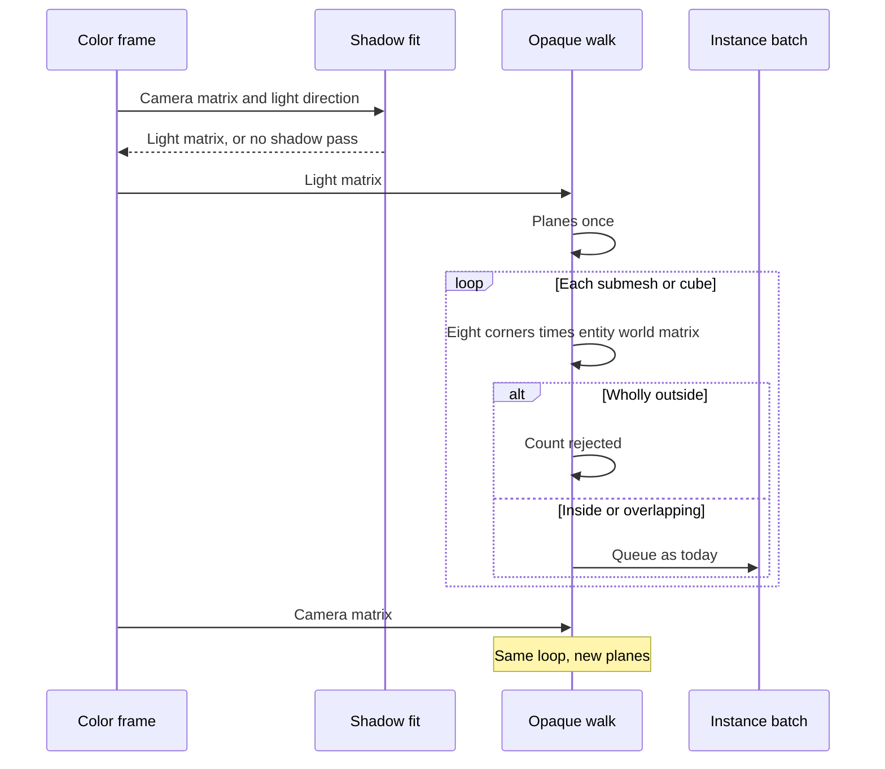

# Frustum Culling — Developer Guide

Implementation guide for skipping opaque cubes and submeshes that lie outside the active pass volume. Assumes the opaque walk, the directional shadow fit, and mesh upload.

## Implementation Overview





## Glossary

| Term | Implementation meaning |
|------|------------------------|
| Local box | Min and max positions stored on the mesh at upload, before CPU vertices are cleared |
| Unit cube box | The −0.5…0.5 box the cube builder already uses. One constant, shared with the cull |
| Pass matrix | Argument to the opaque walk. Light matrix in the shadow pass, camera view-projection in the color pass |
| Outside | Every transformed corner is beyond one plane, past a small slack |
| Reject count | Per pass, one per skipped cube and one per skipped submesh. Logged with the existing draw stats |

## Step-by-Step Requirements

### 1. Store the local box before positions are discarded

When a mesh uploads, scan its positions and keep min and max. Do this before the CPU vertex list is cleared. No vertices, or a non-finite position, leaves the box unset.

The cube builder and the cull must share one half-extent of 0.5. The fallback cube, the textured cube, and the plain cube all use that box. Do not keep a second copy of 0.5 in the walk.

### 2. Build six planes once per pass

Extract left, right, bottom, top, near, and far from the pass matrix. This engine's clip Z is 0 at the near plane and 1 at the far plane, for both the camera perspective and the hand-written light ortho. Normalize each plane. If any normal length is ~0, plane building fails and that pass draws everything.

The walk receives the matrix it should cull against. The shadow call passes the fitted light matrix. The color call passes the camera view-projection. Do not cache a shadow result and reuse it for color.

### 3. Reject only a wholly outside oriented box

Transform the eight corners of the local box by the entity world matrix, the same matrix the draw uses. Do not multiply model-node transforms. The scene graph is not part of drawing today.

A corner that is NaN or infinite means the object is drawn. Otherwise, if one plane has all eight corners strictly outside, skip the object. Use a small world-space slack so a corner that lands a rounding error outside still counts as inside.

Check in this order, and do not change the earlier exits: bad mesh index, suppressed draw, missing model. The test sits immediately before queueing a submesh and immediately before each cube draw, including the fallback cube. A skipped instance is not added to the batch and does not increment the submitted instance count.

```
if the pass has no planes: draw
if the mesh has no local box: draw
corners = eight corners of the local box, times the entity world matrix
if any corner is not finite: draw
if any plane has all corners outside, past a small slack: skip
else: draw
```

### 4. Count rejects in the existing log

Each pass records how many cubes and submeshes it skipped. The once-per-second log prints that number for the shadow pass and for the color pass beside the counts it already prints. Culling runs every frame. Only the print is throttled.

## Testing

Pure tests cover the plane test. Pipeline tests use the existing recording graphics double and `SetWorldTransform`. Setting `Translation` alone does not move a rendered object. The world cache stays identity until something writes it.

| Case | Expect |
|------|--------|
| Box inside a perspective volume | Not outside |
| Box wholly past one face, including near and far | Outside |
| Box cut by a plane, including a box that contains a volume corner with no corner of its own inside | Not outside |
| Long thin box rotated 45° whose axis-aligned bounds would overlap the volume but whose corners do not | Outside |
| Negative scale of a box that occupies the same space | Same answer as the positive scale |
| Non-finite corner | Not outside |
| Matrix that yields no planes | Plane build fails |
| Local box still set after CPU vertices are cleared. Unit cube is −0.5…0.5 | Stored min and max |
| Cube at the origin with the existing shadow-test camera | Shadow draw and color draw, as today |
| Object outside the camera and inside the light box | Shadow draw only |
| Object inside the camera and past the shadow distance | Color draw only |
| Object outside both | No draw. The shadow pass still starts when the light is on |
| Two submeshes, one in view and one far away, same entity matrix | Only the near submesh is queued |
| Mesh with no stored box | Still drawn |

Sprites, subtextures, and a frame with no directional light keep their current tests. No window and no GPU.

## Out of Scope

Sprites and subtextures. Point-light shadow passes. Debug drawing of boxes. An inspector toggle. Applying model-node transforms. Changing the shadow distance or the shadow fit.
