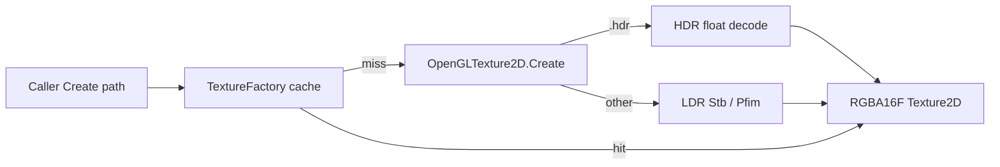
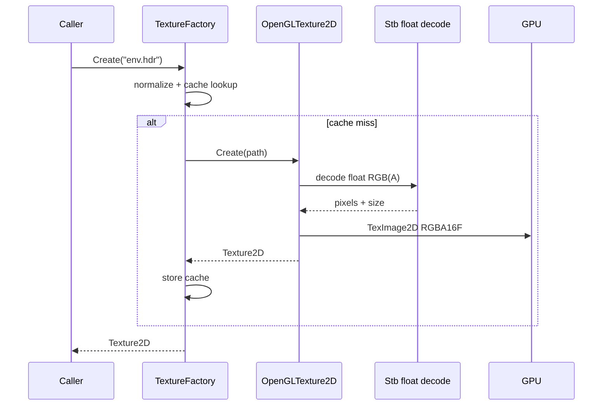

# HDR Environment File Load — Developer Guide

Implementation guide for loading Radiance `.hdr` as equirectangular `RGBA16F` textures through the existing texture factory. See `introduction.md` for conceptual background.

## Glossary (implementation subset)

| Term | Meaning in code |
|------|-----------------|
| Equirect HDR | 2D float texture from `.hdr`, lat-long layout |
| Float decode | Stb HDR/float image result (not 8-bit `ImageResult`) |
| RGBA16F upload | GL internal format half-float RGBA; A = 1 if source is RGB |
| Extension branch | `.hdr` route beside Pfim (DDS/TGA) and Stb LDR |
| Path cache | `TextureFactory` normalized-path dictionary |

## Implementation order

1. **Detect `.hdr` in OpenGL texture create** — extension branch before LDR Stb
2. **Float decode + RGBA expand** — Stb float path; pad alpha if needed
3. **Upload RGBA16F** — half-float pixel type; linear filtering; clamp wrap
4. **Keep factory API unchanged** — cache still via `Create(path)`
5. **Tests + smoke** — fixture decode / missing file / cache; optional quad draw

---

## Step 1: Extension branch

In the platform texture create path (same place that chooses Pfim vs Stb):

- If extension is `.hdr` (case-insensitive) → HDR float path
- Else keep existing Pfim / LDR Stb behavior

**Why:** Matches current format routing; no factory interface change.

---

## Step 2: Float decode

For the HDR branch:

```
set vertical flip policy (same as LDR Stb)
open file stream
decode with Stb float/HDR API → width, height, float channels
if width or height <= 0 → fail
if RGB only → expand each pixel to RGBA with A = 1.0
if decode throws / returns unusable data → fail (do not fall back to 8-bit)
```

Do not insert failed loads into the factory cache.

**Why:** Environment probes must keep HDR magnitudes; 8-bit reinterpretation is wrong.

---

## Step 3: GPU upload

```
create Texture2D
upload float pixel buffer as RGBA16F (internal) / RGBA / half-float type
min/mag: linear
wrap S/T: clamp to edge (equirect; no seam wrap required for raw load)
return Texture2D with path and dimensions set
```

Bind API stays the existing `Texture2D` bind. No cubemap target.

**Why:** `RGBA16F` is the agreed storage; same type keeps cache and bind simple.

---

## Step 4: Factory

`TextureFactory.Create(path)` stays the only public entry:

```
normalize full path
cache hit → return cached
miss → OpenGLTexture2D.Create(path)  // HDR branch inside
store in cache → return
```

No `CreateHdr` method in v1.

**Why:** Call sites and future env components stay one-liner loads.

---

## Step 5: Tests and smoke

**Automated:**

- Tiny checked-in `.hdr` fixture → decode succeeds; width/height > 0; float channel layout as expected (or RGBA after expand)
- Missing path → `FileNotFoundException`
- Same path twice through factory → same instance (when GL/factory tests are available)

**Manual:**

- Load a real probe via `Create`
- Optional: draw as textured quad (expect un-tonemapped look)

**Success criteria:**

- `.hdr` → cached `RGBA16F` equirectangular `Texture2D`
- LDR / DDS / TGA paths unchanged
- Failures not cached
- Suitable as later IBL source input

---

## Architecture





---

## Pseudocode (upload branch only)

```
if extension is ".hdr":
  pixels, w, h, components = StbLoadFloat(path)
  if w <= 0 or h <= 0: throw
  if components == 3: expand to RGBA with A = 1
  tex = AllocGLTexture2D(w, h, RGBA16F)
  UploadHalfFloatRGBA(tex, pixels)
  return WrapTexture2D(path, tex, w, h)
else:
  existing LDR / Pfim path
```

---

## Explicit non-goals (do not implement in this feature)

- Equirect → cubemap
- Irradiance / prefilter / BRDF LUT
- Lighting or tone-map shader changes
- `.exr` support
- Environment ECS component or skybox UI
- Downsampling huge HDRIs
