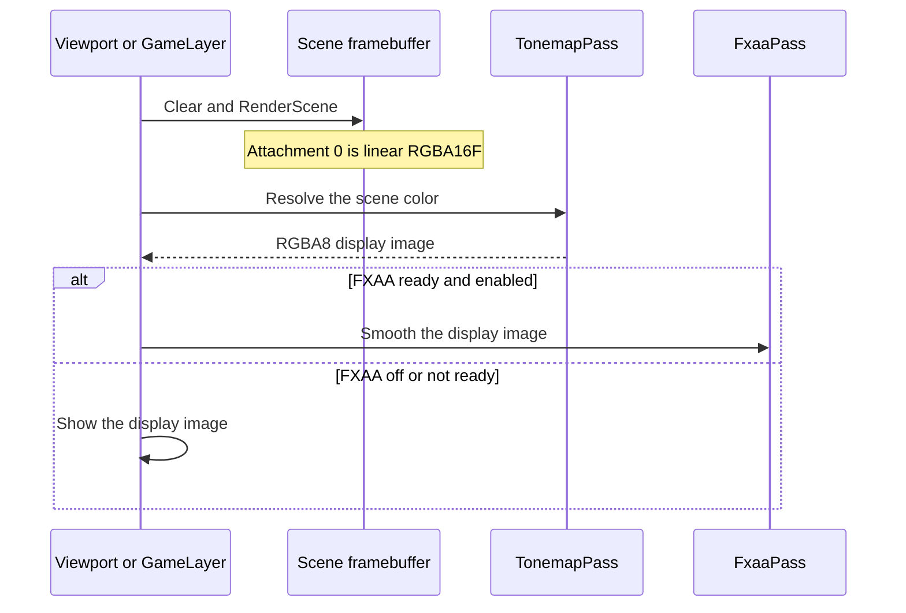

# HDR Framebuffer and Tonemap — Developer Guide

Implementation guide for storing the scene as linear light and compressing it once, after the draw, before FXAA. Assumes the forward color pass, the caller-owned scene framebuffer, and the existing FXAA triangle.

## Implementation Overview



## Glossary

| Term | Implementation meaning |
|------|------------------------|
| Scene attachment 0 | `RGBA16F`, linear filter, clamp to edge |
| Display target | `TonemapPass` output, `RGBA8`, linear filter, clamp, no depth, no entity id |
| Program | `ShaderId.Tonemap`. Vertex shader is `fxaa.vert`. Fragment is `tonemap.frag` |
| Triangle | Three vertices from `gl_VertexID`, the same draw FXAA uses |
| RGB curve | `rgb / (rgb + 1)`, then `pow(rgb, 1/2.2)` |
| Alpha | Copied from the scene sample. Not compressed |
| Sampler | `u_Color` on unit 0, set once at init |
| Call site | After `RenderScene`, before `FxaaPass.Resolve` or `Apply` |
| Registration | `TonemapPass` singleton next to `FxaaPass` in the engine container |

## Step-by-Step Requirements

### 1. Store linear light in the scene

The viewport factory's default color attachment becomes `RGBA16F`. The runtime scene target inside `Present` uses the same format. The integer entity-id attachment and the depth attachment stay on those framebuffers. The display target is a different buffer.

**Why:** The scene and the picture on the monitor are no longer the same object. Picking still needs the integer attachment on the buffer that was drawn.

### 2. Stop encoding inside the draws

Remove the Reinhard-and-gamma step from the sky fragment and from both lit fragment shaders. They write the summed light and the existing alpha. The sprite and line fragments stay as they are: a texture sample times the vertex color, written through.

The fullscreen step is:

```
rgb = sample.rgb / (sample.rgb + 1)
rgb = pow(rgb, 1/2.2)
output = vec4(rgb, sample.a)
```

**Why:** Sprites already write a value in 0–1 and have no compression of their own. Covering them here keeps one curve for the attachment. A stored 1 becomes 0.5 before gamma, which is about 0.73 on the monitor. The clear color takes the same path.

### 3. Draw the pass with the FXAA triangle

Create the program once. On failure, log once and leave the pass unavailable. The vertex shader is the one FXAA already uses, so there is no mesh. Bind the scene color to unit 0, set the viewport to the source size, turn depth test, blend, and face culling off for the draw, and restore them afterward. The destination is the pass's own `RGBA8` target.

`GL_FRAMEBUFFER_SRGB` stays off.

**Why:** The HDR chapter draws a quad from a vertex buffer into the default framebuffer. This engine's post passes already cover the viewport with three `gl_VertexID` vertices and an explicit destination. Reusing that vertex shader avoids a second triangle. Gamma in the fragment is the chapter's manual encode. An sRGB framebuffer encode on top of it would darken the picture again.

### 4. Place it in front of FXAA

The viewport resolves the scene framebuffer through the pass, then runs FXAA only when the preference is on, and only on the display image. The player draws the world into its float scene target. When FXAA is ready, the pass resolves that target and FXAA blits the display image to the window. When FXAA is not ready, the same pass draws the scene color straight to the window.

The outline pass receives the image that is about to be shown, and the scene framebuffer for entity ids. It does not receive the float color.

**Why:** FXAA's metric is the picture that will be displayed. Feeding it the float attachment makes a bright pixel dominate the edge test. The outline shader writes an 8-bit composite, so its color input has to already be the display image.

## Failures

| Condition | Result |
|-----------|--------|
| Shader or triangle fails at init | One log. The pass stays unavailable. The float attachment is not shown. The first displayed frame is empty. Later frames keep the previous display image |
| Width or height is 0 | No draw |
| Display target cannot be created or resized | One log. The target is dropped. The next frame may create it again. The shader stays available |
| Scene color attachment is missing | One log. The pass is skipped |
| An exception after the framebuffer or the viewport was swapped | Both are restored |
