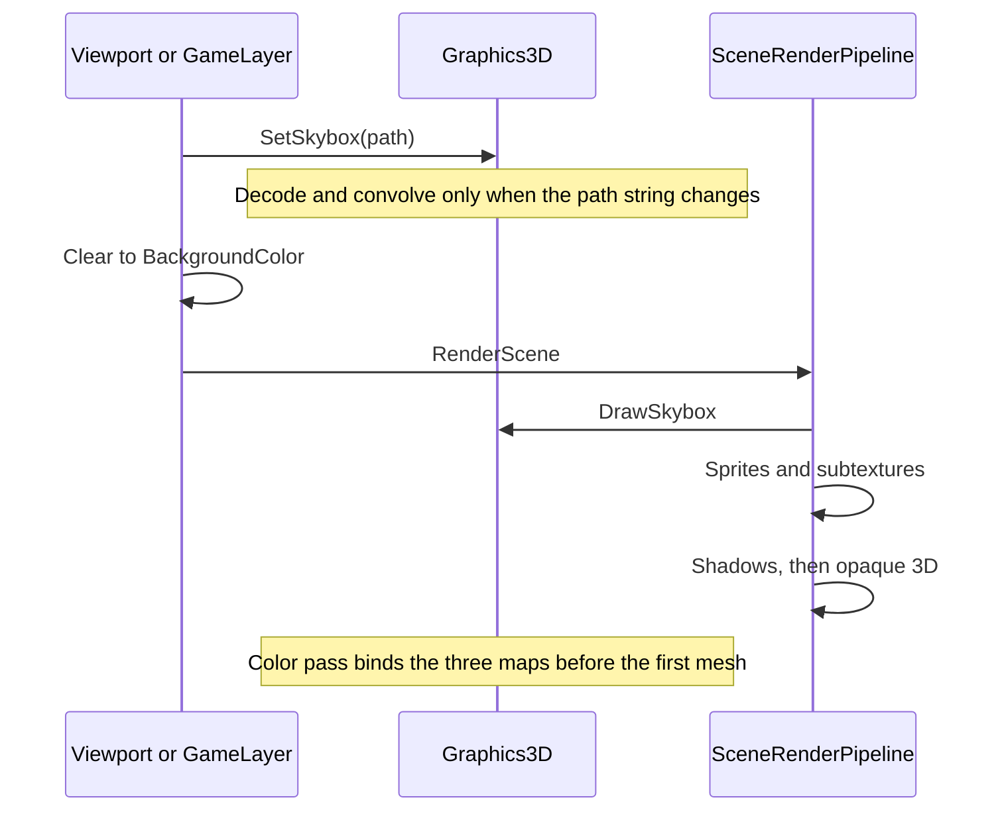

# Image-Based Lighting — Developer Guide

Implementation guide for replacing the flat ambient fill with split-sum lighting from the scene sky. Assumes the forward color pass, the existing sky capture, and Reinhard encoding in the color shaders.

## Implementation Overview



## Glossary

| Term | Implementation meaning |
|------|------------------------|
| Scene field | `Skybox`, a string. Empty means no environment |
| JSON key | `Skybox`. Absent on load means empty. The value is a `.hdr` path |
| Environment size | 512 per face, `RGBA16F`, mip chain, trilinear minification |
| Irradiance size | 32 per face, `RGBA16F`, no mips, linear filter |
| Prefilter | Base 128, five mips, `RGBA16F`, trilinear. Roughness of mip `i` is `i / 4` |
| Lookup | 512², `RG16F`, linear, clamp. Built once per process |
| Sample step | 0.025 radians across the irradiance hemisphere |
| Sample count | 1024 Hammersley samples in the prefilter and in the lookup |
| Reflection lod | `roughness * 4` |
| Flag | `u_Ibl` is 1 only when irradiance, prefilter, and the lookup all exist |
| Slots | 13 irradiance, 14 prefilter, 15 lookup. Bound from the frame upload |
| Indirect Fresnel | `F0` plus `(max(1 - roughness, F0) - F0) * (1 - N·V)^5` |
| Lookup geometry | `k = roughness² / 2` |
| Direct geometry | Unchanged. `k = (roughness + 1)² / 8` |

## Step-by-Step Requirements

### 1. Keep the path on the scene

The string, the JSON key, and the two call sites stay. The viewport passes the active scene path before it binds the scene framebuffer. The player passes it inside the FXAA present callback, before the clear and before systems. Neither call grows a new service.

The settings field stays a text box. Its browse dialog lists radiance files. The texture browser and the texture drop target stay on png and jpg.

Publish already requires a non-empty `Skybox` to be a file under `assets/`. It also requires the `.hdr` extension. An empty value is still ignored.

**Why:** The clear color and the sky path are already one fact per scene, restored with the file, and applied by the same two frame owners. A png in that slot can no longer feed the light, so the dialog and the publisher agree on the extension. Leaving png in the texture list keeps albedo decoding on the 8-bit path.

### 2. Decode the file as linear float

The decoder lock already used for 8-bit images also covers this load, including the vertical flip flag. The load asks for three float channels. A missing file, a non-radiance extension, a decode error, or a non-finite sample fails the capture. A picture whose width is not twice its height logs once and still captures.

The equirect texture is `RGBA16F`, clamp to edge, linear filter, no mips. Every channel is clamped to 65504, the largest half float, before upload. It is deleted when the capture object is disposed.

**Why:** The radiance file is already linear. Decoding it as display bytes would clamp every highlight to one before the blur. The flip flag is process-global, so the new load has to share the lock the byte decoder already holds. A photographed sun can exceed 65504 (San Giuseppe Bridge peaks at 98304 red). Half float stores that as `+Inf`, mip generation and both blurs spread it, and Reinhard turns it into NaN. A yellow sun overflows red and green but not blue, so the scene turned pure blue. The clamp drops 7% of that file's red flux.

### 3. Capture three cubemaps when the path changes

Reuse the six view-projections at the origin with far 10. Face order stays `+X −X +Y −Y +Z −Z`. The vertex shader is the one the sky already uses, with scale 1. Matrices stay row-vector: a face matrix is view times projection, and the shader multiplies the position on the right.

Draw order:

1. Six environment faces at 512. The fragment writes the equirect sample unchanged.
2. Mipmaps on that cubemap, then trilinear minification.
3. Six irradiance faces at 32. Each sample of the environment uses lod 4.
4. Prefilter mips 0 through 4, six faces each, viewport halved per mip. Each sample of the environment uses the lod from the step below.

Irradiance builds its tangent frame with the same rule as the specular sampler: a world up of `+Z` unless the normal is nearly parallel to `Z`, in which case the up is `+X`. The hemisphere step is 0.025 radians. The stored texel is `π` times the weighted average, which cancels the Lambert `1/π` later.

The prefilter treats the output direction as both the normal and the view. Samples are Hammersley points warped by GGX with `a = roughness²`, weighted by `N·L`. The environment lod is 0 when roughness is 0. Otherwise it is `0.5 * log2(saSample / saTexel)`, with the environment face size fixed at 512:

```
pdf = D * NdotH / (4 * HdotV) + 0.0001
saTexel = 4 * π / (6 * 512 * 512)
saSample = 1 / (1024 * pdf + 0.0001)
```

`H·V` in that denominator is at least `0.0001`.

Seamless cubemap sampling stays enabled for the whole process. It is not toggled per pass.

On success the equirect, the capture framebuffer, and the depth buffer go away. The three cubemap ids stay with the graphics layer. On any failed face, `SetSkybox` deletes the new ids and the previous trio stays.

**Why:** One file is the authoring input. Doing the blurs at path-change time leaves the frame with three texture fetches. An explicit lod on the irradiance reads is required once the environment has mips: a discontinuous sample direction would otherwise select an arbitrary mip. Lod 4 is 32 texels per face, about 2.8°, twice the 0.025-radian step. At lod 0 a sun smaller than one step is hit or missed per output texel. On San Giuseppe Bridge, irradiance across the sun's face was off by up to 438% at lod 0 and by up to 12% at lod 4, against the exact cosine integral. The `+Y` face of the chapter's irradiance frame crosses a zero tangent; the specular chapter's frame does not, and both blurs share it. The `π` in the irradiance texel is the chapter's cancellation, so the color shader multiplies albedo and does not divide by `π` again.

### 4. Build the lookup once

At graphics init, draw one clip-space quad into a 512² `RG16F` target, clamp to edge, linear filter. The quad's texture coordinates are `N·V` and roughness. The target has no depth buffer. The geometry term inside this draw uses `k = roughness² / 2`. The draw runs a second time only if init itself runs a second time.

A failed lookup logs once. The sky can still be stored later. The indirect flag stays off for the life of the process.

**Why:** The table depends on the BRDF, not on the picture. The unit cube's UVs are per face, so they do not cover one 0–1 square. The chapter attaches depth because it reuses the cubemap framebuffer. This target is only the quad.

### 5. Encode the sky from the environment cubemap

The sky draw is unchanged in order and depth: before sprites, depth test on, depth write off, scale 4, entity id −1. The fragment reads lod 0 and then applies Reinhard and gamma 2.2. It unbinds unit 0 before returning.

**Why:** Sprites run next and do not write depth. A sky drawn at the end of the 3D pass would replace sprite pixels that are still at the clear depth. The mip chain exists so the prefilter can read coarser levels. The backdrop stays on the base level. The sample is linear HDR, and the scene target is 8-bit, so this fragment is one of the two places that encode.

### 6. Replace the fill in both color shaders

Paste the indirect function into the cube shader and the model shader. There is no shared shader file. Both already floor roughness at 0.045 and build `F0` as 0.04 mixed toward albedo by metallic.

```
F = fresnelRoughness(max(N·V, 0), F0, roughness)
kD = (1 - F) * (1 - metallic)
diffuse = sample(irradiance, N) * albedo
R = reflect(-V, N)
specular = sampleLod(prefilter, R, roughness * 4) * (F * brdf.r + brdf.g)
indirect = (kD * diffuse + specular) * ao
```

When the flag is on, that product is the ambient term. When it is off, the term stays `strength * color * albedo * ao`. The sun and the lamps are added after it. `Encode` runs once on the sum.

On a model, `ao` is the occlusion-map red channel times the component factor. On a cube it is the component factor alone. Either value is clamped before the multiply.

**Why:** The two color programs are loaded whole, so the function is duplicated. The roughness floor means the sharpest reflection reads lod 0.18. Occlusion on the whole product is what makes a crease darken a reflection. Multiplying specular by `kD` or by a second Fresnel would count the Fresnel twice. Dividing diffuse by `π` would dim it a second time.

### 7. Bind the maps with the other frame uniforms

The color-pass upload sets the flag and, when it is on, binds the three maps on units 13, 14, and 15. Sampler unit numbers are written once at shader init. Mesh draws and instance draws do not bind them again. The instance batch key stays mesh, tint, and PBR factors.

Sprites still run before this upload and may use every unit from 0 through 15. The sky's unit 0 binding does not survive into that batch.

**Why:** A per-draw bind would repeat three binds for every cube and every batch. Putting the binds next to the shadow binds keeps them off the shadow passes and off the sprite batch. Units 0 through 12 are already albedo, material maps, the sun shadow, eight point-shadow cubes, and occlusion. 13 through 15 are the last of the 16 units OpenGL 3.3 guarantees.

## Failures

| Condition | Result |
|-----------|--------|
| Empty or whitespace path | The three cubemaps are dropped. The lookup stays. The clear color shows and the fill is flat ambient |
| Missing file, extension other than `.hdr`, non-finite sample, or cubemap creation failure | One log for that path. The new cubemaps are discarded. The previous trio stays, or the clear color shows if there was none. The failed string is remembered |
| Width is not twice the height | One log. Capture still runs |
| A face or a mip fails after the capture has started | Same as a bad file. The shader never sees a partial trio |
| Lookup creation fails during init | One log, no retry. A later sky may still draw. The flag stays 0 |
| An exception after the framebuffer or the viewport was swapped | Both are restored. A clear that already happened is left as it was |
| Publish, empty path | Ignored |
| Publish, path set | The file is under `assets/` and ends in `.hdr`. Otherwise publish fails |
