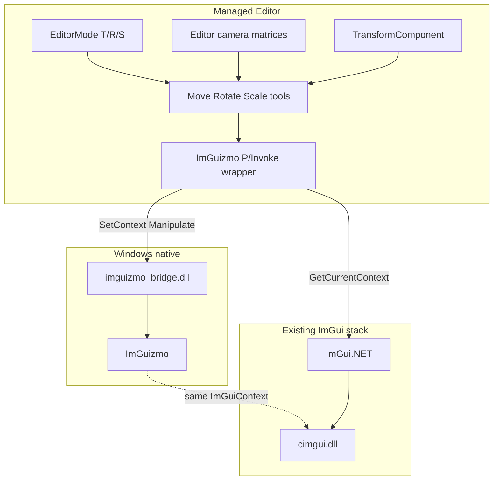
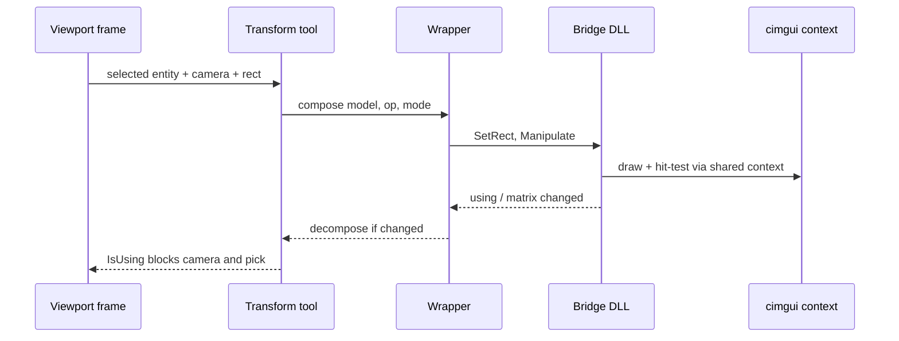

# ImGuizmo 3D Transform — Developer Guide

## Goal

Replace the 2D `GizmoRenderer` path used by Move / Rotate / Scale with ImGuizmo via a minimal Windows native bridge and P/Invoke, keeping ImGui.NET + Silk.NET.

## Glossary (implementation)

| Term | Meaning here |
|------|----------------|
| Bridge | `imguizmo_bridge.dll` — ImGuizmo + C exports |
| Wrapper | Managed P/Invoke surface in Editor |
| Op | Translate / Rotate / Scale from `EditorMode` |
| Mode | Local / World for Manipulate |
| Rect | ImGui window bounds of the scene image |

## Build the bridge

1. Add a small native project (MSVC or CMake) under something like `native/imguizmo_bridge`.
2. Vendor ImGuizmo sources; compile against **Dear ImGui headers matching ImGui.NET 1.90.8** (docking build as used by that package’s `cimgui`).
3. Export only what v1 needs, e.g.:
   - set ImGui context
   - set rect
   - manipulate (view, proj, op, mode, model matrix in/out)
   - is over / is using
4. Produce `imguizmo_bridge.dll` (win-x64). Copy it next to the Editor output on Windows builds.
5. Do not replace `cimgui.dll` from NuGet unless forced — prefer sharing the live context pointer.

Why: smallest ABI surface; avoids forking the whole ImGui native stack.

## Managed wrapper

1. P/Invoke the C exports; use `unsafe` / fixed pointers for matrices as needed.
2. On ImGui attach (after Silk creates the context): load DLL, call set-context with `ImGui.GetCurrentContext()`.
3. If load or context is null: set a “gizmos unavailable” flag; tools no-op draw/manipulate.
4. Map enums: editor Move/Rotate/Scale → ImGuizmo op; UI toggle → local/world mode.

## Wire tools and viewport

Per edit-mode frame when an entity with a transform is selected:

```
view, proj ← editor camera
model ← compose(transform)
set rect ← scene image bounds in screen space
if manipulate(view, proj, op, mode, model):
    transform ← decompose(model)
block camera orbit/pan and entity pick when is_over or is_using
```

1. Refactor Move / Rotate / Scale tools to this path; remove their dependence on 2D `GizmoRenderer` for T/R/S.
2. Keep camera icon/frustum gizmos on the existing framebuffer drawer — out of scope.
3. Local/world: one editor setting or toolbar control feeding mode into all three tools.

## Matrix conventions

- Pass **column-major** float16 arrays as ImGuizmo expects (same layout ImGui.NET uses with `System.Numerics` when transposed correctly — verify once against a known cube).
- Compose order: translation × rotation × scale (match existing engine transform meaning).
- Decompose must preserve the component’s representation (euler/quat as the engine already stores).

## Error handling

| Case | Behavior |
|------|----------|
| DLL missing / DllNotFound | Log once; disable gizmos |
| Context null | Skip Manipulate |
| No selection / no transform | Skip |
| Degenerate matrix | Skip update that frame |

Do not catch access violations — fix version pin if those appear.

## Tests

- Unit: compose/decompose round-trip for representative T/R/S values.
- Unit/smoke: wrapper survives absent DLL (flag set, no throw).
- Manual: T/R/S + local/world in 3D edit viewport; confirm camera does not move while dragging gizmo.

## Architecture





## Out of scope (do not implement in v1)

Snap, multi-select, view cube, non-Windows bridge builds, Hexa.NET migration, replacing camera gizmos.
