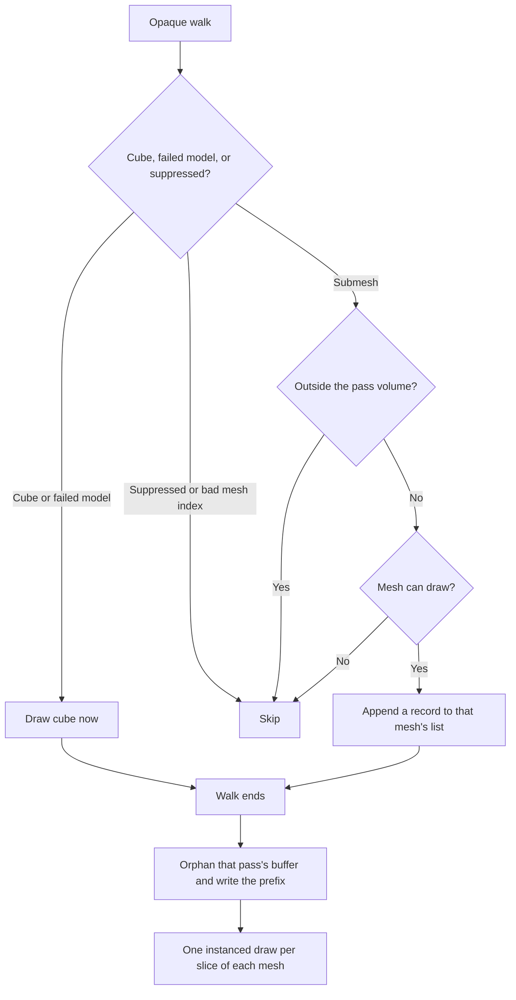
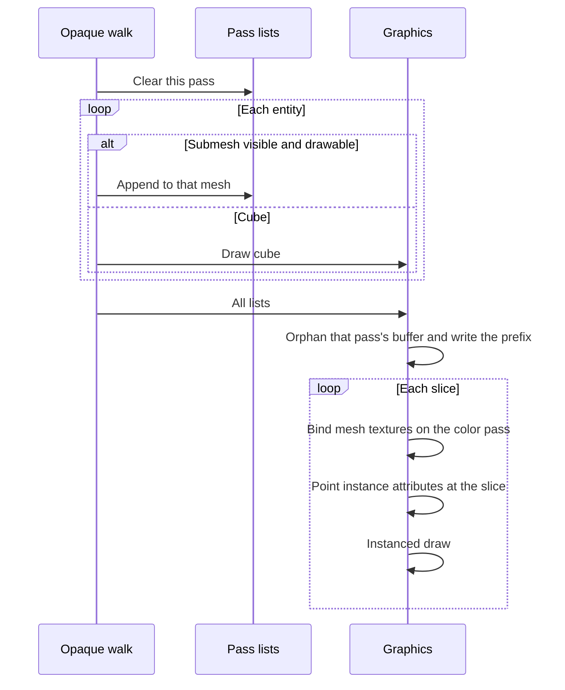

# Mesh Instancing — Developer Guide

Implementation guide for drawing many copies of one imported mesh in one submission. Assumes the opaque walk, frustum culling, and the model and depth shaders.

## Implementation Overview





## Glossary

| Term | Implementation meaning |
|------|------------------------|
| Group key | The `Mesh` object. Legal only when every copy uses that mesh's textures and the pass is opaque |
| Color record | World matrix, 3×3 normal transform, entity id, tint, metallic, roughness, AO |
| Shadow record | World matrix only |
| Slice | A run of copies from one mesh that fits in the vertex-buffer byte cap. A mesh that fits is one slice |
| Attribute budget | Sixteen slots, locations 0–15. Mesh geometry already uses 0–5 |
| Draw count | Instanced submissions actually issued. A skipped mesh adds zero |

## Step-by-Step Requirements

### 1. Append during the walk, draw after it

The cull test stays where it is, in front of the append. A rejected submesh is not appended.

Cubes, a failed model load, `SuppressDraw`, and a bad mesh index do not append. They keep today's behavior.

The shadow walk and the color walk use different lists. Clear a pass's lists at the start of that walk. After the flush, drop keys whose lists are empty so a mesh that left the scene does not stay in the dictionary forever. Keep the list objects for meshes that are still present, and clear them next pass, so a forest does not allocate a new list every frame.

```
clear this pass's lists
for each renderer:
    cube or failed model -> draw cube, as today
    bad index or suppressed -> continue
    for each submesh:
        if culled: continue
        if the mesh cannot draw: continue
        otherwise append one record
flush every non-empty list
drop empty keys
```

A color list is never flushed as a shadow list. The mesh key is valid because textures and the base color live on the mesh, and this walk is opaque. A per-entity texture is a different group. A blended material is not appended: it would have to be drawn back to front, and a group has no such order.

### 2. Pack the color record into sixteen attribute slots

Locations 0–5 are the mesh. That leaves 6–15.

A full second 4×4 matrix plus the id, the tint, and the factors needs more than ten slots. Store the normal transform as three columns, the upper 3×3 of the inverse-transpose already used for the uniform. The world matrix still uses four slots.

Locations 0–15 are the whole budget. Do not append a field. A GPU with sixteen attributes drops anything past location 15, and the picture loses that value with no shader error. A new per-copy value has to take a slot that already exists.

| Slot | Contents |
|------|----------|
| 6–9 | World matrix |
| 10–12 | Normal columns |
| 13 | Entity id |
| 14 | Tint |
| 15 | Metallic, roughness, AO, unused |

Matrices in the buffer are columns, matching `glUniformMatrix` with transpose enabled. The shader still multiplies a row vector by the matrix. Build the normal columns from the same inverse-transpose the cube path uploads. A non-invertible matrix stores an identity normal transform, as today.

The shadow record is the world matrix alone, at slots 6–9, with a shorter stride. Slots 10–15 are disabled for a shadow draw so they do not fetch with the color stride.

OpenGL 3.3 has no base instance. The attribute pointer's byte offset is the start of the slice inside the uploaded buffer. The first copy of a slice is instance 0 of that pointer.

One copy still uses this path. Do not keep a second shader that reads `u_Model`.

### 3. Upload once per packed range, then draw

Shadow and color each own an instance buffer. They never write the same store. A color upload must not wait on the shadow draw from the same frame.

Grow each buffer up to the existing vertex-buffer byte cap, and keep the capacity for the next pass. Before every write, orphan that buffer: allocate a new store of the same size and leave the old store with any draw still reading it. Then write the used prefix into the new store. If the buffer must grow, allocate the larger one and let the driver keep the old store until its draws finish.

Copies that did not move are still rewritten. Culling changes which copies are visible, so keeping last frame's buffer would draw last frame's survivors.

When the copies collected for the pass fit, that is one orphan, one prefix write, and then one draw per mesh. When a mesh, or the whole pass, does not fit, cut it into slices that fit and orphan-and-write each packed range. Sum of the slice lengths equals the number of records. Nothing is dropped.

Skip a mesh with no uploaded buffer or with zero indices. Do not upload its records. Other meshes in the range still draw.

On the color draw, bind that mesh's textures and the uniforms that are shared by every copy: which maps exist, and the base color. Lights and the view matrix are already on the shader. Tint and the three factors come from the record.

On the shadow draw, the depth shader is already bound. Bind no textures. The depth shader reads the world matrix from the instance attribute.

The entity id written to the picking attachment comes from the color record, flat, not from the per-vertex id stored in the mesh and not from a uniform.

Increment the draw-call stat once per slice that was submitted.

### 4. Report copies and draws

Each pass counts copies appended and slices submitted. The once-per-second log prints both, for the shadow pass and for the color pass. The repeated-mesh lines print, for each mesh, its copy count and its slice count. Culling counts stay as they are.

## Testing

Pipeline tests use the recording graphics double. No window and no GPU. The double records one mesh event per slice and copies the records, because the walk may clear the lists on the next pass. Assert counts when two meshes are flushed. Dictionary order is not the entity order.

The slice split is tested as integer math against the real byte cap (`cap + 1` copies → two slices). Do not allocate a cap-sized list.

| Case | Expect |
|------|--------|
| Two entities, same mesh, different tint and factors | One color slice, two records. One shadow slice, two matrices and nothing else |
| Two entities, two meshes | Two slices, one record each |
| One entity | One slice of one |
| Two cubes | Two cube draws, no mesh slice |
| Failed model, `SuppressDraw`, bad mesh index | Today's cube or nothing. No mesh record |
| Mesh that cannot draw, plus one that can | Only the drawable mesh is submitted |
| Non-finite matrix | The record is present |
| Copy count one past the buffer cap | Two slices. The counts sum to the record count |
| Sprite or subtexture | Unchanged |

The existing far-submesh test still sees one mesh event per pass. That submesh is one copy.

## Out of Scope

Cubes, including textured cubes. Sprites and subtextures. A persistent multi-mesh asset. Merging vertices on the CPU. Texture arrays and per-entity textures. Transparent 3D. Changing frustum culling.
