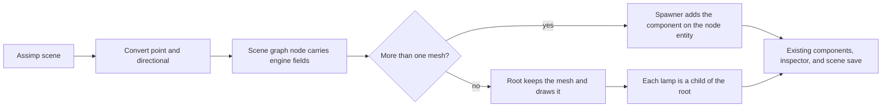
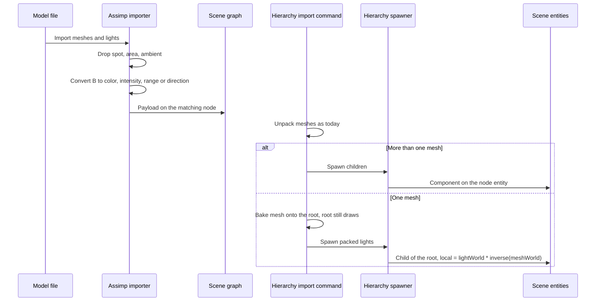

# Model Light Import — Developer Guide

Implementation guide for turning point and directional lights in a model file into scene entities at hierarchy unpack. Assumes the existing Assimp mesh import, the hierarchy spawner, and the point and directional components.

## Implementation Overview



## Glossary

| Term | Implementation meaning |
|------|------------------------|
| File brightness B | Max channel of Assimp diffuse color. Non-finite or ≤ 0 skips that light |
| Point intensity | `clamp(sqrt(B / 4), 0.5, 2)` |
| Point range | Node metadata `PBR_LightRange` when finite and > 0, otherwise `clamp(3 * sqrt(B), 1, 16)` |
| Directional color | Diffuse divided by B when B > 1, otherwise the diffuse channels. Alpha is 1 |
| Directional direction | Assimp direction transformed by the node matrix accumulated to the file root, then normalized. A near-zero vector becomes `(0, -1, 0)` |
| Name match | Assimp light name equals the node name. The first node consumes the first light of that name |
| Packed spawn | `ShouldUnpack` is false. Mesh bake on the root stays. Lights are extra children |

## Step-by-Step Requirements

### 1. Carry an imported light on the scene-graph node

Add an optional light payload to the scene-graph node, set only from the constructor. Two shapes: a point light with color, intensity, and range, or a directional light with color and direction. Those numbers are already engine units.

`ShouldUnpack` stays `TotalMeshCount > 1`. A light does not flip it.

**Why:** The spawner and the editor tests can build a node without Assimp. The mesh-packing rule stays the one the single-mesh path already uses.

### 2. Convert in one pure function

The function takes the diffuse color and an optional file range. It returns nothing when B is non-finite or ≤ 0.

```
B = max(diffuse.r, diffuse.g, diffuse.b)
if B is not finite or B <= 0: skip
color = diffuse / B, alpha 1
intensity = clamp(sqrt(B / 4), 0.5, 2)
range = fileRange if fileRange is finite and > 0
        else clamp(3 * sqrt(B), 1, 16)
```

Directional color and direction are separate:

```
if B is not finite or B <= 0: skip
if B > 1: color = diffuse / B
else: color = diffuse
alpha = 1
if lengthSquared(direction) is near 0: direction = (0, -1, 0)
else: direction = normalize(direction)
```

Do not read Assimp attenuation. glTF import sets quadratic attenuation to 1 on every point light, including lights with infinite range.

**Why:** The numbers are the whole policy. A test can lock them without a file or a GPU. B = 4 is intensity 1 and range 6. B = 0.5 is intensity 0.5 and range about 2.1. B = 100 is intensity 2 and range 16.

### 3. Read lights before the Assimp scene is released

While the imported scene is still open, collect lights. Keep point and directional. Count spot, area, and ambient, then drop them. If that count is greater than zero, log one debug line. Do not log per light and do not fail the mesh import.

Match each kept light to a node by name. The first node with that name takes the first unmatched light of that name. Read `PBR_LightRange` from that node's metadata. Missing metadata, a missing key, a non-positive value, or a non-finite value means there is no file range.

Compose a non-zero Assimp position into the node local transform only when the node has no mesh. A node that has a mesh keeps its mesh transform. Log once at debug if that light's position offset is non-zero.

Transform the direction by the node matrix accumulated to the file root, using the same multiply order as mesh world transforms (`local * parent`). Store the converted payload on the node.

Lights whose names never matched a node become extra children of the graph root. Their local transform is the translation of the Assimp position alone. Their direction is the Assimp direction with no node rotation. Log one debug line that a light had no node.

**Why:** Name equality is how Assimp attaches a light to a node. Conversion has to run before `ReleaseImport`. Mesh import must succeed even when every light is skipped.

### 4. Add the component while spawning an unpacked hierarchy

A node with no meshes, no children, and no light is still skipped.

Any other node that has a light gets the matching component on the entity the spawner already creates for that node. A point payload sets color, intensity, and range. A directional payload sets color and direction.

If the graph root itself has a light, do not add the component to the scene root. Create a child of the scene root, named with the node name, local transform identity, and add the component there. Unpacked mesh children are already parented to the scene root without reapplying the file root matrix. The lamp uses that same origin.

**Why:** Unpacked entities already follow the file parent chain, so a lamp under a prop moves with that prop. Keeping the component off the scene root means hierarchy undo, which restores children, removes the lamp.

### 5. Spawn lights for a packed model without hiding the mesh

When the graph does not unpack, keep the existing mesh bake: the root renderer stays active, and the root transform absorbs the mesh world matrix.

Then walk every node that has a light and create a child of the scene root. The child's local transform is the light's accumulated matrix multiplied by the inverse of the mesh world matrix, with the same multiply order as mesh world transforms. If the mesh world matrix cannot be inverted, skip that light and log one debug line.

A packed directional light's stored direction is in file-root space. Rotate it by that same inverse before writing the component, and normalize. A near-zero result becomes `(0, -1, 0)`.

**Why:** Baking the mesh onto the root moves the root entity. A child that stored the file-root matrix would be transformed twice. Multiplying by the inverse puts the lamp back on the mesh. `ShouldUnpack` stays false, so `SuppressDraw` stays false and the only mesh still draws.

### 6. Leave the frame alone

Do not change the eight-light cap, the resolver, the shaders, the serializers, or the inspectors. The new entities use the components those paths already register.

**Why:** Selection and falloff are a different feature. Imported lights have to save and edit with no new component type.

## Data Flow



## Edge Cases

| Input | Result |
|-------|--------|
| No lights | Meshes import as today. No log |
| Spot, area, ambient | Skipped. One debug line with the count |
| B non-finite or ≤ 0 | That light is skipped. Other lights still import |
| `PBR_LightRange` missing, ≤ 0, or non-finite | Derived range |
| Finite file range | That range, including values outside 1–16 |
| Two lights with one node name | First on the node. The next is a child of the graph root at its Assimp position |
| Light name matches no node | Child of the graph root at its Assimp position. One debug line |
| Non-zero position on a node that has a mesh | Offset ignored. Mesh stays. One debug line |
| Single mesh and many lights | Root draws the mesh. Each light is a child |
| Light on the file root | Child of the scene root, never a component on the scene root |
| Ninth point light, or a second directional | Entity exists. The frame still uses the first eight point lights and the first directional in view order |
| Unpack again | Children destroyed and recreated. Inspector edits on those children are gone |
| Undo hierarchy import | Children, including lamps, restored from the snapshot taken before unpack |

## Testing

Test the conversion with no GPU and no file:

- B = 4 → intensity 1, range 6, color channels are the diffuse divided by 4.
- B = 0.5 → intensity 0.5, range `3 * sqrt(0.5)`.
- B = 100 → intensity 2, range 16.
- B = 0 → no light.
- File range 40 → range 40, intensity still from B.
- File range 0 → derived range.
- Directional diffuse `(2, 1, 0)` → color `(1, 0.5, 0)`.
- Directional diffuse `(0.2, 0.1, 0)` → color unchanged.
- Direction length zero → `(0, -1, 0)`.

Test the graph: one mesh plus a light still has `ShouldUnpack` false. The node stores intensity and range, not the raw diffuse color.

Test the spawner:

- Unpacked empty leaf with a point payload creates an entity with a transform and a point light, and no mesh renderer.
- Unpacked node with one mesh and a point payload has both the renderer and the point light.
- A payload on the graph root becomes a child, and the scene root has no light component.
- Packed spawn on a one-mesh graph creates light children and does not set suppress-draw. A child under a translated root, with the mesh on the root, keeps the child's file local translation.
- Undo of hierarchy import removes those children.

Do not add a GPU test and do not parse a binary glTF in the unit tests.

## Pitfalls

**Treating quadratic attenuation as range.** Assimp writes quadratic 1 for every glTF point light. Using it makes every lamp a different range than the formula above.

**Flipping `ShouldUnpack` because lights exist.** The root renderer is suppressed whenever the graph unpacks. A single mesh would disappear.

**Putting the root lamp on the scene root.** Undo of hierarchy import restores children only. A component added to the root would survive undo.

**Parenting a packed light at its file-root matrix.** The command already bakes the mesh world matrix into the root. The child must be relative to that matrix.

**Expecting the brightest lamp to win a slot.** View order is entity order. Lights already in the scene occupy the eight slots before the imported ones if they were created first. Tree order, not brightness, decides which imported lamps are inside the eight.

**FBX intensity left out of the color.** B stays near 1. The formula then yields intensity 0.5 and range 3. That is the accepted ceiling. Do not add a second formula per format.

## Done When

- [ ] Scene-graph nodes can carry a converted point or directional payload, and `ShouldUnpack` ignores lights
- [ ] Conversion matches the values in Testing
- [ ] Import keeps point and directional lights, drops the other types with one debug line, and still imports meshes when lights fail
- [ ] Unpacked spawn puts the component on the node entity, and a root payload becomes a child
- [ ] Packed spawn leaves the single mesh drawing and parents each lamp with the inverse mesh correction
- [ ] Hierarchy undo removes imported lamps
- [ ] Resolver, shaders, serializers, and inspectors are unchanged
