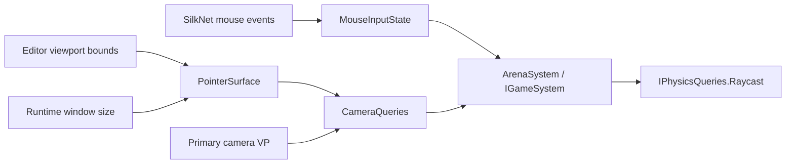
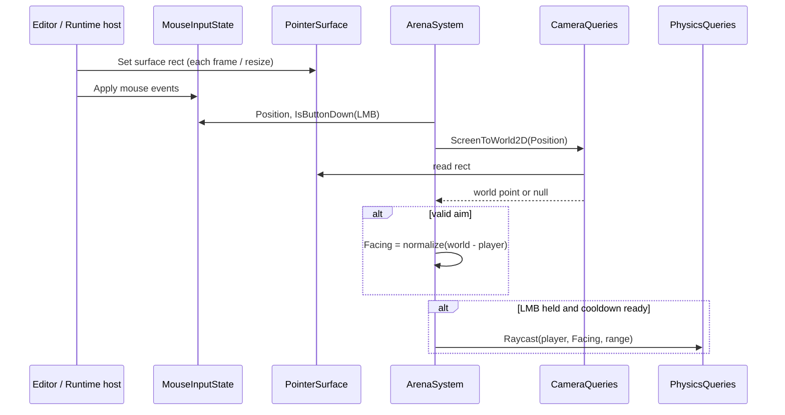

# Mouse Aiming — Developer Guide

Implementation guide for pollable mouse input, pointer surface, screen-to-world, and Arena Shooter wiring. See `introduction.md` for conceptual background.

## Glossary (implementation subset)

| Term | Meaning in code |
|------|-----------------|
| Mouse poll state | Held buttons, pressed-this-frame set, last position |
| Pointer surface | Origin + size rect in window/logical space |
| Screen-to-world | Surface-relative NDC → unproject primary VP → Z=0 hit |
| Host update | Editor viewport or Runtime window writes the surface each frame |
| Arena aim | Facing = normalize(worldMouse − playerPos); fire while LMB held |

## Implementation order

1. **`IMouseInput` + state** — apply mouse events; EndFrame; DI beside keyboard
2. **`IPointerSurface`** — settable rect; default empty/zero until host writes
3. **`ICameraQueries.ScreenToWorld2D`** — move editor unproject idea into Engine; use surface + primary camera
4. **Host wiring** — Editor Play publishes viewport; Runtime publishes client size; both Apply mouse to state
5. **ArenaShooter** — mouse aim + hold LMB fire; remove arrow aim/fire
6. **Tests** — state, conversion math, surface hosts, Arena helpers

---

## Step 1: Mouse poll API

Add a mouse poll interface in the Input-facing layer (same consumer style as keyboard):

- Current position (X, Y) from last move event
- Is button down / was button pressed this frame (at least left button index 0)
- Apply from existing mouse moved / pressed / released events
- EndFrame clears pressed-this-frame

Wire Apply in Editor Play and Runtime input handlers next to keyboard Apply. Call EndFrame where keyboard already clears.

**Why:** Systems cannot aim from event-only callbacks without storing state themselves; one shared state matches keyboard.

---

## Step 2: Pointer surface

Add a small service holding origin and size (window/logical pixels).

Hosts:

- **Editor Play** — each viewport frame while playing, set origin/size from ImGui game viewport min/max (same bounds tools already use)
- **Runtime** — set origin (0,0) and size from client window; refresh on resize
- **Edit mode** — surface may stay zero or last Play value; games only run in Play/Runtime

**Why:** SilkNet mouse is window-relative; the game image in the editor is not. Without the rect, NDC is wrong.

---

## Step 3: Screen-to-world

Public query used by game systems:

```
ScreenToWorld2D(screenPos):
  if surface width or height <= 0 → null
  if no primary camera / cannot invert VP → null
  local = screenPos - surface.origin
  ndc = map local into [-1,1] with Y flip as needed for the projection convention
  unproject near/far through inverse view-projection
  intersect ray with Z = 0
  return XY or null if parallel / invalid
```

Reuse the proven editor unproject approach; do not leave the only implementation in the Editor project.

Content scale: keep surface and mouse in logical space. If framebuffer paths need physical pixels (existing entity pick), keep that local to the editor — gameplay conversion stays logical ↔ world.

**Why:** One call hides NDC and camera details; null means “don’t update aim.”

---

## Step 4: Host and DI wiring

- Register mouse state, pointer surface, and camera queries in Engine DI (game assemblies can inject them).
- Expose primary camera view-projection to the query service without making internal camera types part of the game SDK surface beyond what the query needs.
- Editor: publish surface during Play; Runtime: publish on attach/resize.
- Optional script convenience later: not required for Arena (system-owned input).

**Why:** Games never reference ImGui or SilkNet window types.

---

## Step 5: ArenaShooter

In the arena system update (playing phase):

```
worldMouse = cameraQueries.ScreenToWorld2D(mouse.Position)
if worldMouse present and cursor inside surface:
  facing = normalize(worldMouse - playerPos)  // if length ~0, keep previous
if mouse.IsButtonDown(Left) and fireCooldown ready:
  raycast shoot as today
```

Remove arrow-key aim and arrow-key fire. Keep WASD movement and R restart. Aim marker / tracer continue to follow `Facing`.

**Why:** Validates the engine path on a real game; matches agreed UX (hold LMB auto-fire).

---

## Edge cases

| Case | Behavior |
|------|----------|
| No move events yet | Position default; Arena should not snap aim until a valid world point exists (or cursor inside surface) |
| Cursor outside surface | Do not update facing; do not fire from LMB (editor UI clicks) |
| ScreenToWorld null | Keep last facing; skip fire that depends on fresh aim if desired (prefer: still allow fire along last facing only if LMB held — pick one and stick: **keep last facing, allow fire**) |
| Zero / missing surface | Conversion null |
| No primary camera | Conversion null |
| EndFrame | Clears mouse pressed-this-frame like keyboard |

---

## Architecture





---

## Testing checklist

Mouse state:

- Move updates position
- Press/release updates held
- WasPressed true only until EndFrame
- Apply ignores non-mouse events safely

Screen-to-world:

- Orthographic camera, known surface: center maps near camera look XY
- Corner of surface maps to expected world extents (within tolerance)
- Zero surface → null
- Missing / non-invertible VP → null

Surface hosts:

- Runtime sets full client rect
- Editor Play sets non-zero viewport-derived rect (unit or integration-level as practical)

Arena:

- Stubbed world mouse updates facing toward that point
- LMB held triggers shoot path when cooldown allows
- No LMB → no shoot
- Null world mouse → facing unchanged

---

## Out of scope (do not implement in this pass)

- Remapping `OnMouseMoved` into viewport-local coordinates
- Cursor lock / relative mouse
- Gamepad aim
- Rebind UI
- Replacing editor gizmo `ViewportCoordinateConverter` call sites (optional later dedupe)
- RMB/MMB Arena actions
