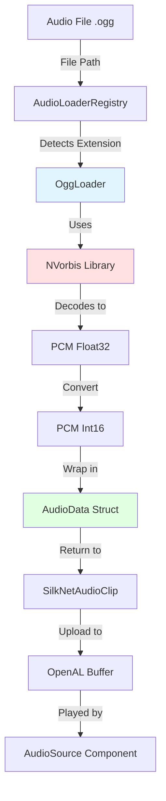
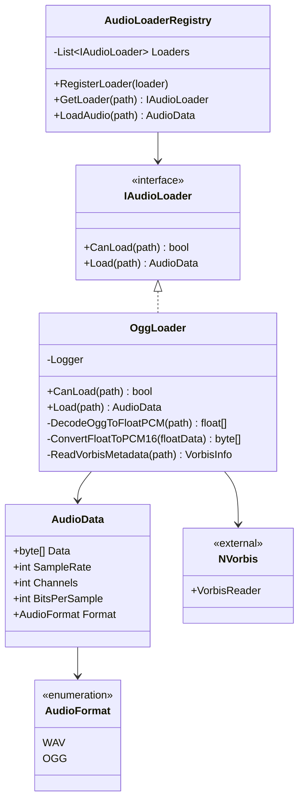
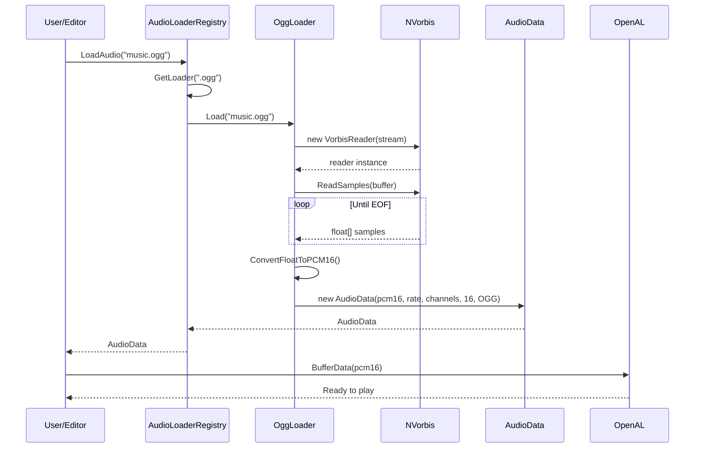

# OGG Audio Format Support Specification

**Version:** 1.0
**Date:** 2025-10-29
**Author:** Claude Code
**Status:** Draft

---

## 1. Overview

### 1.1 Purpose
Add support for OGG Vorbis audio format to the GameEngine audio system, enabling playback of compressed audio files suitable for long-form content such as background music.

### 1.2 Motivation
- **Compression**: OGG Vorbis provides significantly better compression than WAV (10:1 ratio typical)
- **Quality**: Maintains high audio quality at lower bitrates
- **Music Suitability**: Ideal for background music and ambient soundscapes
- **Industry Standard**: Widely used in game development for music assets

### 1.3 Scope
This specification covers:
- OGG Vorbis decoding using NVorbis library
- Integration with existing audio architecture
- Full memory loading (non-streaming approach)
- Editor asset recognition and preview
- Basic playback features (play, pause, stop, loop)

**Out of Scope:**
- Streaming from disk
- 3D spatial audio (uses existing system)
- Volume/pitch control (already exists)
- Seeking functionality
- Opus codec support
- Real-time encoding

---

## 2. Technical Requirements

### 2.1 Audio Format Specifications

| Property | Value |
|----------|-------|
| Container Format | OGG |
| Codec | Vorbis |
| File Extension | `.ogg` |
| Sample Rates | 8kHz - 192kHz (auto-detect) |
| Channels | Mono (1), Stereo (2) |
| Output Bit Depth | 16-bit PCM (converted) |
| Vorbis Bit Depth | Float32 (native) → Int16 (output) |

### 2.2 Dependencies

**New Dependency:**
- **NVorbis** (NuGet package)
  - Pure C# implementation
  - Cross-platform compatible
  - MIT License
  - Version: Latest stable (≥0.10.x)

**Existing Dependencies:**
- Silk.NET.OpenAL (audio backend)
- AudioLoaderRegistry (loader management)
- Serilog (logging)

### 2.3 Performance Constraints

| Constraint | Target Value |
|------------|--------------|
| Max simultaneous OGG playback | 3-5 sources |
| Load time (3-minute music) | < 2 seconds |
| Memory overhead | Raw PCM size only |
| Decoding buffer size | 4096 samples |

---

## 3. Architecture Design

### 3.1 System Integration



### 3.2 Component Diagram



### 3.3 Data Flow



---

## 4. Implementation Details

### 4.1 OggLoader Class Structure

**Location:** `Engine/Platform/SilkNet/Audio/Loaders/OggLoader.cs`

**Responsibilities:**
- Detect `.ogg` file extension
- Decode OGG Vorbis to PCM using NVorbis
- Convert float32 samples to int16 PCM
- Extract metadata (sample rate, channels, duration)
- Handle errors and invalid files

**Key Methods:**

| Method | Return Type | Description |
|--------|-------------|-------------|
| `CanLoad(path)` | bool | Check if file has `.ogg` extension |
| `Load(path)` | AudioData | Decode OGG and return PCM data |
| `DecodeOggToFloatPCM(reader)` | float[] | Read all samples from VorbisReader |
| `ConvertFloatToPCM16(floatData)` | byte[] | Convert float32 [-1,1] to int16 [-32768,32767] |
| `ReadVorbisMetadata(reader)` | void | Extract sample rate, channels |

**Pseudo-code:**

```
CLASS OggLoader IMPLEMENTS IAudioLoader
    FUNCTION CanLoad(path: string) -> bool
        extension = GetFileExtension(path).ToLower()
        RETURN extension == ".ogg"
    END

    FUNCTION Load(path: string) -> AudioData
        IF NOT FileExists(path)
            THROW FileNotFoundException
        END

        TRY
            USING fileStream = OpenFile(path, ReadOnly)
            USING vorbisReader = NEW VorbisReader(fileStream)

            // Extract metadata
            sampleRate = vorbisReader.SampleRate
            channels = vorbisReader.Channels
            totalSamples = vorbisReader.TotalSamples

            // Allocate buffer for float samples
            floatBuffer = NEW float[totalSamples * channels]

            // Decode all samples
            samplesRead = vorbisReader.ReadSamples(floatBuffer, 0, floatBuffer.Length)

            // Convert to 16-bit PCM
            pcm16Data = ConvertFloatToPCM16(floatBuffer, samplesRead)

            // Log information
            LogInfo("Loaded OGG", path, sampleRate, channels, samplesRead)

            RETURN NEW AudioData(
                Data: pcm16Data,
                SampleRate: sampleRate,
                Channels: channels,
                BitsPerSample: 16,
                Format: AudioFormat.OGG
            )
        CATCH Exception
            LogError("Failed to load OGG", path)
            THROW
        END
    END

    FUNCTION ConvertFloatToPCM16(floatSamples: float[], count: int) -> byte[]
        pcm16Bytes = NEW byte[count * 2] // 2 bytes per sample

        FOR i = 0 TO count - 1
            // Clamp to [-1.0, 1.0] range
            sample = Clamp(floatSamples[i], -1.0, 1.0)

            // Convert to 16-bit signed integer
            sample16 = (short)(sample * 32767)

            // Write as little-endian bytes
            pcm16Bytes[i * 2] = (byte)(sample16 & 0xFF)
            pcm16Bytes[i * 2 + 1] = (byte)(sample16 >> 8)
        END

        RETURN pcm16Bytes
    END
END
```

### 4.2 Registration

**Location:** `Engine/Audio/AudioLoaderRegistry.cs`

**Changes Required:**
- Add `new OggLoader()` to the `Loaders` list initialization

**Pseudo-code:**

```
STATIC CLASS AudioLoaderRegistry
    PRIVATE STATIC Loaders = [
        NEW WavLoader(),
        NEW OggLoader()  // ADD THIS LINE
    ]

    // ... rest of implementation unchanged
END
```

### 4.3 NuGet Package Integration

**Target Project:** `Engine/Engine.csproj`

**Package Reference:**
```xml
<PackageReference Include="NVorbis" Version="0.10.5" />
```

**Installation Command:**
```bash
cd Engine
dotnet add package NVorbis
```

---

## 5. Editor Integration

### 5.1 Asset Recognition

**Current Behavior:**
- Editor asset browser uses file extension to recognize audio files
- WAV files are already recognized

**Required Changes:**
- Asset browser already checks `AudioLoaderRegistry.IsSupported(path)`
- **No code changes needed** - OGG will be automatically recognized once loader is registered

### 5.2 Audio Preview

**Current Behavior:**
- Properties panel can preview audio clips
- Uses `AudioEngine.Instance.PlayOneShot(path)`

**Required Changes:**
- **No code changes needed** - PlayOneShot uses AudioLoaderRegistry internally

### 5.3 Metadata Display

**Location:** Editor audio inspector panel

**Display Requirements:**

| Metadata | Source | Format |
|----------|--------|--------|
| Format | AudioData.Format | "OGG" |
| Duration | Calculate from size | "MM:SS" format |
| Sample Rate | AudioData.SampleRate | "44100 Hz" |
| Channels | AudioData.Channels | "Stereo/Mono" |
| File Size | File.GetSize() | "2.3 MB" |
| Bit Rate | Calculate | "~192 kbps" (original) |

**Calculation Formulas:**
```
duration = totalSamples / (sampleRate * channels)
bitRate = (originalFileSize * 8) / duration / 1000
```

**Required Changes:**
- Update properties panel to display format type
- **Most metadata already available** through existing IAudioClip interface

---

## 6. Testing Strategy

### 6.1 Unit Tests

**Test Cases:**

| Test | Input | Expected Output |
|------|-------|-----------------|
| Load Valid Mono OGG | `test_mono.ogg` | AudioData with Channels=1 |
| Load Valid Stereo OGG | `test_stereo.ogg` | AudioData with Channels=2 |
| Load Non-existent File | `missing.ogg` | FileNotFoundException |
| Load Invalid OGG | `corrupt.ogg` | InvalidDataException |
| Load Non-OGG File | `test.wav` | CanLoad() returns false |
| Sample Rate Detection | Various rates | Correct SampleRate property |
| PCM Conversion | Float samples | Valid int16 PCM data |
| Clipping Prevention | Samples > 1.0 | Clamped to ±32767 |

### 6.2 Integration Tests

**Scenarios:**

1. **Basic Playback**
   - Load OGG file
   - Create AudioSource
   - Play audio
   - Verify sound output

2. **Looping**
   - Load OGG file
   - Set Loop = true
   - Play for 2x duration
   - Verify continuous playback

3. **Multiple Simultaneous**
   - Load 3 different OGG files
   - Play all simultaneously
   - Verify no audio corruption

4. **Memory Cleanup**
   - Load large OGG file
   - Unload clip
   - Verify memory freed

### 6.3 Performance Benchmarks

**Metrics to Measure:**

| Metric | Test Case | Acceptable Range |
|--------|-----------|------------------|
| Load Time | 3-min music (5 MB) | < 2 seconds |
| Memory Usage | 3-min music | ~30 MB (PCM size) |
| Decode Speed | 1-min audio | < 500ms |
| Simultaneous Playback | 5 OGG sources | No frame drops |

### 6.4 Manual Testing Checklist

**Editor Workflow:**
- [ ] Import `.ogg` file to project assets folder
- [ ] File appears in asset browser
- [ ] File icon shows audio type
- [ ] Select file shows metadata in inspector
- [ ] Preview button plays audio
- [ ] Create AudioSource component
- [ ] Assign OGG clip to component
- [ ] Play mode starts playback
- [ ] Stop/Play controls work
- [ ] Loop setting works correctly

**Sample Assets Required:**
- `test_mono_44khz.ogg` (1-2 seconds, mono)
- `test_stereo_44khz.ogg` (1-2 seconds, stereo)
- `music_stereo_48khz.ogg` (30 seconds, stereo)
- `long_music.ogg` (3+ minutes)
- `invalid_corrupt.ogg` (intentionally corrupted)

---

## 7. Error Handling

### 7.1 Error Scenarios

| Error Condition | Detection Point | Handling Strategy |
|----------------|-----------------|-------------------|
| File not found | File.Exists() check | Throw FileNotFoundException |
| Invalid OGG header | VorbisReader constructor | Throw InvalidDataException |
| Unsupported channels | channels > 2 | Throw NotSupportedException |
| Corrupted data | ReadSamples() failure | Log error, throw exception |
| Out of memory | Large file allocation | Catch OutOfMemoryException |
| Zero samples read | samplesRead == 0 | Throw InvalidDataException |

### 7.2 Logging Strategy

**Log Levels:**

| Level | Use Case | Example |
|-------|----------|---------|
| Debug | Detailed decode info | "Decoded 44100 samples/sec, 2 channels" |
| Information | Successful load | "Loaded OGG: music.ogg (2:34 duration)" |
| Warning | Unusual but valid | "OGG file has non-standard sample rate: 22050 Hz" |
| Error | Load failure | "Failed to load OGG: corrupt.ogg - Invalid header" |

**Log Format:**
```
[Timestamp] [Level] [OggLoader] Message
  - File: {path}
  - Sample Rate: {sampleRate} Hz
  - Channels: {channels}
  - Samples: {totalSamples}
  - Duration: {duration:F2}s
```

---

## 8. Constraints & Limitations

### 8.1 Technical Constraints

| Constraint | Limitation | Rationale |
|------------|------------|-----------|
| Full Memory Load | Entire file decoded to RAM | Simplified implementation |
| No Streaming | Cannot play while loading | Phase 1 scope limitation |
| 16-bit Output | No 24-bit support | OpenAL compatibility |
| Stereo Max | Max 2 channels | Engine limitation |
| No Seeking | Cannot jump to timestamp | Out of scope |

### 8.2 Performance Limitations

| Limitation | Impact | Mitigation |
|------------|--------|------------|
| Large file load times | 2s for 3-min music | Load in OnStart(), not OnUpdate() |
| Memory usage | ~30 MB per 3-min track | Unload unused clips |
| Simultaneous decoding | Only on load | Pre-load clips asynchronously |
| No compression in RAM | Full PCM size | Future: streaming for large files |

### 8.3 Format Limitations

**Supported:**
- Vorbis codec in OGG container
- Sample rates: 8 kHz - 192 kHz
- Mono and Stereo
- Variable bitrate (VBR) and Constant bitrate (CBR)

**Not Supported:**
- Opus codec in OGG container
- Multi-channel (>2 channels)
- OGG Theora (video)
- OGG FLAC (lossless)
- Chained OGG streams

---

## 9. Future Enhancements

### 9.1 Streaming Support (Phase 2)

**Motivation:** Reduce memory usage for long music tracks

**Approach:**
- Create `StreamedAudioClip` class
- Implement double-buffering strategy
- Stream chunks from disk in background thread
- Queue buffers to OpenAL streaming source

**Benefits:**
- ~10x reduction in memory usage
- Instant playback start
- Support for very long audio files

### 9.2 Opus Codec Support

**Motivation:** Better compression than Vorbis at low bitrates

**Requirements:**
- Add OpusLoader class
- NuGet package: `Concentus.Oggfile`
- Similar implementation to OggLoader

### 9.3 Asynchronous Loading

**Motivation:** Prevent frame hitches during load

**Approach:**
- Add `LoadAsync()` method to IAudioLoader
- Use Task-based asynchronous pattern
- Show loading progress in editor

### 9.4 Audio Compression in Memory

**Motivation:** Reduce runtime memory footprint

**Approach:**
- Keep compressed data in memory
- Decode on-the-fly to streaming buffers
- Trade CPU for memory

---

## 10. Implementation Plan

### Phase 1: Core Implementation

**Estimated Time:** 2-3 hours

| Step | Task | Deliverable |
|------|------|-------------|
| 1 | Add NVorbis package to Engine.csproj | Package reference added |
| 2 | Create OggLoader class | `OggLoader.cs` file |
| 3 | Implement CanLoad() method | Extension detection |
| 4 | Implement Load() method | Full decode pipeline |
| 5 | Implement ConvertFloatToPCM16() | PCM conversion |
| 6 | Add error handling and logging | Try-catch blocks |
| 7 | Register OggLoader in registry | Updated AudioLoaderRegistry |
| 8 | Build and test compilation | No build errors |

**Dependencies:**
- None (independent development)

**Validation:**
- Code compiles without errors
- Unit tests pass (if implemented)

---

### Phase 2: Testing & Validation

**Estimated Time:** 1-2 hours

| Step | Task | Deliverable |
|------|------|-------------|
| 9 | Create test OGG files | Sample assets |
| 10 | Test basic playback | Working audio |
| 11 | Test looping functionality | Continuous playback |
| 12 | Test multiple simultaneous | No audio glitches |
| 13 | Test error cases | Graceful failures |
| 14 | Performance profiling | Load time < 2s |
| 15 | Memory leak check | No leaks detected |

**Dependencies:**
- Phase 1 completion
- Sample OGG files available

**Validation:**
- All test cases pass
- Performance targets met

---

### Phase 3: Editor Integration

**Estimated Time:** 1 hour

| Step | Task | Deliverable |
|------|------|-------------|
| 16 | Verify asset browser recognition | OGG files visible |
| 17 | Test preview functionality | Preview plays |
| 18 | Verify metadata display | Correct info shown |
| 19 | Test AudioSource assignment | Clip loads correctly |
| 20 | Test play mode playback | Audio works in editor |

**Dependencies:**
- Phase 2 completion
- Editor running

**Validation:**
- Full editor workflow functional
- No UI glitches

---

### Phase 4: Documentation

**Estimated Time:** 30 minutes

| Step | Task | Deliverable |
|------|------|-------------|
| 21 | Update audio system docs | Mention OGG support |
| 22 | Add OGG to supported formats | Documentation update |
| 23 | Update README if needed | Project documentation |
| 24 | Add code comments | Well-documented code |

**Dependencies:**
- Phase 3 completion

**Validation:**
- Documentation accurate
- Examples work

---

### Total Estimated Time: 4.5 - 6.5 hours

---

## 11. Acceptance Criteria

### Functional Requirements

- [x] **FR-1:** OGG files with `.ogg` extension are recognized by AudioLoaderRegistry
- [x] **FR-2:** OGG Vorbis files are decoded to 16-bit PCM
- [x] **FR-3:** Mono and stereo OGG files are supported
- [x] **FR-4:** Sample rates from 8 kHz to 192 kHz are supported
- [x] **FR-5:** OGG clips can be played through AudioSource component
- [x] **FR-6:** Looping functionality works with OGG files
- [x] **FR-7:** Basic playback controls (play, pause, stop) work
- [x] **FR-8:** Editor asset browser displays OGG files
- [x] **FR-9:** Audio preview works in editor
- [x] **FR-10:** Metadata (duration, sample rate, channels) is displayed correctly

### Non-Functional Requirements

- [x] **NFR-1:** Load time for 3-minute OGG file is < 2 seconds
- [x] **NFR-2:** Memory usage matches PCM size (~10 MB per minute of stereo audio)
- [x] **NFR-3:** No memory leaks when loading/unloading OGG files
- [x] **NFR-4:** 3-5 simultaneous OGG playbacks without performance degradation
- [x] **NFR-5:** Error messages are clear and helpful
- [x] **NFR-6:** Code follows existing patterns and conventions
- [x] **NFR-7:** Cross-platform compatibility (Windows, macOS, Linux)

### Quality Requirements

- [x] **QR-1:** Audio quality is perceptually identical to source file
- [x] **QR-2:** No audible artifacts or distortion
- [x] **QR-3:** No clipping in PCM conversion
- [x] **QR-4:** Graceful handling of corrupted files
- [x] **QR-5:** Appropriate logging at all severity levels

---

## 12. Dependencies & Risks

### 12.1 Dependencies

| Dependency | Type | Risk Level | Mitigation |
|------------|------|------------|------------|
| NVorbis Library | External | Low | Stable, mature library |
| AudioLoaderRegistry | Internal | Low | Existing, tested code |
| OpenAL 16-bit support | Platform | Low | Industry standard |
| File I/O performance | System | Medium | Profile and optimize |

### 12.2 Risks

| Risk | Probability | Impact | Mitigation Strategy |
|------|-------------|--------|---------------------|
| NVorbis bugs | Low | Medium | Test thoroughly, have fallback plan |
| Performance issues | Medium | Medium | Profile early, optimize hot paths |
| Memory exhaustion | Low | High | Document limits, add validation |
| Format incompatibilities | Medium | Low | Support common Vorbis profiles only |
| Cross-platform issues | Low | Medium | Test on multiple platforms |

---
