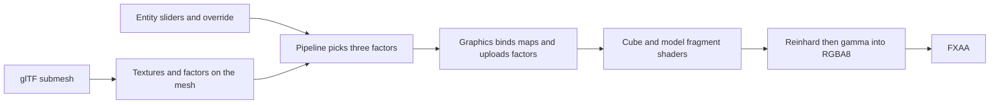
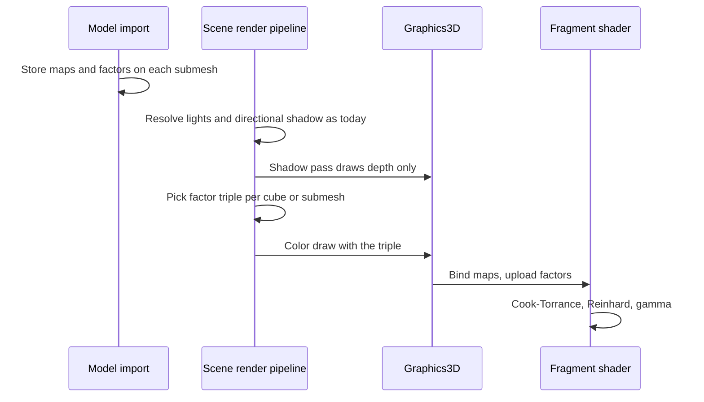

# PBR Direct Lighting — Developer Guide

Implementation guide for replacing Blinn-Phong on cubes and models with direct Cook-Torrance, textured from glTF. Assumes the current forward pass: one ambient, one directional light, up to eight point lights, one directional shadow map.

## Implementation Overview



## Glossary

| Term | Implementation meaning |
|------|------------------------|
| Factor triple | Metallic, roughness, occlusion scalars in 0–1 after clamping |
| Cube draw | No model path, or a model path that failed to import. Always uses the entity triple |
| Mesh draw | One submesh. Factors come from that submesh unless override is on |
| Metallic-roughness map | One linear texture. Sample G for roughness and B for metallic |
| Occlusion map | One linear texture. Sample R |
| Packed path | Assimp's glTF metallic-roughness texture slot. Wins over separate metalness and roughness slots |
| Min roughness | 0.045, applied in the shader after the map multiply |
| Display encode | Reinhard, then `pow(color, 1/2.2)`. Alpha stays `u_Color.a` |

## Step-by-Step Requirements

### 1. Extend the model renderer component

Add metallic, roughness, occlusion, and an override switch to the existing model renderer component. Defaults: 0, 0.5, 1, off. Setters clamp to 0–1. A non-finite value falls back to that field's default. Clone copies the four fields with the rest of the component.

**Why:** The scene serializer already writes public properties. Old scenes load the defaults. Override off is what keeps a gold file gold.

### 2. Show the fields in the inspector

Always draw the three sliders. Draw the override switch only when the model path is non-empty. A cube has no switch because the sliders are already the material.

**Why:** A hidden switch on a cube would imply a file factor that does not exist.

### 3. Replace specular on the mesh

Remove shininess and the specular texture from the mesh. Add:

- a linear metallic-roughness texture
- a linear occlusion texture
- metallic factor, default 0
- roughness factor, default 0.5
- base color factor, default white

**Why:** Specular and shininess are the Phong inputs. Leaving them on the mesh invites a second lighting path.

### 4. Read PBR material at import

For each submesh material:

- albedo: base color, else diffuse, still sRGB. Keep the existing normal-map fallback that infers an albedo path
- normal: normals, else height, linear
- metallic-roughness path: packed glTF slot, else metalness, else roughness. Linear
- occlusion path: ambient-occlusion slot only, linear
- metallic factor: the file key when the read succeeds, else 0. Clamp 0–1. Non-finite becomes the missing default
- roughness factor: the file key when the read succeeds, else 0.5. Same clamp
- base color factor: the file color when the read succeeds, else white. Clamp each channel

When the packed slot is empty and both the metalness path and the roughness path are set to different files, log once and keep the metalness path.

Do not query the specular texture. Do not read shininess.

**Why:** glTF stores one metallic-roughness image. Other files expose metalness and roughness as separate slots. Branch on whether the read succeeded: a missing metallic key stays 0, a missing roughness key stays 0.5, and a successful 1 stays 1. The return code is what separates "the file says 1" from "the file said nothing".

### 5. Pick the factor triple before drawing

One pure function, used by the 3D draw loop:

```
clamp each input to 0–1, non-finite becomes 0
if this draw is a cube:
    return entity metallic, entity roughness, entity occlusion
if override is on:
    return the same entity triple
return mesh metallic, mesh roughness, occlusion factor 1
```

Pass the triple into the cube draw and the mesh draw. The failed-import cube uses the cube branch.

The shadow pass calls the same draw methods. The graphics object returns before binding maps or setting material uniforms. Do not add a second draw API that omits the triple.

**Why:** Multi-material models stay correct while override is off, because each submesh still supplies its own factors. The shadow early-return is the whole of "the shadow pass does not apply PBR".

### 6. Upload material on the color draw

On the model shader, sampler units are:

| Unit | Map |
|------|-----|
| 0 | Albedo |
| 1 | Metallic-roughness |
| 2 | Normal |
| 3 | Directional shadow (unchanged) |
| 4 | Occlusion |

Set the unit indices once at init. On each mesh draw, bind the mesh texture or the existing white stand-in, and upload a has-map flag per optional map. Upload the factor triple and the base color factor.

On the cube shader, upload the factor triple only. The cube already binds its optional albedo. It has no metallic-roughness, occlusion, or normal map.

**Why:** Unit 3 is already the shadow map. Putting occlusion there silently samples depth as occlusion.

### 7. Replace the surface function in both fragment shaders

Delete the Phong diffuse and specular terms, shininess, and the specular map. Keep the directional shadow function, the point-light loop structure, the range fade, and the near-zero lamp guard.

Gather material, then light:

```
albedo = (albedo map or 1) * baseColor * entityColor
metallic = clamp((MR map B or 1) * metallicFactor, 0, 1)
roughness = max(clamp((MR map G or 1) * roughnessFactor, 0, 1), 0.045)
occlusion = clamp((AO map R or 1) * occlusionFactor, 0, 1)
```

The cube has no base color factor (treat it as white) and no MR or AO map (treat those samples as 1).

For the sun and for each point light outside the epsilon:

```
radiance = sun color, or lamp color * intensity * rangeFade
F0 = mix(0.04, albedo, metallic)
D = GGX with alpha = roughness²
G = Smith, each term using k = (roughness + 1)² / 8
F = Schlick
specular = D * G * F / (4 * NdotV * NdotL + 0.0001)
diffuseWeight = (1 - F) * (1 - metallic)
Lo += (diffuseWeight * albedo / pi + specular) * radiance * NdotL
```

Then:

```
sun contribution *= directional shadow
if lamp distance < 0.0001: add radiance * albedo and skip the function
ambient = ambientColor * ambientStrength * albedo * occlusion
color = ambient + sun + lamps
color = color / (color + 1)
color = pow(color, 1/2.2)
output alpha = entity color alpha
```

Use the direct-light geometry `k`, not the image-based one (`alpha² / 2`). Paste the same functions into both fragment shaders. Normal mapping on the model shader stays as it is and feeds N.

**Why:** Cook-Torrance already includes albedo. Multiplying the whole result by albedo again doubles the tint. Reinhard has to run in the fragment because the color attachment is RGBA8 and FXAA samples it next.

### 8. Correct the rendering docs that still say Blinn-Phong

Update the cameras-and-rendering page and the rendering-pipeline page so they describe Cook-Torrance, metallic-roughness, and occlusion, and list image-based lighting and transparent mesh sorting as unsupported.

**Why:** Those pages currently say PBR is not the lighting model.

## Data Flow



## Edge Cases

| Input | Result |
|-------|--------|
| Cube, override off | Entity triple anyway |
| Model, override off | Mesh metallic and roughness, occlusion factor 1, maps still apply |
| Model, override on | Entity triple on every submesh, maps still multiply |
| Failed model import | Cube path, entity triple |
| Missing metallic key | Factor 0 |
| Successful metallic 1 | Factor 1 |
| Missing roughness key | Factor 0.5 |
| Factor outside 0–1, or non-finite | Clamped, or the missing default when non-finite |
| Slider outside 0–1 | Setter clamps; shader clamps again |
| Roughness 0 after multiply | Shader uses 0.045 |
| No MR map | Factors only |
| No AO map | Occlusion factor only |
| Packed slot empty, metalness path ≠ roughness path | One warning, metalness path kept |
| Specular texture in the file | Not loaded |
| Fragment within 0.0001 of a lamp | `radiance * albedo`, no Cook-Torrance |
| Shadow pass | Draw returns before material binds |

## Testing

Pure factor pick, no GPU:

- Cube uses the entity triple when override is off
- Model with override off uses mesh metallic, mesh roughness, occlusion 1
- Model with override on uses the entity triple
- Values outside 0–1 clamp; non-finite becomes 0 before the cube/override choice, so a bad mesh factor cannot leak through

Import helpers, no full asset:

- Packed path wins over metalness and roughness
- Metalness wins over a different roughness path
- Equal metalness and roughness paths are that one path
- Missing metallic read yields 0; a successful 1 stays 1; a successful 2 clamps to 1
- Missing roughness read yields 0.5; a non-finite successful read yields 0.5

Pipeline, with the existing recording graphics stand-in:

- A cube draw records the entity triple
- A mesh draw with override off records the submesh metallic, submesh roughness, and occlusion 1
- A mesh draw with override on records the entity triple
- A failed import records the entity triple on the cube draw

Extend the stand-in signatures when the draw methods grow. Do not add a GPU test. Do not port Cook-Torrance into C# to compare against the shader.

## Pitfalls

**Sampling occlusion from the shadow unit.** Unit 3 is the directional shadow. Occlusion is unit 4.

**Uploading metallic-roughness as sRGB.** Roughness and metalness must stay linear. Only albedo is sRGB.

**Using the image-based Smith `k`.** This chapter's direct lights use `(roughness + 1)² / 8`.

**Applying the roughness floor before the texture multiply.** A rough map times a low factor must be able to reach the floor. Floor last.

**Double-multiplying albedo.** The cube's old final multiply covered ambient and the sun only. The new sum already has albedo inside every term.

**Letting override-off occlusion use the slider.** The slider is ignored until override is on. The factor is 1, and the map still multiplies it.

**Diverging shader copies.** Any change to the function, the floor, Reinhard, or gamma lands in both fragment shaders.

## Done When

- [ ] Model renderer has the four fields, clamping setters, and clone
- [ ] Inspector shows three sliders, and the switch only when a model path is set
- [ ] Mesh no longer carries specular or shininess
- [ ] Import fills metallic-roughness, occlusion, factors, and base color
- [ ] Factor pick matches the cube, override, and mesh rules
- [ ] Both fragment shaders use one Cook-Torrance, Reinhard, and gamma
- [ ] Shadow draws return before material binds
- [ ] Factor, import-helper, and pipeline recording tests pass
- [ ] The two rendering docs no longer describe Blinn-Phong as the 3D model
