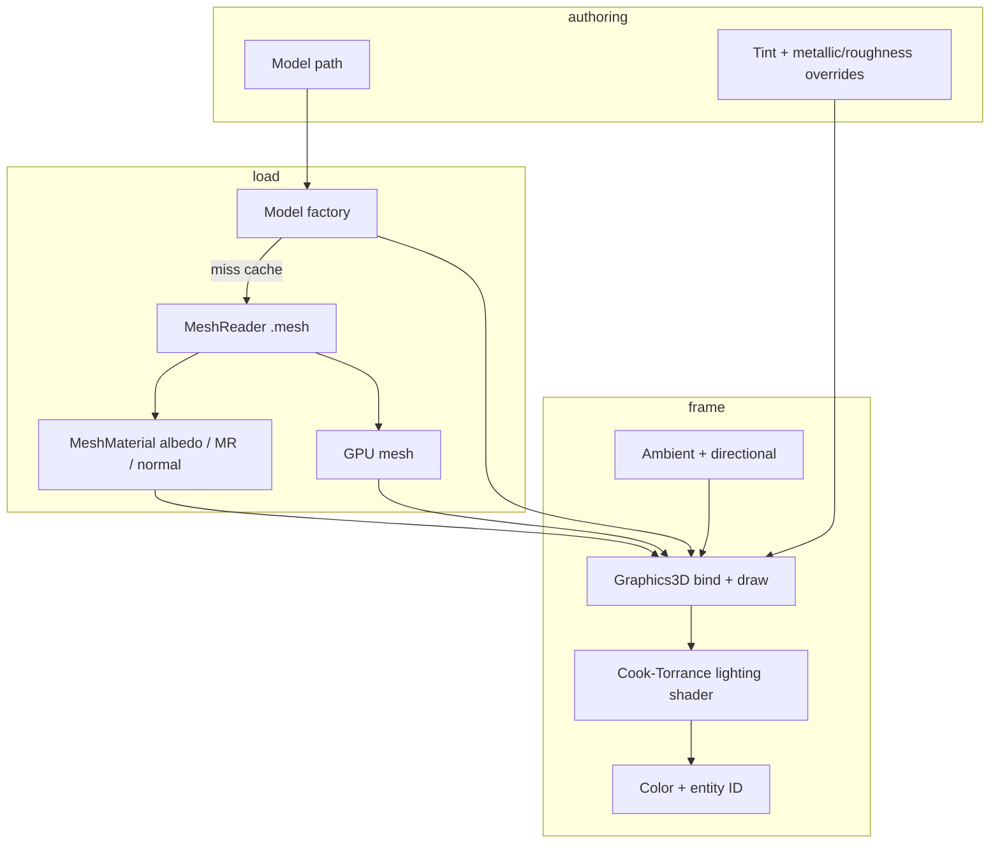
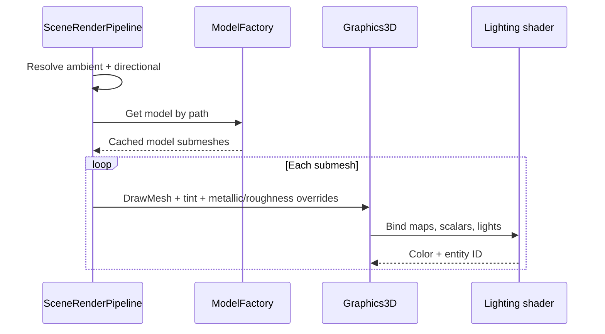

# Physically Based Rendering (Core Metal/Rough) — Developer Guide

Implementation guide for replacing forward Blinn-Phong mesh shading with metal/rough Cook-Torrance under existing ambient + directional lights. See `introduction.md` for conceptual background.

## Glossary (implementation subset)

| Term | Meaning in code |
|------|-----------------|
| Mesh material | Albedo map, packed MR map, normal map, scalar metallic/roughness |
| Packed MR | Texture: G = roughness, B = metallic |
| Albedo tint | Model renderer color; multiplies albedo map or replaces missing map |
| Overrides | Optional component metallic/roughness; when set, replace material scalars |
| Lighting shader | Forward mesh shader: ambient fill + Cook-Torrance directional |
| Legacy convert | Diffuse → albedo; metallic 0; roughness from shininess or 0.5 |

## Implementation order

1. **Mesh material fields** — swap Phong fields for PBR fields (data only)
2. **Lighting shader** — Cook-Torrance + metal-aware ambient; remove shininess/specular map
3. **Graphics3D bind path** — uniforms/samplers for new maps and scalars
4. **Assimp importer** — glTF PBR extract + legacy conversion
5. **Model renderer + editor** — metallic/roughness overrides, clamp, serialize
6. **Tests + smoke** — import mapping, overrides, serialization; manual Bistro/glTF check

---

## Step 1: Mesh material

Replace diffuse/specular/shininess with:

- Optional albedo texture + path
- Optional metallic-roughness texture + path (packed)
- Optional normal texture + path (unchanged role)
- Scalar metallic (default 0)
- Scalar roughness (default 0.5)

Remove specular texture and shininess entirely. Update any “has map” helpers to the new names.

**Why:** One material type feeds one shader; no dual Phong/PBR structs.

---

## Step 2: Lighting shader

Keep the same vertex inputs (position, normal, UV, TBN, entity id). In the fragment stage:

```
sample albedo (or white) *= tint.rgb
sample MR if present → metallic = B, roughness = G; else use scalars
sample normal map via TBN if present; else vertex normal

ambient = ambientColor * ambientStrength * albedo * (1 - metallic)

L = normalize(-directionalDirection)
NdotL = max(dot(N, L), 0)
V = normalize(viewPos - fragPos)
H = normalize(L + V)

F0 = lerp(vec3(0.04), albedo, metallic)
F, D, G = Fresnel-Schlick, GGX NDF, Smith geometry (standard forms)
specular = (D * G * F) / max(4 * NdotV * NdotL, epsilon)
kd = (1 - F) * (1 - metallic)
diffuse = kd * albedo / PI

color = ambient + (diffuse + specular) * directionalColor * NdotL
output color + entity id
```

Use a small roughness floor (e.g. remap rough²) so perfect mirrors do not NaN. No IBL terms.

**Why:** Same lights and MRT layout; only the BRDF changes.

---

## Step 3: Graphics3D bind path

When drawing a mesh:

- Bind albedo / MR / normal samplers and “has map” flags
- Set metallic and roughness floats (after applying component overrides)
- Set tint as albedo tint
- Stop uploading shininess and specular map uniforms

Cube / flat-color fallback can stay non-PBR for empty model paths, or use fixed dielectric scalars — pick one and keep it consistent.

**Why:** Draw API stays `DrawMesh(transform, mesh, material, tint, entityId)`; overrides are resolved by the caller before or inside that bind.

---

## Step 4: Assimp importer

For each material slot:

```
if PBR metal/rough present:
  albedo map ← base color texture
  albedo factor ← base color factor (store in tint default or add a factor field)
  MR map ← metallic-roughness texture, or Assimp specular slot, or Bistro `_BaseColor` → `_Specular` sibling (packed G=roughness, B=metallic)
  metallic ← metallic factor
  roughness ← roughness factor
  normal ← normal map (existing path)
else:
  albedo map ← diffuse/base color texture if any
  metallic ← 0
  roughness ← from shininess heuristic or 0.5
  drop specular map
```

Shininess heuristic (if used): higher shininess → lower roughness; clamp to \[0, 1\]. Texture paths still resolve relative to the model directory via the existing texture factory.

**Why:** glTF/Bistro assets import cleanly; old Phong files still open without a second shader.

---

## Step 5: Model renderer and editor

On the model renderer component:

- Keep model path and color tint
- Add optional metallic and roughness overrides (unset by default)
- When an override is set, it replaces the imported material scalar for that draw; when unset, use the material’s imported factor
- Do not mutate the cached material

Inspector: path, tint, metallic override, roughness override (each override clearable / “use material”). Clamp set values to \[0, 1\]. Serialize optional overrides with existing component serializers.

Draw-time combine:

```
albedoTint = component.Color
effectiveMetallic = component has metallic override
  ? clamp(override, 0, 1)
  : clamp(material.Metallic, 0, 1)
effectiveRoughness = component has roughness override
  ? clamp(override, 0, 1)
  : clamp(material.Roughness, 0, 1)
if MR map present:
  metallic = sample.B * effectiveMetallic
  roughness = sample.G * effectiveRoughness
else:
  metallic = effectiveMetallic
  roughness = effectiveRoughness
```

**Why:** Scene tuning without stomping glTF factors on every entity; maps stay file-authored.

---

## Step 6: Tests and smoke

Automated:

- PBR extract → albedo + packed MR + factors populated
- Legacy material → albedo + metallic 0 + roughness set; no specular retained
- Missing maps → shader path uses scalars only
- Set overrides clamp to \[0, 1\]; unset overrides leave imported factors
- Serialization round-trip for optional override fields
- Update model-loading tests that assert Phong field names

Manual:

- Small metal/rough glTF: metal vs dielectric readable under one sun + ambient
- Normal maps still correct
- Inspector metallic/roughness/tint change appearance without reload
- Optional: Bistro exterior under current lights (expect flat ambient; not ORCA parity)

---

## Architecture



Assimp PBR extract runs only at **Editor import** (`MeshCreator`), not on factory miss. Runtime/`ModelFactory` loads imported `.mesh` via `MeshReader`.

### Draw sequence



---

## Out of scope reminders (do not implement in this work)

- IBL / cubemaps / BRDF LUT
- Tone mapping, bloom, other post passes
- Shadows, SSAO, GI, SSR
- Deferred G-buffer or many lights
- Separate metallic and roughness textures
- Saving material overrides as standalone assets
- Editor texture slot pickers
