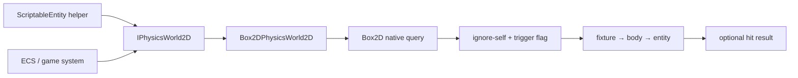
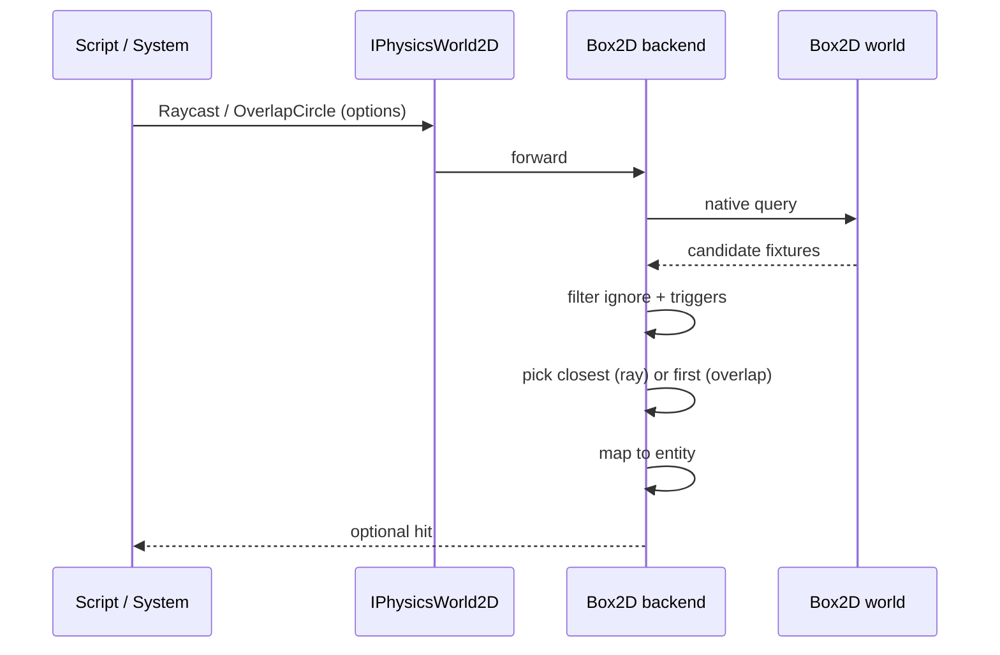

# Physics Raycasting & Shape Queries — Developer Guide

Implementation guide for closest-hit raycast and single-hit circle overlap. See `introduction.md` for conceptual background.

## Glossary (implementation subset)

| Term | Meaning in code |
|------|-----------------|
| World queries | Methods on `IPhysicsWorld2D` for raycast and overlap circle |
| Hit result | Shared hit struct: entity, point, normal, distance, isTrigger |
| Ignore entity | Optional entity Id skipped by the query filter |
| Include triggers | Boolean option; default false |
| Script helpers | `ScriptableEntity` methods that call the scene world with ignore-self |
| Body mapping | Fixture → `IPhysicsBody2D` → `Entity` (existing contact path) |

## Implementation order

1. **Hit result type + query options** — shared structs/flags, no behavior yet
2. **`IPhysicsWorld2D` methods** — declare raycast and overlap circle on the abstraction
3. **Box2D backend** — wrap native raycast / circle query; map hits to entities; apply filters
4. **Script helpers** — forward from `ScriptableEntity` with ignore-self
5. **Tests** — miss, closest, ignore-self, trigger flag, invalid inputs, helper forward

---

## Step 1: Hit result and options

Define a hit result used by both queries:

- Entity id (or entity handle consistent with contacts)
- World-space point
- Normal (ray: from backend; overlap: backend value or zero if unavailable)
- Distance (ray: along cast; overlap: from circle center to point, or 0 if center inside)
- IsTrigger

Query options on each call:

- Ray: origin, direction, max distance, optional ignore entity, includeTriggers (default false)
- Circle: center, radius, optional ignore entity, includeTriggers (default false)

Return type: optional/nullable hit (present = hit, absent = miss).

**Why:** One result shape keeps script and system code uniform. Options stay on the call, not on global world state.

---

## Step 2: World interface

Add to `IPhysicsWorld2D`:

- Closest raycast → optional hit
- Overlap circle → optional hit (any one qualifying overlap; order unspecified)

Do not add a separate queries service. Null/None physics backend implementations return miss for both.

**Why:** Matches existing abstraction; systems can call the world without an entity.

---

## Step 3: Box2D backend

Implement both methods on `Box2DPhysicsWorld2D`.

### Raycast filter logic

```
for each fixture reported by Box2D along the ray:
  resolve body → entity
  if entity missing → skip
  if entity == ignoreEntity → skip
  if fixture is trigger and not includeTriggers → skip
  keep closest remaining hit (by fraction/distance)
return closest hit or miss
```

### Overlap circle filter logic

```
for each fixture overlapping the circle:
  resolve body → entity
  if entity missing → skip
  if entity == ignoreEntity → skip
  if fixture is trigger and not includeTriggers → skip
  return first remaining hit  // stop; no ordering guarantee
return miss
```

Keep filter callbacks side-effect free (no destroy/create bodies inside the filter).

Map fixture user data the same way the contact listener already resolves entities.

**Why:** Native broad/narrow phase stays authoritative; filters encode v1 rules only.

---

## Step 4: Script helpers

On `ScriptableEntity`, add helpers that:

1. Resolve the active scene physics world
2. Call world raycast / overlap with the same parameters
3. Pass the calling entity as ignore entity

If there is no world, return miss (do not throw).

Systems that already hold `IPhysicsWorld2D` call the world directly and pass ignore entity explicitly when needed.

**Why:** Common gameplay is one line; world remains usable without scripts.

---

## Step 5: Edge cases

| Case | Behavior |
|------|----------|
| No hit | Miss (empty optional) |
| No physics world / backend None | Miss |
| Distance ≤ 0 or radius ≤ 0, or non-finite inputs | Miss (optional debug log) |
| Ignore entity null/destroyed | Filter no-op; query still runs |
| Fixture without entity mapping | Skip fixture |
| Multiple overlaps | Any one hit; document non-ordering |

---

## Architecture





Queries do not touch `PhysicsContactQueue` or contact callbacks.

---

## Testing checklist

World/backend:

- Ray miss (empty or past geometry)
- Ray closest among two candidates on the same ray
- Ray ignores specified entity
- Ray skips triggers by default; hits when includeTriggers true
- Overlap miss / single hit / ignore-self / trigger flag
- Invalid distance/radius → miss, no throw

Script helper:

- Forwards ignore-self to the world (fake world if that matches existing test style)

---

## Out of scope (do not implement in this pass)

- All-hits raycast
- TestPoint / AABB / box overlap
- Layer masks / collision matrix
- Editor physics picking
- Guaranteed “closest overlap” ordering
