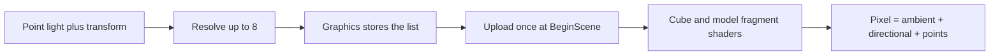
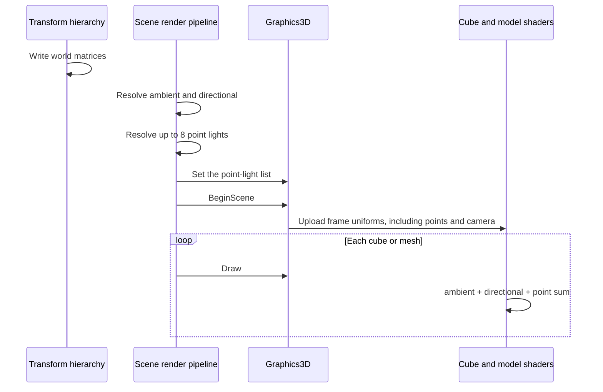

# Point Lighting — Developer Guide

Implementation guide for adding up to eight unshadowed point lights to the 3D pass. Assumes familiarity with the ambient and directional frame-uniform path.

## Implementation Overview



## Glossary

| Term | Implementation meaning |
|------|------------------------|
| Frame light set | At most eight records: world position, RGB color, intensity, range |
| Valid light | Has a transform and a range greater than zero |
| Attenuation | `(1 - distance / range)²` inside the range, otherwise zero |
| Cube sharpness | Constant 32, matching the mesh default |
| Specular default | 0.5 when the surface has no specular map; cubes always use 0.5 |
| Cap | 8, identical in the resolver and in both fragment shaders |

## Step-by-Step Requirements

### 1. Add the component

Add a point-light component beside the existing light components.

**Fields:** color (default white), intensity (default 1), range (default 10). No position field. Support clone, same as the other light components.

**Why:** The scene file and the editor need a data holder. Position stays on the transform so hierarchy already works.

### 2. Register serialization, the inspector, and the add-component menu

Register the component with the same JSON serializer registry as ambient and directional. Add an inspector with the three fields, registered in the editor container next to the other light editors. Add a menu entry next to the existing light entries.

**Why:** Without these, the component exists but cannot be created, edited, or saved.

### 3. Resolve the frame light set

Before the 3D draw loop, walk entities that have both the point-light component and a transform, in view order.

```
count = 0
for each (light, transform) in that view:
    if light.range <= 0: continue
    if count == 8: break
    intensity = max(0, light.intensity)
    position = transform.worldMatrix.translation
    store (position, light.rgb, intensity, light.range)
    count += 1
```

Pass the stored prefix of length `count` to the graphics layer. An empty result is valid.

**Why:** Selection rules live in one place. Skipping invalid lights means they do not consume a slot. Clamping intensity keeps a dimmed light in its slot. World translation is the cache written by the transform hierarchy pass, which runs before the render pass.

### 4. Upload once per 3D pass

Extend the graphics interface with a setter for the frame light set. Store the count and eight records. When the frame uniforms are uploaded to the cube shader and the model shader, also upload:

- the count
- position, color, intensity, and range for every slot

Upload all eight slots. Slots at and past `count` are zero. Both shaders also receive the camera position. Today only the model shader does.

**Why:** Draw calls must not repeat the light list. Zeroing unused slots keeps a stale light from surviving a shorter list. The cube needs the camera position for the specular vector.

### 5. Give the cube a world-space fragment position

The cube vertex shader already computes a world position for the clip transform. Pass that position to the fragment shader. The model vertex shader already does this.

**Why:** The light direction is `lightPosition - fragmentPosition`. Without the fragment position, the cube cannot evaluate a point light.

### 6. Add the same point term to both fragment shaders

Keep the existing ambient and directional terms. Add a function, duplicated in both fragment shaders, that loops from zero to the uploaded count and accumulates:

```
toLight = lightPosition - fragmentPosition
distance = length(toLight)
if distance >= range: add nothing
if distance is near zero:
    add (color * intensity * albedo) and no specular
else:
    attenuation = (1 - distance / range)²
    L = toLight / distance
    diffuse = max(dot(N, L), 0) * color * intensity * albedo
    H = normalize(L + viewDirection)
    specular = pow(max(dot(N, H), 0), sharpness) * color * intensity * specularColor
    add (diffuse + specular) * attenuation
```

Model sharpness and specular color stay on the mesh path already used for the directional highlight. Cube sharpness is 32 and cube specular color is 0.5.

```
pixel = ambient + directional + pointSum
```

Leave the 2D and line shaders unchanged.

**Why:** One formula keeps cubes and models consistent. The near-zero guard avoids normalizing a zero vector when a fragment sits on the light. Duplication is required because shader files are loaded as whole files, not combined from a shared snippet.

### 7. Lock the attenuation curve on the CPU

Expose the scalar attenuation used above from the existing lighting-math helper, and test it directly: distance 0 returns 1, distance equal to range returns 0, half range returns 0.25. The shader expression must match that helper. The helper is not uploaded to the GPU.

**Why:** A wrong falloff is invisible in a unit test of the resolver. The scalar test fails if the agreed curve changes by accident.

## Data Flow



## Edge Cases

| Input | Result |
|-------|--------|
| No point lights | Count zero, point term adds nothing |
| No transform | Skipped, slot not consumed |
| Range zero or negative | Skipped, slot not consumed |
| Intensity negative | Kept, intensity stored as zero |
| Ninth valid light | Dropped, no per-frame log |
| Fragment within 0.0001 of the light | Full diffuse, no specular |
| Color alpha | Ignored; RGB only |

## Testing

Cover the resolver without a GPU:

- Empty scene yields no lights.
- A light with a transform returns that world translation, color, intensity, and range.
- A child uses the world translation, not its local translation.
- Missing transform does not consume a slot.
- Non-positive range does not consume a slot, and a later valid light still fits.
- Negative intensity stays in the set as zero.
- Nine valid lights keep the first eight in entity order.

Cover attenuation with the three values in step 7.

Update the existing frame-uniform test: the cube shader now receives the camera position, and a point-light upload is visible on both shaders at scene begin, not again on draw.

Do not add a GPU render test.

## Pitfalls

**Reading local translation.** The hierarchy cache is the position. Local translation ignores parents.

**Resolving before the hierarchy pass.** The render pass already runs after the hierarchy pass. A test that never writes the world matrix will see the identity translation.

**Diverging shader copies.** A change to the falloff or the eight-light cap must land in the CPU helper, the resolver, and both fragment shaders.

**Multiplying the cube point term by albedo twice.** The point function already includes albedo and specular color. Add it to the cube's existing ambient and directional result. Do not run it through the cube's extra albedo multiply.

**Leaving the cube without a camera uniform.** Specular on the cube needs the view position that only the model shader receives today.

## Done When

- [ ] Component has color, intensity, range, and clone
- [ ] Scene save/load, inspector, and add-component menu include it
- [ ] Resolver applies the selection and clamp rules
- [ ] Both 3D shaders add the point term and receive the list once per pass
- [ ] Cube vertex shader outputs fragment world position
- [ ] Attenuation test matches 1, 0, and 0.25
- [ ] Resolver tests cover skip, clamp, world position, and the eight-light cap
- [ ] 2D and line shaders are unchanged
