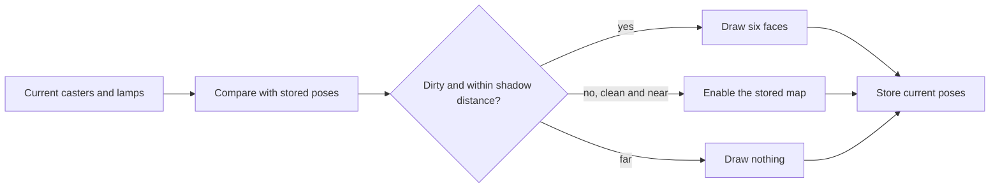
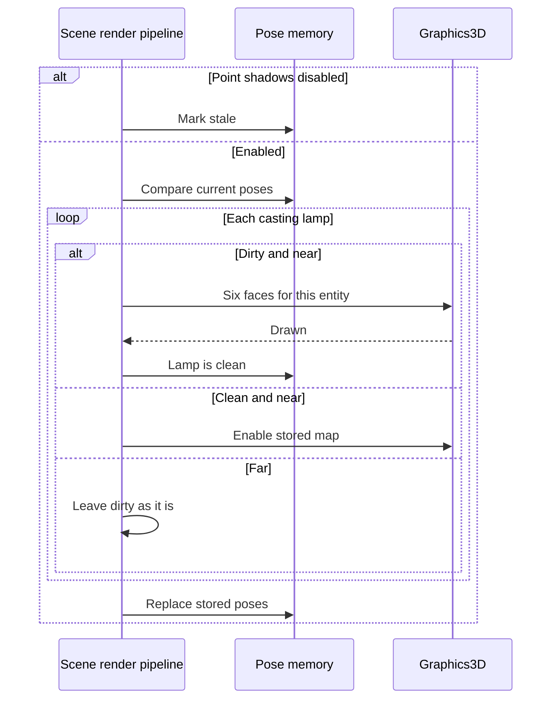

# Point Shadow Cache — Developer Guide

Implementation guide for reusing a point-shadow cubemap until the lamp or a caster that touches it moves. Assumes the existing point-shadow pass, the casts-shadow flag, and the shadow distance.

## Implementation Overview



## Glossary

| Term | Implementation meaning |
|------|------------------------|
| Caster pose | Entity id, world matrix, local bounds, and whether bounds exist |
| Lamp pose | Entity id, world position, range |
| Mover | Current pose missing, previous pose missing, matrix differs, or bounds differ |
| Hit | World-space bounds touch the lamp sphere of the given pose |
| Unbounded caster | A caster with no bounds. A mover of this kind hits every lamp |
| Stale | The next shadow frame treats every casting lamp as dirty and then clears the flag |
| Map owner | The lamp entity id, not the 0–7 uniform slot |

## Step-by-Step Requirements

### 1. Key each cubemap by the lamp entity

The graphics layer keeps one depth cubemap per lamp entity id, created lazily the same way as today's per-slot map. The 0–7 index remains the shader slot for this frame only.

Two calls use that slot:

- Begin a face, as today, also told which entity owns the map. A successful six-face draw is what makes the lamp clean.
- Use the cached map: enable that entity's existing cubemap on the slot. Do not bind the framebuffer, do not clear, do not draw. Return failure when that entity has no map, so the caller can draw instead.

Switching the entity id stored for a slot must not reuse another lamp's image. Disposing the graphics object disposes every entity map. Changing the active scene drops the pose memory and every decision that depended on it.

**Why:** The resolved list is ordered by encounter, and it shifts. The uniform slot is allowed to shift with it. The pixels are not.

### 2. Remember poses across shadow frames

Keep two maps from the last frame that actually updated the cache: caster entity to pose, lamp entity to pose. A separate set holds lamp entities that are dirty until a draw succeeds.

When the view has point shadows disabled, do not draw, do not replace the pose maps, and set stale. The next enabled frame treats every casting lamp as dirty, then clears stale.

When the active scene changes, clear both pose maps, clear the dirty set, and set stale.

**Why:** The editor skips point shadows. Objects moved there must not be compared against a snapshot that never saw them. A new scene reuses entity ids.

### 3. Decide dirty before drawing

Collect the same casters the point-shadow walk would draw: untextured cubes, textured cubes, loaded models, and failed-model fallback cubes. Skip suppressed draws and a mesh index that draws nothing. A model with any missing submesh bounds is unbounded. Otherwise the caster bounds are the union of the submesh bounds, in the mesh's local space. Cubes and fallbacks use the unit cube bounds.

A lamp is dirty when any of these is true:

- The frame is stale, or the lamp is already in the dirty set, or it has no stored pose
- Its position or range differs from the stored pose
- A current caster is a mover and either its previous pose hits the lamp's previous sphere, or its current pose hits the lamp's current sphere
- A caster stored last frame is gone, and its stored pose hits the lamp's previous sphere
- A mover has no bounds on the pose being tested

An unbounded mover hits every lamp. A lamp whose position or range changed is dirty as a whole, so static casters now inside it do not need their own test.

Color and intensity are not part of the pose.

**Why:** The previous sphere is the only way to notice a caster that left. The current sphere is the only way to notice a caster that arrived.

### 4. Draw, reuse, or skip

For each resolved lamp that casts:

```
if the lamp is dirty:
    remember it as dirty
    if it is farther than the shadow distance:
        skip
    else if six faces cannot be built, or a face fails to begin:
        skip the rest of its faces
    else:
        draw each face with the shared opaque walk
        forget that it is dirty
else if it is farther than the shadow distance:
    skip
else:
    enable the cached map for its entity
    if that enable fails:
        treat it as dirty and draw as above
```

After the loop, if this frame was enabled, replace both pose maps with the current casters and the current casting lamps. Do this even when every lamp was skipped for distance, so the next frame can see who moved.

A lamp that does not cast is absent from the lamp pose map. Turning the flag on makes it a lamp with no stored pose, so it is dirty.

**Why:** Distance culling already hides the shadow. Keeping the dirty bit while culled is what forces one redraw when the lamp returns. Replacing the poses after a distance-only frame is what detects motion that happened out of view.

### 5. Test the sphere against the world bounds

Transform the eight corners of the local bounds by the world matrix and take their axis-aligned box. The sphere hits when the closest point of that box to the lamp is within the range. Compare squared distance to squared range.

A pose with no bounds does not use this test. The caller treats that mover as a hit.

**Why:** A rotated box is larger than its local box. The corner box is the same conservative bounds the frustum cull already accepts. Squared distance avoids a square root on every pair.

## Data Flow



## Edge Cases

| Input | Result |
|-------|--------|
| First enabled frame | Stale, every casting lamp draws once |
| Second frame, nothing moved | No faces, cached maps enabled |
| Camera moves, lamp stays within shadow distance | No faces |
| Caster moves inside one lamp | That lamp draws six faces |
| Caster leaves a lamp | The lamp it left draws six faces |
| Caster enters a lamp | The lamp it entered draws six faces |
| Lamp moves or range changes | That lamp draws six faces |
| Color or intensity changes | No faces |
| Caster moves every frame | Only lamps it hits redraw |
| Lamp beyond shadow distance, world static | No faces, map kept |
| Something moves while the lamp is beyond shadow distance, then the camera returns | That lamp draws once |
| Caster has no bounds and its pose changed | Every casting lamp is dirty |
| New caster inside a sphere | That lamp is dirty |
| Removed caster was inside a sphere | That lamp is dirty |
| Face draw fails | Lamp stays dirty, next enabled frame tries again |
| Editor view | No faces, memory not replaced, stale set |
| Active scene changes | Pose memory cleared, next enabled frame draws every casting lamp |
| Directional shadow | Still redrawn every frame |

## Testing

Cover the sphere without a GPU:

- A unit cube at the origin hits a lamp at the origin with range 10.
- The same cube translated by 30 does not hit a lamp at the origin with range 10.
- A cube that sits just outside the range on X does not hit. One unit inside does.

Cover the dirty decision without a GPU, using two explicit pose lists:

- No previous lamp pose means dirty.
- Identical caster and lamp poses mean clean.
- A caster matrix change inside the range means dirty. The same change outside both the old and the new range means clean.
- A caster that was inside and is now outside means dirty.
- A lamp position change means dirty even when no caster moved.
- A removed caster whose stored bounds hit the previous sphere means dirty.
- An unbounded mover means dirty.

Cover the pipeline with the graphics substitute:

- Frame one with a casting lamp and one cube begins six faces.
- Frame two with the same world enables the cached map and begins no face.
- Moving the cube's world matrix begins six faces again.
- A view with point shadows disabled begins no face. The next enabled view begins six faces.
- A casting lamp farther than the shadow distance begins no face. After a caster inside its range moves and the lamp is brought back within distance, it begins six faces.

Do not add a GPU pixel test.

## Pitfalls

**Slot as identity.** The cubemap follows the entity id. The uniform index is assigned again every frame.

**Updating memory on a disabled view.** The editor moves objects while point shadows are off. Replacing poses there, or trusting poses from before the edit, leaves the played frame clean and wrong. Stale forces one full draw instead.

**Clearing dirty on a distance skip.** The lamp was not drawn. The bit stays until a draw finishes.

**Previous sphere only.** A test against the current sphere alone keeps the shadow of a crate that already left.

**Exact matrix compare.** Any change of translation, rotation, or scale is a new pose. A change that does not alter the world matrix or the local bounds is invisible to the cache.

**Scene lifetime.** The pose maps are process memory. Clearing them when the active scene changes stops entity ids from the last scene from matching objects in the next one.

## Done When

- [ ] Each cubemap is stored and sampled by lamp entity id
- [ ] A clean lamp near the camera enables the stored map and draws no face
- [ ] A mover dirties the lamps hit by its previous pose and the lamps hit by its current pose
- [ ] A lamp pose change dirties that lamp only
- [ ] A lamp beyond the shadow distance is not drawn, and a dirty bit survives that skip
- [ ] A disabled point-shadow view marks the cache stale and does not replace poses
- [ ] Changing the active scene clears the pose memory
- [ ] Sphere, dirty-decision, and pipeline tests cover the cases above
- [ ] The directional shadow pass still draws every frame
