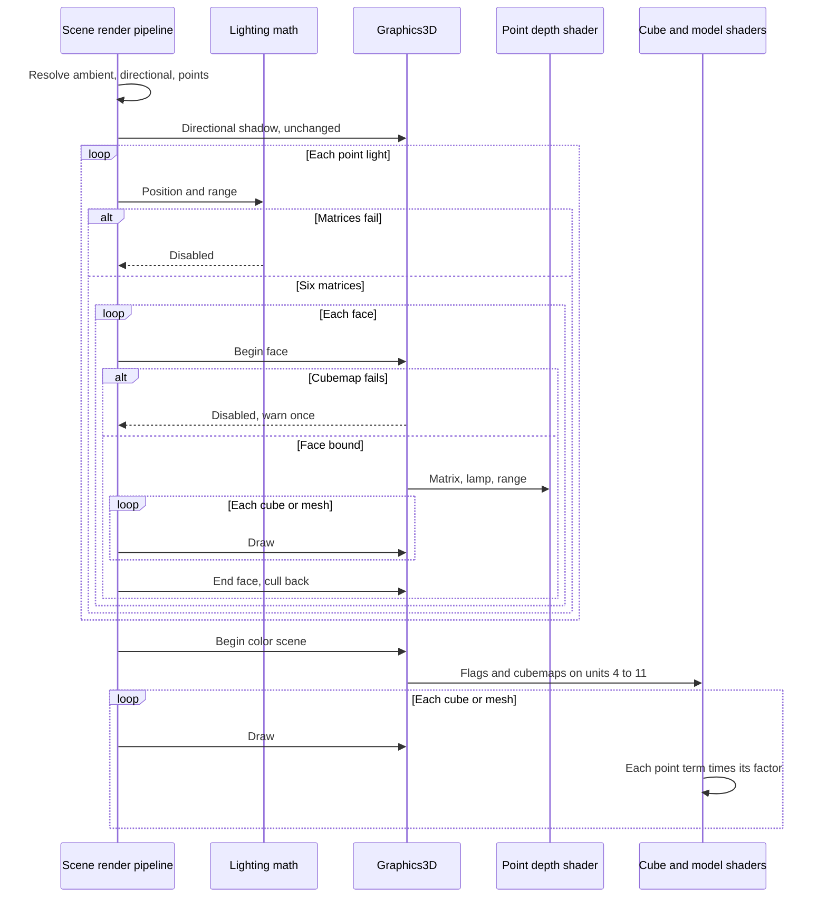

# Point Shadows — Developer Guide

Implementation guide for a cubemap shadow on every point light the frame already shades. Assumes the directional shadow pass and the point-light uniform path.

## Implementation Overview


## Glossary

| Term | Implementation meaning |
|------|------------------------|
| Face size | 512, one constant for every cubemap face |
| Near plane | 0.1 world units. A range at or below this skips the shadow |
| Far plane | That light's range |
| Stored distance | `length(world - lamp) / range`, written as fragment depth |
| Bias | 0.05 world units, divided by range before the comparison |
| Factor | Average of nine comparisons. 1 when the light has no cubemap |
| Kernel | 3×3 offsets in the plane perpendicular to the lamp-to-fragment direction. Step is two texels of a 90° face at that distance: `distance * pi / 512` |
| Cube slots | Texture units 4 through 11, one per light index. Unit 3 stays the directional map |
| Face order | +X, −X, +Y, −Y, +Z, −Z, matching cubemap sampling |

## Step-by-Step Requirements

### 1. Build six face matrices on the CPU

Add a function beside the existing lighting math. Inputs: lamp position, range, and a span of six matrices. Output: true and the matrices, or false. No exceptions.

Reject a span shorter than six and a range less than or equal to 0.1. Build one perspective matrix: 90° field of view, aspect 1, near 0.1, far equal to the range. For each face, build a look-at from the lamp along that axis and multiply view by projection, the same order as the camera view-projection.

Axes and up vectors, in face order:

| Face | Look direction | Up |
|------|----------------|----|
| +X | +X | −Y |
| −X | −X | −Y |
| +Y | +Y | +Z |
| −Y | −Y | −Z |
| +Z | +Z | −Y |
| −Z | −Z | −Y |

**Why:** The color pass only needs the cubemap and the lamp position. The matrices exist so the depth pass rasterizes the right face, and so a unit test can judge them without a GPU. The up vectors keep the faces oriented the way cubemap sampling reads them.

### 2. Allocate one depth cubemap per light

Create each one lazily, through the existing framebuffer factory, the first time that light index is drawn. Size 512 by 512. No color attachment. Depth format is the cubemap format the framebuffer already has. Nearest filtering. Clamp-to-edge on S, T, and R.

The factory's completeness check runs at creation. A non-layered framebuffer with the whole cubemap attached as one layered image is not complete. Attach face +X as a single 2D face before that check. Later faces reuse the bind-one-face path that already exists.

Binding the framebuffer already switches the viewport and restores it on unbind. Do not set the viewport a second time. Keep the cubemap for the rest of the process and dispose it with the graphics object.

**Why:** Eight lights at 512 is the budget chosen for this feature. Nearest filtering keeps the comparison on real depths. Clamp-to-edge is what the cubemap attachment already sets; a cubemap sample always hits a face.

### 3. Draw each face with a distance shader

Keep the directional depth shader as it is. Add a second pair for point faces. The vertex shader reads position at attribute 0, writes world position to the fragment stage, and sets clip position with model then view-projection, row-vector order, same as the directional depth shader. The fragment shader writes fragment depth as distance from the lamp divided by range.

The graphics layer grows two calls: begin a face, and end it. Begin takes the light index, the face index, the face matrix, the lamp position, and the range. It binds that cubemap, attaches that face, clears it, forces depth test and depth writes on, culls front faces, and binds the distance shader with the matrix, the position, and the range. End unbinds the shader and the framebuffer and culls back faces again.

While a point face is open, cube and mesh draws set only the model matrix on the distance shader and draw. They do not bind color textures. The directional depth shader stays bound only for the directional pass.

The renderer today can enable culling, and enabling it always culls back faces. Add a switch that culls front faces during the point pass and restores back faces at the end. Leave culling enabled.

Begin returns false when the cubemap cannot be created. On false it does not change culling and it marks that light's factor as disabled. The caller skips the walk and does not call end.

**Why:** Both vertex formats put position at attribute 0, so one program covers cubes and models. Storing distance is what the color shader compares. Front-face culling during this pass keeps the back of a thin wall as the occluder. The directional pass continues to cull back faces because it runs first and this pass restores the cull before the color scene.

### 4. Walk every point light after the directional pass

The opaque walk stays the one function both shadows and the color pass already share. After the directional block:

```
clear every point-shadow enabled flag
for each resolved point light, in order:
    if six face matrices cannot be built:
        leave that light disabled
        continue
    for each face:
        if begin face fails:
            warn once per process
            leave that light disabled
            stop its remaining faces
        walk
        end face
begin the color scene
walk
end the color scene
```

Wrap the walk of a face so end still runs when the walk throws. A black directional color, or a failed directional fit, still runs this loop. A frame with no point lights does not begin a face.

**Why:** One walk keeps fallbacks and suppressed draws identical on every face. Flags start clear every frame so a light that dropped out does not keep last frame's shadow. The directional pass and the point passes fail independently.

### 5. Average nine samples in both fragment shaders

Upload, once per color scene, to the cube shader and the model shader: an enabled flag per light, and that light's cubemap on unit `4 + index` when the flag is on. Set each cubemap sampler's unit once at init. Do not upload again per draw.

Copy this test into both fragment shaders. The loop index is the light index:

```
if this light's shadow is disabled: factor = 1
else:
    vector = fragmentWorld - lamp
    distance = length(vector)
    current = distance / range
    bias = 0.05 / range
    build a tangent and a bitangent perpendicular to vector
    step = distance * pi / 512
    for x and y from -1 to 1:
        sample the cubemap at vector + (tangent * x + bitangent * y) * step
        add 0 when current - bias > sample, else add 1
    factor = sum / 9
```

Apply the factor to that light's diffuse plus specular, after attenuation. The existing early-out for a fragment closer than the point-light epsilon stays fully lit and does not sample. A fragment at or beyond range still adds nothing and does not sample.

On the cube, point lights are the summed term added beside ambient and the shadowed directional diffuse. On the model, they are the summed term added beside ambient and the shadowed directional diffuse plus specular. Leave the 2D and line shaders unchanged.

**Why:** The cubemap stores distance over range. Comparing window depth to it darkens the wrong pixels. Nine samples match the directional kernel's width without a twenty-tap disk across eight lights. Duplication is required because shader files are loaded whole.

## Data Flow



## Edge Cases

| Input | Result |
|-------|--------|
| No point lights | No face pass, directional path unchanged |
| Range ≤ 0 | Already dropped by point-light resolve |
| Range ≤ 0.1 | Factor 1, no warning |
| Ninth point light | Already dropped by the cap of eight |
| Cubemap creation fails | That light's factor is 1, one warning per process, frame continues |
| Empty scene | Faces stay cleared to far, nothing is in shadow |
| Fragment closer than the point epsilon | That light adds full radiance, no sample |
| Fragment at or beyond range | That light adds nothing, no sample |
| Sampled direction on a cleared texel | Stored distance 1, comparison stays lit |
| Failed model path | Fallback cube on every face and in the color pass |
| Directional fit failed | Point faces still run |
| No directional light | Point faces still run |
| Object farther than range | Clipped by the far plane, casts nothing |

## Testing

Cover the matrices without a GPU:

- A lamp at a known position and a range above 0.1 returns six matrices.
- A point on the +X axis, farther than 0.1 and closer than the range, lands inside face +X and outside the other five.
- A point farther than the range from the lamp lands outside every face.
- A range of 0.1 or below returns failure and does not throw.

Cover the pipeline with the existing graphics substitute, no GPU:

- No point light begins no face, and the directional order stays the one those tests already expect.
- One point light and one cube begin six faces and draw the cube on each, then once in the color pass.
- Two point lights begin twelve faces.
- A range of 0.1 or below begins no face for that light.
- A ninth light begins no face.
- A failed model draws the fallback cube on the faces.
- A failed directional fit still begins the six faces.
- Face order in the log is directional shadow, then point faces, then the color scene.

Extend the graphics-integration shader test that already compiles `cube.frag` so it also compiles the point-depth pair. `modelShader.frag` gets the same cubemap function and has no separate compile test.

Do not add a GPU pixel test.

Check by hand in the editor: a lamp between the camera and a crate on a floor. The floor behind the crate darkens for that lamp only. A second lamp still lights that floor unless its own cubemap is blocked. Ambient still brightens the shadow. Turning the directional color to black removes the sun shadow and leaves the lamp shadow. A sprite neither casts nor receives.

## Pitfalls

**Layered cubemap attachment.** Creation checks framebuffer completeness. Attach a single face before that check. The whole-cube layered attachment is for a geometry shader this feature does not use.

**Window depth in the cubemap.** The directional image stores window depth. Point faces must overwrite fragment depth with distance over range. Leaving the perspective depth in the cubemap makes the color comparison meaningless.

**Wrong face up vectors.** Cubemap sampling assumes the face orientation in the table above. A look-at with world +Y as up on +X writes a face the sample direction will read flipped or shifted.

**Culling left on front faces.** End of every face, including when the walk throws, restores back-face culling before the color scene.

**Last frame's flag.** Clear every light's enabled flag at the start of the point loop. A successful frame followed by a failed cubemap must return that light's factor to 1.

**Shadowing ambient or the sun.** The factor multiplies one point light's diffuse plus specular only, after that light's attenuation.

**Sampler units 0 through 3.** Cubemaps use units 4 through 11. Cube and model draws rebind 0 through 2. The directional map stays on 3.

**A non-uniform sampler index.** Index the cubemap array with the light loop index. An index that varies between fragments in one draw is undefined in this shader version.

**Divergent shader copies.** The bias, the nine offsets, the step, and the comparison have to match in both fragment shaders.

**Directional depth shader reused for faces.** That shader writes no distance. Point faces bind the distance shader only.

## Done When

- [ ] Six face matrices are built from position and range, or the call returns failure without throwing
- [ ] Each of up to eight lights has a lazy 512 depth cubemap, created with a single face attached
- [ ] A distance shader draws cubes and models into the bound face
- [ ] Front faces are culled only during a point face, and back faces are culled again before the color scene
- [ ] The opaque 3D walk is shared by the directional pass, every face, and the color pass
- [ ] A failed cubemap warns once and leaves that light's factor at 1
- [ ] A missing directional shadow does not skip point faces
- [ ] Both 3D fragment shaders average nine comparisons onto that light's term only
- [ ] Matrix, pipeline, and point-depth compile tests cover the cases above
- [ ] 2D and line shaders are unchanged
- [ ] The point-light component, its editor, and the scene save format are unchanged
