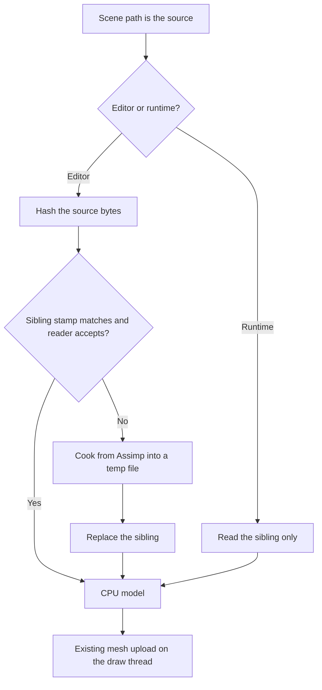
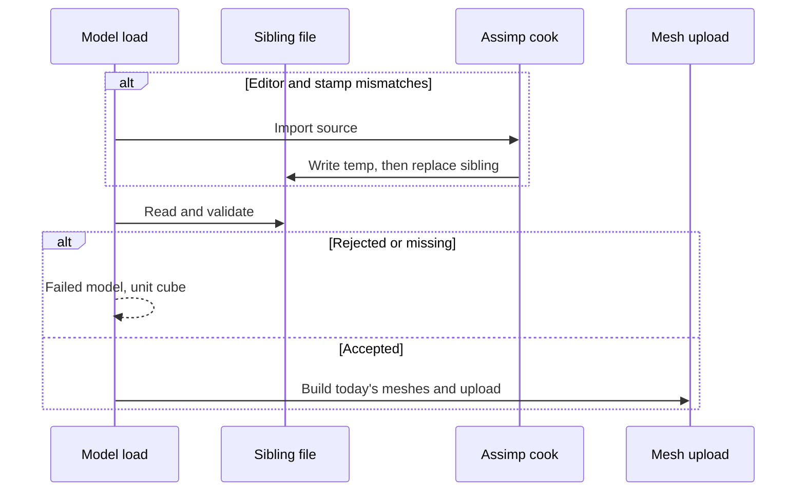

# Runtime Mesh — Developer Guide

Implementation guide for a version-1 sibling that replaces Assimp on load. Assumes today's Assimp import, mesh upload, model cache, hierarchy unpack, and publish copy of the whole `assets` tree.

## Implementation Overview





## Glossary

| Term | Implementation meaning |
|------|------------------------|
| Sibling path | Source path with `.mesh` appended: `crate.glb` → `crate.glb.mesh` |
| Texture folder | `{source file name}.tex` beside the source: `crate.glb.tex` |
| Layout 1 | 56 bytes: position, normal, uv, tangent, bitangent, all float32. No entity id |
| Index type 1 | Unsigned 32-bit indices. The only type version 1 writes or accepts |
| Stamp | `sourceSize`, `sourceSha256`, `importerVersion`, `postProcessFlags` |
| Importer revision | A constant bumped when extraction or the Assimp flag set changes |
| CPU model | The in-memory submeshes, relative texture paths, graph, and lights before upload |
| Record | One mesh, node, or light. Starts with its own byte length, ends padded to 8 |

## Step-by-Step Requirements

### 1. Describe the model before any GPU object exists

The cook and the reader share one in-memory description: submeshes, a node tree, and lights. A submesh holds the layout-1 vertices, 32-bit indices, the box, material factors, and four texture paths. A node holds a name, a local matrix, submesh indices, a light index, and child indices. A light is either a point light or a directional light, in the units the importer already stores.

The entity id is applied when a GPU vertex is built, with the same default the importer uses today. It is not a field in the file.

**Why:** Assimp and the reader must be able to produce the same description. Upload stays the existing initialization, which already drops CPU vertices after the buffers exist.

### 2. Point the sibling at the source path

Given the absolute source path, the sibling is that path plus `.mesh`. Embedded images go in `{source file name}.tex` in the same directory. Paths inside the sibling are relative to the source directory, using `/` as the separator.

External textures store that relative path when the resolved file sits inside the source directory. A resolved file outside that directory is stored as an empty map, with the same warning a missing file already gets. Embedded images are written into the texture folder, named by the first 16 hex characters of the SHA-256 of their bytes plus the extension the importer already chooses. The sibling stores the relative path. The cook does not store a path under the temp directory.

**Why:** `crate.glb` and `crate.fbx` need different siblings. A temp path dies between launches, and the runtime will not extract images from the source.

### 3. Write version 1 little-endian

Write a temporary file in the sibling's directory, flush it, then replace the sibling. If the cook fails, delete the temporary file and leave any previous sibling as it was. Do not publish a half-written sibling.

The header is 128 bytes. Every integer is little-endian. Do not overlay a C# struct onto the bytes.

| Offset | Size | Type | Field |
|--------|------|------|--------|
| 0 | 4 | bytes | Magic `GEM1` |
| 4 | 4 | u32 | `version` = 1 |
| 8 | 8 | u64 | `fileSize`, the length of the file in bytes |
| 16 | 4 | u32 | `flags` = 0 |
| 20 | 4 | u32 | `vertexLayoutId` = 1 |
| 24 | 4 | u32 | `indexType` = 1 |
| 28 | 4 | u32 | `meshCount` |
| 32 | 4 | u32 | `nodeCount` |
| 36 | 4 | u32 | `lightCount` |
| 40 | 4 | u32 | `importerVersion` |
| 44 | 4 | u32 | `postProcessFlags`, the Assimp flag set used to cook |
| 48 | 8 | u64 | `sourceSize` |
| 56 | 32 | bytes | `sourceSha256` |
| 88 | 8 | u64 | `meshTableOffset`, or 0 when `meshCount` is 0 |
| 96 | 8 | u64 | `nodeTableOffset`, or 0 when `nodeCount` is 0 |
| 104 | 8 | u64 | `lightTableOffset`, or 0 when `lightCount` is 0 |
| 112 | 16 | bytes | Reserved, all zero |

A string is a u32 byte length, then that many UTF-8 bytes, with no trailing NUL. Fields inside a record are packed in the order below. They are not given C# alignment. The reader decodes integers explicitly. Each record starts at a multiple of 8. Its `byteLength` includes the trailing zeros that pad the record to a multiple of 8.

Mesh record, in order:

| Field | Type | Meaning |
|-------|------|---------|
| `byteLength` | u32 | Length of this record, including padding |
| name | string | Mesh name, empty allowed |
| `vertexCount` | u32 | Number of layout-1 vertices |
| `indexCount` | u32 | Number of indices, a multiple of 3 |
| `hasBounds` | u32 | 1 in version 1 |
| box min | 3 × f32 | Minimum corner |
| box max | 3 × f32 | Maximum corner |
| `metallic` | f32 | Already clamped by the importer, 0 to 1 |
| `roughness` | f32 | Already clamped by the importer, 0 to 1 |
| base color | 3 × f32 | Finite RGB |
| diffuse, normal, metallic-roughness, occlusion | 4 strings | Empty when that map is absent |
| vertices | `vertexCount` × 56 bytes | Layout 1 |
| indices | `indexCount` × 4 bytes | Unsigned 32-bit |

Layout 1, byte offset within a vertex:

| Offset | Type | Field |
|--------|------|--------|
| 0 | f32 × 3 | Position |
| 12 | f32 × 3 | Normal |
| 24 | f32 × 2 | Texture coordinate |
| 32 | f32 × 3 | Tangent |
| 44 | f32 × 3 | Bitangent |

Node record, in order: `byteLength`, name, sixteen f32 local-matrix values in row-major order matching `System.Numerics.Matrix4x4` (`M11` through `M44`), u32 submesh-index count, that many u32 submesh indices, i32 light index (`-1` when the node has no light), u32 child count, that many u32 child indices.

Node 0 is the root. It appears in no child list. Every other node appears in exactly one child list.

Light record, in order: `byteLength`, u32 kind. Kind 1 is a point light: four f32 color channels, f32 intensity, f32 range. Kind 2 is a directional light: four f32 color channels, three f32 direction components.

Table order in the file is meshes, then nodes, then lights. A table with a zero count has offset 0 and occupies no bytes. A non-zero table offset is at least 128, a multiple of 8, and strictly after the previous non-zero table.

The writer copies the CPU model the current importer already builds: skip empty meshes and Unreal collision meshes, keep only triangles, keep `JoinIdenticalVertices` as Assimp does it, do not weld on position alone, do not bake node matrices, do not merge submeshes that use different materials. A node may list the same submesh index more than once; each listing is kept.

**Why:** The draw path uploads one mesh per submesh and draws with unsigned 32-bit indices. The file matches that, minus the entity id, which is filled at upload.

### 4. Reject a bad file before the large arrays and before upload

Read the whole sibling only up to the size cap, then check the header against that length. Walk records with the declared `byteLength`. Build the CPU model only after the checks pass.

Reject when any of these is true:

- The file is shorter than 128 bytes, or longer than 512 MB.
- Magic, `version`, `flags`, `vertexLayoutId`, or `indexType` is not the version-1 value. `flags` must be 0. Layout must be 1. Index type must be 1.
- `fileSize` does not equal the actual length. Reserved header bytes are not all zero.
- `meshCount` is 0 or greater than 4096. `nodeCount` is 0 or greater than 8192. `lightCount` is greater than 256.
- A non-zero offset is unaligned, inside the header, past the end, or not strictly after the previous non-zero table. A zero count has a non-zero offset, or a non-zero count has offset 0.
- A record's `byteLength` is too small for its fields, is not a multiple of 8, or extends past the file or into the next table.
- A count times a stride overflows, or does not fit in the bytes left in the record. Vertex bytes must be `vertexCount × 56`. Index bytes must be `indexCount × 4`.
- `vertexCount` is 0, greater than 8,000,000, or `indexCount` is 0, greater than 24,000,000, or not a multiple of 3.
- An index is greater than or equal to `vertexCount`.
- Any stored float in a vertex, matrix, color, factor, box, intensity, range, or direction is not finite.
- `hasBounds` is not 1. A box component has min greater than max. The stored box is not the exact min and max of the positions.
- Metallic or roughness is outside 0 to 1.
- A string is not valid UTF-8, or its byte length is greater than 4096, or it does not fit in the record.
- A submesh index is greater than or equal to `meshCount`. A light index is less than `-1` or greater than or equal to `lightCount`.
- The child lists do not form a tree rooted at node 0: a child index is out of range, node 0 is someone's child, a node is listed twice, a node other than the root is listed zero times, or a walk from node 0 does not visit every node.

On rejection, release the bytes and return no model. Do not upload.

```
if file length is outside 128 .. 512MB: reject
read header
if identity fields, fileSize, or reserved bytes fail: reject
if counts or offsets fail: reject
for each mesh, node, light record:
    if byteLength, strings, counts, or ranges fail: reject
    if this is a mesh and indices or the box fail: reject
if the node child lists are not a tree at node 0: reject
then build the CPU model
```

**Why:** A truncated or hostile file must fail the same way a missing file fails. Checking the box against the positions catches a record whose vertices and header disagree.

### 5. Cook in the editor, read only at runtime

Editor load, in order:

```
sibling = source path + ".mesh"
hash = SHA-256 of the source bytes
if the sibling exists
    and its stamp equals hash, source length, importer revision, and post-process flags
    and the reader accepts it:
        use that CPU model
else:
    cook from the source
    if the cook fails: failed model
    else: read the new sibling
    if that read fails: failed model
```

A stamp mismatch does not use the old sibling. A failed cook does not replace it, and this load still fails.

Runtime load resolves the sibling and reads it. It does not hash the source, does not require the source to exist, and does not call Assimp. A missing or rejected sibling is a failed model.

The cache key stays the absolute source path. A successful load still uploads through existing mesh initialization. Diffuse maps are created as sRGB. The other three maps are linear. Missing texture files log and leave that slot empty, as they do today.

**Why:** Play mode and the published game share the runtime rule. The editor is the only place that still parses the source, and only when the stamp says the sibling is stale.

### 6. Require the sibling before publish

Publish already copies the whole assets tree, so a sibling and a texture folder that exist on disk are copied. The reference check that already requires each `ModelPath` to exist also requires the sibling next to that source. A scene whose model was never cooked fails publish. The check requires the sibling to exist. It does not hash the source. Freshness stays on the editor cook.

**Why:** The published game will not parse the source. A missing sibling would become a unit cube only after the player launches.

### 7. Lock the reader with CPU tests

These tests build bytes or a CPU model. They do not need a window.

| Case | Expected |
|------|----------|
| CPU model written twice | Same bytes both times |
| Write then read | Same vertices, indices, factors, paths, box, graph, and lights |
| Two nodes, one submesh index | Vertex bytes stored once; both nodes cite that index |
| Positions equal, texture coordinates different | Both vertices survive |
| Tangent and bitangent | The stored vectors match, including a bitangent that points opposite the crossed axes |
| Truncated header, truncated record | Reject |
| Wrong magic, version 2, `flags` not 0, layout not 1, index type not 1 | Reject |
| `fileSize` not equal to the length | Reject |
| Index greater than or equal to `vertexCount` | Reject |
| `indexCount` not a multiple of 3 | Reject |
| `vertexCount` 0, `meshCount` 0, `nodeCount` 0 | Reject |
| Count times stride overflows the record | Reject |
| Submesh index out of range | Reject |
| Child cycle, missing child, duplicate child | Reject |
| Non-finite position, box that is not the position min and max | Reject |
| 65536 vertices and index 65535 with index type 1 | Accept |
| Same indices with index type not 1 | Reject |

One cook of a small source file on disk checks that the editor recooks when the hash differs and skips Assimp when the stamp matches. Compare that cooked CPU model to a direct import of the same file.

Do not treat a timed GPU run as proof that the format is faster. A later measurement, if added, records file size, read time, and upload time separately, and uses the same mesh the direct import would have uploaded.

## Deferred Beyond Version 1

Leave these out of the writer, the reader acceptance set, and the draw path:

- Meshoptimizer, vertex-cache reorder, overdraw reorder, vertex fetch, and generated levels of detail
- 16-bit indices, even when every index would fit
- Quantized positions, packed normals, and half-float texture coordinates
- Disk compression and a block codec
- A background thread that uploads buffers
- Baking node transforms into vertices
- Animation and skinning
- Binary migration of an old sibling

A later version gets a new `version`, or a non-zero `flags` value. Version 1 rejects both and the editor cooks again from the source.
