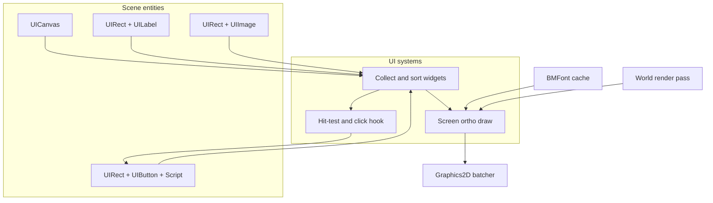
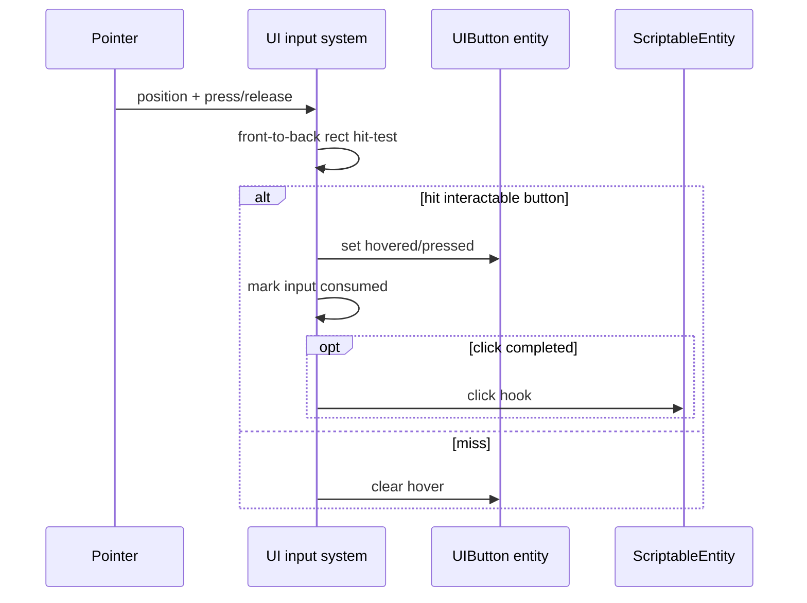

# Runtime UI — Developer Guide

Implementation guide for screen-space Canvas, Label, Image, Button, BMFont text, and UI input. See `introduction.md` for conceptual background.

## Glossary (implementation subset)

| Term | Meaning in implementation |
|------|---------------------------|
| UICanvas | Marker component: enabled, sort order |
| UIRect | Screen-pixel x, y, width, height (top-left origin, Y down) |
| UILabel / UIImage / UIButton | Visual / interactive data on the same entity as UIRect |
| BMFont asset | Metrics file + atlas texture, cached by path |
| UI systems | Collect → input → render after world (priority after world render) |
| Click hook | ScriptableEntity method invoked on completed button click |
| Consume input | Flag/path so gameplay ignores pointer when over UI |

## Implementation order

1. **Components** — UICanvas, UIRect, UILabel, UIImage, UIButton (data + clone/serialize)
2. **BMFont load + glyph quads** — parse atlas metrics; cache; emit quads for a string
3. **UI render pass** — ortho screen pass via existing 2D batcher after world
4. **UI input** — hit-test, hover/press state, click hook, consume flag
5. **Editor inspectors** — fields for rect + visuals + button states
6. **Sample menu scene** — Play / Quit buttons replacing banner pattern
7. **Tests** — parser, hit-test, click lifecycle, label placement math

---

## Step 1: Components

Add data-only scene components:

- **UICanvas** — enabled; sort order (default 0)
- **UIRect** — X, Y, Width, Height in screen pixels; optional SortOrder for draw/hit order among siblings
- **UILabel** — text, font path, color, horizontal align (left/center/right)
- **UIImage** — optional texture path, color tint
- **UIButton** — interactable flag; colors/textures (or tints) for normal, hovered, pressed, disabled

Composition:

- Canvas entity: UICanvas
- Widget entity: UIRect + exactly one of Label, Image, or Button
- Button owns its visuals (do not require a separate Image on the same entity for v1)

Association: all UI widgets in the scene attach to the single active canvas (no CanvasId field yet).

**Why:** Matches existing ECS component patterns; keeps layout as authored data.

---

## Step 2: BMFont and text quads

- Load BMFont metrics + atlas texture by path; cache in a font service/factory
- For a label: walk characters, look up glyphs, place quads inside UIRect using alignment
- Missing glyph: skip or use a documented fallback glyph; do not throw
- Empty string: emit no quads

```
load font(path) → metrics + atlas
for each character in text:
  glyph = metrics[character] or fallback
  place quad at cursor within rect (respect align)
  advance cursor by glyph advance
```

**Why:** Unlocks real HUD/menu text without a TrueType dependency.

---

## Step 3: UI render pass

After the world render system:

1. If no enabled UICanvas → return (if widgets exist without canvas, log once)
2. Collect widgets with UIRect + Label/Image/Button; sort by canvas order then rect sort order
3. Begin screen ortho (window pixel size; top-left origin)
4. Draw Image/Button as one tinted textured or solid quad in the rect
5. Draw Label as glyph quads
6. Missing texture/font: skip visual, log once per path

Reuse the existing 2D batcher; do not invent a second quad pipeline.

**Why:** Screen overlay without fighting the world camera.

---

## Step 4: UI input

Each frame (before or with render collect, after pointer position is known):

```
point = mouse in screen pixels (same space as UIRect)
hovered = null
for each button in front-to-back order:
  if not interactable → continue
  if rect contains point → hovered = button; break

update hover/press visual state on buttons
if pointer over any UI rect → mark UI consumed for this pointer event
on press+release completed on same interactable button:
  invoke ScriptableEntity click hook on that entity
  if no script → log once; ignore
```

Clear hover when mouse leaves window or no hit.

**Why:** Menus work with existing scripts; gameplay does not double-handle clicks.

---

## Step 5: Editor inspectors

Register component editors for UICanvas, UIRect, UILabel, UIImage, UIButton using the existing ImGui component-editor path. Expose the fields above; no runtime ImGui dependency.

**Why:** Scene-authored menus are the M3 authoring story.

---

## Step 6: Sample menu

Add a small scene (or template): one canvas, title label, Play and Quit buttons with scripts that start gameplay / request exit. Prefer this over texture-banner entities in docs and samples going forward.

**Why:** Exit criterion for “menu without quad hacks.”

---

## Step 7: Tests

| Area | Cases |
|------|--------|
| BMFont | Parse valid file; missing glyph path; cache by path |
| Hit-test | Inside/outside; front button wins; disabled ignored |
| Click | Press+release same → one click; press A release B → none; consume when over UI |
| Label layout | Left/center/right glyph origins within rect (math only) |
| Soft fail | Missing font/texture does not throw in collect/render |

Optional: one-frame smoke with canvas + three widget types.

---

## Architecture





---

## Error handling (implementation checklist)

- Missing font/texture: log once per path; skip draw
- Widgets without canvas: log once; no draw/input
- Click without script: log once; ignore
- Empty label: no quads
- Soft glyph/batch budget: truncate draw rather than crash (document limit if enforced)

---

## Explicit non-goals (do not implement in this pass)

Anchors / reference resolution, UI parenting, scroll/slider/text field, world-space canvas, nine-slice, theming, runtime ImGui.
