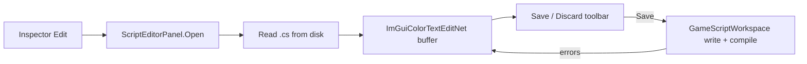

# In-Engine Script Editor — Developer Guide

Editor-only feature: replace inspector **Edit** (OS file open) with a dockable Script Editor panel. Assumes familiarity with `NativeScriptComponent`, `GameScriptWorkspace`, `IEditorPanel`, and `ModalDrawer`.

## Implementation Overview



## Glossary (implementation subset)

| Term | Meaning here |
|------|----------------|
| Open | Show panel, load file for one `ScriptTypeName` |
| Snapshot | String compared to widget text for dirty |
| Workspace | Existing `CreateOrUpdateScriptAsync` / `GetScriptFilePath` |
| Play gate | If dirty, confirm Save-and-Play before `SceneManager.Play` |

## Step-by-Step Requirements

### 1. Add the text-editor package to the Editor project

Reference **ImGuiColorTextEditNet** from the Editor project only (not Engine, not Runtime).

**Why:** The widget is pure ImGui.NET drawing. It must not ship in the player. Confirm the package’s ImGui.NET requirement against Silk.NET’s ImGui binding; do not rebuild the custom `cimgui` overlay for this.

### 2. Add a C# language definition

The package ships HLSL / GLSL / SQL / Lua, not C#. Define keywords (`class`, `void`, `using`, …), `//` and `/* */` comments, case-sensitive, auto-indent on. Assign it when the widget is created.

**Why:** Keyword coloring is the v1 highlighting bar. Do not port regex highlighters or add a parser.

### 3. Introduce a singleton script editor panel

New `ScriptEditorPanel` implementing `IEditorPanel` (dockspace already draws those). Hidden until `Open`. Window title: script name, plus `*` when dirty. Closable `Begin` like Keyboard Shortcuts / Stats.

Public surface on the class: `Open`, `IsDirty`, `Save`. Inject this class into the inspector and the Play path.

**Owns:** one widget instance, current script name, last-saved snapshot, last compile error strings, confirm-modal flags.

**Does not own:** compiling, attaching scripts to entities, undo history for the scene.

**Why:** Inspector stays a button. Play and project-close need `IsDirty` without talking to ImGui. No second interface.

### 4. Change inspector Edit to open the panel

In the script component editor, **Edit** calls `Open(scriptTypeName)` instead of `Process.Start`. If `GetScriptFilePath` returns nothing, log and return; do not open an empty buffer.

**Why:** Replaces the OS editor as agreed. Create / attach / remove stay unchanged.

### 5. Register in DI

Register `ScriptEditorPanel` as a singleton: as itself (for `Open` / dirty / save) and as `IEditorPanel` so `EditorPanels` enumerates it.

**Why:** Same as Keyboard Shortcuts. No event bus, no extra interface.

### 6. Implement buffer operations

On `Open` of the **same** script: show/focus only. On a **different** script: if dirty, run the three-button confirm; if clean, load the new file.

```
function Open(name):
    path = workspace.GetScriptFilePath(name)
    if path is missing: log; return
    if panel open and dirty and name != current:
        ask Save / Discard-and-switch / Cancel
        if Cancel: return
        if Save: Save(); if still dirty: return
    text = read file
    widget.AllText = text
    snapshot = text
    clear errors
    current = name
    show panel
```

**Save:** pass widget text to `CreateOrUpdateScriptAsync`. On I/O failure, keep dirty and show the error. On compile success, snapshot = text, clear errors. On compile failure, snapshot = text (file already written), keep the workspace error strings under the editor, keep panel open.

**Discard:** set widget text to snapshot, clear errors. After a failed Save, snapshot already matches disk.

**Close (window X):** if dirty, three-button confirm; if clean, hide.

**Why:** Dirty is a string compare to the snapshot, not the widget undo stack (reload/`SetText` resets undo).

### 7. Show compile errors as text

Join the strings `CreateOrUpdateScriptAsync` already returns and draw them under the editor.

**Why:** The workspace already formats Roslyn diagnostics. Do not parse line numbers or drive gutter markers.

### 8. Gate Play (and project close) on dirty

Before Play compiles from disk: if the panel is dirty, show **Save and Play** / **Cancel**. Cancel does not Play. Save and Play: Save first; if compile failed, do not Play. SceneManager uses `IsDirty` + `Save`; the confirm lives with the other panel modals.

Use the same dirty check if the user closes the project with the panel open.

**Why:** Play ignores the buffer. Two-button confirm is enough; “Play without saving” is out of scope.

Three-button confirms (Save / Discard / Cancel) use `ModalDrawer.BeginCenteredModal` inside the panel. Do not add a new drawer type.

### 9. Tests for non-UI logic

One small test file:

- Load sets snapshot; changing text reports dirty; Discard restores snapshot
- Save forwards content to a fake workspace
- Missing file does not call into the widget / does not show the panel

No ImGui render tests.

**Why:** Dirty and save-forwarding are the branches that lose work if wrong.

## Common Pitfalls

**Treating compile failure as “not saved”** — The workspace writes first. After a failed Save the buffer matches disk; Discard will not restore the previous compile.

**Play compiling the widget** — Play only sees disk. The dirty gate is mandatory.

**AlwaysAutoResize modal leftover** — This is a dockable window, not `BeginCenteredModal` for the editor itself. Confirms are small modals; the editor is `IEditorPanel`.

**Opening an empty editor on a missing file** — `ScriptTypeName` can exist without a matching `.cs` (wrong name, deleted file). Refuse Open.

**Putting the NuGet on Engine** — Runtime must not take an ImGui text editor.

## Files Touched (reference map)

| Area | Where |
|------|--------|
| Panel | New type under `Editor/` (panels / scripting features) |
| Inspector | `Editor/ComponentEditors/ScriptComponentEditor.cs` — Edit action only |
| Workspace | Unchanged API; panel is a caller |
| Play | `SceneManager.Play` / toolbar path — dirty gate |
| DI | `Editor/DI/EditorIoCContainer.cs` |
| Package | `Editor/Editor.csproj` |
| Tests | `tests/Editor.Tests/` — buffer, fake workspace |
