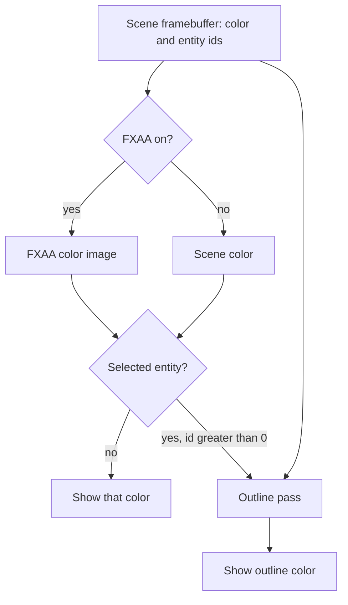

# Selection Outline — Developer Guide

Implementation guide for a one-pixel orange edge around the selected entity. Assumes the viewport already draws a scene framebuffer with a color attachment and an integer entity-id attachment, then optionally resolves FXAA.

## Implementation Overview

The entity-id image always comes from the scene framebuffer. The color input is whichever image would have been shown. The outline writes a color buffer it owns.

## Glossary

| Term | Implementation meaning |
|------|------------------------|
| Entity-id attachment | Color attachment 1 of the scene framebuffer. Cleared to −1 each frame. Picking already reads it |
| Displayed color | Scene color attachment, or the FXAA resolve buffer when FXAA is enabled |
| Outline buffer | Color-only image owned by the pass. RGBA8, linear filter, clamp-to-edge. No depth, no integer attachment |
| Selected id | `SelectedEntity.Id`. The pass draws only when this is greater than 0 |
| Edge color | Constant `(1, 0.55, 0, 1)` in the fragment shader |
| Neighbor | One pixel up, down, left, or right. A coordinate outside the image is not selected |

## Step-by-Step Requirements

### 1. Expose a color attachment by index

The framebuffer interface returns only the first color texture. Add an index, defaulting to 0, so existing callers stay valid. Index 1 is the entity-id texture. An index outside the attachment list returns 0.

**Why:** The outline must bind that integer texture. Picking can read a pixel, but it cannot hand the texture to a shader.

### 2. Add the outline shader

Add a shader id whose vertex shader is the same full-screen triangle FXAA uses, and whose fragment shader reads a color sampler and an integer entity-id sampler. The pass sets the color sampler to unit 0 and the id sampler to unit 1 once, at init.

The fragment keeps the sampled color when the pixel's id is greater than 0 and equals the uniform id. Otherwise, if any of the four neighbors passes that test, it writes the edge color. Otherwise it keeps the sampled color. A neighbor outside the texture is not a match.

**Why:** One id uniform replaces the old array of 64. Skipping non-positive ids keeps the clear value −1 from ever matching.

### 3. Add the pass

Place it next to the FXAA pass. It depends on the renderer, the shader factory, the vertex-array factory, and the framebuffer factory. It does not depend on scenes, selection, or the editor.

Init runs once. It creates the shader, the triangle, and a 1×1 outline buffer. Failure logs a warning, marks the pass unavailable, and does not try again. The shader factory owns the shader. The pass disposes the triangle and the buffer.

Resolve takes the displayed color framebuffer, the scene framebuffer, and the selected id. It returns the displayed color framebuffer unchanged when the pass is unavailable, the size is zero, the id is not greater than 0, or attachment 1 is missing. Otherwise it resizes the outline buffer to the displayed color size, draws, and returns the outline buffer. A resize that throws marks the pass unavailable, logs once, and returns the displayed color. Later frames do not try again.

The draw binds the outline buffer, turns depth test, blend, and face culling off, binds the two textures on units 0 and 1, sets the id, and draws three vertices. It restores those three states and unbinds. Do not change the integer texture's filter. Do not draw into the scene framebuffer.

**Why:** The scene framebuffer is still the picking source after this pass. Writing the edge into it would replace entity ids or feedback the color. A 1×1 buffer at init gives the "create once" failure policy a real allocation before the viewport has a size.

### 4. Call it from the viewport

After the existing FXAA choice, if an entity is selected, replace the displayed framebuffer with the pass result. Do this in Edit and in Play. Pass the scene framebuffer as the id source even when FXAA replaced the color. Show that framebuffer in ImGui the same way as today.

Register the pass as a singleton on the editor container only. Add it to the viewport's constructor. Do not register it in the engine container. The game, sandbox, and benchmark never resolve the viewport, so they never create the pass.

**Why:** Play in the editor renders into the same framebuffer before this line, so ids exist. The standalone game has no selected entity and no viewport.

### 5. Test the silhouette on the GPU

One graphics test, beside the FXAA pass test. Build a color-plus-entity-id framebuffer. Clear color to white and ids to −1. With scissor, clear a rectangle of the integer attachment to a positive id. Resolve with that id.

The center of the rectangle stays white. The pixel just outside one edge is the edge color. The pixel two steps outside stays white. The GL error is 0, and the pass is available after init.

A second fact: resolve with an id that is not greater than 0 returns the same color framebuffer it was given and does not draw.

**Why:** The first fact fails if the neighbor test or the integer bind is wrong. The second fact fails if the clear value can become an edge. The viewport's if-statement is not part of either test.
