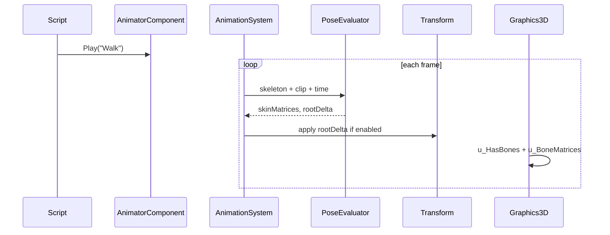

# Skeletal Animation (FBX Embedded Clips) — Developer Guide

Implementation guide for single-clip skeletal playback with GPU skinning and optional root motion. See `introduction.md` for concepts.

## Glossary (implementation subset)

| Term | Meaning |
|------|---------|
| Skeleton | `Engine.Renderer.Animation.Skeleton` on cached `Model` |
| Clip | `AnimationClip` on `Model` |
| Animator | `AnimatorComponent` — clip/time/playing/loop/speed/root motion |
| Skin matrices | Runtime array on animator; uploaded as `u_BoneMatrices[64]` |
| Bone limit | `Skeleton.MaxBones` = 32 (vertex uniform budget) |

## Implementation map (shipped)

1. **Model data** — `Skeleton`, `AnimationClip`, bone ids/weights on `Mesh.Vertex`
2. **Assimp import** — probe for bones; skinned path without `PreTransformVertices`
3. **PoseEvaluator** — sample → local → global → skin + root delta
4. **AnimationSystem** (priority 140) — tick before render; script API on component
5. **GPU path** — `lightingShader.vert` skinning; `Graphics3D.DrawMesh(..., boneMatrices)`
6. **Editor** — `AnimatorComponentEditor`, Add Component menu, serializer registration

## Draw / tick flow

## Error handling

| Case | Behavior |
|------|----------|
| No skeleton | Animator cleared; static draw |
| Unknown clip | Warning; stop playing |
| Bones > 64 | Truncate + warning |
| Loop + root motion | Reset previous root on wrap (no reverse jump) |
| Bad model path | Cube fallback (unchanged) |

## Out of scope

Blending, state machines, separate anim files, retarget, morphs, bone entities, bake format, timeline editor.
