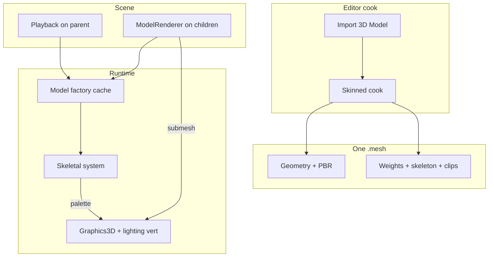

# Skeletal Animation (v1) — Developer Guide

Implementation guide for cook-time skinning and GPU playback. See `introduction.md` for concepts.

## Glossary (implementation subset)

| Term | Meaning in this bake |
|------|----------------------|
| Skinning payload | Optional `.mesh` section: weights, skeleton, clips |
| Palette | 100 skinning matrices; identity when not posing |
| Playback | Parent component: mesh path, clip name, Playing, Loop, Speed, Time |
| Root-space bake | Vertices written in skeleton root; child local TRS = identity |
| Bone cap | 100; cook fails above that |

## Step-by-step

### 1. Extend the mesh container

Add a new container version that can carry a skinning payload. Keep reading the current static version so existing files do not break.

Per skinned vertex: four bone indices and four weights (unused = −1 / 0). Then: bones in parent-before-child order (name, parent index, inverse bind), then clips (name, duration in seconds, per-bone T/R/S tracks).

**Why:** One factory, one path, one cache. Draw and playback open the same file.

### 2. Cook skinned sources

On import, if any mesh has bones:

- Do **not** flatten the node tree (that destroys the rig).
- Bone set = bones that skin a mesh ∪ nodes that have clip channels. Sort by hierarchy depth so parents get lower indices.
- Parent of a bone = nearest ancestor that is also in the bone set (skip unweighted pivot nodes).
- Inverse bind from the bone offset matrix, transposed into engine row-vector space. If a clip-only bone has no offset, use the inverse of its bind global.
- Weights: sort by influence, keep 4, renormalize.
- Clip times: divide by ticks-per-second (fallback 25). Store quaternions in engine component order after a single Assimp → Numerics conversion.
- Bake every skinned vertex into skeleton root space so palette and the entity model matrix share one space.
- > 100 bones → fail that source; report it in the import summary.
- No bones → existing static cook, unchanged.

Textures relocate as they do today. Output is still `assets/models/<stem>.mesh`.

**Why:** Assimp stays behind the cook boundary; runtime never sees `aiScene`.

### 3. Spawn without auto-playback

Skinned import still spawns a parent plus one child per mesh part. Children get `ModelRenderer` (shared path, submesh range) and **identity** local transform. Do **not** add the playback component.

**Why:** Author chooses when a statue becomes a character. Identity children avoid node TRS plus skinning.

### 4. Playback component and system

Playback fields: path to the cooked `.mesh`, clip name (empty = first clip), Playing, Loop, Speed, Time. Palette is transient and not serialized.

The skeletal system runs in **Edit and Play**, before scene render:

```
if not Playing:
  palette = identity
else:
  Time += dt * Speed
  if Loop: wrap Time into [0, duration)
  else: clamp Time to [0, duration]
  palette = evaluate(skeleton, clip, Time)
```

Missing file, file with no skeleton, or unknown clip name → identity palette + one log; do not throw.

**Why:** Same controls in the inspector and in game. Identity is bind pose.

### 5. Evaluate a pose

For each bone in index order:

```
local = rest local from inverse binds
if clip has a channel for this bone:
  T = lerp keys at Time
  R = slerp keys at Time (normalize)
  S = lerp keys at Time
  local = compose S, R, T in row-vector order
global = local composed with parent global (root: local only)
palette[i] = inverseBind[i] composed with global
unused palette slots = identity
```

**Required invariant:** Playing off, and Playing at the clip’s first key, produce the same palette as bind (within float noise). If this fails, multiply order or the Assimp quaternion layout is wrong — stop and fix; do not ship.

Do not retarget a clip from another file onto this skeleton in v1.

**Why:** This is the class of bug that exploded triangles on the old branch. The invariant is the test, not a comment.

### 6. Draw with an ancestor palette

For each `ModelRenderer`, decide skinned vs static:

- **Skinned** only when the mesh has a skinning payload **and** a nearest ancestor playback points at **that same** `.mesh` path.
  - World matrix = that ancestor’s world transform (ignore the child’s local TRS).
  - Palette = that playback’s palette.
- **Otherwise** (static file, no ancestor, or path mismatch): existing draw — this entity’s world transform, identity palette / no skinning.

Then: upload palette if skinned, then the usual model / view-projection / material uniforms.

Vertex shader (skinned draws): four influences; skip index −1; if all weights ~0, use the bind vertex; skin position, normal, and tangent; then existing PBR path. Fragment shader unchanged.

If uploading a 100-matrix uniform array is awkward on a given driver, that is a later upload fix (uniform buffer). v1 behavior is still “palette in, skinned vertex out.”

**Why:** Parent owns the rig; children are material slices. A static mesh under a character parent must not steal the parent’s transform.

### 7. Cache and publish

Path-keyed model cache serves geometry and the skinning payload. Re-import of that path must drop the cache entry.

Publish: if playback has a path, the file must exist under `assets/` — same rule as other asset paths.

---

## Architecture



```mermaid
sequenceDiagram
  participant Sys as Skeletal system
  participant Fac as Model factory
  participant Pipe as Scene render
  participant GPU as Lighting vertex shader

  Sys->>Fac: load .mesh from playback path
  alt missing / no skeleton / unknown clip / not Playing
    Sys->>Sys: identity palette
  else Playing
    Sys->>Sys: advance Time, evaluate keys, write palette
  end
  Pipe->>Pipe: ModelRenderer: same .mesh as ancestor playback?
  Pipe->>GPU: skinned: parent world + palette; else entity transform
  GPU->>GPU: 4-weight skin, then model and view-projection
```

---

## Error-handling checklist

| Case | Behavior |
|------|----------|
| Static `.mesh` on playback | Identity palette; log once: no skeleton |
| Missing/corrupt playback path | Identity palette; do not cache success |
| Missing renderer `.mesh` | Cube fallback (unchanged) |
| Empty clip name | First clip |
| Unknown clip name | Identity palette + log |
| > 100 bones at cook | That import fails; others in the batch may succeed |
| Zero-weight vertex | Unskinned bind vertex in the shader |
| No ancestor playback, or renderer path ≠ playback path | Static draw (entity transform, no skinning) |
| Re-import same path | Evict factory cache |

---

## Testing focus

**Invariant (required):** bind palette equals first-key palette on a tiny two-bone clip. CPU pose test always; GPU readback if the graphics host can sample a vertex.

**Cook:** glTF fixture with two bones and one clip — four influences, parent-before-child, times in seconds, root-space vertices. 101 bones fails cook. Bone-free file still writes a static mesh. Current static files still load.

**Evaluate:** lerp/slerp between two keys; Loop wraps; Loop off clamps; unknown name → identity. A child bone rotates about its own joint (parent origin does not drift).

**ECS:** playback on parent, two children with renderers — both draws see the same palette. No playback → identity.

**Out of v1 tests:** retarget across two Mixamo files, blending, full-mesh CPU skinning as the product path.

---

## Out of scope reminders

Do not add: companion `.skel` / `.anim3d` files, runtime Assimp, clip retargeting, blend trees, IK, morph targets, auto-adding playback on import, baking PreTransformVertices on skinned sources.
