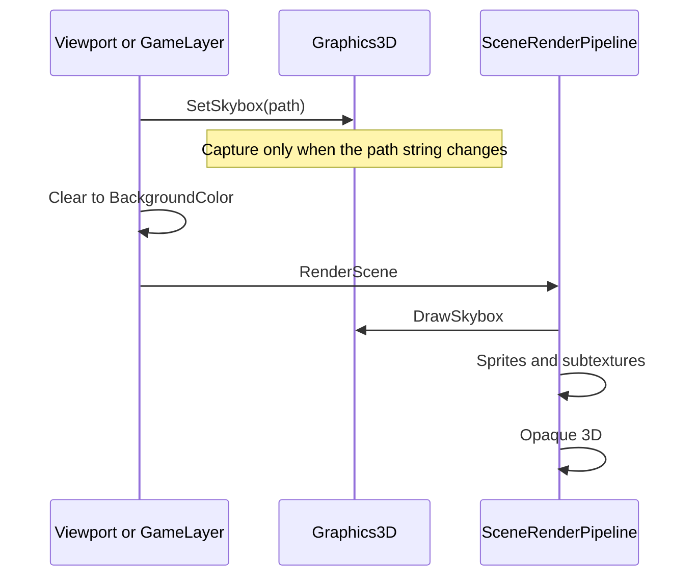

# Skybox — Developer Guide

Implementation guide for showing one equirectangular image as the scene background. Assumes the forward color pass, the scene clear color, and the existing unit cube mesh.

## Implementation Overview



## Glossary

| Term | Implementation meaning |
|------|------------------------|
| Scene field | `Skybox`, a string. Empty means no sky |
| JSON key | `Skybox`. Absent on load means empty |
| Face size | 512. Independent of the point-shadow face size |
| Capture projection | 90° field of view, aspect 1, near 0.1, far 10, eye at the origin |
| Face order | +X, −X, +Y, −Y, +Z, −Z. Up vectors −Y, −Y, +Z, −Z, −Y, −Y |
| Equirect UV | `atan(z, x) * 0.1591 + 0.5`, `asin(y) * 0.3183 + 0.5`, direction normalized |
| Sky scale | One vertex shader. Capture sets scale 1. The sky sets scale 4, so a face sits 2 units out |
| Cubemap format | `RGBA8`, linear filter, clamp on S, T, and R, no mipmaps |
| Entity id | The sky fragment writes −1 |

## Step-by-Step Requirements

### 1. Store the path on the scene

Add a string on the scene, default empty. Write it to the scene JSON only when it is non-empty. On load, a missing key or a blank value becomes empty.

The editor settings popup gains a text field under the clear color. Committing the field stores an asset-relative path. An empty field stores empty.

**Why:** The clear color already lives on the scene and in the scene file. The sky is the same kind of fact: one per scene, restored with the file, and absent from old files.

### 2. Hand the path to the graphics layer once per frame

The editor viewport calls `SetSkybox` before it binds the scene framebuffer, for both edit and play. The runtime game layer calls it inside the FXAA callback, before the clear and before systems run. The game layer takes the existing 3D graphics service in its constructor. Nothing new is registered.

`SetSkybox` compares the incoming string to the one it already captured. A match returns immediately. An empty or whitespace string drops the cubemap. A different string resolves the file and captures.

**Why:** The render system only has the entity context, not the scene. The clear color is already applied by these two frame owners. The path joins that call, so edit mode, play mode, and the player cannot disagree. Skipping the resolve on a repeated string keeps that call off the allocator.

### 3. Capture six faces when the path changes

Decode the file as 8-bit RGBA with the vertical flip the texture decoder already applies. Do not mark it sRGB. Upload it as a 2D texture, clamp to edge, linear filter, no mipmaps. Seamless cubemap sampling is already enabled.

The six view-projections are the existing point-shadow face helper at the origin with far 10. Draw the existing unit cube once per face into a 512×512 color cubemap. The capture framebuffer is its own target, with a depth renderbuffer. It is not the scene framebuffer and it is not a point-shadow cubemap.

Capture and the sky share one vertex shader. It passes the cube's local position and multiplies that position by a scale uniform. Capture sets the scale to 1. The fragment shader normalizes the position and samples the 2D image:

```
d = normalize(localPosition)
x = 0 when local x is 0, otherwise local x
z = 0 when local z is 0, otherwise local z
u = atan(z, x) * 0.1591 + 0.5
v = asin(d.y) * 0.3183 + 0.5
```

At the poles, `atan(0, 0)` is taken as 0, so U is 0.5. That matches the GLSL implementations this engine ships on.

Culling is off for the six draws, because the cameras sit inside the cube and the mesh faces outward. Depth test and depth write stay on so a face can occlude the rest of the cube.

When all six faces have been drawn, delete the 2D texture. Keep the cubemap. Save the bound framebuffer and the viewport before the first face, and restore both afterward, including when a face fails.

**Why:** One file is the authoring input. A cubemap is what the sky samples, and what a later environment-lighting pass would sample. Doing the six draws at load time leaves the frame with a single texture fetch. The projection and the face axes are the equirectangular-to-cubemap capture from the diffuse-irradiance chapter, stopped before any convolution. Row-vector multiply matches every other shader in this engine. LearnOpenGL writes `projection * view * vec4` because GLM is column-major.

### 4. Build the sky view next to the camera view

Where a camera already produces view-projection, also produce a second matrix: zero the translation row of the view (M41, M42, M43), then multiply by the same projection. `CameraViews` does this for the primary camera. The editor camera does this for the edit-mode view. Store the result on the scene view beside the normal view-projection.

**Why:** A sky that uses the full view slides with the camera and the player flies out of the box. Stripping translation is the skybox chapter's view. The matrix has to be built where the view matrix still exists. The scene view today only keeps the combined view-projection, and translation cannot be recovered from that product.

### 5. Draw the sky before sprites

At the start of the scene render, call the sky draw. It returns immediately when no cubemap is stored. Otherwise draw the unit cube with the sky view and scale 4. The fragment direction is the unscaled local position. Write the sampled color unchanged. Write entity id −1.

Turn depth writes off and culling off for that draw. Leave the depth test on. Restore depth writes and back-face culling before returning. Bind the cubemap for the draw, then unbind it.

**Why:** Sprites run next and do not write depth. A sky drawn at the end of the 3D pass, which is the cubemap chapter's early-z optimization (`gl_Position = pos.xyww`, depth function `LEQUAL`), would replace every sprite pixel whose depth is still the clear value. Drawing first, with depth writes off, is that chapter's earlier method, and it leaves sprite and mesh pixels in place. `LEQUAL` is already the engine depth function. Do not switch it back to `LESS`.

The mesh is only one unit across. Scale 4 puts a face 2 units out, beyond the default near planes (0.01 on the game camera, 0.1 on the editor camera). A near plane of 2 or more clips the sky. The upgrade is to scale from that camera's near and far. Capture keeps scale 1: its near is 0.1 and its far is 10, and the unscaled cube already sits between them.

The sample is not Reinhard-compressed and not gamma-encoded. The irradiance chapter does both because its cubemap is `RGB16F`. This cubemap is `RGBA8` from an 8-bit picture, and the scene target is `RGBA8`.

Unbinding the cubemap avoids a cubemap left on a unit that the next `sampler2D` draw will use.

### 6. Check the file when publishing

Add `Skybox` to the publish validator's path names. An empty value is ignored, same as an empty texture path. A non-empty value whose file is not under `assets/` fails the publish. The file itself is copied with the rest of the assets directory.

**Why:** The player resolves the same path the editor stored. A missing image would otherwise become a log and a flat clear only after the game starts.

## Failures

| Condition | Result |
|-----------|--------|
| Empty or whitespace path | Cubemap dropped. Clear color shows |
| Missing file, undecodable image, or cubemap creation failure | One log for that path. The new cubemap is discarded. The previous cubemap stays, or the clear color shows if there was none. The failed string is remembered, so later frames do not resolve it again until it changes |
| Width is not twice the height | One log. Capture still runs. The sky looks stretched |
| Capture throws after swapping framebuffer or viewport | Both are restored. Scene clear that already happened is left as it was |
