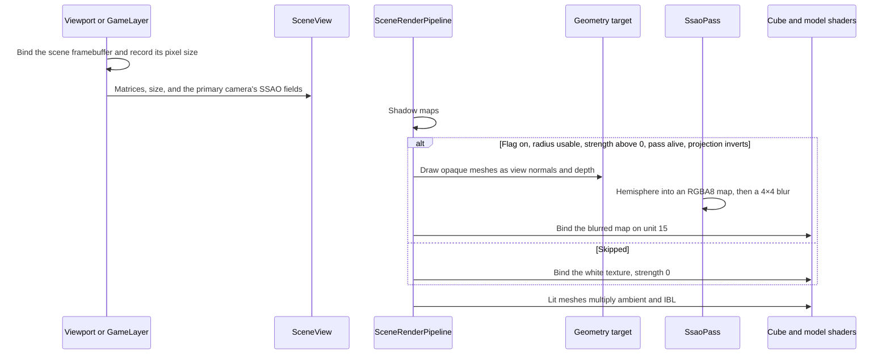

# SSAO — Developer Guide

How to add screen-space occlusion of indirect light on the forward path. The scene order stays sky, sprites, shadows, then lit meshes. This pass sits between the shadow maps and the lit meshes.

`SceneRenderPipeline` and `Graphics3D` are already large. The fullscreen targets, the kernel, and the noise live on a new pass type. `Graphics3D` only grows a normal-draw branch next to the existing shadow branch. Do not split those two files as part of this work.

## Implementation Overview



## Glossary

| Term | Implementation meaning |
|------|------------------------|
| Geometry target | `SsaoPass` framebuffer. Color is `RGBA16F` (normal in rgb). Depth is `FrameBufferTextureFormat.Depth` |
| Occlusion map | `RGBA8`. The factor is the red channel. The blur writes a second target |
| Programs | `ShaderId.ViewNormal`, `ShaderId.ViewNormalModel`, `ShaderId.Ssao`, `ShaderId.SsaoBlur`. The last two use `fxaa.vert` |
| Kernel | 64 `Vector3` values, seed 1, built once. Bias `0.025` |
| Noise | 4×4 RGBA8 from `CreateFromRgba`, built once. The shader expands `rgb * 2 - 1` |
| Unit | 17 fragment units: BRDF LUT stays on 15, SSAO is on 16. 16 units: SSAO takes 15 and the LUT sample becomes `EnvBrdfApprox` |
| Gate | `Ssao`, finite radius `> 0`, finite strength clamped to `0–1` and then `> 0`, non-zero target size, invertible projection, pass available |
| Call | `SceneRenderPipeline.RenderScene` after point shadows, before `BeginScene` |

## Step-by-Step Requirements

### 1. Store the knobs on the primary camera

Add `Ssao` (`false`), `SsaoRadius` (`0.5`), and `SsaoStrength` (`1`) to `CameraComponent`. Include them in `Clone()`. The generic component serializer already writes public properties, so old scene files keep the defaults. The camera inspector shows the three fields for both projection types.

`SceneView` carries the view matrix, the projection, the target width and height, and the three knobs. `CameraViews.TryFrom` stores the view and the projection it already multiplies. `TryGetPrimaryView` copies the knobs from the same first primary camera.

**Why:** The radius is in view units. A saved camera is the object that already defines that view. Defaults keep published scenes on the current lighting cost.

### 2. Record the framebuffer size, then build the view

The code that binds the scene framebuffer writes its pixel size onto `IGraphics3D` before the scene draws. The editor does this at the start of the viewport frame, so edit and play-in-editor share it, including a retina scale. `GameLayer` does it from the size it passes to `DrawScene`.

Edit mode builds the view from the editor camera and copies the three knobs with the same first-primary rule as play. A missing primary leaves the flag off. Play and the player build the view from that primary camera, then copy the recorded size onto it.

**Why:** The camera aspect ratio is not the framebuffer size. Content scale makes those two numbers differ. The occlusion targets have to match the target that is actually bound.

### 3. Draw normals and raw depth for 3D only

When the gate passes, the pass binds the geometry target, clears color to 0 and depth to 1, and the pipeline submits the same opaque set as the color pass, with the same instancing and the same alpha cutout as `depth.frag`.

The vertex stage builds the world normal the way the color shaders do, then multiplies on the right by the 3×3 of the view. The view has no scale. The fragment writes `vec4(viewNormal, 0)`.

The depth attachment is `FrameBufferTextureFormat.Depth`, the raw depth the scene framebuffer already uses. Do not use `DepthComponent`. That value is the shadow-map path and turns compare-to-reference on, so a `sampler2D` read would not return window depth.

**Why:** The kernel must see only meshes. Sprites leave depth in the scene buffer while the depth test is off. The shadow depth format cannot feed this sample.

### 4. Compute and blur the factor

Invert the projection once on the CPU. Upload that inverse and the projection. The fullscreen triangle matches tonemap.

Rebuild view position from window depth. This engine's clip Z is 0 on the near plane and 1 on the far plane, and the default depth range stores that as window depth `ndcZ * 0.5 + 0.5`.

```
ndc.xy = uv * 2 - 1
ndc.z  = windowDepth * 2 - 1
view   = (ndc, 1) * inverseProjection
view  /= view.w
```

A fragment whose window depth is 1 writes occlusion 1 and stops. That is the cleared far value.

Aim the kernel with a tangent basis built in the shader from the view normal and the noise vector (Gram-Schmidt). The noise sample is `texture(...).rgb * 2 - 1`, because the upload stores unsigned bytes. Noise coordinates are `uv * (width, height) / 4`. Each sample:

```
samplePos  = fragView + (TBN * kernel[i]) * radius
offset     = (samplePos, 1) * projection
offset.xy /= offset.w
offset.xy  = offset.xy * 0.5 + 0.5
sampleZ    = view position rebuilt at offset.xy
weight     = smoothstep(0, 1, radius / abs(fragView.z - sampleZ))
occlusion += (sampleZ >= samplePos.z + 0.025) ? weight : 0
```

Then `occlusion = 1 - occlusion / 64`.

The blur averages the 16 texels where x and y run from -2 inclusive to 2 exclusive, and divides by 16.

**Why:** LearnOpenGL stores position and uses a GLM projection whose clip Z is −1…1. Rebuilding depth avoids a full-screen float position. Remapping all of `xyz` with `* 0.5 + 0.5` would treat this engine's Z as if it were GLM. The projection multiply stays on the left because `SetMat4` transposes on upload. The basis multiply stays `mat3 * vec3` because that matrix is built in the shader.

The tutorial's occlusion target is an unsized `GL_RED` float. The value is already 0…1, so it sits in the red channel of an `RGBA8` target.

### 5. Multiply indirect light

The cube and model shaders sample the blurred map at `gl_FragCoord.xy / textureSize`. Ambient, including the image-based term and the material occlusion already inside it, is multiplied by `mix(1, sample, strength)`. The sun, the lamps, and emissive are added after that. When the device exposes at least 17 fragment units, the compile defines `USE_BRDF_LUT`, the LUT stays on unit 15, and SSAO uses unit 16. At 16 units the LUT sampler is omitted and `EnvBrdfApprox` supplies the same scale and bias, with SSAO on unit 15.

When the gate fails, bind `ITextureFactory.GetWhiteTexture()` and use strength 0. Check `GL_MAX_TEXTURE_IMAGE_UNITS` once. Below 16, the pass stays unavailable and logs once. A shader or target that fails to create does the same. A resize that fails skips that frame, logs once, and tries again next frame. A zero size or a bad radius does not log.

Bind and unbind the geometry target and both fullscreen targets in `try/finally`.

**Why:** macOS links a fragment shader with at most 16 samplers. Windows drivers expose more, so those builds keep the LUT and add SSAO as the 17th sampler. The white texture keeps a single sample in the lighting shader. Restoring the framebuffer is the same discipline as a point-shadow face.

## Failures

| Condition | Result |
|-----------|--------|
| Fewer than 16 fragment texture units | Pass stays unavailable. One warning |
| Normal, SSAO, or blur shader fails, or the geometry target fails at init | Pass stays unavailable. One warning |
| Target resize throws | That frame is skipped. One warning. Next frame tries again |
| Flag off, strength is not finite or clamps to 0, radius not finite or not positive, size is 0 | Frame skipped. No warning |
| Projection does not invert | Frame skipped. One warning |
| Exception during the geometry draw | Geometry target is unbound before the exception leaves |
