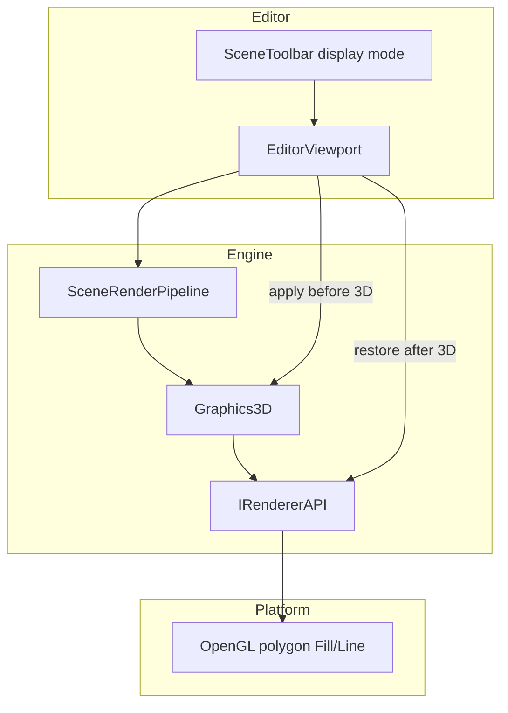
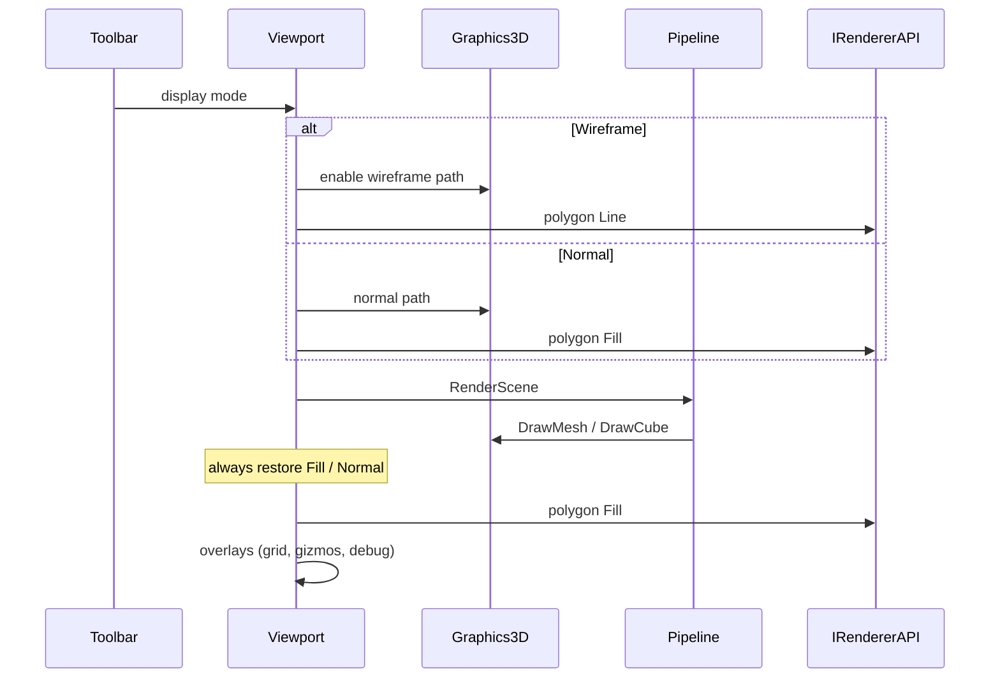

# Viewport Wireframe Display — Developer Guide

Implementation guide for editor Normal / Wireframe viewport display. See `introduction.md` for conceptual background.

## Glossary (implementation subset)

| Term | Meaning in code |
|------|-----------------|
| Display mode | Editor enum/state: Normal or Wireframe on the scene toolbar |
| Polygon mode | `IRendererAPI` Fill vs Line; OpenGL backend maps to polygon raster mode |
| Wireframe draw path | `Graphics3D` mesh/cube path: unlit flat color + Line mode |
| Apply / restore | Editor viewport sets Wireframe for the 3D scene pass, then forces Fill |
| Edge color | Single editor constant (not user-facing in v1) |

## Implementation steps

1. **Add display mode to the scene toolbar**  
   Session-only state defaulting to Normal; toolbar toggle next to 2D/3D.  
   **Why:** Matches existing view toggles; no preferences plumbing.

2. **Extend `IRendererAPI` with polygon Fill / Line**  
   Implement in the OpenGL backend only.  
   **Why:** Keeps platform abstraction; engine core must not call GL.

3. **Add a Wireframe path on `Graphics3D` for meshes and cubes**  
   When Wireframe is active: bind unlit flat-color shading, ensure Line polygon mode, draw the same geometry. When Normal: today’s PBR / lit cube path and Fill.  
   **Why:** One place owns 3D draw appearance; `SceneRenderPipeline` stays mode-agnostic.

4. **Apply mode in the editor viewport around the 3D scene pass**  
   Read toolbar mode → enable Wireframe path if needed → run existing scene render → always restore Fill / Normal path before overlays.  
   **Why:** Sprites, grid, gizmos, and debug lines must not inherit Line mode.

5. **Keep runtime / published paths untouched**  
   Do not read or set display mode outside the editor viewport.  
   **Why:** Product scope is editor-only.

6. **Tests**  
   Mode default and toggle; Graphics3D path selection; apply/restore via renderer spy; no wireframe calls from 2D/overlay paths; OpenGL Fill/Line mapping where API tests already exist.  
   **Why:** Behavior contracts without screenshot goldens.

## Architecture



## Per-frame flow (editor)



## Wireframe draw logic (pseudocode)

```
for each 3D mesh or cube draw:
  if display mode is Wireframe:
    use unlit flat edge color
    ensure polygon mode is Line
    draw same indexed geometry
  else:
    use existing shaded materials / lit cube
    ensure polygon mode is Fill
    draw as today
```

Sprites and non-mesh passes ignore display mode.

## Error handling requirements

- Unknown or unset mode → Normal.
- Restore Fill after the 3D pass even if a draw fails mid-pass.
- Missing wireframe shader / init failure → log and fall back to Normal for that frame.
- Empty scene → toggle still valid; nothing special to draw.

## Out of scope (do not build in v1)

Shortcuts, preference/scene persistence, 2D wireframe, runtime API, solid+edge overlay, configurable color, unique-edge extraction.

## Verification checklist

- [ ] Toolbar defaults to Normal on editor start
- [ ] Toggle switches Normal ↔ Wireframe in edit and play-in-editor
- [ ] Meshes and cubes show flat-colored triangle edges in Wireframe
- [ ] Sprites, grid, gizmos, collider debug stay non-wireframe
- [ ] Published/runtime build has no display-mode UI or behavior
- [ ] Leaving Wireframe (or ending the 3D pass) leaves polygon mode at Fill
