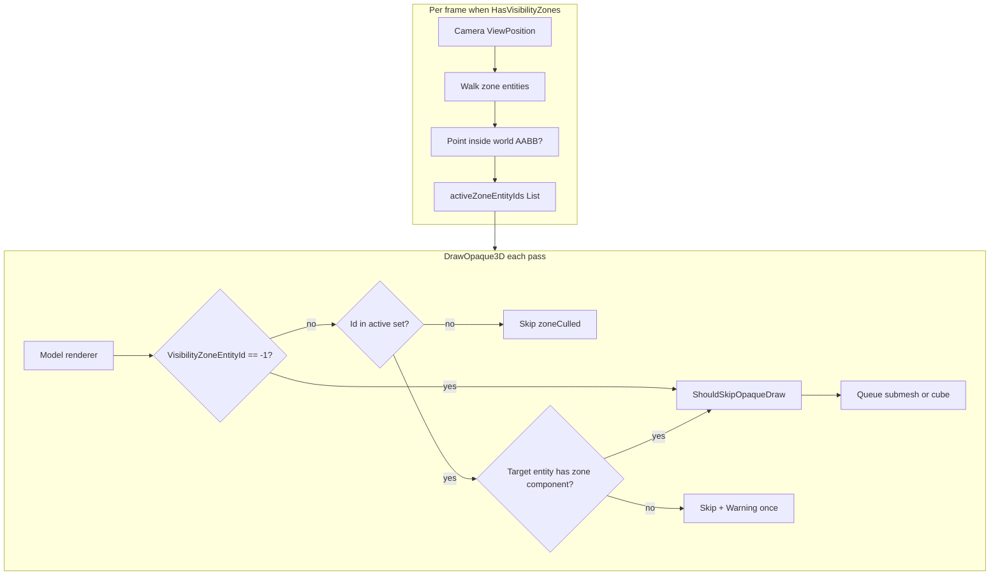
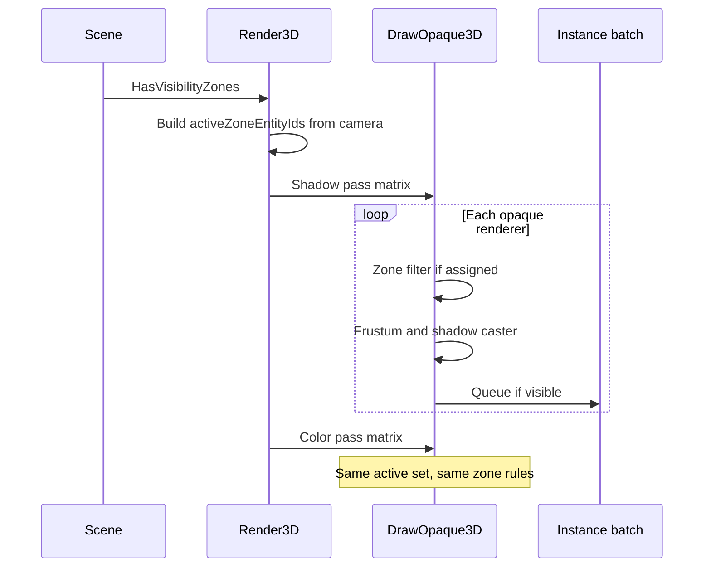

# Visibility Zones — Developer Guide

Implementation guide for zone-based opaque filtering. Assumes frustum culling, directional shadows, and the opaque walk in the scene render pipeline.

## Glossary

| Term | Implementation meaning |
|------|-------------------------|
| Zone component | Data-only component on a zone entity: local `Min` and `Max` for an AABB |
| Zone entity id | `Entity.Id` of the zone entity; stored on `ModelRendererComponent` |
| Sentinel | `-1` on the model renderer field: do not apply zone filtering |
| Active set | `List<int>` of zone entity ids whose world AABB contains the camera position |
| Scene flag | `HasVisibilityZones`: true iff the scene context has at least one zone component after load or editor mutation |

## Architecture





## Step-by-Step Requirements

### 1. Add the zone component

Place in `SceneComponents` (alongside other rendering components). Fields: local `Vector3 Min`, `Vector3 Max` with sensible defaults (unit cube or zero box requiring author edit). Implement `Clone` for copy/paste and prefabs. Register JSON serialization with the existing component registry pattern.

### 2. Extend the model renderer

Add `VisibilityZoneEntityId` defaulting to `-1`. Include in `Clone`. Serialize in scene and prefab JSON. No separate member component type.

### 3. Maintain `HasVisibilityZones` on the scene

Set to true when deserialization registers any entity with a zone component. Set to false when the last zone component is removed. In the editor, refresh the flag when components are added or removed on entities (same lifecycle as other scene mutations). Do not scan the whole context every frame to detect zones.

### 4. Build the active set once per `Render3D` call

When the flag is false, skip this block entirely.

When true, clear a reusable `List<int>` and iterate `View<VisibilityZoneComponent, TransformComponent>`. For each zone, compute world min/max from local box and world transform (reuse the same world AABB helper as mesh bounds). If the camera position from `SceneView.ViewPosition` lies inside that inclusive box, append the zone entity id if not already present (linear scan is enough for tens of zones).

Pass the list into each `DrawOpaque3D` invocation for that frame (directional shadow faces and point shadow faces included, same as frustum).

### 5. Filter in the opaque walk

Immediately before `ShouldSkipOpaqueDraw` for cubes and submeshes:

```
if HasVisibilityZones and VisibilityZoneEntityId != -1:
    if id not in activeZoneEntityIds: skip and increment zoneCulled
    else if target entity missing or lacks zone component:
        skip, log Warning once per bad id (ponytail: one warning path, not per submesh spam)
else:
    continue to frustum
```

Submeshes without stored local bounds still honor zone filtering when the renderer has an assignment; frustum may still draw them if zone passes and bounds are missing (same “failure draws” spirit as frustum spec).

Order is fixed: zone assignment check, then existing `ShouldSkipOpaqueDraw`.

### 6. Play and edit cameras

Use `SceneView.ViewPosition` already supplied to `RenderScene`. Edit viewport must pass the editor camera position. Play mode must pass the primary gameplay camera position from the same path used today for view-projection. Zone logic does not read a separate “visibility camera.”

### 7. Editor: inspectors

- Zone component editor: min/max fields (vector UI consistent with the project).
- Model renderer editor: integer field plus picker listing entities that currently have a zone component, labeled by entity name; writing the chosen entity’s id into `VisibilityZoneEntityId`. Allow clearing back to `-1`.

Register editors in the editor DI container like other component editors.

### 8. Editor: viewport wireframe

In edit mode, for each zone entity, draw a wireframe axis-aligned box in world space from local min/max and transform. No play-mode highlight of active zones in v1. No portal editing UI.

### 9. Performance logging (when implementing)

Add a single `zoneCulled` counter per pass to the existing throttled `3D perf` log. Not required in the design doc beyond this note.

## Serialization and Prefabs

Zone components and model renderer zone ids round-trip through scene JSON and prefabs like other components. After prefab instantiate or scene load, recompute `HasVisibilityZones`. Cloned entities copy zone ids as integers; authors must fix ids if clones reference zone entities that were not cloned together.

## Testing

| Case | Expect |
|------|--------|
| Scene with no zone components | Identical draw order and counts to today |
| Camera inside zone A, renderer assigned to A | Draw in color and shadow when frustum allows |
| Same, assigned to B | No draw |
| `VisibilityZoneEntityId == -1` | Only frustum; ignores active set |
| Camera inside overlapping A and B | Union: renderers in A or B draw |
| Camera outside all zone boxes | Zone-assigned skipped; unassigned use frustum only |
| Invalid zone entity id | Skip renderer; warning in play |
| Point inside world AABB helper | Unit tests on corner cases of the box test |

Use the existing recording graphics double and pipeline tests pattern from frustum and shadow specs. No GPU window tests required.

## Out of Scope (v1)

Portals and BFS between zones. GPU occlusion queries. Automatic Blender collection export. Inspector validation suite (duplicate boxes, missing World entity). Active-zone debug coloring in play. Sprites and subtextures. Changing frustum or shadow distance rules. A separate zone registry asset file.

## Future: Portals (not v1)

A portal would link two zone entities and extend the active set beyond boxes that contain the camera. v1 overlap at doorways is the intentional stand-in until that graph exists.
